# Session 5: Generative Networks
## Assignment: Generative Adversarial Networks and Recurrent Neural Networks

<p class="lead">
<a href="https://www.kadenze.com/courses/creative-applications-of-deep-learning-with-tensorflow/info">Creative Applications of Deep Learning with Google's Tensorflow</a><br />
<a href="http://pkmital.com">Parag K. Mital</a><br />
<a href="https://www.kadenze.com">Kadenze, Inc.</a>
</p>

# Table of Contents

<!-- MarkdownTOC autolink="true" autoanchor="true" bracket="round" -->

- [Overview](#overview)
- [Learning Goals](#learning-goals)
- [Part 1 - Generative Adversarial Networks \(GAN\) / Deep Convolutional GAN \(DCGAN\)](#part-1---generative-adversarial-networks-gan--deep-convolutional-gan-dcgan)
  - [Introduction](#introduction)
  - [Building the Encoder](#building-the-encoder)
  - [Building the Discriminator for the Training Samples](#building-the-discriminator-for-the-training-samples)
  - [Building the Decoder](#building-the-decoder)
  - [Building the Generator](#building-the-generator)
  - [Building the Discriminator for the Generated Samples](#building-the-discriminator-for-the-generated-samples)
  - [GAN Loss Functions](#gan-loss-functions)
  - [Building the Optimizers w/ Regularization](#building-the-optimizers-w-regularization)
  - [Loading a Dataset](#loading-a-dataset)
  - [Training](#training)
  - [Equilibrium](#equilibrium)
- [Part 2 - Variational Auto-Encoding Generative Adversarial Network \(VAEGAN\)](#part-2---variational-auto-encoding-generative-adversarial-network-vaegan)
  - [Batch Normalization](#batch-normalization)
  - [Building the Encoder](#building-the-encoder-1)
  - [Building the Variational Layer](#building-the-variational-layer)
  - [Building the Decoder](#building-the-decoder-1)
  - [Building VAE/GAN Loss Functions](#building-vaegan-loss-functions)
  - [Creating the Optimizers](#creating-the-optimizers)
  - [Loading the Dataset](#loading-the-dataset)
  - [Training](#training-1)
- [Part 3 - Latent-Space Arithmetic](#part-3---latent-space-arithmetic)
  - [Loading the Pre-Trained Model](#loading-the-pre-trained-model)
  - [Exploring the Celeb Net Attributes](#exploring-the-celeb-net-attributes)
  - [Find the Latent Encoding for an Attribute](#find-the-latent-encoding-for-an-attribute)
  - [Latent Feature Arithmetic](#latent-feature-arithmetic)
  - [Extensions](#extensions)
- [Part 4 - Character-Level Language Model](session-5-part-2.ipynb#part-4---character-level-language-model)
- [Part 5 - Pretrained Char-RNN of Donald Trump](session-5-part-2.ipynb#part-5---pretrained-char-rnn-of-donald-trump)
    - [Getting the Trump Data](session-5-part-2.ipynb#getting-the-trump-data)
    - [Basic Text Analysis](session-5-part-2.ipynb#basic-text-analysis)
    - [Loading the Pre-trained Trump Model](session-5-part-2.ipynb#loading-the-pre-trained-trump-model)
    - [Inference: Keeping Track of the State](session-5-part-2.ipynb#inference-keeping-track-of-the-state)
    - [Probabilistic Sampling](session-5-part-2.ipynb#probabilistic-sampling)
    - [Inference: Temperature](session-5-part-2.ipynb#inference-temperature)
    - [Inference: Priming](session-5-part-2.ipynb#inference-priming)
- [Assignment Submission](session-5-part-2.ipynb#assignment-submission)
<!-- /MarkdownTOC -->


<a name="overview"></a>
# Overview

This is certainly the hardest session and will require a lot of time and patience to complete.  Also, many elements of this session may require further investigation, including reading of the original papers and additional resources in order to fully grasp their understanding.  The models we cover are state of the art and I've aimed to give you something between a practical and mathematical understanding of the material, though it is a tricky balance.  I hope for those interested, that you delve deeper into the papers for more understanding.  And for those of you seeking just a practical understanding, that these notebooks will suffice.

This session covered two of the most advanced generative networks: generative adversarial networks and recurrent neural networks.  During the homework, we'll see how these work in more details and try building our own.  I am not asking you train anything in this session as both GANs and RNNs take many days to train.  However, I have provided pre-trained networks which we'll be exploring.   We'll also see how a Variational Autoencoder can be combined with a Generative Adversarial Network to allow you to also encode input data, and I've provided a pre-trained model of this type of model trained on the Celeb Faces dataset.  We'll see what this means in more details below.

After this session, you are also required to submit your final project which can combine any of the materials you have learned so far to produce a short 1 minute clip demonstrating any aspect of the course you want to invesitgate further or combine with anything else you feel like doing.  This is completely open to you and to encourage your peers to share something that demonstrates creative thinking.  Be sure to keep the final project in mind while browsing through this notebook!

<a name="learning-goals"></a>
# Learning Goals

* Learn to build the components of a Generative Adversarial Network and how it is trained
* Learn to combine the Variational Autoencoder with a Generative Adversarial Network
* Learn to use latent space arithmetic with a pre-trained VAE/GAN network
* Learn to build the components of a Character Recurrent Neural Network and how it is trained
* Learn to sample from a pre-trained CharRNN model


```python
# First check the Python version
import sys
if sys.version_info < (3,4):
    print('You are running an older version of Python!\n\n',
          'You should consider updating to Python 3.4.0 or',
          'higher as the libraries built for this course',
          'have only been tested in Python 3.4 and higher.\n')
    print('Try installing the Python 3.5 version of anaconda'
          'and then restart `jupyter notebook`:\n',
          'https://www.continuum.io/downloads\n\n')

# Now get necessary libraries
try:
    import os
    import numpy as np
    import matplotlib.pyplot as plt
    from skimage.transform import resize
    from skimage import data
    from scipy.misc import imresize
    from scipy.ndimage.filters import gaussian_filter
    import IPython.display as ipyd
    import tensorflow as tf
    from libs import utils, gif, datasets, dataset_utils, nb_utils
    from tensorflow.contrib.layers import batch_norm
except ImportError as e:
    print("Make sure you have started notebook in the same directory",
          "as the provided zip file which includes the 'libs' folder",
          "and the file 'utils.py' inside of it.  You will NOT be able",
          "to complete this assignment unless you restart jupyter",
          "notebook inside the directory created by extracting",
          "the zip file or cloning the github repo.")
    print(e)

# We'll tell matplotlib to inline any drawn figures like so:
%matplotlib inline
plt.style.use('ggplot')
```


```python
# Bit of formatting because I don't like the default inline code style:
from IPython.core.display import HTML
HTML("""<style> .rendered_html code { 
    padding: 2px 4px;
    color: #c7254e;
    background-color: #f9f2f4;
    border-radius: 4px;
} </style>""")
```


<style> .rendered_html code { 
    padding: 2px 4px;
    color: #c7254e;
    background-color: #f9f2f4;
    border-radius: 4px;
} </style>


<a name="part-1---generative-adversarial-networks-gan--deep-convolutional-gan-dcgan"></a>
# Part 1 - Generative Adversarial Networks (GAN) / Deep Convolutional GAN (DCGAN)

<a name="introduction"></a>
## Introduction

Recall from the lecture that a Generative Adversarial Network is two networks, a generator and a discriminator.  The "generator" takes a feature vector and decodes this feature vector to become an image, exactly like the decoder we built in Session 3's Autoencoder.  The discriminator is exactly like the encoder of the Autoencoder, except it can only have 1 value in the final layer.  We use a sigmoid to squash this value between 0 and 1, and then interpret the meaning of it as: 1, the image you gave me was real, or 0, the image you gave me was generated by the generator, it's a FAKE!  So the discriminator is like an encoder which takes an image and then perfoms lie detection.  Are you feeding me lies?  Or is the image real?  

Consider the AE and VAE we trained in Session 3.  The loss function operated partly on the input space.  It said, per pixel, what is the difference between my reconstruction and the input image?  The l2-loss per pixel.  Recall at that time we suggested that this wasn't the best idea because per-pixel differences aren't representative of our own perception of the image.  One way to consider this is if we had the same image, and translated it by a few pixels.  We would not be able to tell the difference, but the per-pixel difference between the two images could be enormously high.

The GAN does not use per-pixel difference.  Instead, it trains a distance function: the discriminator.  The discriminator takes in two images, the real image and the generated one, and learns what a similar image should look like!  That is really the amazing part of this network and has opened up some very exciting potential future directions for unsupervised learning.  Another network that also learns a distance function is known as the siamese network.  We didn't get into this network in this course, but it is commonly used in facial verification, or asserting whether two faces are the same or not.

The GAN network is notoriously a huge pain to train!  For that reason, we won't actually be training it.  Instead, we'll discuss an extension to this basic network called the VAEGAN which uses the VAE we created in Session 3 along with the GAN.  We'll then train that network in Part 2.  For now, let's stick with creating the GAN.

Let's first create the two networks: the discriminator and the generator.  We'll first begin by building a general purpose encoder which we'll use for our discriminator.  Recall that we've already done this in Session 3.  What we want is for the input placeholder to be encoded using a list of dimensions for each of our encoder's layers.  In the case of a convolutional network, our list of dimensions should correspond to the number of output filters.  We also need to specify the kernel heights and widths for each layer's convolutional network.

We'll first need a placeholder.  This will be the "real" image input to the discriminator and the discrimintator will encode this image into a single value, 0 or 1, saying, yes this is real, or no, this is not real.

<h3><font color='red'>TODO! COMPLETE THIS SECTION!</font></h3>


```python
from tensorflow.python.framework import ops
ops.reset_default_graph()
# We'll keep a variable for the size of our image.
n_pixels = 32
n_channels = 3
input_shape = [None, n_pixels, n_pixels, n_channels]

# And then create the input image placeholder
X = tf.placeholder(name='X', shape=input_shape, dtype=tf.float32)
```

<a name="building-the-encoder"></a>
## Building the Encoder

Let's build our encoder just like in Session 3.  We'll create a function which accepts the input placeholder, a list of dimensions describing the number of convolutional filters in each layer, and a list of filter sizes to use for the kernel sizes in each convolutional layer.  We'll also pass in a parameter for which activation function to apply.

<h3><font color='red'>TODO! COMPLETE THIS SECTION!</font></h3>


```python
def encoder(x, channels, filter_sizes, activation=tf.nn.tanh, reuse=None):
    # Set the input to a common variable name, h, for hidden layer
    h = x

    # Now we'll loop over the list of dimensions defining the number
    # of output filters in each layer, and collect each hidden layer
    hs = []
    for layer_i in range(len(channels)):
        
        with tf.variable_scope('layer{}'.format(layer_i+1), reuse=reuse):
            # Convolve using the utility convolution function
            # This requires the number of output filter,
            # and the size of the kernel in `k_h` and `k_w`.
            # By default, this will use a stride of 2, meaning
            # each new layer will be downsampled by 2.
            h, W = utils.conv2d(
                                h, 
                                len(filter_sizes),
                                k_h=3,
                                k_w=3,
                                d_h=2,
                                d_w=2,
                                name=str(layer_i))
            # Now apply the activation function
            h = activation(h)
                                            
            # Store each hidden layer
            hs.append(h)

    # Finally, return the encoding.
    return h, hs
```

<a name="building-the-discriminator-for-the-training-samples"></a>
## Building the Discriminator for the Training Samples

Finally, let's take the output of our encoder, and make sure it has just 1 value by using a fully connected layer.  We can use the `libs/utils` module's, `linear` layer to do this, which will also reshape our 4-dimensional tensor to a 2-dimensional one prior to using the fully connected layer.

<h3><font color='red'>TODO! COMPLETE THIS SECTION!</font></h3>


```python
def discriminator(X,
                  channels=[50, 50, 50, 50],
                  filter_sizes=[4, 4, 4, 4],
                  activation=utils.lrelu,
                  reuse=None):

    # We'll scope these variables to "discriminator_real"
    with tf.variable_scope('discriminator', reuse=reuse):
        # Encode X:
        H, Hs = encoder(X, channels, filter_sizes, activation, reuse)
        
        # Now make one last layer with just 1 output.  We'll
        # have to reshape to 2-d so that we can create a fully
        # connected layer:
        shape = H.get_shape().as_list()
        H = tf.reshape(H, [-1, shape[1] * shape[2] * shape[3]])
        
        # Now we can connect our 2D layer to a single neuron output w/
        # a sigmoid activation:
        D, W = utils.linear(x=H, n_output=1, name='Y', activation=tf.nn.sigmoid, reuse=None)
    return D
```

Now let's create the discriminator for the real training data coming from `X`:


```python
D_real = discriminator(X)
```

And we can see what the network looks like now:


```python
graph = tf.get_default_graph()
nb_utils.show_graph(graph.as_graph_def())
```


            <iframe seamless style="width:800px;height:620px;border:0" srcdoc="
            <script>
              function load() {
                document.getElementById(&quot;graph0.5295216639713634&quot;).pbtxt = 'node {\n  name: &quot;X&quot;\n  op: &quot;Placeholder&quot;\n  attr {\n    key: &quot;dtype&quot;\n    value {\n      type: DT_FLOAT\n    }\n  }\n  attr {\n    key: &quot;shape&quot;\n    value {\n      shape {\n        dim {\n          size: -1\n        }\n        dim {\n          size: 32\n        }\n        dim {\n          size: 32\n        }\n        dim {\n          size: 3\n        }\n      }\n    }\n  }\n}\nnode {\n  name: &quot;discriminator/layer1/0/W/Initializer/random/uniform/shape&quot;\n  op: &quot;Const&quot;\n  attr {\n    key: &quot;_class&quot;\n    value {\n      list {\n        s: &quot;loc:@discriminator/layer1/0/W&quot;\n      }\n    }\n  }\n  attr {\n    key: &quot;dtype&quot;\n    value {\n      type: DT_INT32\n    }\n  }\n  attr {\n    key: &quot;value&quot;\n    value {\n      tensor {\n        dtype: DT_INT32\n        tensor_shape {\n          dim {\n            size: 4\n          }\n        }\n        tensor_content: &quot;\\003\\000\\000\\000\\003\\000\\000\\000\\003\\000\\000\\000\\004\\000\\000\\000&quot;\n      }\n    }\n  }\n}\nnode {\n  name: &quot;discriminator/layer1/0/W/Initializer/random/uniform/min&quot;\n  op: &quot;Const&quot;\n  attr {\n    key: &quot;_class&quot;\n    value {\n      list {\n        s: &quot;loc:@discriminator/layer1/0/W&quot;\n      }\n    }\n  }\n  attr {\n    key: &quot;dtype&quot;\n    value {\n      type: DT_FLOAT\n    }\n  }\n  attr {\n    key: &quot;value&quot;\n    value {\n      tensor {\n        dtype: DT_FLOAT\n        tensor_shape {\n        }\n        float_val: -0.30860671401023865\n      }\n    }\n  }\n}\nnode {\n  name: &quot;discriminator/layer1/0/W/Initializer/random/uniform/max&quot;\n  op: &quot;Const&quot;\n  attr {\n    key: &quot;_class&quot;\n    value {\n      list {\n        s: &quot;loc:@discriminator/layer1/0/W&quot;\n      }\n    }\n  }\n  attr {\n    key: &quot;dtype&quot;\n    value {\n      type: DT_FLOAT\n    }\n  }\n  attr {\n    key: &quot;value&quot;\n    value {\n      tensor {\n        dtype: DT_FLOAT\n        tensor_shape {\n        }\n        float_val: 0.30860671401023865\n      }\n    }\n  }\n}\nnode {\n  name: &quot;discriminator/layer1/0/W/Initializer/random/uniform/RandomUniform&quot;\n  op: &quot;RandomUniform&quot;\n  input: &quot;discriminator/layer1/0/W/Initializer/random/uniform/shape&quot;\n  attr {\n    key: &quot;T&quot;\n    value {\n      type: DT_INT32\n    }\n  }\n  attr {\n    key: &quot;_class&quot;\n    value {\n      list {\n        s: &quot;loc:@discriminator/layer1/0/W&quot;\n      }\n    }\n  }\n  attr {\n    key: &quot;dtype&quot;\n    value {\n      type: DT_FLOAT\n    }\n  }\n  attr {\n    key: &quot;seed&quot;\n    value {\n      i: 0\n    }\n  }\n  attr {\n    key: &quot;seed2&quot;\n    value {\n      i: 0\n    }\n  }\n}\nnode {\n  name: &quot;discriminator/layer1/0/W/Initializer/random/uniform/sub&quot;\n  op: &quot;Sub&quot;\n  input: &quot;discriminator/layer1/0/W/Initializer/random/uniform/max&quot;\n  input: &quot;discriminator/layer1/0/W/Initializer/random/uniform/min&quot;\n  attr {\n    key: &quot;T&quot;\n    value {\n      type: DT_FLOAT\n    }\n  }\n  attr {\n    key: &quot;_class&quot;\n    value {\n      list {\n        s: &quot;loc:@discriminator/layer1/0/W&quot;\n      }\n    }\n  }\n}\nnode {\n  name: &quot;discriminator/layer1/0/W/Initializer/random/uniform/mul&quot;\n  op: &quot;Mul&quot;\n  input: &quot;discriminator/layer1/0/W/Initializer/random/uniform/RandomUniform&quot;\n  input: &quot;discriminator/layer1/0/W/Initializer/random/uniform/sub&quot;\n  attr {\n    key: &quot;T&quot;\n    value {\n      type: DT_FLOAT\n    }\n  }\n  attr {\n    key: &quot;_class&quot;\n    value {\n      list {\n        s: &quot;loc:@discriminator/layer1/0/W&quot;\n      }\n    }\n  }\n}\nnode {\n  name: &quot;discriminator/layer1/0/W/Initializer/random/uniform&quot;\n  op: &quot;Add&quot;\n  input: &quot;discriminator/layer1/0/W/Initializer/random/uniform/mul&quot;\n  input: &quot;discriminator/layer1/0/W/Initializer/random/uniform/min&quot;\n  attr {\n    key: &quot;T&quot;\n    value {\n      type: DT_FLOAT\n    }\n  }\n  attr {\n    key: &quot;_class&quot;\n    value {\n      list {\n        s: &quot;loc:@discriminator/layer1/0/W&quot;\n      }\n    }\n  }\n}\nnode {\n  name: &quot;discriminator/layer1/0/W&quot;\n  op: &quot;VariableV2&quot;\n  attr {\n    key: &quot;_class&quot;\n    value {\n      list {\n        s: &quot;loc:@discriminator/layer1/0/W&quot;\n      }\n    }\n  }\n  attr {\n    key: &quot;container&quot;\n    value {\n      s: &quot;&quot;\n    }\n  }\n  attr {\n    key: &quot;dtype&quot;\n    value {\n      type: DT_FLOAT\n    }\n  }\n  attr {\n    key: &quot;shape&quot;\n    value {\n      shape {\n        dim {\n          size: 3\n        }\n        dim {\n          size: 3\n        }\n        dim {\n          size: 3\n        }\n        dim {\n          size: 4\n        }\n      }\n    }\n  }\n  attr {\n    key: &quot;shared_name&quot;\n    value {\n      s: &quot;&quot;\n    }\n  }\n}\nnode {\n  name: &quot;discriminator/layer1/0/W/Assign&quot;\n  op: &quot;Assign&quot;\n  input: &quot;discriminator/layer1/0/W&quot;\n  input: &quot;discriminator/layer1/0/W/Initializer/random/uniform&quot;\n  attr {\n    key: &quot;T&quot;\n    value {\n      type: DT_FLOAT\n    }\n  }\n  attr {\n    key: &quot;_class&quot;\n    value {\n      list {\n        s: &quot;loc:@discriminator/layer1/0/W&quot;\n      }\n    }\n  }\n  attr {\n    key: &quot;use_locking&quot;\n    value {\n      b: true\n    }\n  }\n  attr {\n    key: &quot;validate_shape&quot;\n    value {\n      b: true\n    }\n  }\n}\nnode {\n  name: &quot;discriminator/layer1/0/W/read&quot;\n  op: &quot;Identity&quot;\n  input: &quot;discriminator/layer1/0/W&quot;\n  attr {\n    key: &quot;T&quot;\n    value {\n      type: DT_FLOAT\n    }\n  }\n  attr {\n    key: &quot;_class&quot;\n    value {\n      list {\n        s: &quot;loc:@discriminator/layer1/0/W&quot;\n      }\n    }\n  }\n}\nnode {\n  name: &quot;discriminator/layer1/0/conv&quot;\n  op: &quot;Conv2D&quot;\n  input: &quot;X&quot;\n  input: &quot;discriminator/layer1/0/W/read&quot;\n  attr {\n    key: &quot;T&quot;\n    value {\n      type: DT_FLOAT\n    }\n  }\n  attr {\n    key: &quot;data_format&quot;\n    value {\n      s: &quot;NHWC&quot;\n    }\n  }\n  attr {\n    key: &quot;padding&quot;\n    value {\n      s: &quot;SAME&quot;\n    }\n  }\n  attr {\n    key: &quot;strides&quot;\n    value {\n      list {\n        i: 1\n        i: 2\n        i: 2\n        i: 1\n      }\n    }\n  }\n  attr {\n    key: &quot;use_cudnn_on_gpu&quot;\n    value {\n      b: true\n    }\n  }\n}\nnode {\n  name: &quot;discriminator/layer1/0/b/Initializer/Const&quot;\n  op: &quot;Const&quot;\n  attr {\n    key: &quot;_class&quot;\n    value {\n      list {\n        s: &quot;loc:@discriminator/layer1/0/b&quot;\n      }\n    }\n  }\n  attr {\n    key: &quot;dtype&quot;\n    value {\n      type: DT_FLOAT\n    }\n  }\n  attr {\n    key: &quot;value&quot;\n    value {\n      tensor {\n        dtype: DT_FLOAT\n        tensor_shape {\n          dim {\n            size: 4\n          }\n        }\n        float_val: 0.0\n      }\n    }\n  }\n}\nnode {\n  name: &quot;discriminator/layer1/0/b&quot;\n  op: &quot;VariableV2&quot;\n  attr {\n    key: &quot;_class&quot;\n    value {\n      list {\n        s: &quot;loc:@discriminator/layer1/0/b&quot;\n      }\n    }\n  }\n  attr {\n    key: &quot;container&quot;\n    value {\n      s: &quot;&quot;\n    }\n  }\n  attr {\n    key: &quot;dtype&quot;\n    value {\n      type: DT_FLOAT\n    }\n  }\n  attr {\n    key: &quot;shape&quot;\n    value {\n      shape {\n        dim {\n          size: 4\n        }\n      }\n    }\n  }\n  attr {\n    key: &quot;shared_name&quot;\n    value {\n      s: &quot;&quot;\n    }\n  }\n}\nnode {\n  name: &quot;discriminator/layer1/0/b/Assign&quot;\n  op: &quot;Assign&quot;\n  input: &quot;discriminator/layer1/0/b&quot;\n  input: &quot;discriminator/layer1/0/b/Initializer/Const&quot;\n  attr {\n    key: &quot;T&quot;\n    value {\n      type: DT_FLOAT\n    }\n  }\n  attr {\n    key: &quot;_class&quot;\n    value {\n      list {\n        s: &quot;loc:@discriminator/layer1/0/b&quot;\n      }\n    }\n  }\n  attr {\n    key: &quot;use_locking&quot;\n    value {\n      b: true\n    }\n  }\n  attr {\n    key: &quot;validate_shape&quot;\n    value {\n      b: true\n    }\n  }\n}\nnode {\n  name: &quot;discriminator/layer1/0/b/read&quot;\n  op: &quot;Identity&quot;\n  input: &quot;discriminator/layer1/0/b&quot;\n  attr {\n    key: &quot;T&quot;\n    value {\n      type: DT_FLOAT\n    }\n  }\n  attr {\n    key: &quot;_class&quot;\n    value {\n      list {\n        s: &quot;loc:@discriminator/layer1/0/b&quot;\n      }\n    }\n  }\n}\nnode {\n  name: &quot;discriminator/layer1/0/h&quot;\n  op: &quot;BiasAdd&quot;\n  input: &quot;discriminator/layer1/0/conv&quot;\n  input: &quot;discriminator/layer1/0/b/read&quot;\n  attr {\n    key: &quot;T&quot;\n    value {\n      type: DT_FLOAT\n    }\n  }\n  attr {\n    key: &quot;data_format&quot;\n    value {\n      s: &quot;NHWC&quot;\n    }\n  }\n}\nnode {\n  name: &quot;discriminator/layer1/mul/x&quot;\n  op: &quot;Const&quot;\n  attr {\n    key: &quot;dtype&quot;\n    value {\n      type: DT_FLOAT\n    }\n  }\n  attr {\n    key: &quot;value&quot;\n    value {\n      tensor {\n        dtype: DT_FLOAT\n        tensor_shape {\n        }\n        float_val: 0.6000000238418579\n      }\n    }\n  }\n}\nnode {\n  name: &quot;discriminator/layer1/mul&quot;\n  op: &quot;Mul&quot;\n  input: &quot;discriminator/layer1/mul/x&quot;\n  input: &quot;discriminator/layer1/0/h&quot;\n  attr {\n    key: &quot;T&quot;\n    value {\n      type: DT_FLOAT\n    }\n  }\n}\nnode {\n  name: &quot;discriminator/layer1/Abs&quot;\n  op: &quot;Abs&quot;\n  input: &quot;discriminator/layer1/0/h&quot;\n  attr {\n    key: &quot;T&quot;\n    value {\n      type: DT_FLOAT\n    }\n  }\n}\nnode {\n  name: &quot;discriminator/layer1/mul/1/x&quot;\n  op: &quot;Const&quot;\n  attr {\n    key: &quot;dtype&quot;\n    value {\n      type: DT_FLOAT\n    }\n  }\n  attr {\n    key: &quot;value&quot;\n    value {\n      tensor {\n        dtype: DT_FLOAT\n        tensor_shape {\n        }\n        float_val: 0.4000000059604645\n      }\n    }\n  }\n}\nnode {\n  name: &quot;discriminator/layer1/mul/1&quot;\n  op: &quot;Mul&quot;\n  input: &quot;discriminator/layer1/mul/1/x&quot;\n  input: &quot;discriminator/layer1/Abs&quot;\n  attr {\n    key: &quot;T&quot;\n    value {\n      type: DT_FLOAT\n    }\n  }\n}\nnode {\n  name: &quot;discriminator/layer1/add&quot;\n  op: &quot;Add&quot;\n  input: &quot;discriminator/layer1/mul&quot;\n  input: &quot;discriminator/layer1/mul/1&quot;\n  attr {\n    key: &quot;T&quot;\n    value {\n      type: DT_FLOAT\n    }\n  }\n}\nnode {\n  name: &quot;discriminator/layer2/1/W/Initializer/random/uniform/shape&quot;\n  op: &quot;Const&quot;\n  attr {\n    key: &quot;_class&quot;\n    value {\n      list {\n        s: &quot;loc:@discriminator/layer2/1/W&quot;\n      }\n    }\n  }\n  attr {\n    key: &quot;dtype&quot;\n    value {\n      type: DT_INT32\n    }\n  }\n  attr {\n    key: &quot;value&quot;\n    value {\n      tensor {\n        dtype: DT_INT32\n        tensor_shape {\n          dim {\n            size: 4\n          }\n        }\n        tensor_content: &quot;\\003\\000\\000\\000\\003\\000\\000\\000\\004\\000\\000\\000\\004\\000\\000\\000&quot;\n      }\n    }\n  }\n}\nnode {\n  name: &quot;discriminator/layer2/1/W/Initializer/random/uniform/min&quot;\n  op: &quot;Const&quot;\n  attr {\n    key: &quot;_class&quot;\n    value {\n      list {\n        s: &quot;loc:@discriminator/layer2/1/W&quot;\n      }\n    }\n  }\n  attr {\n    key: &quot;dtype&quot;\n    value {\n      type: DT_FLOAT\n    }\n  }\n  attr {\n    key: &quot;value&quot;\n    value {\n      tensor {\n        dtype: DT_FLOAT\n        tensor_shape {\n        }\n        float_val: -0.28867512941360474\n      }\n    }\n  }\n}\nnode {\n  name: &quot;discriminator/layer2/1/W/Initializer/random/uniform/max&quot;\n  op: &quot;Const&quot;\n  attr {\n    key: &quot;_class&quot;\n    value {\n      list {\n        s: &quot;loc:@discriminator/layer2/1/W&quot;\n      }\n    }\n  }\n  attr {\n    key: &quot;dtype&quot;\n    value {\n      type: DT_FLOAT\n    }\n  }\n  attr {\n    key: &quot;value&quot;\n    value {\n      tensor {\n        dtype: DT_FLOAT\n        tensor_shape {\n        }\n        float_val: 0.28867512941360474\n      }\n    }\n  }\n}\nnode {\n  name: &quot;discriminator/layer2/1/W/Initializer/random/uniform/RandomUniform&quot;\n  op: &quot;RandomUniform&quot;\n  input: &quot;discriminator/layer2/1/W/Initializer/random/uniform/shape&quot;\n  attr {\n    key: &quot;T&quot;\n    value {\n      type: DT_INT32\n    }\n  }\n  attr {\n    key: &quot;_class&quot;\n    value {\n      list {\n        s: &quot;loc:@discriminator/layer2/1/W&quot;\n      }\n    }\n  }\n  attr {\n    key: &quot;dtype&quot;\n    value {\n      type: DT_FLOAT\n    }\n  }\n  attr {\n    key: &quot;seed&quot;\n    value {\n      i: 0\n    }\n  }\n  attr {\n    key: &quot;seed2&quot;\n    value {\n      i: 0\n    }\n  }\n}\nnode {\n  name: &quot;discriminator/layer2/1/W/Initializer/random/uniform/sub&quot;\n  op: &quot;Sub&quot;\n  input: &quot;discriminator/layer2/1/W/Initializer/random/uniform/max&quot;\n  input: &quot;discriminator/layer2/1/W/Initializer/random/uniform/min&quot;\n  attr {\n    key: &quot;T&quot;\n    value {\n      type: DT_FLOAT\n    }\n  }\n  attr {\n    key: &quot;_class&quot;\n    value {\n      list {\n        s: &quot;loc:@discriminator/layer2/1/W&quot;\n      }\n    }\n  }\n}\nnode {\n  name: &quot;discriminator/layer2/1/W/Initializer/random/uniform/mul&quot;\n  op: &quot;Mul&quot;\n  input: &quot;discriminator/layer2/1/W/Initializer/random/uniform/RandomUniform&quot;\n  input: &quot;discriminator/layer2/1/W/Initializer/random/uniform/sub&quot;\n  attr {\n    key: &quot;T&quot;\n    value {\n      type: DT_FLOAT\n    }\n  }\n  attr {\n    key: &quot;_class&quot;\n    value {\n      list {\n        s: &quot;loc:@discriminator/layer2/1/W&quot;\n      }\n    }\n  }\n}\nnode {\n  name: &quot;discriminator/layer2/1/W/Initializer/random/uniform&quot;\n  op: &quot;Add&quot;\n  input: &quot;discriminator/layer2/1/W/Initializer/random/uniform/mul&quot;\n  input: &quot;discriminator/layer2/1/W/Initializer/random/uniform/min&quot;\n  attr {\n    key: &quot;T&quot;\n    value {\n      type: DT_FLOAT\n    }\n  }\n  attr {\n    key: &quot;_class&quot;\n    value {\n      list {\n        s: &quot;loc:@discriminator/layer2/1/W&quot;\n      }\n    }\n  }\n}\nnode {\n  name: &quot;discriminator/layer2/1/W&quot;\n  op: &quot;VariableV2&quot;\n  attr {\n    key: &quot;_class&quot;\n    value {\n      list {\n        s: &quot;loc:@discriminator/layer2/1/W&quot;\n      }\n    }\n  }\n  attr {\n    key: &quot;container&quot;\n    value {\n      s: &quot;&quot;\n    }\n  }\n  attr {\n    key: &quot;dtype&quot;\n    value {\n      type: DT_FLOAT\n    }\n  }\n  attr {\n    key: &quot;shape&quot;\n    value {\n      shape {\n        dim {\n          size: 3\n        }\n        dim {\n          size: 3\n        }\n        dim {\n          size: 4\n        }\n        dim {\n          size: 4\n        }\n      }\n    }\n  }\n  attr {\n    key: &quot;shared_name&quot;\n    value {\n      s: &quot;&quot;\n    }\n  }\n}\nnode {\n  name: &quot;discriminator/layer2/1/W/Assign&quot;\n  op: &quot;Assign&quot;\n  input: &quot;discriminator/layer2/1/W&quot;\n  input: &quot;discriminator/layer2/1/W/Initializer/random/uniform&quot;\n  attr {\n    key: &quot;T&quot;\n    value {\n      type: DT_FLOAT\n    }\n  }\n  attr {\n    key: &quot;_class&quot;\n    value {\n      list {\n        s: &quot;loc:@discriminator/layer2/1/W&quot;\n      }\n    }\n  }\n  attr {\n    key: &quot;use_locking&quot;\n    value {\n      b: true\n    }\n  }\n  attr {\n    key: &quot;validate_shape&quot;\n    value {\n      b: true\n    }\n  }\n}\nnode {\n  name: &quot;discriminator/layer2/1/W/read&quot;\n  op: &quot;Identity&quot;\n  input: &quot;discriminator/layer2/1/W&quot;\n  attr {\n    key: &quot;T&quot;\n    value {\n      type: DT_FLOAT\n    }\n  }\n  attr {\n    key: &quot;_class&quot;\n    value {\n      list {\n        s: &quot;loc:@discriminator/layer2/1/W&quot;\n      }\n    }\n  }\n}\nnode {\n  name: &quot;discriminator/layer2/1/conv&quot;\n  op: &quot;Conv2D&quot;\n  input: &quot;discriminator/layer1/add&quot;\n  input: &quot;discriminator/layer2/1/W/read&quot;\n  attr {\n    key: &quot;T&quot;\n    value {\n      type: DT_FLOAT\n    }\n  }\n  attr {\n    key: &quot;data_format&quot;\n    value {\n      s: &quot;NHWC&quot;\n    }\n  }\n  attr {\n    key: &quot;padding&quot;\n    value {\n      s: &quot;SAME&quot;\n    }\n  }\n  attr {\n    key: &quot;strides&quot;\n    value {\n      list {\n        i: 1\n        i: 2\n        i: 2\n        i: 1\n      }\n    }\n  }\n  attr {\n    key: &quot;use_cudnn_on_gpu&quot;\n    value {\n      b: true\n    }\n  }\n}\nnode {\n  name: &quot;discriminator/layer2/1/b/Initializer/Const&quot;\n  op: &quot;Const&quot;\n  attr {\n    key: &quot;_class&quot;\n    value {\n      list {\n        s: &quot;loc:@discriminator/layer2/1/b&quot;\n      }\n    }\n  }\n  attr {\n    key: &quot;dtype&quot;\n    value {\n      type: DT_FLOAT\n    }\n  }\n  attr {\n    key: &quot;value&quot;\n    value {\n      tensor {\n        dtype: DT_FLOAT\n        tensor_shape {\n          dim {\n            size: 4\n          }\n        }\n        float_val: 0.0\n      }\n    }\n  }\n}\nnode {\n  name: &quot;discriminator/layer2/1/b&quot;\n  op: &quot;VariableV2&quot;\n  attr {\n    key: &quot;_class&quot;\n    value {\n      list {\n        s: &quot;loc:@discriminator/layer2/1/b&quot;\n      }\n    }\n  }\n  attr {\n    key: &quot;container&quot;\n    value {\n      s: &quot;&quot;\n    }\n  }\n  attr {\n    key: &quot;dtype&quot;\n    value {\n      type: DT_FLOAT\n    }\n  }\n  attr {\n    key: &quot;shape&quot;\n    value {\n      shape {\n        dim {\n          size: 4\n        }\n      }\n    }\n  }\n  attr {\n    key: &quot;shared_name&quot;\n    value {\n      s: &quot;&quot;\n    }\n  }\n}\nnode {\n  name: &quot;discriminator/layer2/1/b/Assign&quot;\n  op: &quot;Assign&quot;\n  input: &quot;discriminator/layer2/1/b&quot;\n  input: &quot;discriminator/layer2/1/b/Initializer/Const&quot;\n  attr {\n    key: &quot;T&quot;\n    value {\n      type: DT_FLOAT\n    }\n  }\n  attr {\n    key: &quot;_class&quot;\n    value {\n      list {\n        s: &quot;loc:@discriminator/layer2/1/b&quot;\n      }\n    }\n  }\n  attr {\n    key: &quot;use_locking&quot;\n    value {\n      b: true\n    }\n  }\n  attr {\n    key: &quot;validate_shape&quot;\n    value {\n      b: true\n    }\n  }\n}\nnode {\n  name: &quot;discriminator/layer2/1/b/read&quot;\n  op: &quot;Identity&quot;\n  input: &quot;discriminator/layer2/1/b&quot;\n  attr {\n    key: &quot;T&quot;\n    value {\n      type: DT_FLOAT\n    }\n  }\n  attr {\n    key: &quot;_class&quot;\n    value {\n      list {\n        s: &quot;loc:@discriminator/layer2/1/b&quot;\n      }\n    }\n  }\n}\nnode {\n  name: &quot;discriminator/layer2/1/h&quot;\n  op: &quot;BiasAdd&quot;\n  input: &quot;discriminator/layer2/1/conv&quot;\n  input: &quot;discriminator/layer2/1/b/read&quot;\n  attr {\n    key: &quot;T&quot;\n    value {\n      type: DT_FLOAT\n    }\n  }\n  attr {\n    key: &quot;data_format&quot;\n    value {\n      s: &quot;NHWC&quot;\n    }\n  }\n}\nnode {\n  name: &quot;discriminator/layer2/mul/x&quot;\n  op: &quot;Const&quot;\n  attr {\n    key: &quot;dtype&quot;\n    value {\n      type: DT_FLOAT\n    }\n  }\n  attr {\n    key: &quot;value&quot;\n    value {\n      tensor {\n        dtype: DT_FLOAT\n        tensor_shape {\n        }\n        float_val: 0.6000000238418579\n      }\n    }\n  }\n}\nnode {\n  name: &quot;discriminator/layer2/mul&quot;\n  op: &quot;Mul&quot;\n  input: &quot;discriminator/layer2/mul/x&quot;\n  input: &quot;discriminator/layer2/1/h&quot;\n  attr {\n    key: &quot;T&quot;\n    value {\n      type: DT_FLOAT\n    }\n  }\n}\nnode {\n  name: &quot;discriminator/layer2/Abs&quot;\n  op: &quot;Abs&quot;\n  input: &quot;discriminator/layer2/1/h&quot;\n  attr {\n    key: &quot;T&quot;\n    value {\n      type: DT_FLOAT\n    }\n  }\n}\nnode {\n  name: &quot;discriminator/layer2/mul/1/x&quot;\n  op: &quot;Const&quot;\n  attr {\n    key: &quot;dtype&quot;\n    value {\n      type: DT_FLOAT\n    }\n  }\n  attr {\n    key: &quot;value&quot;\n    value {\n      tensor {\n        dtype: DT_FLOAT\n        tensor_shape {\n        }\n        float_val: 0.4000000059604645\n      }\n    }\n  }\n}\nnode {\n  name: &quot;discriminator/layer2/mul/1&quot;\n  op: &quot;Mul&quot;\n  input: &quot;discriminator/layer2/mul/1/x&quot;\n  input: &quot;discriminator/layer2/Abs&quot;\n  attr {\n    key: &quot;T&quot;\n    value {\n      type: DT_FLOAT\n    }\n  }\n}\nnode {\n  name: &quot;discriminator/layer2/add&quot;\n  op: &quot;Add&quot;\n  input: &quot;discriminator/layer2/mul&quot;\n  input: &quot;discriminator/layer2/mul/1&quot;\n  attr {\n    key: &quot;T&quot;\n    value {\n      type: DT_FLOAT\n    }\n  }\n}\nnode {\n  name: &quot;discriminator/layer3/2/W/Initializer/random/uniform/shape&quot;\n  op: &quot;Const&quot;\n  attr {\n    key: &quot;_class&quot;\n    value {\n      list {\n        s: &quot;loc:@discriminator/layer3/2/W&quot;\n      }\n    }\n  }\n  attr {\n    key: &quot;dtype&quot;\n    value {\n      type: DT_INT32\n    }\n  }\n  attr {\n    key: &quot;value&quot;\n    value {\n      tensor {\n        dtype: DT_INT32\n        tensor_shape {\n          dim {\n            size: 4\n          }\n        }\n        tensor_content: &quot;\\003\\000\\000\\000\\003\\000\\000\\000\\004\\000\\000\\000\\004\\000\\000\\000&quot;\n      }\n    }\n  }\n}\nnode {\n  name: &quot;discriminator/layer3/2/W/Initializer/random/uniform/min&quot;\n  op: &quot;Const&quot;\n  attr {\n    key: &quot;_class&quot;\n    value {\n      list {\n        s: &quot;loc:@discriminator/layer3/2/W&quot;\n      }\n    }\n  }\n  attr {\n    key: &quot;dtype&quot;\n    value {\n      type: DT_FLOAT\n    }\n  }\n  attr {\n    key: &quot;value&quot;\n    value {\n      tensor {\n        dtype: DT_FLOAT\n        tensor_shape {\n        }\n        float_val: -0.28867512941360474\n      }\n    }\n  }\n}\nnode {\n  name: &quot;discriminator/layer3/2/W/Initializer/random/uniform/max&quot;\n  op: &quot;Const&quot;\n  attr {\n    key: &quot;_class&quot;\n    value {\n      list {\n        s: &quot;loc:@discriminator/layer3/2/W&quot;\n      }\n    }\n  }\n  attr {\n    key: &quot;dtype&quot;\n    value {\n      type: DT_FLOAT\n    }\n  }\n  attr {\n    key: &quot;value&quot;\n    value {\n      tensor {\n        dtype: DT_FLOAT\n        tensor_shape {\n        }\n        float_val: 0.28867512941360474\n      }\n    }\n  }\n}\nnode {\n  name: &quot;discriminator/layer3/2/W/Initializer/random/uniform/RandomUniform&quot;\n  op: &quot;RandomUniform&quot;\n  input: &quot;discriminator/layer3/2/W/Initializer/random/uniform/shape&quot;\n  attr {\n    key: &quot;T&quot;\n    value {\n      type: DT_INT32\n    }\n  }\n  attr {\n    key: &quot;_class&quot;\n    value {\n      list {\n        s: &quot;loc:@discriminator/layer3/2/W&quot;\n      }\n    }\n  }\n  attr {\n    key: &quot;dtype&quot;\n    value {\n      type: DT_FLOAT\n    }\n  }\n  attr {\n    key: &quot;seed&quot;\n    value {\n      i: 0\n    }\n  }\n  attr {\n    key: &quot;seed2&quot;\n    value {\n      i: 0\n    }\n  }\n}\nnode {\n  name: &quot;discriminator/layer3/2/W/Initializer/random/uniform/sub&quot;\n  op: &quot;Sub&quot;\n  input: &quot;discriminator/layer3/2/W/Initializer/random/uniform/max&quot;\n  input: &quot;discriminator/layer3/2/W/Initializer/random/uniform/min&quot;\n  attr {\n    key: &quot;T&quot;\n    value {\n      type: DT_FLOAT\n    }\n  }\n  attr {\n    key: &quot;_class&quot;\n    value {\n      list {\n        s: &quot;loc:@discriminator/layer3/2/W&quot;\n      }\n    }\n  }\n}\nnode {\n  name: &quot;discriminator/layer3/2/W/Initializer/random/uniform/mul&quot;\n  op: &quot;Mul&quot;\n  input: &quot;discriminator/layer3/2/W/Initializer/random/uniform/RandomUniform&quot;\n  input: &quot;discriminator/layer3/2/W/Initializer/random/uniform/sub&quot;\n  attr {\n    key: &quot;T&quot;\n    value {\n      type: DT_FLOAT\n    }\n  }\n  attr {\n    key: &quot;_class&quot;\n    value {\n      list {\n        s: &quot;loc:@discriminator/layer3/2/W&quot;\n      }\n    }\n  }\n}\nnode {\n  name: &quot;discriminator/layer3/2/W/Initializer/random/uniform&quot;\n  op: &quot;Add&quot;\n  input: &quot;discriminator/layer3/2/W/Initializer/random/uniform/mul&quot;\n  input: &quot;discriminator/layer3/2/W/Initializer/random/uniform/min&quot;\n  attr {\n    key: &quot;T&quot;\n    value {\n      type: DT_FLOAT\n    }\n  }\n  attr {\n    key: &quot;_class&quot;\n    value {\n      list {\n        s: &quot;loc:@discriminator/layer3/2/W&quot;\n      }\n    }\n  }\n}\nnode {\n  name: &quot;discriminator/layer3/2/W&quot;\n  op: &quot;VariableV2&quot;\n  attr {\n    key: &quot;_class&quot;\n    value {\n      list {\n        s: &quot;loc:@discriminator/layer3/2/W&quot;\n      }\n    }\n  }\n  attr {\n    key: &quot;container&quot;\n    value {\n      s: &quot;&quot;\n    }\n  }\n  attr {\n    key: &quot;dtype&quot;\n    value {\n      type: DT_FLOAT\n    }\n  }\n  attr {\n    key: &quot;shape&quot;\n    value {\n      shape {\n        dim {\n          size: 3\n        }\n        dim {\n          size: 3\n        }\n        dim {\n          size: 4\n        }\n        dim {\n          size: 4\n        }\n      }\n    }\n  }\n  attr {\n    key: &quot;shared_name&quot;\n    value {\n      s: &quot;&quot;\n    }\n  }\n}\nnode {\n  name: &quot;discriminator/layer3/2/W/Assign&quot;\n  op: &quot;Assign&quot;\n  input: &quot;discriminator/layer3/2/W&quot;\n  input: &quot;discriminator/layer3/2/W/Initializer/random/uniform&quot;\n  attr {\n    key: &quot;T&quot;\n    value {\n      type: DT_FLOAT\n    }\n  }\n  attr {\n    key: &quot;_class&quot;\n    value {\n      list {\n        s: &quot;loc:@discriminator/layer3/2/W&quot;\n      }\n    }\n  }\n  attr {\n    key: &quot;use_locking&quot;\n    value {\n      b: true\n    }\n  }\n  attr {\n    key: &quot;validate_shape&quot;\n    value {\n      b: true\n    }\n  }\n}\nnode {\n  name: &quot;discriminator/layer3/2/W/read&quot;\n  op: &quot;Identity&quot;\n  input: &quot;discriminator/layer3/2/W&quot;\n  attr {\n    key: &quot;T&quot;\n    value {\n      type: DT_FLOAT\n    }\n  }\n  attr {\n    key: &quot;_class&quot;\n    value {\n      list {\n        s: &quot;loc:@discriminator/layer3/2/W&quot;\n      }\n    }\n  }\n}\nnode {\n  name: &quot;discriminator/layer3/2/conv&quot;\n  op: &quot;Conv2D&quot;\n  input: &quot;discriminator/layer2/add&quot;\n  input: &quot;discriminator/layer3/2/W/read&quot;\n  attr {\n    key: &quot;T&quot;\n    value {\n      type: DT_FLOAT\n    }\n  }\n  attr {\n    key: &quot;data_format&quot;\n    value {\n      s: &quot;NHWC&quot;\n    }\n  }\n  attr {\n    key: &quot;padding&quot;\n    value {\n      s: &quot;SAME&quot;\n    }\n  }\n  attr {\n    key: &quot;strides&quot;\n    value {\n      list {\n        i: 1\n        i: 2\n        i: 2\n        i: 1\n      }\n    }\n  }\n  attr {\n    key: &quot;use_cudnn_on_gpu&quot;\n    value {\n      b: true\n    }\n  }\n}\nnode {\n  name: &quot;discriminator/layer3/2/b/Initializer/Const&quot;\n  op: &quot;Const&quot;\n  attr {\n    key: &quot;_class&quot;\n    value {\n      list {\n        s: &quot;loc:@discriminator/layer3/2/b&quot;\n      }\n    }\n  }\n  attr {\n    key: &quot;dtype&quot;\n    value {\n      type: DT_FLOAT\n    }\n  }\n  attr {\n    key: &quot;value&quot;\n    value {\n      tensor {\n        dtype: DT_FLOAT\n        tensor_shape {\n          dim {\n            size: 4\n          }\n        }\n        float_val: 0.0\n      }\n    }\n  }\n}\nnode {\n  name: &quot;discriminator/layer3/2/b&quot;\n  op: &quot;VariableV2&quot;\n  attr {\n    key: &quot;_class&quot;\n    value {\n      list {\n        s: &quot;loc:@discriminator/layer3/2/b&quot;\n      }\n    }\n  }\n  attr {\n    key: &quot;container&quot;\n    value {\n      s: &quot;&quot;\n    }\n  }\n  attr {\n    key: &quot;dtype&quot;\n    value {\n      type: DT_FLOAT\n    }\n  }\n  attr {\n    key: &quot;shape&quot;\n    value {\n      shape {\n        dim {\n          size: 4\n        }\n      }\n    }\n  }\n  attr {\n    key: &quot;shared_name&quot;\n    value {\n      s: &quot;&quot;\n    }\n  }\n}\nnode {\n  name: &quot;discriminator/layer3/2/b/Assign&quot;\n  op: &quot;Assign&quot;\n  input: &quot;discriminator/layer3/2/b&quot;\n  input: &quot;discriminator/layer3/2/b/Initializer/Const&quot;\n  attr {\n    key: &quot;T&quot;\n    value {\n      type: DT_FLOAT\n    }\n  }\n  attr {\n    key: &quot;_class&quot;\n    value {\n      list {\n        s: &quot;loc:@discriminator/layer3/2/b&quot;\n      }\n    }\n  }\n  attr {\n    key: &quot;use_locking&quot;\n    value {\n      b: true\n    }\n  }\n  attr {\n    key: &quot;validate_shape&quot;\n    value {\n      b: true\n    }\n  }\n}\nnode {\n  name: &quot;discriminator/layer3/2/b/read&quot;\n  op: &quot;Identity&quot;\n  input: &quot;discriminator/layer3/2/b&quot;\n  attr {\n    key: &quot;T&quot;\n    value {\n      type: DT_FLOAT\n    }\n  }\n  attr {\n    key: &quot;_class&quot;\n    value {\n      list {\n        s: &quot;loc:@discriminator/layer3/2/b&quot;\n      }\n    }\n  }\n}\nnode {\n  name: &quot;discriminator/layer3/2/h&quot;\n  op: &quot;BiasAdd&quot;\n  input: &quot;discriminator/layer3/2/conv&quot;\n  input: &quot;discriminator/layer3/2/b/read&quot;\n  attr {\n    key: &quot;T&quot;\n    value {\n      type: DT_FLOAT\n    }\n  }\n  attr {\n    key: &quot;data_format&quot;\n    value {\n      s: &quot;NHWC&quot;\n    }\n  }\n}\nnode {\n  name: &quot;discriminator/layer3/mul/x&quot;\n  op: &quot;Const&quot;\n  attr {\n    key: &quot;dtype&quot;\n    value {\n      type: DT_FLOAT\n    }\n  }\n  attr {\n    key: &quot;value&quot;\n    value {\n      tensor {\n        dtype: DT_FLOAT\n        tensor_shape {\n        }\n        float_val: 0.6000000238418579\n      }\n    }\n  }\n}\nnode {\n  name: &quot;discriminator/layer3/mul&quot;\n  op: &quot;Mul&quot;\n  input: &quot;discriminator/layer3/mul/x&quot;\n  input: &quot;discriminator/layer3/2/h&quot;\n  attr {\n    key: &quot;T&quot;\n    value {\n      type: DT_FLOAT\n    }\n  }\n}\nnode {\n  name: &quot;discriminator/layer3/Abs&quot;\n  op: &quot;Abs&quot;\n  input: &quot;discriminator/layer3/2/h&quot;\n  attr {\n    key: &quot;T&quot;\n    value {\n      type: DT_FLOAT\n    }\n  }\n}\nnode {\n  name: &quot;discriminator/layer3/mul/1/x&quot;\n  op: &quot;Const&quot;\n  attr {\n    key: &quot;dtype&quot;\n    value {\n      type: DT_FLOAT\n    }\n  }\n  attr {\n    key: &quot;value&quot;\n    value {\n      tensor {\n        dtype: DT_FLOAT\n        tensor_shape {\n        }\n        float_val: 0.4000000059604645\n      }\n    }\n  }\n}\nnode {\n  name: &quot;discriminator/layer3/mul/1&quot;\n  op: &quot;Mul&quot;\n  input: &quot;discriminator/layer3/mul/1/x&quot;\n  input: &quot;discriminator/layer3/Abs&quot;\n  attr {\n    key: &quot;T&quot;\n    value {\n      type: DT_FLOAT\n    }\n  }\n}\nnode {\n  name: &quot;discriminator/layer3/add&quot;\n  op: &quot;Add&quot;\n  input: &quot;discriminator/layer3/mul&quot;\n  input: &quot;discriminator/layer3/mul/1&quot;\n  attr {\n    key: &quot;T&quot;\n    value {\n      type: DT_FLOAT\n    }\n  }\n}\nnode {\n  name: &quot;discriminator/layer4/3/W/Initializer/random/uniform/shape&quot;\n  op: &quot;Const&quot;\n  attr {\n    key: &quot;_class&quot;\n    value {\n      list {\n        s: &quot;loc:@discriminator/layer4/3/W&quot;\n      }\n    }\n  }\n  attr {\n    key: &quot;dtype&quot;\n    value {\n      type: DT_INT32\n    }\n  }\n  attr {\n    key: &quot;value&quot;\n    value {\n      tensor {\n        dtype: DT_INT32\n        tensor_shape {\n          dim {\n            size: 4\n          }\n        }\n        tensor_content: &quot;\\003\\000\\000\\000\\003\\000\\000\\000\\004\\000\\000\\000\\004\\000\\000\\000&quot;\n      }\n    }\n  }\n}\nnode {\n  name: &quot;discriminator/layer4/3/W/Initializer/random/uniform/min&quot;\n  op: &quot;Const&quot;\n  attr {\n    key: &quot;_class&quot;\n    value {\n      list {\n        s: &quot;loc:@discriminator/layer4/3/W&quot;\n      }\n    }\n  }\n  attr {\n    key: &quot;dtype&quot;\n    value {\n      type: DT_FLOAT\n    }\n  }\n  attr {\n    key: &quot;value&quot;\n    value {\n      tensor {\n        dtype: DT_FLOAT\n        tensor_shape {\n        }\n        float_val: -0.28867512941360474\n      }\n    }\n  }\n}\nnode {\n  name: &quot;discriminator/layer4/3/W/Initializer/random/uniform/max&quot;\n  op: &quot;Const&quot;\n  attr {\n    key: &quot;_class&quot;\n    value {\n      list {\n        s: &quot;loc:@discriminator/layer4/3/W&quot;\n      }\n    }\n  }\n  attr {\n    key: &quot;dtype&quot;\n    value {\n      type: DT_FLOAT\n    }\n  }\n  attr {\n    key: &quot;value&quot;\n    value {\n      tensor {\n        dtype: DT_FLOAT\n        tensor_shape {\n        }\n        float_val: 0.28867512941360474\n      }\n    }\n  }\n}\nnode {\n  name: &quot;discriminator/layer4/3/W/Initializer/random/uniform/RandomUniform&quot;\n  op: &quot;RandomUniform&quot;\n  input: &quot;discriminator/layer4/3/W/Initializer/random/uniform/shape&quot;\n  attr {\n    key: &quot;T&quot;\n    value {\n      type: DT_INT32\n    }\n  }\n  attr {\n    key: &quot;_class&quot;\n    value {\n      list {\n        s: &quot;loc:@discriminator/layer4/3/W&quot;\n      }\n    }\n  }\n  attr {\n    key: &quot;dtype&quot;\n    value {\n      type: DT_FLOAT\n    }\n  }\n  attr {\n    key: &quot;seed&quot;\n    value {\n      i: 0\n    }\n  }\n  attr {\n    key: &quot;seed2&quot;\n    value {\n      i: 0\n    }\n  }\n}\nnode {\n  name: &quot;discriminator/layer4/3/W/Initializer/random/uniform/sub&quot;\n  op: &quot;Sub&quot;\n  input: &quot;discriminator/layer4/3/W/Initializer/random/uniform/max&quot;\n  input: &quot;discriminator/layer4/3/W/Initializer/random/uniform/min&quot;\n  attr {\n    key: &quot;T&quot;\n    value {\n      type: DT_FLOAT\n    }\n  }\n  attr {\n    key: &quot;_class&quot;\n    value {\n      list {\n        s: &quot;loc:@discriminator/layer4/3/W&quot;\n      }\n    }\n  }\n}\nnode {\n  name: &quot;discriminator/layer4/3/W/Initializer/random/uniform/mul&quot;\n  op: &quot;Mul&quot;\n  input: &quot;discriminator/layer4/3/W/Initializer/random/uniform/RandomUniform&quot;\n  input: &quot;discriminator/layer4/3/W/Initializer/random/uniform/sub&quot;\n  attr {\n    key: &quot;T&quot;\n    value {\n      type: DT_FLOAT\n    }\n  }\n  attr {\n    key: &quot;_class&quot;\n    value {\n      list {\n        s: &quot;loc:@discriminator/layer4/3/W&quot;\n      }\n    }\n  }\n}\nnode {\n  name: &quot;discriminator/layer4/3/W/Initializer/random/uniform&quot;\n  op: &quot;Add&quot;\n  input: &quot;discriminator/layer4/3/W/Initializer/random/uniform/mul&quot;\n  input: &quot;discriminator/layer4/3/W/Initializer/random/uniform/min&quot;\n  attr {\n    key: &quot;T&quot;\n    value {\n      type: DT_FLOAT\n    }\n  }\n  attr {\n    key: &quot;_class&quot;\n    value {\n      list {\n        s: &quot;loc:@discriminator/layer4/3/W&quot;\n      }\n    }\n  }\n}\nnode {\n  name: &quot;discriminator/layer4/3/W&quot;\n  op: &quot;VariableV2&quot;\n  attr {\n    key: &quot;_class&quot;\n    value {\n      list {\n        s: &quot;loc:@discriminator/layer4/3/W&quot;\n      }\n    }\n  }\n  attr {\n    key: &quot;container&quot;\n    value {\n      s: &quot;&quot;\n    }\n  }\n  attr {\n    key: &quot;dtype&quot;\n    value {\n      type: DT_FLOAT\n    }\n  }\n  attr {\n    key: &quot;shape&quot;\n    value {\n      shape {\n        dim {\n          size: 3\n        }\n        dim {\n          size: 3\n        }\n        dim {\n          size: 4\n        }\n        dim {\n          size: 4\n        }\n      }\n    }\n  }\n  attr {\n    key: &quot;shared_name&quot;\n    value {\n      s: &quot;&quot;\n    }\n  }\n}\nnode {\n  name: &quot;discriminator/layer4/3/W/Assign&quot;\n  op: &quot;Assign&quot;\n  input: &quot;discriminator/layer4/3/W&quot;\n  input: &quot;discriminator/layer4/3/W/Initializer/random/uniform&quot;\n  attr {\n    key: &quot;T&quot;\n    value {\n      type: DT_FLOAT\n    }\n  }\n  attr {\n    key: &quot;_class&quot;\n    value {\n      list {\n        s: &quot;loc:@discriminator/layer4/3/W&quot;\n      }\n    }\n  }\n  attr {\n    key: &quot;use_locking&quot;\n    value {\n      b: true\n    }\n  }\n  attr {\n    key: &quot;validate_shape&quot;\n    value {\n      b: true\n    }\n  }\n}\nnode {\n  name: &quot;discriminator/layer4/3/W/read&quot;\n  op: &quot;Identity&quot;\n  input: &quot;discriminator/layer4/3/W&quot;\n  attr {\n    key: &quot;T&quot;\n    value {\n      type: DT_FLOAT\n    }\n  }\n  attr {\n    key: &quot;_class&quot;\n    value {\n      list {\n        s: &quot;loc:@discriminator/layer4/3/W&quot;\n      }\n    }\n  }\n}\nnode {\n  name: &quot;discriminator/layer4/3/conv&quot;\n  op: &quot;Conv2D&quot;\n  input: &quot;discriminator/layer3/add&quot;\n  input: &quot;discriminator/layer4/3/W/read&quot;\n  attr {\n    key: &quot;T&quot;\n    value {\n      type: DT_FLOAT\n    }\n  }\n  attr {\n    key: &quot;data_format&quot;\n    value {\n      s: &quot;NHWC&quot;\n    }\n  }\n  attr {\n    key: &quot;padding&quot;\n    value {\n      s: &quot;SAME&quot;\n    }\n  }\n  attr {\n    key: &quot;strides&quot;\n    value {\n      list {\n        i: 1\n        i: 2\n        i: 2\n        i: 1\n      }\n    }\n  }\n  attr {\n    key: &quot;use_cudnn_on_gpu&quot;\n    value {\n      b: true\n    }\n  }\n}\nnode {\n  name: &quot;discriminator/layer4/3/b/Initializer/Const&quot;\n  op: &quot;Const&quot;\n  attr {\n    key: &quot;_class&quot;\n    value {\n      list {\n        s: &quot;loc:@discriminator/layer4/3/b&quot;\n      }\n    }\n  }\n  attr {\n    key: &quot;dtype&quot;\n    value {\n      type: DT_FLOAT\n    }\n  }\n  attr {\n    key: &quot;value&quot;\n    value {\n      tensor {\n        dtype: DT_FLOAT\n        tensor_shape {\n          dim {\n            size: 4\n          }\n        }\n        float_val: 0.0\n      }\n    }\n  }\n}\nnode {\n  name: &quot;discriminator/layer4/3/b&quot;\n  op: &quot;VariableV2&quot;\n  attr {\n    key: &quot;_class&quot;\n    value {\n      list {\n        s: &quot;loc:@discriminator/layer4/3/b&quot;\n      }\n    }\n  }\n  attr {\n    key: &quot;container&quot;\n    value {\n      s: &quot;&quot;\n    }\n  }\n  attr {\n    key: &quot;dtype&quot;\n    value {\n      type: DT_FLOAT\n    }\n  }\n  attr {\n    key: &quot;shape&quot;\n    value {\n      shape {\n        dim {\n          size: 4\n        }\n      }\n    }\n  }\n  attr {\n    key: &quot;shared_name&quot;\n    value {\n      s: &quot;&quot;\n    }\n  }\n}\nnode {\n  name: &quot;discriminator/layer4/3/b/Assign&quot;\n  op: &quot;Assign&quot;\n  input: &quot;discriminator/layer4/3/b&quot;\n  input: &quot;discriminator/layer4/3/b/Initializer/Const&quot;\n  attr {\n    key: &quot;T&quot;\n    value {\n      type: DT_FLOAT\n    }\n  }\n  attr {\n    key: &quot;_class&quot;\n    value {\n      list {\n        s: &quot;loc:@discriminator/layer4/3/b&quot;\n      }\n    }\n  }\n  attr {\n    key: &quot;use_locking&quot;\n    value {\n      b: true\n    }\n  }\n  attr {\n    key: &quot;validate_shape&quot;\n    value {\n      b: true\n    }\n  }\n}\nnode {\n  name: &quot;discriminator/layer4/3/b/read&quot;\n  op: &quot;Identity&quot;\n  input: &quot;discriminator/layer4/3/b&quot;\n  attr {\n    key: &quot;T&quot;\n    value {\n      type: DT_FLOAT\n    }\n  }\n  attr {\n    key: &quot;_class&quot;\n    value {\n      list {\n        s: &quot;loc:@discriminator/layer4/3/b&quot;\n      }\n    }\n  }\n}\nnode {\n  name: &quot;discriminator/layer4/3/h&quot;\n  op: &quot;BiasAdd&quot;\n  input: &quot;discriminator/layer4/3/conv&quot;\n  input: &quot;discriminator/layer4/3/b/read&quot;\n  attr {\n    key: &quot;T&quot;\n    value {\n      type: DT_FLOAT\n    }\n  }\n  attr {\n    key: &quot;data_format&quot;\n    value {\n      s: &quot;NHWC&quot;\n    }\n  }\n}\nnode {\n  name: &quot;discriminator/layer4/mul/x&quot;\n  op: &quot;Const&quot;\n  attr {\n    key: &quot;dtype&quot;\n    value {\n      type: DT_FLOAT\n    }\n  }\n  attr {\n    key: &quot;value&quot;\n    value {\n      tensor {\n        dtype: DT_FLOAT\n        tensor_shape {\n        }\n        float_val: 0.6000000238418579\n      }\n    }\n  }\n}\nnode {\n  name: &quot;discriminator/layer4/mul&quot;\n  op: &quot;Mul&quot;\n  input: &quot;discriminator/layer4/mul/x&quot;\n  input: &quot;discriminator/layer4/3/h&quot;\n  attr {\n    key: &quot;T&quot;\n    value {\n      type: DT_FLOAT\n    }\n  }\n}\nnode {\n  name: &quot;discriminator/layer4/Abs&quot;\n  op: &quot;Abs&quot;\n  input: &quot;discriminator/layer4/3/h&quot;\n  attr {\n    key: &quot;T&quot;\n    value {\n      type: DT_FLOAT\n    }\n  }\n}\nnode {\n  name: &quot;discriminator/layer4/mul/1/x&quot;\n  op: &quot;Const&quot;\n  attr {\n    key: &quot;dtype&quot;\n    value {\n      type: DT_FLOAT\n    }\n  }\n  attr {\n    key: &quot;value&quot;\n    value {\n      tensor {\n        dtype: DT_FLOAT\n        tensor_shape {\n        }\n        float_val: 0.4000000059604645\n      }\n    }\n  }\n}\nnode {\n  name: &quot;discriminator/layer4/mul/1&quot;\n  op: &quot;Mul&quot;\n  input: &quot;discriminator/layer4/mul/1/x&quot;\n  input: &quot;discriminator/layer4/Abs&quot;\n  attr {\n    key: &quot;T&quot;\n    value {\n      type: DT_FLOAT\n    }\n  }\n}\nnode {\n  name: &quot;discriminator/layer4/add&quot;\n  op: &quot;Add&quot;\n  input: &quot;discriminator/layer4/mul&quot;\n  input: &quot;discriminator/layer4/mul/1&quot;\n  attr {\n    key: &quot;T&quot;\n    value {\n      type: DT_FLOAT\n    }\n  }\n}\nnode {\n  name: &quot;discriminator/Reshape/shape&quot;\n  op: &quot;Const&quot;\n  attr {\n    key: &quot;dtype&quot;\n    value {\n      type: DT_INT32\n    }\n  }\n  attr {\n    key: &quot;value&quot;\n    value {\n      tensor {\n        dtype: DT_INT32\n        tensor_shape {\n          dim {\n            size: 2\n          }\n        }\n        tensor_content: &quot;\\377\\377\\377\\377\\020\\000\\000\\000&quot;\n      }\n    }\n  }\n}\nnode {\n  name: &quot;discriminator/Reshape&quot;\n  op: &quot;Reshape&quot;\n  input: &quot;discriminator/layer4/add&quot;\n  input: &quot;discriminator/Reshape/shape&quot;\n  attr {\n    key: &quot;T&quot;\n    value {\n      type: DT_FLOAT\n    }\n  }\n  attr {\n    key: &quot;Tshape&quot;\n    value {\n      type: DT_INT32\n    }\n  }\n}\nnode {\n  name: &quot;discriminator/Y/W/Initializer/random/uniform/shape&quot;\n  op: &quot;Const&quot;\n  attr {\n    key: &quot;_class&quot;\n    value {\n      list {\n        s: &quot;loc:@discriminator/Y/W&quot;\n      }\n    }\n  }\n  attr {\n    key: &quot;dtype&quot;\n    value {\n      type: DT_INT32\n    }\n  }\n  attr {\n    key: &quot;value&quot;\n    value {\n      tensor {\n        dtype: DT_INT32\n        tensor_shape {\n          dim {\n            size: 2\n          }\n        }\n        tensor_content: &quot;\\020\\000\\000\\000\\001\\000\\000\\000&quot;\n      }\n    }\n  }\n}\nnode {\n  name: &quot;discriminator/Y/W/Initializer/random/uniform/min&quot;\n  op: &quot;Const&quot;\n  attr {\n    key: &quot;_class&quot;\n    value {\n      list {\n        s: &quot;loc:@discriminator/Y/W&quot;\n      }\n    }\n  }\n  attr {\n    key: &quot;dtype&quot;\n    value {\n      type: DT_FLOAT\n    }\n  }\n  attr {\n    key: &quot;value&quot;\n    value {\n      tensor {\n        dtype: DT_FLOAT\n        tensor_shape {\n        }\n        float_val: -0.5940885543823242\n      }\n    }\n  }\n}\nnode {\n  name: &quot;discriminator/Y/W/Initializer/random/uniform/max&quot;\n  op: &quot;Const&quot;\n  attr {\n    key: &quot;_class&quot;\n    value {\n      list {\n        s: &quot;loc:@discriminator/Y/W&quot;\n      }\n    }\n  }\n  attr {\n    key: &quot;dtype&quot;\n    value {\n      type: DT_FLOAT\n    }\n  }\n  attr {\n    key: &quot;value&quot;\n    value {\n      tensor {\n        dtype: DT_FLOAT\n        tensor_shape {\n        }\n        float_val: 0.5940885543823242\n      }\n    }\n  }\n}\nnode {\n  name: &quot;discriminator/Y/W/Initializer/random/uniform/RandomUniform&quot;\n  op: &quot;RandomUniform&quot;\n  input: &quot;discriminator/Y/W/Initializer/random/uniform/shape&quot;\n  attr {\n    key: &quot;T&quot;\n    value {\n      type: DT_INT32\n    }\n  }\n  attr {\n    key: &quot;_class&quot;\n    value {\n      list {\n        s: &quot;loc:@discriminator/Y/W&quot;\n      }\n    }\n  }\n  attr {\n    key: &quot;dtype&quot;\n    value {\n      type: DT_FLOAT\n    }\n  }\n  attr {\n    key: &quot;seed&quot;\n    value {\n      i: 0\n    }\n  }\n  attr {\n    key: &quot;seed2&quot;\n    value {\n      i: 0\n    }\n  }\n}\nnode {\n  name: &quot;discriminator/Y/W/Initializer/random/uniform/sub&quot;\n  op: &quot;Sub&quot;\n  input: &quot;discriminator/Y/W/Initializer/random/uniform/max&quot;\n  input: &quot;discriminator/Y/W/Initializer/random/uniform/min&quot;\n  attr {\n    key: &quot;T&quot;\n    value {\n      type: DT_FLOAT\n    }\n  }\n  attr {\n    key: &quot;_class&quot;\n    value {\n      list {\n        s: &quot;loc:@discriminator/Y/W&quot;\n      }\n    }\n  }\n}\nnode {\n  name: &quot;discriminator/Y/W/Initializer/random/uniform/mul&quot;\n  op: &quot;Mul&quot;\n  input: &quot;discriminator/Y/W/Initializer/random/uniform/RandomUniform&quot;\n  input: &quot;discriminator/Y/W/Initializer/random/uniform/sub&quot;\n  attr {\n    key: &quot;T&quot;\n    value {\n      type: DT_FLOAT\n    }\n  }\n  attr {\n    key: &quot;_class&quot;\n    value {\n      list {\n        s: &quot;loc:@discriminator/Y/W&quot;\n      }\n    }\n  }\n}\nnode {\n  name: &quot;discriminator/Y/W/Initializer/random/uniform&quot;\n  op: &quot;Add&quot;\n  input: &quot;discriminator/Y/W/Initializer/random/uniform/mul&quot;\n  input: &quot;discriminator/Y/W/Initializer/random/uniform/min&quot;\n  attr {\n    key: &quot;T&quot;\n    value {\n      type: DT_FLOAT\n    }\n  }\n  attr {\n    key: &quot;_class&quot;\n    value {\n      list {\n        s: &quot;loc:@discriminator/Y/W&quot;\n      }\n    }\n  }\n}\nnode {\n  name: &quot;discriminator/Y/W&quot;\n  op: &quot;VariableV2&quot;\n  attr {\n    key: &quot;_class&quot;\n    value {\n      list {\n        s: &quot;loc:@discriminator/Y/W&quot;\n      }\n    }\n  }\n  attr {\n    key: &quot;container&quot;\n    value {\n      s: &quot;&quot;\n    }\n  }\n  attr {\n    key: &quot;dtype&quot;\n    value {\n      type: DT_FLOAT\n    }\n  }\n  attr {\n    key: &quot;shape&quot;\n    value {\n      shape {\n        dim {\n          size: 16\n        }\n        dim {\n          size: 1\n        }\n      }\n    }\n  }\n  attr {\n    key: &quot;shared_name&quot;\n    value {\n      s: &quot;&quot;\n    }\n  }\n}\nnode {\n  name: &quot;discriminator/Y/W/Assign&quot;\n  op: &quot;Assign&quot;\n  input: &quot;discriminator/Y/W&quot;\n  input: &quot;discriminator/Y/W/Initializer/random/uniform&quot;\n  attr {\n    key: &quot;T&quot;\n    value {\n      type: DT_FLOAT\n    }\n  }\n  attr {\n    key: &quot;_class&quot;\n    value {\n      list {\n        s: &quot;loc:@discriminator/Y/W&quot;\n      }\n    }\n  }\n  attr {\n    key: &quot;use_locking&quot;\n    value {\n      b: true\n    }\n  }\n  attr {\n    key: &quot;validate_shape&quot;\n    value {\n      b: true\n    }\n  }\n}\nnode {\n  name: &quot;discriminator/Y/W/read&quot;\n  op: &quot;Identity&quot;\n  input: &quot;discriminator/Y/W&quot;\n  attr {\n    key: &quot;T&quot;\n    value {\n      type: DT_FLOAT\n    }\n  }\n  attr {\n    key: &quot;_class&quot;\n    value {\n      list {\n        s: &quot;loc:@discriminator/Y/W&quot;\n      }\n    }\n  }\n}\nnode {\n  name: &quot;discriminator/Y/b/Initializer/Const&quot;\n  op: &quot;Const&quot;\n  attr {\n    key: &quot;_class&quot;\n    value {\n      list {\n        s: &quot;loc:@discriminator/Y/b&quot;\n      }\n    }\n  }\n  attr {\n    key: &quot;dtype&quot;\n    value {\n      type: DT_FLOAT\n    }\n  }\n  attr {\n    key: &quot;value&quot;\n    value {\n      tensor {\n        dtype: DT_FLOAT\n        tensor_shape {\n          dim {\n            size: 1\n          }\n        }\n        float_val: 0.0\n      }\n    }\n  }\n}\nnode {\n  name: &quot;discriminator/Y/b&quot;\n  op: &quot;VariableV2&quot;\n  attr {\n    key: &quot;_class&quot;\n    value {\n      list {\n        s: &quot;loc:@discriminator/Y/b&quot;\n      }\n    }\n  }\n  attr {\n    key: &quot;container&quot;\n    value {\n      s: &quot;&quot;\n    }\n  }\n  attr {\n    key: &quot;dtype&quot;\n    value {\n      type: DT_FLOAT\n    }\n  }\n  attr {\n    key: &quot;shape&quot;\n    value {\n      shape {\n        dim {\n          size: 1\n        }\n      }\n    }\n  }\n  attr {\n    key: &quot;shared_name&quot;\n    value {\n      s: &quot;&quot;\n    }\n  }\n}\nnode {\n  name: &quot;discriminator/Y/b/Assign&quot;\n  op: &quot;Assign&quot;\n  input: &quot;discriminator/Y/b&quot;\n  input: &quot;discriminator/Y/b/Initializer/Const&quot;\n  attr {\n    key: &quot;T&quot;\n    value {\n      type: DT_FLOAT\n    }\n  }\n  attr {\n    key: &quot;_class&quot;\n    value {\n      list {\n        s: &quot;loc:@discriminator/Y/b&quot;\n      }\n    }\n  }\n  attr {\n    key: &quot;use_locking&quot;\n    value {\n      b: true\n    }\n  }\n  attr {\n    key: &quot;validate_shape&quot;\n    value {\n      b: true\n    }\n  }\n}\nnode {\n  name: &quot;discriminator/Y/b/read&quot;\n  op: &quot;Identity&quot;\n  input: &quot;discriminator/Y/b&quot;\n  attr {\n    key: &quot;T&quot;\n    value {\n      type: DT_FLOAT\n    }\n  }\n  attr {\n    key: &quot;_class&quot;\n    value {\n      list {\n        s: &quot;loc:@discriminator/Y/b&quot;\n      }\n    }\n  }\n}\nnode {\n  name: &quot;discriminator/Y/MatMul&quot;\n  op: &quot;MatMul&quot;\n  input: &quot;discriminator/Reshape&quot;\n  input: &quot;discriminator/Y/W/read&quot;\n  attr {\n    key: &quot;T&quot;\n    value {\n      type: DT_FLOAT\n    }\n  }\n  attr {\n    key: &quot;transpose_a&quot;\n    value {\n      b: false\n    }\n  }\n  attr {\n    key: &quot;transpose_b&quot;\n    value {\n      b: false\n    }\n  }\n}\nnode {\n  name: &quot;discriminator/Y/h&quot;\n  op: &quot;BiasAdd&quot;\n  input: &quot;discriminator/Y/MatMul&quot;\n  input: &quot;discriminator/Y/b/read&quot;\n  attr {\n    key: &quot;T&quot;\n    value {\n      type: DT_FLOAT\n    }\n  }\n  attr {\n    key: &quot;data_format&quot;\n    value {\n      s: &quot;NHWC&quot;\n    }\n  }\n}\nnode {\n  name: &quot;discriminator/Y/Sigmoid&quot;\n  op: &quot;Sigmoid&quot;\n  input: &quot;discriminator/Y/h&quot;\n  attr {\n    key: &quot;T&quot;\n    value {\n      type: DT_FLOAT\n    }\n  }\n}\n';
              }
            </script>
            <link rel=&quot;import&quot; href=&quot;https://tensorboard.appspot.com/tf-graph-basic.build.html&quot; onload=load()>
            <div style=&quot;height:600px&quot;>
              <tf-graph-basic id=&quot;graph0.5295216639713634&quot;></tf-graph-basic>
            </div>
        "></iframe>
        


<a name="building-the-decoder"></a>
## Building the Decoder

Now we're ready to build the Generator, or decoding network.  This network takes as input a vector of features and will try to produce an image that looks like our training data.  We'll send this synthesized image to our discriminator which we've just built above.

Let's start by building the input to this network.  We'll need a placeholder for the input features to this network.  We have to be mindful of how many features we have.  The feature vector for the Generator will eventually need to form an image.  What we can do is create a 1-dimensional vector of values for each element in our batch, giving us `[None, n_features]`.  We can then reshape this to a 4-dimensional Tensor so that we can build a decoder network just like in Session 3.

But how do we assign the values from our 1-d feature vector (or 2-d tensor with Batch number of them) to the 3-d shape of an image (or 4-d tensor with Batch number of them)?  We have to go from the number of features in our 1-d feature vector, let's say `n_latent` to `height x width x channels` through a series of convolutional transpose layers.  One way to approach this is think of the reverse process.  Starting from the final decoding of `height x width x channels`, I will use convolution with a stride of 2, so downsample by 2 with each new layer.  So the second to last decoder layer would be, `height // 2 x width // 2 x ?`.  If I look at it like this, I can use the variable `n_pixels` denoting the `height` and `width` to build my decoder, and set the channels to whatever I want.

Let's start with just our 2-d placeholder which will have `None x n_features`, then convert it to a 4-d tensor ready for the decoder part of the network (a.k.a. the generator).


```python
# We'll need some variables first. This will be how many
# channels our generator's feature vector has.  Experiment w/
# this if you are training your own network.
n_code = 16

# And in total how many feature it has, including the spatial dimensions.
n_latent = (n_pixels // 16) * (n_pixels // 16) * n_code

# Let's build the 2-D placeholder, which is the 1-d feature vector for every
# element in our batch.  We'll then reshape this to 4-D for the decoder.
Z = tf.placeholder(name='Z', shape=[None, n_latent], dtype=tf.float32)

# Now we can reshape it to input to the decoder.  Here we have to
# be mindful of the height and width as described before.  We need
# to make the height and width a factor of the final height and width
# that we want.  Since we are using strided convolutions of 2, then
# we can say with 4 layers, that first decoder's layer should be:
# n_pixels / 2 / 2 / 2 / 2, or n_pixels / 16:
Z_tensor = tf.reshape(Z, [-1, n_pixels // 16, n_pixels // 16, n_code])
```

Now we'll build the decoder in much the same way as we built our encoder.  And exactly as we've done in Session 3!  This requires one additional parameter "channels" which is how many output filters we want for each net layer.  We'll interpret the `dimensions` as the height and width of the tensor in each new layer, the `channels` is how many output filters we want for each net layer, and the `filter_sizes` is the size of the filters used for convolution.  We'll default to using a stride of two which will downsample each layer.  We're also going to collect each hidden layer `h` in a list.  We'll end up needing this for Part 2 when we combine the variational autoencoder w/ the generative adversarial network.


```python
def decoder(z, dimensions, channels, filter_sizes,
            activation=tf.nn.relu, reuse=None):
    h = z
    hs = []
    for layer_i in range(len(dimensions)):
        with tf.variable_scope('layer{}'.format(layer_i+1), reuse=reuse):
            h, W = utils.deconv2d(x=h,
                               n_output_h=dimensions[layer_i],
                               n_output_w=dimensions[layer_i],
                               n_output_ch=channels[layer_i],
                               k_h=filter_sizes[layer_i],
                               k_w=filter_sizes[layer_i],
                               reuse=reuse)
            h = activation(h)
            hs.append(h)
    return h, hs
```

<a name="building-the-generator"></a>
## Building the Generator

Now we're ready to use our decoder to take in a vector of features and generate something that looks like our training images. We have to ensure that the last layer produces the same output shape as the discriminator's input.  E.g. we used a `[None, 64, 64, 3]` input to the discriminator, so our generator needs to also output `[None, 64, 64, 3]` tensors.  In other words, we have to ensure the last element in our `dimensions` list is 64, and the last element in our `channels` list is 3.


```python
# Explore these parameters.
def generator(Z,
              dimensions=[n_pixels//8, n_pixels//4, n_pixels//2, n_pixels],
              channels=[50, 50, 50, n_channels],
              filter_sizes=[4, 4, 4, 4],
              activation=utils.lrelu):

    with tf.variable_scope('generator'):
        G, Hs = decoder(Z_tensor, dimensions, channels, filter_sizes, activation)

    return G
```

Now let's call the `generator` function with our input placeholder `Z`.  This will take our feature vector and generate something in the shape of an image.


```python
G = generator(Z)
```


```python
graph = tf.get_default_graph()
nb_utils.show_graph(graph.as_graph_def())
```


            <iframe seamless style="width:800px;height:620px;border:0" srcdoc="
            <script>
              function load() {
                document.getElementById(&quot;graph0.9779902055767046&quot;).pbtxt = 'node {\n  name: &quot;X&quot;\n  op: &quot;Placeholder&quot;\n  attr {\n    key: &quot;dtype&quot;\n    value {\n      type: DT_FLOAT\n    }\n  }\n  attr {\n    key: &quot;shape&quot;\n    value {\n      shape {\n        dim {\n          size: -1\n        }\n        dim {\n          size: 32\n        }\n        dim {\n          size: 32\n        }\n        dim {\n          size: 3\n        }\n      }\n    }\n  }\n}\nnode {\n  name: &quot;discriminator/layer1/0/W/Initializer/random/uniform/shape&quot;\n  op: &quot;Const&quot;\n  attr {\n    key: &quot;_class&quot;\n    value {\n      list {\n        s: &quot;loc:@discriminator/layer1/0/W&quot;\n      }\n    }\n  }\n  attr {\n    key: &quot;dtype&quot;\n    value {\n      type: DT_INT32\n    }\n  }\n  attr {\n    key: &quot;value&quot;\n    value {\n      tensor {\n        dtype: DT_INT32\n        tensor_shape {\n          dim {\n            size: 4\n          }\n        }\n        tensor_content: &quot;\\003\\000\\000\\000\\003\\000\\000\\000\\003\\000\\000\\000\\004\\000\\000\\000&quot;\n      }\n    }\n  }\n}\nnode {\n  name: &quot;discriminator/layer1/0/W/Initializer/random/uniform/min&quot;\n  op: &quot;Const&quot;\n  attr {\n    key: &quot;_class&quot;\n    value {\n      list {\n        s: &quot;loc:@discriminator/layer1/0/W&quot;\n      }\n    }\n  }\n  attr {\n    key: &quot;dtype&quot;\n    value {\n      type: DT_FLOAT\n    }\n  }\n  attr {\n    key: &quot;value&quot;\n    value {\n      tensor {\n        dtype: DT_FLOAT\n        tensor_shape {\n        }\n        float_val: -0.30860671401023865\n      }\n    }\n  }\n}\nnode {\n  name: &quot;discriminator/layer1/0/W/Initializer/random/uniform/max&quot;\n  op: &quot;Const&quot;\n  attr {\n    key: &quot;_class&quot;\n    value {\n      list {\n        s: &quot;loc:@discriminator/layer1/0/W&quot;\n      }\n    }\n  }\n  attr {\n    key: &quot;dtype&quot;\n    value {\n      type: DT_FLOAT\n    }\n  }\n  attr {\n    key: &quot;value&quot;\n    value {\n      tensor {\n        dtype: DT_FLOAT\n        tensor_shape {\n        }\n        float_val: 0.30860671401023865\n      }\n    }\n  }\n}\nnode {\n  name: &quot;discriminator/layer1/0/W/Initializer/random/uniform/RandomUniform&quot;\n  op: &quot;RandomUniform&quot;\n  input: &quot;discriminator/layer1/0/W/Initializer/random/uniform/shape&quot;\n  attr {\n    key: &quot;T&quot;\n    value {\n      type: DT_INT32\n    }\n  }\n  attr {\n    key: &quot;_class&quot;\n    value {\n      list {\n        s: &quot;loc:@discriminator/layer1/0/W&quot;\n      }\n    }\n  }\n  attr {\n    key: &quot;dtype&quot;\n    value {\n      type: DT_FLOAT\n    }\n  }\n  attr {\n    key: &quot;seed&quot;\n    value {\n      i: 0\n    }\n  }\n  attr {\n    key: &quot;seed2&quot;\n    value {\n      i: 0\n    }\n  }\n}\nnode {\n  name: &quot;discriminator/layer1/0/W/Initializer/random/uniform/sub&quot;\n  op: &quot;Sub&quot;\n  input: &quot;discriminator/layer1/0/W/Initializer/random/uniform/max&quot;\n  input: &quot;discriminator/layer1/0/W/Initializer/random/uniform/min&quot;\n  attr {\n    key: &quot;T&quot;\n    value {\n      type: DT_FLOAT\n    }\n  }\n  attr {\n    key: &quot;_class&quot;\n    value {\n      list {\n        s: &quot;loc:@discriminator/layer1/0/W&quot;\n      }\n    }\n  }\n}\nnode {\n  name: &quot;discriminator/layer1/0/W/Initializer/random/uniform/mul&quot;\n  op: &quot;Mul&quot;\n  input: &quot;discriminator/layer1/0/W/Initializer/random/uniform/RandomUniform&quot;\n  input: &quot;discriminator/layer1/0/W/Initializer/random/uniform/sub&quot;\n  attr {\n    key: &quot;T&quot;\n    value {\n      type: DT_FLOAT\n    }\n  }\n  attr {\n    key: &quot;_class&quot;\n    value {\n      list {\n        s: &quot;loc:@discriminator/layer1/0/W&quot;\n      }\n    }\n  }\n}\nnode {\n  name: &quot;discriminator/layer1/0/W/Initializer/random/uniform&quot;\n  op: &quot;Add&quot;\n  input: &quot;discriminator/layer1/0/W/Initializer/random/uniform/mul&quot;\n  input: &quot;discriminator/layer1/0/W/Initializer/random/uniform/min&quot;\n  attr {\n    key: &quot;T&quot;\n    value {\n      type: DT_FLOAT\n    }\n  }\n  attr {\n    key: &quot;_class&quot;\n    value {\n      list {\n        s: &quot;loc:@discriminator/layer1/0/W&quot;\n      }\n    }\n  }\n}\nnode {\n  name: &quot;discriminator/layer1/0/W&quot;\n  op: &quot;VariableV2&quot;\n  attr {\n    key: &quot;_class&quot;\n    value {\n      list {\n        s: &quot;loc:@discriminator/layer1/0/W&quot;\n      }\n    }\n  }\n  attr {\n    key: &quot;container&quot;\n    value {\n      s: &quot;&quot;\n    }\n  }\n  attr {\n    key: &quot;dtype&quot;\n    value {\n      type: DT_FLOAT\n    }\n  }\n  attr {\n    key: &quot;shape&quot;\n    value {\n      shape {\n        dim {\n          size: 3\n        }\n        dim {\n          size: 3\n        }\n        dim {\n          size: 3\n        }\n        dim {\n          size: 4\n        }\n      }\n    }\n  }\n  attr {\n    key: &quot;shared_name&quot;\n    value {\n      s: &quot;&quot;\n    }\n  }\n}\nnode {\n  name: &quot;discriminator/layer1/0/W/Assign&quot;\n  op: &quot;Assign&quot;\n  input: &quot;discriminator/layer1/0/W&quot;\n  input: &quot;discriminator/layer1/0/W/Initializer/random/uniform&quot;\n  attr {\n    key: &quot;T&quot;\n    value {\n      type: DT_FLOAT\n    }\n  }\n  attr {\n    key: &quot;_class&quot;\n    value {\n      list {\n        s: &quot;loc:@discriminator/layer1/0/W&quot;\n      }\n    }\n  }\n  attr {\n    key: &quot;use_locking&quot;\n    value {\n      b: true\n    }\n  }\n  attr {\n    key: &quot;validate_shape&quot;\n    value {\n      b: true\n    }\n  }\n}\nnode {\n  name: &quot;discriminator/layer1/0/W/read&quot;\n  op: &quot;Identity&quot;\n  input: &quot;discriminator/layer1/0/W&quot;\n  attr {\n    key: &quot;T&quot;\n    value {\n      type: DT_FLOAT\n    }\n  }\n  attr {\n    key: &quot;_class&quot;\n    value {\n      list {\n        s: &quot;loc:@discriminator/layer1/0/W&quot;\n      }\n    }\n  }\n}\nnode {\n  name: &quot;discriminator/layer1/0/conv&quot;\n  op: &quot;Conv2D&quot;\n  input: &quot;X&quot;\n  input: &quot;discriminator/layer1/0/W/read&quot;\n  attr {\n    key: &quot;T&quot;\n    value {\n      type: DT_FLOAT\n    }\n  }\n  attr {\n    key: &quot;data_format&quot;\n    value {\n      s: &quot;NHWC&quot;\n    }\n  }\n  attr {\n    key: &quot;padding&quot;\n    value {\n      s: &quot;SAME&quot;\n    }\n  }\n  attr {\n    key: &quot;strides&quot;\n    value {\n      list {\n        i: 1\n        i: 2\n        i: 2\n        i: 1\n      }\n    }\n  }\n  attr {\n    key: &quot;use_cudnn_on_gpu&quot;\n    value {\n      b: true\n    }\n  }\n}\nnode {\n  name: &quot;discriminator/layer1/0/b/Initializer/Const&quot;\n  op: &quot;Const&quot;\n  attr {\n    key: &quot;_class&quot;\n    value {\n      list {\n        s: &quot;loc:@discriminator/layer1/0/b&quot;\n      }\n    }\n  }\n  attr {\n    key: &quot;dtype&quot;\n    value {\n      type: DT_FLOAT\n    }\n  }\n  attr {\n    key: &quot;value&quot;\n    value {\n      tensor {\n        dtype: DT_FLOAT\n        tensor_shape {\n          dim {\n            size: 4\n          }\n        }\n        float_val: 0.0\n      }\n    }\n  }\n}\nnode {\n  name: &quot;discriminator/layer1/0/b&quot;\n  op: &quot;VariableV2&quot;\n  attr {\n    key: &quot;_class&quot;\n    value {\n      list {\n        s: &quot;loc:@discriminator/layer1/0/b&quot;\n      }\n    }\n  }\n  attr {\n    key: &quot;container&quot;\n    value {\n      s: &quot;&quot;\n    }\n  }\n  attr {\n    key: &quot;dtype&quot;\n    value {\n      type: DT_FLOAT\n    }\n  }\n  attr {\n    key: &quot;shape&quot;\n    value {\n      shape {\n        dim {\n          size: 4\n        }\n      }\n    }\n  }\n  attr {\n    key: &quot;shared_name&quot;\n    value {\n      s: &quot;&quot;\n    }\n  }\n}\nnode {\n  name: &quot;discriminator/layer1/0/b/Assign&quot;\n  op: &quot;Assign&quot;\n  input: &quot;discriminator/layer1/0/b&quot;\n  input: &quot;discriminator/layer1/0/b/Initializer/Const&quot;\n  attr {\n    key: &quot;T&quot;\n    value {\n      type: DT_FLOAT\n    }\n  }\n  attr {\n    key: &quot;_class&quot;\n    value {\n      list {\n        s: &quot;loc:@discriminator/layer1/0/b&quot;\n      }\n    }\n  }\n  attr {\n    key: &quot;use_locking&quot;\n    value {\n      b: true\n    }\n  }\n  attr {\n    key: &quot;validate_shape&quot;\n    value {\n      b: true\n    }\n  }\n}\nnode {\n  name: &quot;discriminator/layer1/0/b/read&quot;\n  op: &quot;Identity&quot;\n  input: &quot;discriminator/layer1/0/b&quot;\n  attr {\n    key: &quot;T&quot;\n    value {\n      type: DT_FLOAT\n    }\n  }\n  attr {\n    key: &quot;_class&quot;\n    value {\n      list {\n        s: &quot;loc:@discriminator/layer1/0/b&quot;\n      }\n    }\n  }\n}\nnode {\n  name: &quot;discriminator/layer1/0/h&quot;\n  op: &quot;BiasAdd&quot;\n  input: &quot;discriminator/layer1/0/conv&quot;\n  input: &quot;discriminator/layer1/0/b/read&quot;\n  attr {\n    key: &quot;T&quot;\n    value {\n      type: DT_FLOAT\n    }\n  }\n  attr {\n    key: &quot;data_format&quot;\n    value {\n      s: &quot;NHWC&quot;\n    }\n  }\n}\nnode {\n  name: &quot;discriminator/layer1/mul/x&quot;\n  op: &quot;Const&quot;\n  attr {\n    key: &quot;dtype&quot;\n    value {\n      type: DT_FLOAT\n    }\n  }\n  attr {\n    key: &quot;value&quot;\n    value {\n      tensor {\n        dtype: DT_FLOAT\n        tensor_shape {\n        }\n        float_val: 0.6000000238418579\n      }\n    }\n  }\n}\nnode {\n  name: &quot;discriminator/layer1/mul&quot;\n  op: &quot;Mul&quot;\n  input: &quot;discriminator/layer1/mul/x&quot;\n  input: &quot;discriminator/layer1/0/h&quot;\n  attr {\n    key: &quot;T&quot;\n    value {\n      type: DT_FLOAT\n    }\n  }\n}\nnode {\n  name: &quot;discriminator/layer1/Abs&quot;\n  op: &quot;Abs&quot;\n  input: &quot;discriminator/layer1/0/h&quot;\n  attr {\n    key: &quot;T&quot;\n    value {\n      type: DT_FLOAT\n    }\n  }\n}\nnode {\n  name: &quot;discriminator/layer1/mul/1/x&quot;\n  op: &quot;Const&quot;\n  attr {\n    key: &quot;dtype&quot;\n    value {\n      type: DT_FLOAT\n    }\n  }\n  attr {\n    key: &quot;value&quot;\n    value {\n      tensor {\n        dtype: DT_FLOAT\n        tensor_shape {\n        }\n        float_val: 0.4000000059604645\n      }\n    }\n  }\n}\nnode {\n  name: &quot;discriminator/layer1/mul/1&quot;\n  op: &quot;Mul&quot;\n  input: &quot;discriminator/layer1/mul/1/x&quot;\n  input: &quot;discriminator/layer1/Abs&quot;\n  attr {\n    key: &quot;T&quot;\n    value {\n      type: DT_FLOAT\n    }\n  }\n}\nnode {\n  name: &quot;discriminator/layer1/add&quot;\n  op: &quot;Add&quot;\n  input: &quot;discriminator/layer1/mul&quot;\n  input: &quot;discriminator/layer1/mul/1&quot;\n  attr {\n    key: &quot;T&quot;\n    value {\n      type: DT_FLOAT\n    }\n  }\n}\nnode {\n  name: &quot;discriminator/layer2/1/W/Initializer/random/uniform/shape&quot;\n  op: &quot;Const&quot;\n  attr {\n    key: &quot;_class&quot;\n    value {\n      list {\n        s: &quot;loc:@discriminator/layer2/1/W&quot;\n      }\n    }\n  }\n  attr {\n    key: &quot;dtype&quot;\n    value {\n      type: DT_INT32\n    }\n  }\n  attr {\n    key: &quot;value&quot;\n    value {\n      tensor {\n        dtype: DT_INT32\n        tensor_shape {\n          dim {\n            size: 4\n          }\n        }\n        tensor_content: &quot;\\003\\000\\000\\000\\003\\000\\000\\000\\004\\000\\000\\000\\004\\000\\000\\000&quot;\n      }\n    }\n  }\n}\nnode {\n  name: &quot;discriminator/layer2/1/W/Initializer/random/uniform/min&quot;\n  op: &quot;Const&quot;\n  attr {\n    key: &quot;_class&quot;\n    value {\n      list {\n        s: &quot;loc:@discriminator/layer2/1/W&quot;\n      }\n    }\n  }\n  attr {\n    key: &quot;dtype&quot;\n    value {\n      type: DT_FLOAT\n    }\n  }\n  attr {\n    key: &quot;value&quot;\n    value {\n      tensor {\n        dtype: DT_FLOAT\n        tensor_shape {\n        }\n        float_val: -0.28867512941360474\n      }\n    }\n  }\n}\nnode {\n  name: &quot;discriminator/layer2/1/W/Initializer/random/uniform/max&quot;\n  op: &quot;Const&quot;\n  attr {\n    key: &quot;_class&quot;\n    value {\n      list {\n        s: &quot;loc:@discriminator/layer2/1/W&quot;\n      }\n    }\n  }\n  attr {\n    key: &quot;dtype&quot;\n    value {\n      type: DT_FLOAT\n    }\n  }\n  attr {\n    key: &quot;value&quot;\n    value {\n      tensor {\n        dtype: DT_FLOAT\n        tensor_shape {\n        }\n        float_val: 0.28867512941360474\n      }\n    }\n  }\n}\nnode {\n  name: &quot;discriminator/layer2/1/W/Initializer/random/uniform/RandomUniform&quot;\n  op: &quot;RandomUniform&quot;\n  input: &quot;discriminator/layer2/1/W/Initializer/random/uniform/shape&quot;\n  attr {\n    key: &quot;T&quot;\n    value {\n      type: DT_INT32\n    }\n  }\n  attr {\n    key: &quot;_class&quot;\n    value {\n      list {\n        s: &quot;loc:@discriminator/layer2/1/W&quot;\n      }\n    }\n  }\n  attr {\n    key: &quot;dtype&quot;\n    value {\n      type: DT_FLOAT\n    }\n  }\n  attr {\n    key: &quot;seed&quot;\n    value {\n      i: 0\n    }\n  }\n  attr {\n    key: &quot;seed2&quot;\n    value {\n      i: 0\n    }\n  }\n}\nnode {\n  name: &quot;discriminator/layer2/1/W/Initializer/random/uniform/sub&quot;\n  op: &quot;Sub&quot;\n  input: &quot;discriminator/layer2/1/W/Initializer/random/uniform/max&quot;\n  input: &quot;discriminator/layer2/1/W/Initializer/random/uniform/min&quot;\n  attr {\n    key: &quot;T&quot;\n    value {\n      type: DT_FLOAT\n    }\n  }\n  attr {\n    key: &quot;_class&quot;\n    value {\n      list {\n        s: &quot;loc:@discriminator/layer2/1/W&quot;\n      }\n    }\n  }\n}\nnode {\n  name: &quot;discriminator/layer2/1/W/Initializer/random/uniform/mul&quot;\n  op: &quot;Mul&quot;\n  input: &quot;discriminator/layer2/1/W/Initializer/random/uniform/RandomUniform&quot;\n  input: &quot;discriminator/layer2/1/W/Initializer/random/uniform/sub&quot;\n  attr {\n    key: &quot;T&quot;\n    value {\n      type: DT_FLOAT\n    }\n  }\n  attr {\n    key: &quot;_class&quot;\n    value {\n      list {\n        s: &quot;loc:@discriminator/layer2/1/W&quot;\n      }\n    }\n  }\n}\nnode {\n  name: &quot;discriminator/layer2/1/W/Initializer/random/uniform&quot;\n  op: &quot;Add&quot;\n  input: &quot;discriminator/layer2/1/W/Initializer/random/uniform/mul&quot;\n  input: &quot;discriminator/layer2/1/W/Initializer/random/uniform/min&quot;\n  attr {\n    key: &quot;T&quot;\n    value {\n      type: DT_FLOAT\n    }\n  }\n  attr {\n    key: &quot;_class&quot;\n    value {\n      list {\n        s: &quot;loc:@discriminator/layer2/1/W&quot;\n      }\n    }\n  }\n}\nnode {\n  name: &quot;discriminator/layer2/1/W&quot;\n  op: &quot;VariableV2&quot;\n  attr {\n    key: &quot;_class&quot;\n    value {\n      list {\n        s: &quot;loc:@discriminator/layer2/1/W&quot;\n      }\n    }\n  }\n  attr {\n    key: &quot;container&quot;\n    value {\n      s: &quot;&quot;\n    }\n  }\n  attr {\n    key: &quot;dtype&quot;\n    value {\n      type: DT_FLOAT\n    }\n  }\n  attr {\n    key: &quot;shape&quot;\n    value {\n      shape {\n        dim {\n          size: 3\n        }\n        dim {\n          size: 3\n        }\n        dim {\n          size: 4\n        }\n        dim {\n          size: 4\n        }\n      }\n    }\n  }\n  attr {\n    key: &quot;shared_name&quot;\n    value {\n      s: &quot;&quot;\n    }\n  }\n}\nnode {\n  name: &quot;discriminator/layer2/1/W/Assign&quot;\n  op: &quot;Assign&quot;\n  input: &quot;discriminator/layer2/1/W&quot;\n  input: &quot;discriminator/layer2/1/W/Initializer/random/uniform&quot;\n  attr {\n    key: &quot;T&quot;\n    value {\n      type: DT_FLOAT\n    }\n  }\n  attr {\n    key: &quot;_class&quot;\n    value {\n      list {\n        s: &quot;loc:@discriminator/layer2/1/W&quot;\n      }\n    }\n  }\n  attr {\n    key: &quot;use_locking&quot;\n    value {\n      b: true\n    }\n  }\n  attr {\n    key: &quot;validate_shape&quot;\n    value {\n      b: true\n    }\n  }\n}\nnode {\n  name: &quot;discriminator/layer2/1/W/read&quot;\n  op: &quot;Identity&quot;\n  input: &quot;discriminator/layer2/1/W&quot;\n  attr {\n    key: &quot;T&quot;\n    value {\n      type: DT_FLOAT\n    }\n  }\n  attr {\n    key: &quot;_class&quot;\n    value {\n      list {\n        s: &quot;loc:@discriminator/layer2/1/W&quot;\n      }\n    }\n  }\n}\nnode {\n  name: &quot;discriminator/layer2/1/conv&quot;\n  op: &quot;Conv2D&quot;\n  input: &quot;discriminator/layer1/add&quot;\n  input: &quot;discriminator/layer2/1/W/read&quot;\n  attr {\n    key: &quot;T&quot;\n    value {\n      type: DT_FLOAT\n    }\n  }\n  attr {\n    key: &quot;data_format&quot;\n    value {\n      s: &quot;NHWC&quot;\n    }\n  }\n  attr {\n    key: &quot;padding&quot;\n    value {\n      s: &quot;SAME&quot;\n    }\n  }\n  attr {\n    key: &quot;strides&quot;\n    value {\n      list {\n        i: 1\n        i: 2\n        i: 2\n        i: 1\n      }\n    }\n  }\n  attr {\n    key: &quot;use_cudnn_on_gpu&quot;\n    value {\n      b: true\n    }\n  }\n}\nnode {\n  name: &quot;discriminator/layer2/1/b/Initializer/Const&quot;\n  op: &quot;Const&quot;\n  attr {\n    key: &quot;_class&quot;\n    value {\n      list {\n        s: &quot;loc:@discriminator/layer2/1/b&quot;\n      }\n    }\n  }\n  attr {\n    key: &quot;dtype&quot;\n    value {\n      type: DT_FLOAT\n    }\n  }\n  attr {\n    key: &quot;value&quot;\n    value {\n      tensor {\n        dtype: DT_FLOAT\n        tensor_shape {\n          dim {\n            size: 4\n          }\n        }\n        float_val: 0.0\n      }\n    }\n  }\n}\nnode {\n  name: &quot;discriminator/layer2/1/b&quot;\n  op: &quot;VariableV2&quot;\n  attr {\n    key: &quot;_class&quot;\n    value {\n      list {\n        s: &quot;loc:@discriminator/layer2/1/b&quot;\n      }\n    }\n  }\n  attr {\n    key: &quot;container&quot;\n    value {\n      s: &quot;&quot;\n    }\n  }\n  attr {\n    key: &quot;dtype&quot;\n    value {\n      type: DT_FLOAT\n    }\n  }\n  attr {\n    key: &quot;shape&quot;\n    value {\n      shape {\n        dim {\n          size: 4\n        }\n      }\n    }\n  }\n  attr {\n    key: &quot;shared_name&quot;\n    value {\n      s: &quot;&quot;\n    }\n  }\n}\nnode {\n  name: &quot;discriminator/layer2/1/b/Assign&quot;\n  op: &quot;Assign&quot;\n  input: &quot;discriminator/layer2/1/b&quot;\n  input: &quot;discriminator/layer2/1/b/Initializer/Const&quot;\n  attr {\n    key: &quot;T&quot;\n    value {\n      type: DT_FLOAT\n    }\n  }\n  attr {\n    key: &quot;_class&quot;\n    value {\n      list {\n        s: &quot;loc:@discriminator/layer2/1/b&quot;\n      }\n    }\n  }\n  attr {\n    key: &quot;use_locking&quot;\n    value {\n      b: true\n    }\n  }\n  attr {\n    key: &quot;validate_shape&quot;\n    value {\n      b: true\n    }\n  }\n}\nnode {\n  name: &quot;discriminator/layer2/1/b/read&quot;\n  op: &quot;Identity&quot;\n  input: &quot;discriminator/layer2/1/b&quot;\n  attr {\n    key: &quot;T&quot;\n    value {\n      type: DT_FLOAT\n    }\n  }\n  attr {\n    key: &quot;_class&quot;\n    value {\n      list {\n        s: &quot;loc:@discriminator/layer2/1/b&quot;\n      }\n    }\n  }\n}\nnode {\n  name: &quot;discriminator/layer2/1/h&quot;\n  op: &quot;BiasAdd&quot;\n  input: &quot;discriminator/layer2/1/conv&quot;\n  input: &quot;discriminator/layer2/1/b/read&quot;\n  attr {\n    key: &quot;T&quot;\n    value {\n      type: DT_FLOAT\n    }\n  }\n  attr {\n    key: &quot;data_format&quot;\n    value {\n      s: &quot;NHWC&quot;\n    }\n  }\n}\nnode {\n  name: &quot;discriminator/layer2/mul/x&quot;\n  op: &quot;Const&quot;\n  attr {\n    key: &quot;dtype&quot;\n    value {\n      type: DT_FLOAT\n    }\n  }\n  attr {\n    key: &quot;value&quot;\n    value {\n      tensor {\n        dtype: DT_FLOAT\n        tensor_shape {\n        }\n        float_val: 0.6000000238418579\n      }\n    }\n  }\n}\nnode {\n  name: &quot;discriminator/layer2/mul&quot;\n  op: &quot;Mul&quot;\n  input: &quot;discriminator/layer2/mul/x&quot;\n  input: &quot;discriminator/layer2/1/h&quot;\n  attr {\n    key: &quot;T&quot;\n    value {\n      type: DT_FLOAT\n    }\n  }\n}\nnode {\n  name: &quot;discriminator/layer2/Abs&quot;\n  op: &quot;Abs&quot;\n  input: &quot;discriminator/layer2/1/h&quot;\n  attr {\n    key: &quot;T&quot;\n    value {\n      type: DT_FLOAT\n    }\n  }\n}\nnode {\n  name: &quot;discriminator/layer2/mul/1/x&quot;\n  op: &quot;Const&quot;\n  attr {\n    key: &quot;dtype&quot;\n    value {\n      type: DT_FLOAT\n    }\n  }\n  attr {\n    key: &quot;value&quot;\n    value {\n      tensor {\n        dtype: DT_FLOAT\n        tensor_shape {\n        }\n        float_val: 0.4000000059604645\n      }\n    }\n  }\n}\nnode {\n  name: &quot;discriminator/layer2/mul/1&quot;\n  op: &quot;Mul&quot;\n  input: &quot;discriminator/layer2/mul/1/x&quot;\n  input: &quot;discriminator/layer2/Abs&quot;\n  attr {\n    key: &quot;T&quot;\n    value {\n      type: DT_FLOAT\n    }\n  }\n}\nnode {\n  name: &quot;discriminator/layer2/add&quot;\n  op: &quot;Add&quot;\n  input: &quot;discriminator/layer2/mul&quot;\n  input: &quot;discriminator/layer2/mul/1&quot;\n  attr {\n    key: &quot;T&quot;\n    value {\n      type: DT_FLOAT\n    }\n  }\n}\nnode {\n  name: &quot;discriminator/layer3/2/W/Initializer/random/uniform/shape&quot;\n  op: &quot;Const&quot;\n  attr {\n    key: &quot;_class&quot;\n    value {\n      list {\n        s: &quot;loc:@discriminator/layer3/2/W&quot;\n      }\n    }\n  }\n  attr {\n    key: &quot;dtype&quot;\n    value {\n      type: DT_INT32\n    }\n  }\n  attr {\n    key: &quot;value&quot;\n    value {\n      tensor {\n        dtype: DT_INT32\n        tensor_shape {\n          dim {\n            size: 4\n          }\n        }\n        tensor_content: &quot;\\003\\000\\000\\000\\003\\000\\000\\000\\004\\000\\000\\000\\004\\000\\000\\000&quot;\n      }\n    }\n  }\n}\nnode {\n  name: &quot;discriminator/layer3/2/W/Initializer/random/uniform/min&quot;\n  op: &quot;Const&quot;\n  attr {\n    key: &quot;_class&quot;\n    value {\n      list {\n        s: &quot;loc:@discriminator/layer3/2/W&quot;\n      }\n    }\n  }\n  attr {\n    key: &quot;dtype&quot;\n    value {\n      type: DT_FLOAT\n    }\n  }\n  attr {\n    key: &quot;value&quot;\n    value {\n      tensor {\n        dtype: DT_FLOAT\n        tensor_shape {\n        }\n        float_val: -0.28867512941360474\n      }\n    }\n  }\n}\nnode {\n  name: &quot;discriminator/layer3/2/W/Initializer/random/uniform/max&quot;\n  op: &quot;Const&quot;\n  attr {\n    key: &quot;_class&quot;\n    value {\n      list {\n        s: &quot;loc:@discriminator/layer3/2/W&quot;\n      }\n    }\n  }\n  attr {\n    key: &quot;dtype&quot;\n    value {\n      type: DT_FLOAT\n    }\n  }\n  attr {\n    key: &quot;value&quot;\n    value {\n      tensor {\n        dtype: DT_FLOAT\n        tensor_shape {\n        }\n        float_val: 0.28867512941360474\n      }\n    }\n  }\n}\nnode {\n  name: &quot;discriminator/layer3/2/W/Initializer/random/uniform/RandomUniform&quot;\n  op: &quot;RandomUniform&quot;\n  input: &quot;discriminator/layer3/2/W/Initializer/random/uniform/shape&quot;\n  attr {\n    key: &quot;T&quot;\n    value {\n      type: DT_INT32\n    }\n  }\n  attr {\n    key: &quot;_class&quot;\n    value {\n      list {\n        s: &quot;loc:@discriminator/layer3/2/W&quot;\n      }\n    }\n  }\n  attr {\n    key: &quot;dtype&quot;\n    value {\n      type: DT_FLOAT\n    }\n  }\n  attr {\n    key: &quot;seed&quot;\n    value {\n      i: 0\n    }\n  }\n  attr {\n    key: &quot;seed2&quot;\n    value {\n      i: 0\n    }\n  }\n}\nnode {\n  name: &quot;discriminator/layer3/2/W/Initializer/random/uniform/sub&quot;\n  op: &quot;Sub&quot;\n  input: &quot;discriminator/layer3/2/W/Initializer/random/uniform/max&quot;\n  input: &quot;discriminator/layer3/2/W/Initializer/random/uniform/min&quot;\n  attr {\n    key: &quot;T&quot;\n    value {\n      type: DT_FLOAT\n    }\n  }\n  attr {\n    key: &quot;_class&quot;\n    value {\n      list {\n        s: &quot;loc:@discriminator/layer3/2/W&quot;\n      }\n    }\n  }\n}\nnode {\n  name: &quot;discriminator/layer3/2/W/Initializer/random/uniform/mul&quot;\n  op: &quot;Mul&quot;\n  input: &quot;discriminator/layer3/2/W/Initializer/random/uniform/RandomUniform&quot;\n  input: &quot;discriminator/layer3/2/W/Initializer/random/uniform/sub&quot;\n  attr {\n    key: &quot;T&quot;\n    value {\n      type: DT_FLOAT\n    }\n  }\n  attr {\n    key: &quot;_class&quot;\n    value {\n      list {\n        s: &quot;loc:@discriminator/layer3/2/W&quot;\n      }\n    }\n  }\n}\nnode {\n  name: &quot;discriminator/layer3/2/W/Initializer/random/uniform&quot;\n  op: &quot;Add&quot;\n  input: &quot;discriminator/layer3/2/W/Initializer/random/uniform/mul&quot;\n  input: &quot;discriminator/layer3/2/W/Initializer/random/uniform/min&quot;\n  attr {\n    key: &quot;T&quot;\n    value {\n      type: DT_FLOAT\n    }\n  }\n  attr {\n    key: &quot;_class&quot;\n    value {\n      list {\n        s: &quot;loc:@discriminator/layer3/2/W&quot;\n      }\n    }\n  }\n}\nnode {\n  name: &quot;discriminator/layer3/2/W&quot;\n  op: &quot;VariableV2&quot;\n  attr {\n    key: &quot;_class&quot;\n    value {\n      list {\n        s: &quot;loc:@discriminator/layer3/2/W&quot;\n      }\n    }\n  }\n  attr {\n    key: &quot;container&quot;\n    value {\n      s: &quot;&quot;\n    }\n  }\n  attr {\n    key: &quot;dtype&quot;\n    value {\n      type: DT_FLOAT\n    }\n  }\n  attr {\n    key: &quot;shape&quot;\n    value {\n      shape {\n        dim {\n          size: 3\n        }\n        dim {\n          size: 3\n        }\n        dim {\n          size: 4\n        }\n        dim {\n          size: 4\n        }\n      }\n    }\n  }\n  attr {\n    key: &quot;shared_name&quot;\n    value {\n      s: &quot;&quot;\n    }\n  }\n}\nnode {\n  name: &quot;discriminator/layer3/2/W/Assign&quot;\n  op: &quot;Assign&quot;\n  input: &quot;discriminator/layer3/2/W&quot;\n  input: &quot;discriminator/layer3/2/W/Initializer/random/uniform&quot;\n  attr {\n    key: &quot;T&quot;\n    value {\n      type: DT_FLOAT\n    }\n  }\n  attr {\n    key: &quot;_class&quot;\n    value {\n      list {\n        s: &quot;loc:@discriminator/layer3/2/W&quot;\n      }\n    }\n  }\n  attr {\n    key: &quot;use_locking&quot;\n    value {\n      b: true\n    }\n  }\n  attr {\n    key: &quot;validate_shape&quot;\n    value {\n      b: true\n    }\n  }\n}\nnode {\n  name: &quot;discriminator/layer3/2/W/read&quot;\n  op: &quot;Identity&quot;\n  input: &quot;discriminator/layer3/2/W&quot;\n  attr {\n    key: &quot;T&quot;\n    value {\n      type: DT_FLOAT\n    }\n  }\n  attr {\n    key: &quot;_class&quot;\n    value {\n      list {\n        s: &quot;loc:@discriminator/layer3/2/W&quot;\n      }\n    }\n  }\n}\nnode {\n  name: &quot;discriminator/layer3/2/conv&quot;\n  op: &quot;Conv2D&quot;\n  input: &quot;discriminator/layer2/add&quot;\n  input: &quot;discriminator/layer3/2/W/read&quot;\n  attr {\n    key: &quot;T&quot;\n    value {\n      type: DT_FLOAT\n    }\n  }\n  attr {\n    key: &quot;data_format&quot;\n    value {\n      s: &quot;NHWC&quot;\n    }\n  }\n  attr {\n    key: &quot;padding&quot;\n    value {\n      s: &quot;SAME&quot;\n    }\n  }\n  attr {\n    key: &quot;strides&quot;\n    value {\n      list {\n        i: 1\n        i: 2\n        i: 2\n        i: 1\n      }\n    }\n  }\n  attr {\n    key: &quot;use_cudnn_on_gpu&quot;\n    value {\n      b: true\n    }\n  }\n}\nnode {\n  name: &quot;discriminator/layer3/2/b/Initializer/Const&quot;\n  op: &quot;Const&quot;\n  attr {\n    key: &quot;_class&quot;\n    value {\n      list {\n        s: &quot;loc:@discriminator/layer3/2/b&quot;\n      }\n    }\n  }\n  attr {\n    key: &quot;dtype&quot;\n    value {\n      type: DT_FLOAT\n    }\n  }\n  attr {\n    key: &quot;value&quot;\n    value {\n      tensor {\n        dtype: DT_FLOAT\n        tensor_shape {\n          dim {\n            size: 4\n          }\n        }\n        float_val: 0.0\n      }\n    }\n  }\n}\nnode {\n  name: &quot;discriminator/layer3/2/b&quot;\n  op: &quot;VariableV2&quot;\n  attr {\n    key: &quot;_class&quot;\n    value {\n      list {\n        s: &quot;loc:@discriminator/layer3/2/b&quot;\n      }\n    }\n  }\n  attr {\n    key: &quot;container&quot;\n    value {\n      s: &quot;&quot;\n    }\n  }\n  attr {\n    key: &quot;dtype&quot;\n    value {\n      type: DT_FLOAT\n    }\n  }\n  attr {\n    key: &quot;shape&quot;\n    value {\n      shape {\n        dim {\n          size: 4\n        }\n      }\n    }\n  }\n  attr {\n    key: &quot;shared_name&quot;\n    value {\n      s: &quot;&quot;\n    }\n  }\n}\nnode {\n  name: &quot;discriminator/layer3/2/b/Assign&quot;\n  op: &quot;Assign&quot;\n  input: &quot;discriminator/layer3/2/b&quot;\n  input: &quot;discriminator/layer3/2/b/Initializer/Const&quot;\n  attr {\n    key: &quot;T&quot;\n    value {\n      type: DT_FLOAT\n    }\n  }\n  attr {\n    key: &quot;_class&quot;\n    value {\n      list {\n        s: &quot;loc:@discriminator/layer3/2/b&quot;\n      }\n    }\n  }\n  attr {\n    key: &quot;use_locking&quot;\n    value {\n      b: true\n    }\n  }\n  attr {\n    key: &quot;validate_shape&quot;\n    value {\n      b: true\n    }\n  }\n}\nnode {\n  name: &quot;discriminator/layer3/2/b/read&quot;\n  op: &quot;Identity&quot;\n  input: &quot;discriminator/layer3/2/b&quot;\n  attr {\n    key: &quot;T&quot;\n    value {\n      type: DT_FLOAT\n    }\n  }\n  attr {\n    key: &quot;_class&quot;\n    value {\n      list {\n        s: &quot;loc:@discriminator/layer3/2/b&quot;\n      }\n    }\n  }\n}\nnode {\n  name: &quot;discriminator/layer3/2/h&quot;\n  op: &quot;BiasAdd&quot;\n  input: &quot;discriminator/layer3/2/conv&quot;\n  input: &quot;discriminator/layer3/2/b/read&quot;\n  attr {\n    key: &quot;T&quot;\n    value {\n      type: DT_FLOAT\n    }\n  }\n  attr {\n    key: &quot;data_format&quot;\n    value {\n      s: &quot;NHWC&quot;\n    }\n  }\n}\nnode {\n  name: &quot;discriminator/layer3/mul/x&quot;\n  op: &quot;Const&quot;\n  attr {\n    key: &quot;dtype&quot;\n    value {\n      type: DT_FLOAT\n    }\n  }\n  attr {\n    key: &quot;value&quot;\n    value {\n      tensor {\n        dtype: DT_FLOAT\n        tensor_shape {\n        }\n        float_val: 0.6000000238418579\n      }\n    }\n  }\n}\nnode {\n  name: &quot;discriminator/layer3/mul&quot;\n  op: &quot;Mul&quot;\n  input: &quot;discriminator/layer3/mul/x&quot;\n  input: &quot;discriminator/layer3/2/h&quot;\n  attr {\n    key: &quot;T&quot;\n    value {\n      type: DT_FLOAT\n    }\n  }\n}\nnode {\n  name: &quot;discriminator/layer3/Abs&quot;\n  op: &quot;Abs&quot;\n  input: &quot;discriminator/layer3/2/h&quot;\n  attr {\n    key: &quot;T&quot;\n    value {\n      type: DT_FLOAT\n    }\n  }\n}\nnode {\n  name: &quot;discriminator/layer3/mul/1/x&quot;\n  op: &quot;Const&quot;\n  attr {\n    key: &quot;dtype&quot;\n    value {\n      type: DT_FLOAT\n    }\n  }\n  attr {\n    key: &quot;value&quot;\n    value {\n      tensor {\n        dtype: DT_FLOAT\n        tensor_shape {\n        }\n        float_val: 0.4000000059604645\n      }\n    }\n  }\n}\nnode {\n  name: &quot;discriminator/layer3/mul/1&quot;\n  op: &quot;Mul&quot;\n  input: &quot;discriminator/layer3/mul/1/x&quot;\n  input: &quot;discriminator/layer3/Abs&quot;\n  attr {\n    key: &quot;T&quot;\n    value {\n      type: DT_FLOAT\n    }\n  }\n}\nnode {\n  name: &quot;discriminator/layer3/add&quot;\n  op: &quot;Add&quot;\n  input: &quot;discriminator/layer3/mul&quot;\n  input: &quot;discriminator/layer3/mul/1&quot;\n  attr {\n    key: &quot;T&quot;\n    value {\n      type: DT_FLOAT\n    }\n  }\n}\nnode {\n  name: &quot;discriminator/layer4/3/W/Initializer/random/uniform/shape&quot;\n  op: &quot;Const&quot;\n  attr {\n    key: &quot;_class&quot;\n    value {\n      list {\n        s: &quot;loc:@discriminator/layer4/3/W&quot;\n      }\n    }\n  }\n  attr {\n    key: &quot;dtype&quot;\n    value {\n      type: DT_INT32\n    }\n  }\n  attr {\n    key: &quot;value&quot;\n    value {\n      tensor {\n        dtype: DT_INT32\n        tensor_shape {\n          dim {\n            size: 4\n          }\n        }\n        tensor_content: &quot;\\003\\000\\000\\000\\003\\000\\000\\000\\004\\000\\000\\000\\004\\000\\000\\000&quot;\n      }\n    }\n  }\n}\nnode {\n  name: &quot;discriminator/layer4/3/W/Initializer/random/uniform/min&quot;\n  op: &quot;Const&quot;\n  attr {\n    key: &quot;_class&quot;\n    value {\n      list {\n        s: &quot;loc:@discriminator/layer4/3/W&quot;\n      }\n    }\n  }\n  attr {\n    key: &quot;dtype&quot;\n    value {\n      type: DT_FLOAT\n    }\n  }\n  attr {\n    key: &quot;value&quot;\n    value {\n      tensor {\n        dtype: DT_FLOAT\n        tensor_shape {\n        }\n        float_val: -0.28867512941360474\n      }\n    }\n  }\n}\nnode {\n  name: &quot;discriminator/layer4/3/W/Initializer/random/uniform/max&quot;\n  op: &quot;Const&quot;\n  attr {\n    key: &quot;_class&quot;\n    value {\n      list {\n        s: &quot;loc:@discriminator/layer4/3/W&quot;\n      }\n    }\n  }\n  attr {\n    key: &quot;dtype&quot;\n    value {\n      type: DT_FLOAT\n    }\n  }\n  attr {\n    key: &quot;value&quot;\n    value {\n      tensor {\n        dtype: DT_FLOAT\n        tensor_shape {\n        }\n        float_val: 0.28867512941360474\n      }\n    }\n  }\n}\nnode {\n  name: &quot;discriminator/layer4/3/W/Initializer/random/uniform/RandomUniform&quot;\n  op: &quot;RandomUniform&quot;\n  input: &quot;discriminator/layer4/3/W/Initializer/random/uniform/shape&quot;\n  attr {\n    key: &quot;T&quot;\n    value {\n      type: DT_INT32\n    }\n  }\n  attr {\n    key: &quot;_class&quot;\n    value {\n      list {\n        s: &quot;loc:@discriminator/layer4/3/W&quot;\n      }\n    }\n  }\n  attr {\n    key: &quot;dtype&quot;\n    value {\n      type: DT_FLOAT\n    }\n  }\n  attr {\n    key: &quot;seed&quot;\n    value {\n      i: 0\n    }\n  }\n  attr {\n    key: &quot;seed2&quot;\n    value {\n      i: 0\n    }\n  }\n}\nnode {\n  name: &quot;discriminator/layer4/3/W/Initializer/random/uniform/sub&quot;\n  op: &quot;Sub&quot;\n  input: &quot;discriminator/layer4/3/W/Initializer/random/uniform/max&quot;\n  input: &quot;discriminator/layer4/3/W/Initializer/random/uniform/min&quot;\n  attr {\n    key: &quot;T&quot;\n    value {\n      type: DT_FLOAT\n    }\n  }\n  attr {\n    key: &quot;_class&quot;\n    value {\n      list {\n        s: &quot;loc:@discriminator/layer4/3/W&quot;\n      }\n    }\n  }\n}\nnode {\n  name: &quot;discriminator/layer4/3/W/Initializer/random/uniform/mul&quot;\n  op: &quot;Mul&quot;\n  input: &quot;discriminator/layer4/3/W/Initializer/random/uniform/RandomUniform&quot;\n  input: &quot;discriminator/layer4/3/W/Initializer/random/uniform/sub&quot;\n  attr {\n    key: &quot;T&quot;\n    value {\n      type: DT_FLOAT\n    }\n  }\n  attr {\n    key: &quot;_class&quot;\n    value {\n      list {\n        s: &quot;loc:@discriminator/layer4/3/W&quot;\n      }\n    }\n  }\n}\nnode {\n  name: &quot;discriminator/layer4/3/W/Initializer/random/uniform&quot;\n  op: &quot;Add&quot;\n  input: &quot;discriminator/layer4/3/W/Initializer/random/uniform/mul&quot;\n  input: &quot;discriminator/layer4/3/W/Initializer/random/uniform/min&quot;\n  attr {\n    key: &quot;T&quot;\n    value {\n      type: DT_FLOAT\n    }\n  }\n  attr {\n    key: &quot;_class&quot;\n    value {\n      list {\n        s: &quot;loc:@discriminator/layer4/3/W&quot;\n      }\n    }\n  }\n}\nnode {\n  name: &quot;discriminator/layer4/3/W&quot;\n  op: &quot;VariableV2&quot;\n  attr {\n    key: &quot;_class&quot;\n    value {\n      list {\n        s: &quot;loc:@discriminator/layer4/3/W&quot;\n      }\n    }\n  }\n  attr {\n    key: &quot;container&quot;\n    value {\n      s: &quot;&quot;\n    }\n  }\n  attr {\n    key: &quot;dtype&quot;\n    value {\n      type: DT_FLOAT\n    }\n  }\n  attr {\n    key: &quot;shape&quot;\n    value {\n      shape {\n        dim {\n          size: 3\n        }\n        dim {\n          size: 3\n        }\n        dim {\n          size: 4\n        }\n        dim {\n          size: 4\n        }\n      }\n    }\n  }\n  attr {\n    key: &quot;shared_name&quot;\n    value {\n      s: &quot;&quot;\n    }\n  }\n}\nnode {\n  name: &quot;discriminator/layer4/3/W/Assign&quot;\n  op: &quot;Assign&quot;\n  input: &quot;discriminator/layer4/3/W&quot;\n  input: &quot;discriminator/layer4/3/W/Initializer/random/uniform&quot;\n  attr {\n    key: &quot;T&quot;\n    value {\n      type: DT_FLOAT\n    }\n  }\n  attr {\n    key: &quot;_class&quot;\n    value {\n      list {\n        s: &quot;loc:@discriminator/layer4/3/W&quot;\n      }\n    }\n  }\n  attr {\n    key: &quot;use_locking&quot;\n    value {\n      b: true\n    }\n  }\n  attr {\n    key: &quot;validate_shape&quot;\n    value {\n      b: true\n    }\n  }\n}\nnode {\n  name: &quot;discriminator/layer4/3/W/read&quot;\n  op: &quot;Identity&quot;\n  input: &quot;discriminator/layer4/3/W&quot;\n  attr {\n    key: &quot;T&quot;\n    value {\n      type: DT_FLOAT\n    }\n  }\n  attr {\n    key: &quot;_class&quot;\n    value {\n      list {\n        s: &quot;loc:@discriminator/layer4/3/W&quot;\n      }\n    }\n  }\n}\nnode {\n  name: &quot;discriminator/layer4/3/conv&quot;\n  op: &quot;Conv2D&quot;\n  input: &quot;discriminator/layer3/add&quot;\n  input: &quot;discriminator/layer4/3/W/read&quot;\n  attr {\n    key: &quot;T&quot;\n    value {\n      type: DT_FLOAT\n    }\n  }\n  attr {\n    key: &quot;data_format&quot;\n    value {\n      s: &quot;NHWC&quot;\n    }\n  }\n  attr {\n    key: &quot;padding&quot;\n    value {\n      s: &quot;SAME&quot;\n    }\n  }\n  attr {\n    key: &quot;strides&quot;\n    value {\n      list {\n        i: 1\n        i: 2\n        i: 2\n        i: 1\n      }\n    }\n  }\n  attr {\n    key: &quot;use_cudnn_on_gpu&quot;\n    value {\n      b: true\n    }\n  }\n}\nnode {\n  name: &quot;discriminator/layer4/3/b/Initializer/Const&quot;\n  op: &quot;Const&quot;\n  attr {\n    key: &quot;_class&quot;\n    value {\n      list {\n        s: &quot;loc:@discriminator/layer4/3/b&quot;\n      }\n    }\n  }\n  attr {\n    key: &quot;dtype&quot;\n    value {\n      type: DT_FLOAT\n    }\n  }\n  attr {\n    key: &quot;value&quot;\n    value {\n      tensor {\n        dtype: DT_FLOAT\n        tensor_shape {\n          dim {\n            size: 4\n          }\n        }\n        float_val: 0.0\n      }\n    }\n  }\n}\nnode {\n  name: &quot;discriminator/layer4/3/b&quot;\n  op: &quot;VariableV2&quot;\n  attr {\n    key: &quot;_class&quot;\n    value {\n      list {\n        s: &quot;loc:@discriminator/layer4/3/b&quot;\n      }\n    }\n  }\n  attr {\n    key: &quot;container&quot;\n    value {\n      s: &quot;&quot;\n    }\n  }\n  attr {\n    key: &quot;dtype&quot;\n    value {\n      type: DT_FLOAT\n    }\n  }\n  attr {\n    key: &quot;shape&quot;\n    value {\n      shape {\n        dim {\n          size: 4\n        }\n      }\n    }\n  }\n  attr {\n    key: &quot;shared_name&quot;\n    value {\n      s: &quot;&quot;\n    }\n  }\n}\nnode {\n  name: &quot;discriminator/layer4/3/b/Assign&quot;\n  op: &quot;Assign&quot;\n  input: &quot;discriminator/layer4/3/b&quot;\n  input: &quot;discriminator/layer4/3/b/Initializer/Const&quot;\n  attr {\n    key: &quot;T&quot;\n    value {\n      type: DT_FLOAT\n    }\n  }\n  attr {\n    key: &quot;_class&quot;\n    value {\n      list {\n        s: &quot;loc:@discriminator/layer4/3/b&quot;\n      }\n    }\n  }\n  attr {\n    key: &quot;use_locking&quot;\n    value {\n      b: true\n    }\n  }\n  attr {\n    key: &quot;validate_shape&quot;\n    value {\n      b: true\n    }\n  }\n}\nnode {\n  name: &quot;discriminator/layer4/3/b/read&quot;\n  op: &quot;Identity&quot;\n  input: &quot;discriminator/layer4/3/b&quot;\n  attr {\n    key: &quot;T&quot;\n    value {\n      type: DT_FLOAT\n    }\n  }\n  attr {\n    key: &quot;_class&quot;\n    value {\n      list {\n        s: &quot;loc:@discriminator/layer4/3/b&quot;\n      }\n    }\n  }\n}\nnode {\n  name: &quot;discriminator/layer4/3/h&quot;\n  op: &quot;BiasAdd&quot;\n  input: &quot;discriminator/layer4/3/conv&quot;\n  input: &quot;discriminator/layer4/3/b/read&quot;\n  attr {\n    key: &quot;T&quot;\n    value {\n      type: DT_FLOAT\n    }\n  }\n  attr {\n    key: &quot;data_format&quot;\n    value {\n      s: &quot;NHWC&quot;\n    }\n  }\n}\nnode {\n  name: &quot;discriminator/layer4/mul/x&quot;\n  op: &quot;Const&quot;\n  attr {\n    key: &quot;dtype&quot;\n    value {\n      type: DT_FLOAT\n    }\n  }\n  attr {\n    key: &quot;value&quot;\n    value {\n      tensor {\n        dtype: DT_FLOAT\n        tensor_shape {\n        }\n        float_val: 0.6000000238418579\n      }\n    }\n  }\n}\nnode {\n  name: &quot;discriminator/layer4/mul&quot;\n  op: &quot;Mul&quot;\n  input: &quot;discriminator/layer4/mul/x&quot;\n  input: &quot;discriminator/layer4/3/h&quot;\n  attr {\n    key: &quot;T&quot;\n    value {\n      type: DT_FLOAT\n    }\n  }\n}\nnode {\n  name: &quot;discriminator/layer4/Abs&quot;\n  op: &quot;Abs&quot;\n  input: &quot;discriminator/layer4/3/h&quot;\n  attr {\n    key: &quot;T&quot;\n    value {\n      type: DT_FLOAT\n    }\n  }\n}\nnode {\n  name: &quot;discriminator/layer4/mul/1/x&quot;\n  op: &quot;Const&quot;\n  attr {\n    key: &quot;dtype&quot;\n    value {\n      type: DT_FLOAT\n    }\n  }\n  attr {\n    key: &quot;value&quot;\n    value {\n      tensor {\n        dtype: DT_FLOAT\n        tensor_shape {\n        }\n        float_val: 0.4000000059604645\n      }\n    }\n  }\n}\nnode {\n  name: &quot;discriminator/layer4/mul/1&quot;\n  op: &quot;Mul&quot;\n  input: &quot;discriminator/layer4/mul/1/x&quot;\n  input: &quot;discriminator/layer4/Abs&quot;\n  attr {\n    key: &quot;T&quot;\n    value {\n      type: DT_FLOAT\n    }\n  }\n}\nnode {\n  name: &quot;discriminator/layer4/add&quot;\n  op: &quot;Add&quot;\n  input: &quot;discriminator/layer4/mul&quot;\n  input: &quot;discriminator/layer4/mul/1&quot;\n  attr {\n    key: &quot;T&quot;\n    value {\n      type: DT_FLOAT\n    }\n  }\n}\nnode {\n  name: &quot;discriminator/Reshape/shape&quot;\n  op: &quot;Const&quot;\n  attr {\n    key: &quot;dtype&quot;\n    value {\n      type: DT_INT32\n    }\n  }\n  attr {\n    key: &quot;value&quot;\n    value {\n      tensor {\n        dtype: DT_INT32\n        tensor_shape {\n          dim {\n            size: 2\n          }\n        }\n        tensor_content: &quot;\\377\\377\\377\\377\\020\\000\\000\\000&quot;\n      }\n    }\n  }\n}\nnode {\n  name: &quot;discriminator/Reshape&quot;\n  op: &quot;Reshape&quot;\n  input: &quot;discriminator/layer4/add&quot;\n  input: &quot;discriminator/Reshape/shape&quot;\n  attr {\n    key: &quot;T&quot;\n    value {\n      type: DT_FLOAT\n    }\n  }\n  attr {\n    key: &quot;Tshape&quot;\n    value {\n      type: DT_INT32\n    }\n  }\n}\nnode {\n  name: &quot;discriminator/Y/W/Initializer/random/uniform/shape&quot;\n  op: &quot;Const&quot;\n  attr {\n    key: &quot;_class&quot;\n    value {\n      list {\n        s: &quot;loc:@discriminator/Y/W&quot;\n      }\n    }\n  }\n  attr {\n    key: &quot;dtype&quot;\n    value {\n      type: DT_INT32\n    }\n  }\n  attr {\n    key: &quot;value&quot;\n    value {\n      tensor {\n        dtype: DT_INT32\n        tensor_shape {\n          dim {\n            size: 2\n          }\n        }\n        tensor_content: &quot;\\020\\000\\000\\000\\001\\000\\000\\000&quot;\n      }\n    }\n  }\n}\nnode {\n  name: &quot;discriminator/Y/W/Initializer/random/uniform/min&quot;\n  op: &quot;Const&quot;\n  attr {\n    key: &quot;_class&quot;\n    value {\n      list {\n        s: &quot;loc:@discriminator/Y/W&quot;\n      }\n    }\n  }\n  attr {\n    key: &quot;dtype&quot;\n    value {\n      type: DT_FLOAT\n    }\n  }\n  attr {\n    key: &quot;value&quot;\n    value {\n      tensor {\n        dtype: DT_FLOAT\n        tensor_shape {\n        }\n        float_val: -0.5940885543823242\n      }\n    }\n  }\n}\nnode {\n  name: &quot;discriminator/Y/W/Initializer/random/uniform/max&quot;\n  op: &quot;Const&quot;\n  attr {\n    key: &quot;_class&quot;\n    value {\n      list {\n        s: &quot;loc:@discriminator/Y/W&quot;\n      }\n    }\n  }\n  attr {\n    key: &quot;dtype&quot;\n    value {\n      type: DT_FLOAT\n    }\n  }\n  attr {\n    key: &quot;value&quot;\n    value {\n      tensor {\n        dtype: DT_FLOAT\n        tensor_shape {\n        }\n        float_val: 0.5940885543823242\n      }\n    }\n  }\n}\nnode {\n  name: &quot;discriminator/Y/W/Initializer/random/uniform/RandomUniform&quot;\n  op: &quot;RandomUniform&quot;\n  input: &quot;discriminator/Y/W/Initializer/random/uniform/shape&quot;\n  attr {\n    key: &quot;T&quot;\n    value {\n      type: DT_INT32\n    }\n  }\n  attr {\n    key: &quot;_class&quot;\n    value {\n      list {\n        s: &quot;loc:@discriminator/Y/W&quot;\n      }\n    }\n  }\n  attr {\n    key: &quot;dtype&quot;\n    value {\n      type: DT_FLOAT\n    }\n  }\n  attr {\n    key: &quot;seed&quot;\n    value {\n      i: 0\n    }\n  }\n  attr {\n    key: &quot;seed2&quot;\n    value {\n      i: 0\n    }\n  }\n}\nnode {\n  name: &quot;discriminator/Y/W/Initializer/random/uniform/sub&quot;\n  op: &quot;Sub&quot;\n  input: &quot;discriminator/Y/W/Initializer/random/uniform/max&quot;\n  input: &quot;discriminator/Y/W/Initializer/random/uniform/min&quot;\n  attr {\n    key: &quot;T&quot;\n    value {\n      type: DT_FLOAT\n    }\n  }\n  attr {\n    key: &quot;_class&quot;\n    value {\n      list {\n        s: &quot;loc:@discriminator/Y/W&quot;\n      }\n    }\n  }\n}\nnode {\n  name: &quot;discriminator/Y/W/Initializer/random/uniform/mul&quot;\n  op: &quot;Mul&quot;\n  input: &quot;discriminator/Y/W/Initializer/random/uniform/RandomUniform&quot;\n  input: &quot;discriminator/Y/W/Initializer/random/uniform/sub&quot;\n  attr {\n    key: &quot;T&quot;\n    value {\n      type: DT_FLOAT\n    }\n  }\n  attr {\n    key: &quot;_class&quot;\n    value {\n      list {\n        s: &quot;loc:@discriminator/Y/W&quot;\n      }\n    }\n  }\n}\nnode {\n  name: &quot;discriminator/Y/W/Initializer/random/uniform&quot;\n  op: &quot;Add&quot;\n  input: &quot;discriminator/Y/W/Initializer/random/uniform/mul&quot;\n  input: &quot;discriminator/Y/W/Initializer/random/uniform/min&quot;\n  attr {\n    key: &quot;T&quot;\n    value {\n      type: DT_FLOAT\n    }\n  }\n  attr {\n    key: &quot;_class&quot;\n    value {\n      list {\n        s: &quot;loc:@discriminator/Y/W&quot;\n      }\n    }\n  }\n}\nnode {\n  name: &quot;discriminator/Y/W&quot;\n  op: &quot;VariableV2&quot;\n  attr {\n    key: &quot;_class&quot;\n    value {\n      list {\n        s: &quot;loc:@discriminator/Y/W&quot;\n      }\n    }\n  }\n  attr {\n    key: &quot;container&quot;\n    value {\n      s: &quot;&quot;\n    }\n  }\n  attr {\n    key: &quot;dtype&quot;\n    value {\n      type: DT_FLOAT\n    }\n  }\n  attr {\n    key: &quot;shape&quot;\n    value {\n      shape {\n        dim {\n          size: 16\n        }\n        dim {\n          size: 1\n        }\n      }\n    }\n  }\n  attr {\n    key: &quot;shared_name&quot;\n    value {\n      s: &quot;&quot;\n    }\n  }\n}\nnode {\n  name: &quot;discriminator/Y/W/Assign&quot;\n  op: &quot;Assign&quot;\n  input: &quot;discriminator/Y/W&quot;\n  input: &quot;discriminator/Y/W/Initializer/random/uniform&quot;\n  attr {\n    key: &quot;T&quot;\n    value {\n      type: DT_FLOAT\n    }\n  }\n  attr {\n    key: &quot;_class&quot;\n    value {\n      list {\n        s: &quot;loc:@discriminator/Y/W&quot;\n      }\n    }\n  }\n  attr {\n    key: &quot;use_locking&quot;\n    value {\n      b: true\n    }\n  }\n  attr {\n    key: &quot;validate_shape&quot;\n    value {\n      b: true\n    }\n  }\n}\nnode {\n  name: &quot;discriminator/Y/W/read&quot;\n  op: &quot;Identity&quot;\n  input: &quot;discriminator/Y/W&quot;\n  attr {\n    key: &quot;T&quot;\n    value {\n      type: DT_FLOAT\n    }\n  }\n  attr {\n    key: &quot;_class&quot;\n    value {\n      list {\n        s: &quot;loc:@discriminator/Y/W&quot;\n      }\n    }\n  }\n}\nnode {\n  name: &quot;discriminator/Y/b/Initializer/Const&quot;\n  op: &quot;Const&quot;\n  attr {\n    key: &quot;_class&quot;\n    value {\n      list {\n        s: &quot;loc:@discriminator/Y/b&quot;\n      }\n    }\n  }\n  attr {\n    key: &quot;dtype&quot;\n    value {\n      type: DT_FLOAT\n    }\n  }\n  attr {\n    key: &quot;value&quot;\n    value {\n      tensor {\n        dtype: DT_FLOAT\n        tensor_shape {\n          dim {\n            size: 1\n          }\n        }\n        float_val: 0.0\n      }\n    }\n  }\n}\nnode {\n  name: &quot;discriminator/Y/b&quot;\n  op: &quot;VariableV2&quot;\n  attr {\n    key: &quot;_class&quot;\n    value {\n      list {\n        s: &quot;loc:@discriminator/Y/b&quot;\n      }\n    }\n  }\n  attr {\n    key: &quot;container&quot;\n    value {\n      s: &quot;&quot;\n    }\n  }\n  attr {\n    key: &quot;dtype&quot;\n    value {\n      type: DT_FLOAT\n    }\n  }\n  attr {\n    key: &quot;shape&quot;\n    value {\n      shape {\n        dim {\n          size: 1\n        }\n      }\n    }\n  }\n  attr {\n    key: &quot;shared_name&quot;\n    value {\n      s: &quot;&quot;\n    }\n  }\n}\nnode {\n  name: &quot;discriminator/Y/b/Assign&quot;\n  op: &quot;Assign&quot;\n  input: &quot;discriminator/Y/b&quot;\n  input: &quot;discriminator/Y/b/Initializer/Const&quot;\n  attr {\n    key: &quot;T&quot;\n    value {\n      type: DT_FLOAT\n    }\n  }\n  attr {\n    key: &quot;_class&quot;\n    value {\n      list {\n        s: &quot;loc:@discriminator/Y/b&quot;\n      }\n    }\n  }\n  attr {\n    key: &quot;use_locking&quot;\n    value {\n      b: true\n    }\n  }\n  attr {\n    key: &quot;validate_shape&quot;\n    value {\n      b: true\n    }\n  }\n}\nnode {\n  name: &quot;discriminator/Y/b/read&quot;\n  op: &quot;Identity&quot;\n  input: &quot;discriminator/Y/b&quot;\n  attr {\n    key: &quot;T&quot;\n    value {\n      type: DT_FLOAT\n    }\n  }\n  attr {\n    key: &quot;_class&quot;\n    value {\n      list {\n        s: &quot;loc:@discriminator/Y/b&quot;\n      }\n    }\n  }\n}\nnode {\n  name: &quot;discriminator/Y/MatMul&quot;\n  op: &quot;MatMul&quot;\n  input: &quot;discriminator/Reshape&quot;\n  input: &quot;discriminator/Y/W/read&quot;\n  attr {\n    key: &quot;T&quot;\n    value {\n      type: DT_FLOAT\n    }\n  }\n  attr {\n    key: &quot;transpose_a&quot;\n    value {\n      b: false\n    }\n  }\n  attr {\n    key: &quot;transpose_b&quot;\n    value {\n      b: false\n    }\n  }\n}\nnode {\n  name: &quot;discriminator/Y/h&quot;\n  op: &quot;BiasAdd&quot;\n  input: &quot;discriminator/Y/MatMul&quot;\n  input: &quot;discriminator/Y/b/read&quot;\n  attr {\n    key: &quot;T&quot;\n    value {\n      type: DT_FLOAT\n    }\n  }\n  attr {\n    key: &quot;data_format&quot;\n    value {\n      s: &quot;NHWC&quot;\n    }\n  }\n}\nnode {\n  name: &quot;discriminator/Y/Sigmoid&quot;\n  op: &quot;Sigmoid&quot;\n  input: &quot;discriminator/Y/h&quot;\n  attr {\n    key: &quot;T&quot;\n    value {\n      type: DT_FLOAT\n    }\n  }\n}\nnode {\n  name: &quot;Z&quot;\n  op: &quot;Placeholder&quot;\n  attr {\n    key: &quot;dtype&quot;\n    value {\n      type: DT_FLOAT\n    }\n  }\n  attr {\n    key: &quot;shape&quot;\n    value {\n      shape {\n        dim {\n          size: -1\n        }\n        dim {\n          size: 64\n        }\n      }\n    }\n  }\n}\nnode {\n  name: &quot;Reshape/shape&quot;\n  op: &quot;Const&quot;\n  attr {\n    key: &quot;dtype&quot;\n    value {\n      type: DT_INT32\n    }\n  }\n  attr {\n    key: &quot;value&quot;\n    value {\n      tensor {\n        dtype: DT_INT32\n        tensor_shape {\n          dim {\n            size: 4\n          }\n        }\n        tensor_content: &quot;\\377\\377\\377\\377\\002\\000\\000\\000\\002\\000\\000\\000\\020\\000\\000\\000&quot;\n      }\n    }\n  }\n}\nnode {\n  name: &quot;Reshape&quot;\n  op: &quot;Reshape&quot;\n  input: &quot;Z&quot;\n  input: &quot;Reshape/shape&quot;\n  attr {\n    key: &quot;T&quot;\n    value {\n      type: DT_FLOAT\n    }\n  }\n  attr {\n    key: &quot;Tshape&quot;\n    value {\n      type: DT_INT32\n    }\n  }\n}\nnode {\n  name: &quot;generator/layer1/deconv2d/W/Initializer/random/uniform/shape&quot;\n  op: &quot;Const&quot;\n  attr {\n    key: &quot;_class&quot;\n    value {\n      list {\n        s: &quot;loc:@generator/layer1/deconv2d/W&quot;\n      }\n    }\n  }\n  attr {\n    key: &quot;dtype&quot;\n    value {\n      type: DT_INT32\n    }\n  }\n  attr {\n    key: &quot;value&quot;\n    value {\n      tensor {\n        dtype: DT_INT32\n        tensor_shape {\n          dim {\n            size: 4\n          }\n        }\n        tensor_content: &quot;\\004\\000\\000\\000\\004\\000\\000\\0002\\000\\000\\000\\020\\000\\000\\000&quot;\n      }\n    }\n  }\n}\nnode {\n  name: &quot;generator/layer1/deconv2d/W/Initializer/random/uniform/min&quot;\n  op: &quot;Const&quot;\n  attr {\n    key: &quot;_class&quot;\n    value {\n      list {\n        s: &quot;loc:@generator/layer1/deconv2d/W&quot;\n      }\n    }\n  }\n  attr {\n    key: &quot;dtype&quot;\n    value {\n      type: DT_FLOAT\n    }\n  }\n  attr {\n    key: &quot;value&quot;\n    value {\n      tensor {\n        dtype: DT_FLOAT\n        tensor_shape {\n        }\n        float_val: -0.07537783682346344\n      }\n    }\n  }\n}\nnode {\n  name: &quot;generator/layer1/deconv2d/W/Initializer/random/uniform/max&quot;\n  op: &quot;Const&quot;\n  attr {\n    key: &quot;_class&quot;\n    value {\n      list {\n        s: &quot;loc:@generator/layer1/deconv2d/W&quot;\n      }\n    }\n  }\n  attr {\n    key: &quot;dtype&quot;\n    value {\n      type: DT_FLOAT\n    }\n  }\n  attr {\n    key: &quot;value&quot;\n    value {\n      tensor {\n        dtype: DT_FLOAT\n        tensor_shape {\n        }\n        float_val: 0.07537783682346344\n      }\n    }\n  }\n}\nnode {\n  name: &quot;generator/layer1/deconv2d/W/Initializer/random/uniform/RandomUniform&quot;\n  op: &quot;RandomUniform&quot;\n  input: &quot;generator/layer1/deconv2d/W/Initializer/random/uniform/shape&quot;\n  attr {\n    key: &quot;T&quot;\n    value {\n      type: DT_INT32\n    }\n  }\n  attr {\n    key: &quot;_class&quot;\n    value {\n      list {\n        s: &quot;loc:@generator/layer1/deconv2d/W&quot;\n      }\n    }\n  }\n  attr {\n    key: &quot;dtype&quot;\n    value {\n      type: DT_FLOAT\n    }\n  }\n  attr {\n    key: &quot;seed&quot;\n    value {\n      i: 0\n    }\n  }\n  attr {\n    key: &quot;seed2&quot;\n    value {\n      i: 0\n    }\n  }\n}\nnode {\n  name: &quot;generator/layer1/deconv2d/W/Initializer/random/uniform/sub&quot;\n  op: &quot;Sub&quot;\n  input: &quot;generator/layer1/deconv2d/W/Initializer/random/uniform/max&quot;\n  input: &quot;generator/layer1/deconv2d/W/Initializer/random/uniform/min&quot;\n  attr {\n    key: &quot;T&quot;\n    value {\n      type: DT_FLOAT\n    }\n  }\n  attr {\n    key: &quot;_class&quot;\n    value {\n      list {\n        s: &quot;loc:@generator/layer1/deconv2d/W&quot;\n      }\n    }\n  }\n}\nnode {\n  name: &quot;generator/layer1/deconv2d/W/Initializer/random/uniform/mul&quot;\n  op: &quot;Mul&quot;\n  input: &quot;generator/layer1/deconv2d/W/Initializer/random/uniform/RandomUniform&quot;\n  input: &quot;generator/layer1/deconv2d/W/Initializer/random/uniform/sub&quot;\n  attr {\n    key: &quot;T&quot;\n    value {\n      type: DT_FLOAT\n    }\n  }\n  attr {\n    key: &quot;_class&quot;\n    value {\n      list {\n        s: &quot;loc:@generator/layer1/deconv2d/W&quot;\n      }\n    }\n  }\n}\nnode {\n  name: &quot;generator/layer1/deconv2d/W/Initializer/random/uniform&quot;\n  op: &quot;Add&quot;\n  input: &quot;generator/layer1/deconv2d/W/Initializer/random/uniform/mul&quot;\n  input: &quot;generator/layer1/deconv2d/W/Initializer/random/uniform/min&quot;\n  attr {\n    key: &quot;T&quot;\n    value {\n      type: DT_FLOAT\n    }\n  }\n  attr {\n    key: &quot;_class&quot;\n    value {\n      list {\n        s: &quot;loc:@generator/layer1/deconv2d/W&quot;\n      }\n    }\n  }\n}\nnode {\n  name: &quot;generator/layer1/deconv2d/W&quot;\n  op: &quot;VariableV2&quot;\n  attr {\n    key: &quot;_class&quot;\n    value {\n      list {\n        s: &quot;loc:@generator/layer1/deconv2d/W&quot;\n      }\n    }\n  }\n  attr {\n    key: &quot;container&quot;\n    value {\n      s: &quot;&quot;\n    }\n  }\n  attr {\n    key: &quot;dtype&quot;\n    value {\n      type: DT_FLOAT\n    }\n  }\n  attr {\n    key: &quot;shape&quot;\n    value {\n      shape {\n        dim {\n          size: 4\n        }\n        dim {\n          size: 4\n        }\n        dim {\n          size: 50\n        }\n        dim {\n          size: 16\n        }\n      }\n    }\n  }\n  attr {\n    key: &quot;shared_name&quot;\n    value {\n      s: &quot;&quot;\n    }\n  }\n}\nnode {\n  name: &quot;generator/layer1/deconv2d/W/Assign&quot;\n  op: &quot;Assign&quot;\n  input: &quot;generator/layer1/deconv2d/W&quot;\n  input: &quot;generator/layer1/deconv2d/W/Initializer/random/uniform&quot;\n  attr {\n    key: &quot;T&quot;\n    value {\n      type: DT_FLOAT\n    }\n  }\n  attr {\n    key: &quot;_class&quot;\n    value {\n      list {\n        s: &quot;loc:@generator/layer1/deconv2d/W&quot;\n      }\n    }\n  }\n  attr {\n    key: &quot;use_locking&quot;\n    value {\n      b: true\n    }\n  }\n  attr {\n    key: &quot;validate_shape&quot;\n    value {\n      b: true\n    }\n  }\n}\nnode {\n  name: &quot;generator/layer1/deconv2d/W/read&quot;\n  op: &quot;Identity&quot;\n  input: &quot;generator/layer1/deconv2d/W&quot;\n  attr {\n    key: &quot;T&quot;\n    value {\n      type: DT_FLOAT\n    }\n  }\n  attr {\n    key: &quot;_class&quot;\n    value {\n      list {\n        s: &quot;loc:@generator/layer1/deconv2d/W&quot;\n      }\n    }\n  }\n}\nnode {\n  name: &quot;generator/layer1/deconv2d/Shape&quot;\n  op: &quot;Shape&quot;\n  input: &quot;Reshape&quot;\n  attr {\n    key: &quot;T&quot;\n    value {\n      type: DT_FLOAT\n    }\n  }\n  attr {\n    key: &quot;out_type&quot;\n    value {\n      type: DT_INT32\n    }\n  }\n}\nnode {\n  name: &quot;generator/layer1/deconv2d/strided/slice/stack&quot;\n  op: &quot;Const&quot;\n  attr {\n    key: &quot;dtype&quot;\n    value {\n      type: DT_INT32\n    }\n  }\n  attr {\n    key: &quot;value&quot;\n    value {\n      tensor {\n        dtype: DT_INT32\n        tensor_shape {\n          dim {\n            size: 1\n          }\n        }\n        int_val: 0\n      }\n    }\n  }\n}\nnode {\n  name: &quot;generator/layer1/deconv2d/strided/slice/stack_1&quot;\n  op: &quot;Const&quot;\n  attr {\n    key: &quot;dtype&quot;\n    value {\n      type: DT_INT32\n    }\n  }\n  attr {\n    key: &quot;value&quot;\n    value {\n      tensor {\n        dtype: DT_INT32\n        tensor_shape {\n          dim {\n            size: 1\n          }\n        }\n        int_val: 1\n      }\n    }\n  }\n}\nnode {\n  name: &quot;generator/layer1/deconv2d/strided/slice/stack_2&quot;\n  op: &quot;Const&quot;\n  attr {\n    key: &quot;dtype&quot;\n    value {\n      type: DT_INT32\n    }\n  }\n  attr {\n    key: &quot;value&quot;\n    value {\n      tensor {\n        dtype: DT_INT32\n        tensor_shape {\n          dim {\n            size: 1\n          }\n        }\n        int_val: 1\n      }\n    }\n  }\n}\nnode {\n  name: &quot;generator/layer1/deconv2d/strided/slice&quot;\n  op: &quot;StridedSlice&quot;\n  input: &quot;generator/layer1/deconv2d/Shape&quot;\n  input: &quot;generator/layer1/deconv2d/strided/slice/stack&quot;\n  input: &quot;generator/layer1/deconv2d/strided/slice/stack_1&quot;\n  input: &quot;generator/layer1/deconv2d/strided/slice/stack_2&quot;\n  attr {\n    key: &quot;Index&quot;\n    value {\n      type: DT_INT32\n    }\n  }\n  attr {\n    key: &quot;T&quot;\n    value {\n      type: DT_INT32\n    }\n  }\n  attr {\n    key: &quot;begin_mask&quot;\n    value {\n      i: 0\n    }\n  }\n  attr {\n    key: &quot;ellipsis_mask&quot;\n    value {\n      i: 0\n    }\n  }\n  attr {\n    key: &quot;end_mask&quot;\n    value {\n      i: 0\n    }\n  }\n  attr {\n    key: &quot;new_axis_mask&quot;\n    value {\n      i: 0\n    }\n  }\n  attr {\n    key: &quot;shrink_axis_mask&quot;\n    value {\n      i: 1\n    }\n  }\n}\nnode {\n  name: &quot;generator/layer1/deconv2d/stack/1&quot;\n  op: &quot;Const&quot;\n  attr {\n    key: &quot;dtype&quot;\n    value {\n      type: DT_INT32\n    }\n  }\n  attr {\n    key: &quot;value&quot;\n    value {\n      tensor {\n        dtype: DT_INT32\n        tensor_shape {\n        }\n        int_val: 4\n      }\n    }\n  }\n}\nnode {\n  name: &quot;generator/layer1/deconv2d/stack/2&quot;\n  op: &quot;Const&quot;\n  attr {\n    key: &quot;dtype&quot;\n    value {\n      type: DT_INT32\n    }\n  }\n  attr {\n    key: &quot;value&quot;\n    value {\n      tensor {\n        dtype: DT_INT32\n        tensor_shape {\n        }\n        int_val: 4\n      }\n    }\n  }\n}\nnode {\n  name: &quot;generator/layer1/deconv2d/stack/3&quot;\n  op: &quot;Const&quot;\n  attr {\n    key: &quot;dtype&quot;\n    value {\n      type: DT_INT32\n    }\n  }\n  attr {\n    key: &quot;value&quot;\n    value {\n      tensor {\n        dtype: DT_INT32\n        tensor_shape {\n        }\n        int_val: 50\n      }\n    }\n  }\n}\nnode {\n  name: &quot;generator/layer1/deconv2d/stack&quot;\n  op: &quot;Pack&quot;\n  input: &quot;generator/layer1/deconv2d/strided/slice&quot;\n  input: &quot;generator/layer1/deconv2d/stack/1&quot;\n  input: &quot;generator/layer1/deconv2d/stack/2&quot;\n  input: &quot;generator/layer1/deconv2d/stack/3&quot;\n  attr {\n    key: &quot;N&quot;\n    value {\n      i: 4\n    }\n  }\n  attr {\n    key: &quot;T&quot;\n    value {\n      type: DT_INT32\n    }\n  }\n  attr {\n    key: &quot;axis&quot;\n    value {\n      i: 0\n    }\n  }\n}\nnode {\n  name: &quot;generator/layer1/deconv2d/conv/t&quot;\n  op: &quot;Conv2DBackpropInput&quot;\n  input: &quot;generator/layer1/deconv2d/stack&quot;\n  input: &quot;generator/layer1/deconv2d/W/read&quot;\n  input: &quot;Reshape&quot;\n  attr {\n    key: &quot;T&quot;\n    value {\n      type: DT_FLOAT\n    }\n  }\n  attr {\n    key: &quot;data_format&quot;\n    value {\n      s: &quot;NHWC&quot;\n    }\n  }\n  attr {\n    key: &quot;padding&quot;\n    value {\n      s: &quot;SAME&quot;\n    }\n  }\n  attr {\n    key: &quot;strides&quot;\n    value {\n      list {\n        i: 1\n        i: 2\n        i: 2\n        i: 1\n      }\n    }\n  }\n  attr {\n    key: &quot;use_cudnn_on_gpu&quot;\n    value {\n      b: true\n    }\n  }\n}\nnode {\n  name: &quot;generator/layer1/deconv2d/b/Initializer/Const&quot;\n  op: &quot;Const&quot;\n  attr {\n    key: &quot;_class&quot;\n    value {\n      list {\n        s: &quot;loc:@generator/layer1/deconv2d/b&quot;\n      }\n    }\n  }\n  attr {\n    key: &quot;dtype&quot;\n    value {\n      type: DT_FLOAT\n    }\n  }\n  attr {\n    key: &quot;value&quot;\n    value {\n      tensor {\n        dtype: DT_FLOAT\n        tensor_shape {\n          dim {\n            size: 50\n          }\n        }\n        float_val: 0.0\n      }\n    }\n  }\n}\nnode {\n  name: &quot;generator/layer1/deconv2d/b&quot;\n  op: &quot;VariableV2&quot;\n  attr {\n    key: &quot;_class&quot;\n    value {\n      list {\n        s: &quot;loc:@generator/layer1/deconv2d/b&quot;\n      }\n    }\n  }\n  attr {\n    key: &quot;container&quot;\n    value {\n      s: &quot;&quot;\n    }\n  }\n  attr {\n    key: &quot;dtype&quot;\n    value {\n      type: DT_FLOAT\n    }\n  }\n  attr {\n    key: &quot;shape&quot;\n    value {\n      shape {\n        dim {\n          size: 50\n        }\n      }\n    }\n  }\n  attr {\n    key: &quot;shared_name&quot;\n    value {\n      s: &quot;&quot;\n    }\n  }\n}\nnode {\n  name: &quot;generator/layer1/deconv2d/b/Assign&quot;\n  op: &quot;Assign&quot;\n  input: &quot;generator/layer1/deconv2d/b&quot;\n  input: &quot;generator/layer1/deconv2d/b/Initializer/Const&quot;\n  attr {\n    key: &quot;T&quot;\n    value {\n      type: DT_FLOAT\n    }\n  }\n  attr {\n    key: &quot;_class&quot;\n    value {\n      list {\n        s: &quot;loc:@generator/layer1/deconv2d/b&quot;\n      }\n    }\n  }\n  attr {\n    key: &quot;use_locking&quot;\n    value {\n      b: true\n    }\n  }\n  attr {\n    key: &quot;validate_shape&quot;\n    value {\n      b: true\n    }\n  }\n}\nnode {\n  name: &quot;generator/layer1/deconv2d/b/read&quot;\n  op: &quot;Identity&quot;\n  input: &quot;generator/layer1/deconv2d/b&quot;\n  attr {\n    key: &quot;T&quot;\n    value {\n      type: DT_FLOAT\n    }\n  }\n  attr {\n    key: &quot;_class&quot;\n    value {\n      list {\n        s: &quot;loc:@generator/layer1/deconv2d/b&quot;\n      }\n    }\n  }\n}\nnode {\n  name: &quot;generator/layer1/deconv2d/h&quot;\n  op: &quot;BiasAdd&quot;\n  input: &quot;generator/layer1/deconv2d/conv/t&quot;\n  input: &quot;generator/layer1/deconv2d/b/read&quot;\n  attr {\n    key: &quot;T&quot;\n    value {\n      type: DT_FLOAT\n    }\n  }\n  attr {\n    key: &quot;data_format&quot;\n    value {\n      s: &quot;NHWC&quot;\n    }\n  }\n}\nnode {\n  name: &quot;generator/layer1/mul/x&quot;\n  op: &quot;Const&quot;\n  attr {\n    key: &quot;dtype&quot;\n    value {\n      type: DT_FLOAT\n    }\n  }\n  attr {\n    key: &quot;value&quot;\n    value {\n      tensor {\n        dtype: DT_FLOAT\n        tensor_shape {\n        }\n        float_val: 0.6000000238418579\n      }\n    }\n  }\n}\nnode {\n  name: &quot;generator/layer1/mul&quot;\n  op: &quot;Mul&quot;\n  input: &quot;generator/layer1/mul/x&quot;\n  input: &quot;generator/layer1/deconv2d/h&quot;\n  attr {\n    key: &quot;T&quot;\n    value {\n      type: DT_FLOAT\n    }\n  }\n}\nnode {\n  name: &quot;generator/layer1/Abs&quot;\n  op: &quot;Abs&quot;\n  input: &quot;generator/layer1/deconv2d/h&quot;\n  attr {\n    key: &quot;T&quot;\n    value {\n      type: DT_FLOAT\n    }\n  }\n}\nnode {\n  name: &quot;generator/layer1/mul/1/x&quot;\n  op: &quot;Const&quot;\n  attr {\n    key: &quot;dtype&quot;\n    value {\n      type: DT_FLOAT\n    }\n  }\n  attr {\n    key: &quot;value&quot;\n    value {\n      tensor {\n        dtype: DT_FLOAT\n        tensor_shape {\n        }\n        float_val: 0.4000000059604645\n      }\n    }\n  }\n}\nnode {\n  name: &quot;generator/layer1/mul/1&quot;\n  op: &quot;Mul&quot;\n  input: &quot;generator/layer1/mul/1/x&quot;\n  input: &quot;generator/layer1/Abs&quot;\n  attr {\n    key: &quot;T&quot;\n    value {\n      type: DT_FLOAT\n    }\n  }\n}\nnode {\n  name: &quot;generator/layer1/add&quot;\n  op: &quot;Add&quot;\n  input: &quot;generator/layer1/mul&quot;\n  input: &quot;generator/layer1/mul/1&quot;\n  attr {\n    key: &quot;T&quot;\n    value {\n      type: DT_FLOAT\n    }\n  }\n}\nnode {\n  name: &quot;generator/layer2/deconv2d/W/Initializer/random/uniform/shape&quot;\n  op: &quot;Const&quot;\n  attr {\n    key: &quot;_class&quot;\n    value {\n      list {\n        s: &quot;loc:@generator/layer2/deconv2d/W&quot;\n      }\n    }\n  }\n  attr {\n    key: &quot;dtype&quot;\n    value {\n      type: DT_INT32\n    }\n  }\n  attr {\n    key: &quot;value&quot;\n    value {\n      tensor {\n        dtype: DT_INT32\n        tensor_shape {\n          dim {\n            size: 4\n          }\n        }\n        tensor_content: &quot;\\004\\000\\000\\000\\004\\000\\000\\0002\\000\\000\\0002\\000\\000\\000&quot;\n      }\n    }\n  }\n}\nnode {\n  name: &quot;generator/layer2/deconv2d/W/Initializer/random/uniform/min&quot;\n  op: &quot;Const&quot;\n  attr {\n    key: &quot;_class&quot;\n    value {\n      list {\n        s: &quot;loc:@generator/layer2/deconv2d/W&quot;\n      }\n    }\n  }\n  attr {\n    key: &quot;dtype&quot;\n    value {\n      type: DT_FLOAT\n    }\n  }\n  attr {\n    key: &quot;value&quot;\n    value {\n      tensor {\n        dtype: DT_FLOAT\n        tensor_shape {\n        }\n        float_val: -0.06123724207282066\n      }\n    }\n  }\n}\nnode {\n  name: &quot;generator/layer2/deconv2d/W/Initializer/random/uniform/max&quot;\n  op: &quot;Const&quot;\n  attr {\n    key: &quot;_class&quot;\n    value {\n      list {\n        s: &quot;loc:@generator/layer2/deconv2d/W&quot;\n      }\n    }\n  }\n  attr {\n    key: &quot;dtype&quot;\n    value {\n      type: DT_FLOAT\n    }\n  }\n  attr {\n    key: &quot;value&quot;\n    value {\n      tensor {\n        dtype: DT_FLOAT\n        tensor_shape {\n        }\n        float_val: 0.06123724207282066\n      }\n    }\n  }\n}\nnode {\n  name: &quot;generator/layer2/deconv2d/W/Initializer/random/uniform/RandomUniform&quot;\n  op: &quot;RandomUniform&quot;\n  input: &quot;generator/layer2/deconv2d/W/Initializer/random/uniform/shape&quot;\n  attr {\n    key: &quot;T&quot;\n    value {\n      type: DT_INT32\n    }\n  }\n  attr {\n    key: &quot;_class&quot;\n    value {\n      list {\n        s: &quot;loc:@generator/layer2/deconv2d/W&quot;\n      }\n    }\n  }\n  attr {\n    key: &quot;dtype&quot;\n    value {\n      type: DT_FLOAT\n    }\n  }\n  attr {\n    key: &quot;seed&quot;\n    value {\n      i: 0\n    }\n  }\n  attr {\n    key: &quot;seed2&quot;\n    value {\n      i: 0\n    }\n  }\n}\nnode {\n  name: &quot;generator/layer2/deconv2d/W/Initializer/random/uniform/sub&quot;\n  op: &quot;Sub&quot;\n  input: &quot;generator/layer2/deconv2d/W/Initializer/random/uniform/max&quot;\n  input: &quot;generator/layer2/deconv2d/W/Initializer/random/uniform/min&quot;\n  attr {\n    key: &quot;T&quot;\n    value {\n      type: DT_FLOAT\n    }\n  }\n  attr {\n    key: &quot;_class&quot;\n    value {\n      list {\n        s: &quot;loc:@generator/layer2/deconv2d/W&quot;\n      }\n    }\n  }\n}\nnode {\n  name: &quot;generator/layer2/deconv2d/W/Initializer/random/uniform/mul&quot;\n  op: &quot;Mul&quot;\n  input: &quot;generator/layer2/deconv2d/W/Initializer/random/uniform/RandomUniform&quot;\n  input: &quot;generator/layer2/deconv2d/W/Initializer/random/uniform/sub&quot;\n  attr {\n    key: &quot;T&quot;\n    value {\n      type: DT_FLOAT\n    }\n  }\n  attr {\n    key: &quot;_class&quot;\n    value {\n      list {\n        s: &quot;loc:@generator/layer2/deconv2d/W&quot;\n      }\n    }\n  }\n}\nnode {\n  name: &quot;generator/layer2/deconv2d/W/Initializer/random/uniform&quot;\n  op: &quot;Add&quot;\n  input: &quot;generator/layer2/deconv2d/W/Initializer/random/uniform/mul&quot;\n  input: &quot;generator/layer2/deconv2d/W/Initializer/random/uniform/min&quot;\n  attr {\n    key: &quot;T&quot;\n    value {\n      type: DT_FLOAT\n    }\n  }\n  attr {\n    key: &quot;_class&quot;\n    value {\n      list {\n        s: &quot;loc:@generator/layer2/deconv2d/W&quot;\n      }\n    }\n  }\n}\nnode {\n  name: &quot;generator/layer2/deconv2d/W&quot;\n  op: &quot;VariableV2&quot;\n  attr {\n    key: &quot;_class&quot;\n    value {\n      list {\n        s: &quot;loc:@generator/layer2/deconv2d/W&quot;\n      }\n    }\n  }\n  attr {\n    key: &quot;container&quot;\n    value {\n      s: &quot;&quot;\n    }\n  }\n  attr {\n    key: &quot;dtype&quot;\n    value {\n      type: DT_FLOAT\n    }\n  }\n  attr {\n    key: &quot;shape&quot;\n    value {\n      shape {\n        dim {\n          size: 4\n        }\n        dim {\n          size: 4\n        }\n        dim {\n          size: 50\n        }\n        dim {\n          size: 50\n        }\n      }\n    }\n  }\n  attr {\n    key: &quot;shared_name&quot;\n    value {\n      s: &quot;&quot;\n    }\n  }\n}\nnode {\n  name: &quot;generator/layer2/deconv2d/W/Assign&quot;\n  op: &quot;Assign&quot;\n  input: &quot;generator/layer2/deconv2d/W&quot;\n  input: &quot;generator/layer2/deconv2d/W/Initializer/random/uniform&quot;\n  attr {\n    key: &quot;T&quot;\n    value {\n      type: DT_FLOAT\n    }\n  }\n  attr {\n    key: &quot;_class&quot;\n    value {\n      list {\n        s: &quot;loc:@generator/layer2/deconv2d/W&quot;\n      }\n    }\n  }\n  attr {\n    key: &quot;use_locking&quot;\n    value {\n      b: true\n    }\n  }\n  attr {\n    key: &quot;validate_shape&quot;\n    value {\n      b: true\n    }\n  }\n}\nnode {\n  name: &quot;generator/layer2/deconv2d/W/read&quot;\n  op: &quot;Identity&quot;\n  input: &quot;generator/layer2/deconv2d/W&quot;\n  attr {\n    key: &quot;T&quot;\n    value {\n      type: DT_FLOAT\n    }\n  }\n  attr {\n    key: &quot;_class&quot;\n    value {\n      list {\n        s: &quot;loc:@generator/layer2/deconv2d/W&quot;\n      }\n    }\n  }\n}\nnode {\n  name: &quot;generator/layer2/deconv2d/Shape&quot;\n  op: &quot;Shape&quot;\n  input: &quot;generator/layer1/add&quot;\n  attr {\n    key: &quot;T&quot;\n    value {\n      type: DT_FLOAT\n    }\n  }\n  attr {\n    key: &quot;out_type&quot;\n    value {\n      type: DT_INT32\n    }\n  }\n}\nnode {\n  name: &quot;generator/layer2/deconv2d/strided/slice/stack&quot;\n  op: &quot;Const&quot;\n  attr {\n    key: &quot;dtype&quot;\n    value {\n      type: DT_INT32\n    }\n  }\n  attr {\n    key: &quot;value&quot;\n    value {\n      tensor {\n        dtype: DT_INT32\n        tensor_shape {\n          dim {\n            size: 1\n          }\n        }\n        int_val: 0\n      }\n    }\n  }\n}\nnode {\n  name: &quot;generator/layer2/deconv2d/strided/slice/stack_1&quot;\n  op: &quot;Const&quot;\n  attr {\n    key: &quot;dtype&quot;\n    value {\n      type: DT_INT32\n    }\n  }\n  attr {\n    key: &quot;value&quot;\n    value {\n      tensor {\n        dtype: DT_INT32\n        tensor_shape {\n          dim {\n            size: 1\n          }\n        }\n        int_val: 1\n      }\n    }\n  }\n}\nnode {\n  name: &quot;generator/layer2/deconv2d/strided/slice/stack_2&quot;\n  op: &quot;Const&quot;\n  attr {\n    key: &quot;dtype&quot;\n    value {\n      type: DT_INT32\n    }\n  }\n  attr {\n    key: &quot;value&quot;\n    value {\n      tensor {\n        dtype: DT_INT32\n        tensor_shape {\n          dim {\n            size: 1\n          }\n        }\n        int_val: 1\n      }\n    }\n  }\n}\nnode {\n  name: &quot;generator/layer2/deconv2d/strided/slice&quot;\n  op: &quot;StridedSlice&quot;\n  input: &quot;generator/layer2/deconv2d/Shape&quot;\n  input: &quot;generator/layer2/deconv2d/strided/slice/stack&quot;\n  input: &quot;generator/layer2/deconv2d/strided/slice/stack_1&quot;\n  input: &quot;generator/layer2/deconv2d/strided/slice/stack_2&quot;\n  attr {\n    key: &quot;Index&quot;\n    value {\n      type: DT_INT32\n    }\n  }\n  attr {\n    key: &quot;T&quot;\n    value {\n      type: DT_INT32\n    }\n  }\n  attr {\n    key: &quot;begin_mask&quot;\n    value {\n      i: 0\n    }\n  }\n  attr {\n    key: &quot;ellipsis_mask&quot;\n    value {\n      i: 0\n    }\n  }\n  attr {\n    key: &quot;end_mask&quot;\n    value {\n      i: 0\n    }\n  }\n  attr {\n    key: &quot;new_axis_mask&quot;\n    value {\n      i: 0\n    }\n  }\n  attr {\n    key: &quot;shrink_axis_mask&quot;\n    value {\n      i: 1\n    }\n  }\n}\nnode {\n  name: &quot;generator/layer2/deconv2d/stack/1&quot;\n  op: &quot;Const&quot;\n  attr {\n    key: &quot;dtype&quot;\n    value {\n      type: DT_INT32\n    }\n  }\n  attr {\n    key: &quot;value&quot;\n    value {\n      tensor {\n        dtype: DT_INT32\n        tensor_shape {\n        }\n        int_val: 8\n      }\n    }\n  }\n}\nnode {\n  name: &quot;generator/layer2/deconv2d/stack/2&quot;\n  op: &quot;Const&quot;\n  attr {\n    key: &quot;dtype&quot;\n    value {\n      type: DT_INT32\n    }\n  }\n  attr {\n    key: &quot;value&quot;\n    value {\n      tensor {\n        dtype: DT_INT32\n        tensor_shape {\n        }\n        int_val: 8\n      }\n    }\n  }\n}\nnode {\n  name: &quot;generator/layer2/deconv2d/stack/3&quot;\n  op: &quot;Const&quot;\n  attr {\n    key: &quot;dtype&quot;\n    value {\n      type: DT_INT32\n    }\n  }\n  attr {\n    key: &quot;value&quot;\n    value {\n      tensor {\n        dtype: DT_INT32\n        tensor_shape {\n        }\n        int_val: 50\n      }\n    }\n  }\n}\nnode {\n  name: &quot;generator/layer2/deconv2d/stack&quot;\n  op: &quot;Pack&quot;\n  input: &quot;generator/layer2/deconv2d/strided/slice&quot;\n  input: &quot;generator/layer2/deconv2d/stack/1&quot;\n  input: &quot;generator/layer2/deconv2d/stack/2&quot;\n  input: &quot;generator/layer2/deconv2d/stack/3&quot;\n  attr {\n    key: &quot;N&quot;\n    value {\n      i: 4\n    }\n  }\n  attr {\n    key: &quot;T&quot;\n    value {\n      type: DT_INT32\n    }\n  }\n  attr {\n    key: &quot;axis&quot;\n    value {\n      i: 0\n    }\n  }\n}\nnode {\n  name: &quot;generator/layer2/deconv2d/conv/t&quot;\n  op: &quot;Conv2DBackpropInput&quot;\n  input: &quot;generator/layer2/deconv2d/stack&quot;\n  input: &quot;generator/layer2/deconv2d/W/read&quot;\n  input: &quot;generator/layer1/add&quot;\n  attr {\n    key: &quot;T&quot;\n    value {\n      type: DT_FLOAT\n    }\n  }\n  attr {\n    key: &quot;data_format&quot;\n    value {\n      s: &quot;NHWC&quot;\n    }\n  }\n  attr {\n    key: &quot;padding&quot;\n    value {\n      s: &quot;SAME&quot;\n    }\n  }\n  attr {\n    key: &quot;strides&quot;\n    value {\n      list {\n        i: 1\n        i: 2\n        i: 2\n        i: 1\n      }\n    }\n  }\n  attr {\n    key: &quot;use_cudnn_on_gpu&quot;\n    value {\n      b: true\n    }\n  }\n}\nnode {\n  name: &quot;generator/layer2/deconv2d/b/Initializer/Const&quot;\n  op: &quot;Const&quot;\n  attr {\n    key: &quot;_class&quot;\n    value {\n      list {\n        s: &quot;loc:@generator/layer2/deconv2d/b&quot;\n      }\n    }\n  }\n  attr {\n    key: &quot;dtype&quot;\n    value {\n      type: DT_FLOAT\n    }\n  }\n  attr {\n    key: &quot;value&quot;\n    value {\n      tensor {\n        dtype: DT_FLOAT\n        tensor_shape {\n          dim {\n            size: 50\n          }\n        }\n        float_val: 0.0\n      }\n    }\n  }\n}\nnode {\n  name: &quot;generator/layer2/deconv2d/b&quot;\n  op: &quot;VariableV2&quot;\n  attr {\n    key: &quot;_class&quot;\n    value {\n      list {\n        s: &quot;loc:@generator/layer2/deconv2d/b&quot;\n      }\n    }\n  }\n  attr {\n    key: &quot;container&quot;\n    value {\n      s: &quot;&quot;\n    }\n  }\n  attr {\n    key: &quot;dtype&quot;\n    value {\n      type: DT_FLOAT\n    }\n  }\n  attr {\n    key: &quot;shape&quot;\n    value {\n      shape {\n        dim {\n          size: 50\n        }\n      }\n    }\n  }\n  attr {\n    key: &quot;shared_name&quot;\n    value {\n      s: &quot;&quot;\n    }\n  }\n}\nnode {\n  name: &quot;generator/layer2/deconv2d/b/Assign&quot;\n  op: &quot;Assign&quot;\n  input: &quot;generator/layer2/deconv2d/b&quot;\n  input: &quot;generator/layer2/deconv2d/b/Initializer/Const&quot;\n  attr {\n    key: &quot;T&quot;\n    value {\n      type: DT_FLOAT\n    }\n  }\n  attr {\n    key: &quot;_class&quot;\n    value {\n      list {\n        s: &quot;loc:@generator/layer2/deconv2d/b&quot;\n      }\n    }\n  }\n  attr {\n    key: &quot;use_locking&quot;\n    value {\n      b: true\n    }\n  }\n  attr {\n    key: &quot;validate_shape&quot;\n    value {\n      b: true\n    }\n  }\n}\nnode {\n  name: &quot;generator/layer2/deconv2d/b/read&quot;\n  op: &quot;Identity&quot;\n  input: &quot;generator/layer2/deconv2d/b&quot;\n  attr {\n    key: &quot;T&quot;\n    value {\n      type: DT_FLOAT\n    }\n  }\n  attr {\n    key: &quot;_class&quot;\n    value {\n      list {\n        s: &quot;loc:@generator/layer2/deconv2d/b&quot;\n      }\n    }\n  }\n}\nnode {\n  name: &quot;generator/layer2/deconv2d/h&quot;\n  op: &quot;BiasAdd&quot;\n  input: &quot;generator/layer2/deconv2d/conv/t&quot;\n  input: &quot;generator/layer2/deconv2d/b/read&quot;\n  attr {\n    key: &quot;T&quot;\n    value {\n      type: DT_FLOAT\n    }\n  }\n  attr {\n    key: &quot;data_format&quot;\n    value {\n      s: &quot;NHWC&quot;\n    }\n  }\n}\nnode {\n  name: &quot;generator/layer2/mul/x&quot;\n  op: &quot;Const&quot;\n  attr {\n    key: &quot;dtype&quot;\n    value {\n      type: DT_FLOAT\n    }\n  }\n  attr {\n    key: &quot;value&quot;\n    value {\n      tensor {\n        dtype: DT_FLOAT\n        tensor_shape {\n        }\n        float_val: 0.6000000238418579\n      }\n    }\n  }\n}\nnode {\n  name: &quot;generator/layer2/mul&quot;\n  op: &quot;Mul&quot;\n  input: &quot;generator/layer2/mul/x&quot;\n  input: &quot;generator/layer2/deconv2d/h&quot;\n  attr {\n    key: &quot;T&quot;\n    value {\n      type: DT_FLOAT\n    }\n  }\n}\nnode {\n  name: &quot;generator/layer2/Abs&quot;\n  op: &quot;Abs&quot;\n  input: &quot;generator/layer2/deconv2d/h&quot;\n  attr {\n    key: &quot;T&quot;\n    value {\n      type: DT_FLOAT\n    }\n  }\n}\nnode {\n  name: &quot;generator/layer2/mul/1/x&quot;\n  op: &quot;Const&quot;\n  attr {\n    key: &quot;dtype&quot;\n    value {\n      type: DT_FLOAT\n    }\n  }\n  attr {\n    key: &quot;value&quot;\n    value {\n      tensor {\n        dtype: DT_FLOAT\n        tensor_shape {\n        }\n        float_val: 0.4000000059604645\n      }\n    }\n  }\n}\nnode {\n  name: &quot;generator/layer2/mul/1&quot;\n  op: &quot;Mul&quot;\n  input: &quot;generator/layer2/mul/1/x&quot;\n  input: &quot;generator/layer2/Abs&quot;\n  attr {\n    key: &quot;T&quot;\n    value {\n      type: DT_FLOAT\n    }\n  }\n}\nnode {\n  name: &quot;generator/layer2/add&quot;\n  op: &quot;Add&quot;\n  input: &quot;generator/layer2/mul&quot;\n  input: &quot;generator/layer2/mul/1&quot;\n  attr {\n    key: &quot;T&quot;\n    value {\n      type: DT_FLOAT\n    }\n  }\n}\nnode {\n  name: &quot;generator/layer3/deconv2d/W/Initializer/random/uniform/shape&quot;\n  op: &quot;Const&quot;\n  attr {\n    key: &quot;_class&quot;\n    value {\n      list {\n        s: &quot;loc:@generator/layer3/deconv2d/W&quot;\n      }\n    }\n  }\n  attr {\n    key: &quot;dtype&quot;\n    value {\n      type: DT_INT32\n    }\n  }\n  attr {\n    key: &quot;value&quot;\n    value {\n      tensor {\n        dtype: DT_INT32\n        tensor_shape {\n          dim {\n            size: 4\n          }\n        }\n        tensor_content: &quot;\\004\\000\\000\\000\\004\\000\\000\\0002\\000\\000\\0002\\000\\000\\000&quot;\n      }\n    }\n  }\n}\nnode {\n  name: &quot;generator/layer3/deconv2d/W/Initializer/random/uniform/min&quot;\n  op: &quot;Const&quot;\n  attr {\n    key: &quot;_class&quot;\n    value {\n      list {\n        s: &quot;loc:@generator/layer3/deconv2d/W&quot;\n      }\n    }\n  }\n  attr {\n    key: &quot;dtype&quot;\n    value {\n      type: DT_FLOAT\n    }\n  }\n  attr {\n    key: &quot;value&quot;\n    value {\n      tensor {\n        dtype: DT_FLOAT\n        tensor_shape {\n        }\n        float_val: -0.06123724207282066\n      }\n    }\n  }\n}\nnode {\n  name: &quot;generator/layer3/deconv2d/W/Initializer/random/uniform/max&quot;\n  op: &quot;Const&quot;\n  attr {\n    key: &quot;_class&quot;\n    value {\n      list {\n        s: &quot;loc:@generator/layer3/deconv2d/W&quot;\n      }\n    }\n  }\n  attr {\n    key: &quot;dtype&quot;\n    value {\n      type: DT_FLOAT\n    }\n  }\n  attr {\n    key: &quot;value&quot;\n    value {\n      tensor {\n        dtype: DT_FLOAT\n        tensor_shape {\n        }\n        float_val: 0.06123724207282066\n      }\n    }\n  }\n}\nnode {\n  name: &quot;generator/layer3/deconv2d/W/Initializer/random/uniform/RandomUniform&quot;\n  op: &quot;RandomUniform&quot;\n  input: &quot;generator/layer3/deconv2d/W/Initializer/random/uniform/shape&quot;\n  attr {\n    key: &quot;T&quot;\n    value {\n      type: DT_INT32\n    }\n  }\n  attr {\n    key: &quot;_class&quot;\n    value {\n      list {\n        s: &quot;loc:@generator/layer3/deconv2d/W&quot;\n      }\n    }\n  }\n  attr {\n    key: &quot;dtype&quot;\n    value {\n      type: DT_FLOAT\n    }\n  }\n  attr {\n    key: &quot;seed&quot;\n    value {\n      i: 0\n    }\n  }\n  attr {\n    key: &quot;seed2&quot;\n    value {\n      i: 0\n    }\n  }\n}\nnode {\n  name: &quot;generator/layer3/deconv2d/W/Initializer/random/uniform/sub&quot;\n  op: &quot;Sub&quot;\n  input: &quot;generator/layer3/deconv2d/W/Initializer/random/uniform/max&quot;\n  input: &quot;generator/layer3/deconv2d/W/Initializer/random/uniform/min&quot;\n  attr {\n    key: &quot;T&quot;\n    value {\n      type: DT_FLOAT\n    }\n  }\n  attr {\n    key: &quot;_class&quot;\n    value {\n      list {\n        s: &quot;loc:@generator/layer3/deconv2d/W&quot;\n      }\n    }\n  }\n}\nnode {\n  name: &quot;generator/layer3/deconv2d/W/Initializer/random/uniform/mul&quot;\n  op: &quot;Mul&quot;\n  input: &quot;generator/layer3/deconv2d/W/Initializer/random/uniform/RandomUniform&quot;\n  input: &quot;generator/layer3/deconv2d/W/Initializer/random/uniform/sub&quot;\n  attr {\n    key: &quot;T&quot;\n    value {\n      type: DT_FLOAT\n    }\n  }\n  attr {\n    key: &quot;_class&quot;\n    value {\n      list {\n        s: &quot;loc:@generator/layer3/deconv2d/W&quot;\n      }\n    }\n  }\n}\nnode {\n  name: &quot;generator/layer3/deconv2d/W/Initializer/random/uniform&quot;\n  op: &quot;Add&quot;\n  input: &quot;generator/layer3/deconv2d/W/Initializer/random/uniform/mul&quot;\n  input: &quot;generator/layer3/deconv2d/W/Initializer/random/uniform/min&quot;\n  attr {\n    key: &quot;T&quot;\n    value {\n      type: DT_FLOAT\n    }\n  }\n  attr {\n    key: &quot;_class&quot;\n    value {\n      list {\n        s: &quot;loc:@generator/layer3/deconv2d/W&quot;\n      }\n    }\n  }\n}\nnode {\n  name: &quot;generator/layer3/deconv2d/W&quot;\n  op: &quot;VariableV2&quot;\n  attr {\n    key: &quot;_class&quot;\n    value {\n      list {\n        s: &quot;loc:@generator/layer3/deconv2d/W&quot;\n      }\n    }\n  }\n  attr {\n    key: &quot;container&quot;\n    value {\n      s: &quot;&quot;\n    }\n  }\n  attr {\n    key: &quot;dtype&quot;\n    value {\n      type: DT_FLOAT\n    }\n  }\n  attr {\n    key: &quot;shape&quot;\n    value {\n      shape {\n        dim {\n          size: 4\n        }\n        dim {\n          size: 4\n        }\n        dim {\n          size: 50\n        }\n        dim {\n          size: 50\n        }\n      }\n    }\n  }\n  attr {\n    key: &quot;shared_name&quot;\n    value {\n      s: &quot;&quot;\n    }\n  }\n}\nnode {\n  name: &quot;generator/layer3/deconv2d/W/Assign&quot;\n  op: &quot;Assign&quot;\n  input: &quot;generator/layer3/deconv2d/W&quot;\n  input: &quot;generator/layer3/deconv2d/W/Initializer/random/uniform&quot;\n  attr {\n    key: &quot;T&quot;\n    value {\n      type: DT_FLOAT\n    }\n  }\n  attr {\n    key: &quot;_class&quot;\n    value {\n      list {\n        s: &quot;loc:@generator/layer3/deconv2d/W&quot;\n      }\n    }\n  }\n  attr {\n    key: &quot;use_locking&quot;\n    value {\n      b: true\n    }\n  }\n  attr {\n    key: &quot;validate_shape&quot;\n    value {\n      b: true\n    }\n  }\n}\nnode {\n  name: &quot;generator/layer3/deconv2d/W/read&quot;\n  op: &quot;Identity&quot;\n  input: &quot;generator/layer3/deconv2d/W&quot;\n  attr {\n    key: &quot;T&quot;\n    value {\n      type: DT_FLOAT\n    }\n  }\n  attr {\n    key: &quot;_class&quot;\n    value {\n      list {\n        s: &quot;loc:@generator/layer3/deconv2d/W&quot;\n      }\n    }\n  }\n}\nnode {\n  name: &quot;generator/layer3/deconv2d/Shape&quot;\n  op: &quot;Shape&quot;\n  input: &quot;generator/layer2/add&quot;\n  attr {\n    key: &quot;T&quot;\n    value {\n      type: DT_FLOAT\n    }\n  }\n  attr {\n    key: &quot;out_type&quot;\n    value {\n      type: DT_INT32\n    }\n  }\n}\nnode {\n  name: &quot;generator/layer3/deconv2d/strided/slice/stack&quot;\n  op: &quot;Const&quot;\n  attr {\n    key: &quot;dtype&quot;\n    value {\n      type: DT_INT32\n    }\n  }\n  attr {\n    key: &quot;value&quot;\n    value {\n      tensor {\n        dtype: DT_INT32\n        tensor_shape {\n          dim {\n            size: 1\n          }\n        }\n        int_val: 0\n      }\n    }\n  }\n}\nnode {\n  name: &quot;generator/layer3/deconv2d/strided/slice/stack_1&quot;\n  op: &quot;Const&quot;\n  attr {\n    key: &quot;dtype&quot;\n    value {\n      type: DT_INT32\n    }\n  }\n  attr {\n    key: &quot;value&quot;\n    value {\n      tensor {\n        dtype: DT_INT32\n        tensor_shape {\n          dim {\n            size: 1\n          }\n        }\n        int_val: 1\n      }\n    }\n  }\n}\nnode {\n  name: &quot;generator/layer3/deconv2d/strided/slice/stack_2&quot;\n  op: &quot;Const&quot;\n  attr {\n    key: &quot;dtype&quot;\n    value {\n      type: DT_INT32\n    }\n  }\n  attr {\n    key: &quot;value&quot;\n    value {\n      tensor {\n        dtype: DT_INT32\n        tensor_shape {\n          dim {\n            size: 1\n          }\n        }\n        int_val: 1\n      }\n    }\n  }\n}\nnode {\n  name: &quot;generator/layer3/deconv2d/strided/slice&quot;\n  op: &quot;StridedSlice&quot;\n  input: &quot;generator/layer3/deconv2d/Shape&quot;\n  input: &quot;generator/layer3/deconv2d/strided/slice/stack&quot;\n  input: &quot;generator/layer3/deconv2d/strided/slice/stack_1&quot;\n  input: &quot;generator/layer3/deconv2d/strided/slice/stack_2&quot;\n  attr {\n    key: &quot;Index&quot;\n    value {\n      type: DT_INT32\n    }\n  }\n  attr {\n    key: &quot;T&quot;\n    value {\n      type: DT_INT32\n    }\n  }\n  attr {\n    key: &quot;begin_mask&quot;\n    value {\n      i: 0\n    }\n  }\n  attr {\n    key: &quot;ellipsis_mask&quot;\n    value {\n      i: 0\n    }\n  }\n  attr {\n    key: &quot;end_mask&quot;\n    value {\n      i: 0\n    }\n  }\n  attr {\n    key: &quot;new_axis_mask&quot;\n    value {\n      i: 0\n    }\n  }\n  attr {\n    key: &quot;shrink_axis_mask&quot;\n    value {\n      i: 1\n    }\n  }\n}\nnode {\n  name: &quot;generator/layer3/deconv2d/stack/1&quot;\n  op: &quot;Const&quot;\n  attr {\n    key: &quot;dtype&quot;\n    value {\n      type: DT_INT32\n    }\n  }\n  attr {\n    key: &quot;value&quot;\n    value {\n      tensor {\n        dtype: DT_INT32\n        tensor_shape {\n        }\n        int_val: 16\n      }\n    }\n  }\n}\nnode {\n  name: &quot;generator/layer3/deconv2d/stack/2&quot;\n  op: &quot;Const&quot;\n  attr {\n    key: &quot;dtype&quot;\n    value {\n      type: DT_INT32\n    }\n  }\n  attr {\n    key: &quot;value&quot;\n    value {\n      tensor {\n        dtype: DT_INT32\n        tensor_shape {\n        }\n        int_val: 16\n      }\n    }\n  }\n}\nnode {\n  name: &quot;generator/layer3/deconv2d/stack/3&quot;\n  op: &quot;Const&quot;\n  attr {\n    key: &quot;dtype&quot;\n    value {\n      type: DT_INT32\n    }\n  }\n  attr {\n    key: &quot;value&quot;\n    value {\n      tensor {\n        dtype: DT_INT32\n        tensor_shape {\n        }\n        int_val: 50\n      }\n    }\n  }\n}\nnode {\n  name: &quot;generator/layer3/deconv2d/stack&quot;\n  op: &quot;Pack&quot;\n  input: &quot;generator/layer3/deconv2d/strided/slice&quot;\n  input: &quot;generator/layer3/deconv2d/stack/1&quot;\n  input: &quot;generator/layer3/deconv2d/stack/2&quot;\n  input: &quot;generator/layer3/deconv2d/stack/3&quot;\n  attr {\n    key: &quot;N&quot;\n    value {\n      i: 4\n    }\n  }\n  attr {\n    key: &quot;T&quot;\n    value {\n      type: DT_INT32\n    }\n  }\n  attr {\n    key: &quot;axis&quot;\n    value {\n      i: 0\n    }\n  }\n}\nnode {\n  name: &quot;generator/layer3/deconv2d/conv/t&quot;\n  op: &quot;Conv2DBackpropInput&quot;\n  input: &quot;generator/layer3/deconv2d/stack&quot;\n  input: &quot;generator/layer3/deconv2d/W/read&quot;\n  input: &quot;generator/layer2/add&quot;\n  attr {\n    key: &quot;T&quot;\n    value {\n      type: DT_FLOAT\n    }\n  }\n  attr {\n    key: &quot;data_format&quot;\n    value {\n      s: &quot;NHWC&quot;\n    }\n  }\n  attr {\n    key: &quot;padding&quot;\n    value {\n      s: &quot;SAME&quot;\n    }\n  }\n  attr {\n    key: &quot;strides&quot;\n    value {\n      list {\n        i: 1\n        i: 2\n        i: 2\n        i: 1\n      }\n    }\n  }\n  attr {\n    key: &quot;use_cudnn_on_gpu&quot;\n    value {\n      b: true\n    }\n  }\n}\nnode {\n  name: &quot;generator/layer3/deconv2d/b/Initializer/Const&quot;\n  op: &quot;Const&quot;\n  attr {\n    key: &quot;_class&quot;\n    value {\n      list {\n        s: &quot;loc:@generator/layer3/deconv2d/b&quot;\n      }\n    }\n  }\n  attr {\n    key: &quot;dtype&quot;\n    value {\n      type: DT_FLOAT\n    }\n  }\n  attr {\n    key: &quot;value&quot;\n    value {\n      tensor {\n        dtype: DT_FLOAT\n        tensor_shape {\n          dim {\n            size: 50\n          }\n        }\n        float_val: 0.0\n      }\n    }\n  }\n}\nnode {\n  name: &quot;generator/layer3/deconv2d/b&quot;\n  op: &quot;VariableV2&quot;\n  attr {\n    key: &quot;_class&quot;\n    value {\n      list {\n        s: &quot;loc:@generator/layer3/deconv2d/b&quot;\n      }\n    }\n  }\n  attr {\n    key: &quot;container&quot;\n    value {\n      s: &quot;&quot;\n    }\n  }\n  attr {\n    key: &quot;dtype&quot;\n    value {\n      type: DT_FLOAT\n    }\n  }\n  attr {\n    key: &quot;shape&quot;\n    value {\n      shape {\n        dim {\n          size: 50\n        }\n      }\n    }\n  }\n  attr {\n    key: &quot;shared_name&quot;\n    value {\n      s: &quot;&quot;\n    }\n  }\n}\nnode {\n  name: &quot;generator/layer3/deconv2d/b/Assign&quot;\n  op: &quot;Assign&quot;\n  input: &quot;generator/layer3/deconv2d/b&quot;\n  input: &quot;generator/layer3/deconv2d/b/Initializer/Const&quot;\n  attr {\n    key: &quot;T&quot;\n    value {\n      type: DT_FLOAT\n    }\n  }\n  attr {\n    key: &quot;_class&quot;\n    value {\n      list {\n        s: &quot;loc:@generator/layer3/deconv2d/b&quot;\n      }\n    }\n  }\n  attr {\n    key: &quot;use_locking&quot;\n    value {\n      b: true\n    }\n  }\n  attr {\n    key: &quot;validate_shape&quot;\n    value {\n      b: true\n    }\n  }\n}\nnode {\n  name: &quot;generator/layer3/deconv2d/b/read&quot;\n  op: &quot;Identity&quot;\n  input: &quot;generator/layer3/deconv2d/b&quot;\n  attr {\n    key: &quot;T&quot;\n    value {\n      type: DT_FLOAT\n    }\n  }\n  attr {\n    key: &quot;_class&quot;\n    value {\n      list {\n        s: &quot;loc:@generator/layer3/deconv2d/b&quot;\n      }\n    }\n  }\n}\nnode {\n  name: &quot;generator/layer3/deconv2d/h&quot;\n  op: &quot;BiasAdd&quot;\n  input: &quot;generator/layer3/deconv2d/conv/t&quot;\n  input: &quot;generator/layer3/deconv2d/b/read&quot;\n  attr {\n    key: &quot;T&quot;\n    value {\n      type: DT_FLOAT\n    }\n  }\n  attr {\n    key: &quot;data_format&quot;\n    value {\n      s: &quot;NHWC&quot;\n    }\n  }\n}\nnode {\n  name: &quot;generator/layer3/mul/x&quot;\n  op: &quot;Const&quot;\n  attr {\n    key: &quot;dtype&quot;\n    value {\n      type: DT_FLOAT\n    }\n  }\n  attr {\n    key: &quot;value&quot;\n    value {\n      tensor {\n        dtype: DT_FLOAT\n        tensor_shape {\n        }\n        float_val: 0.6000000238418579\n      }\n    }\n  }\n}\nnode {\n  name: &quot;generator/layer3/mul&quot;\n  op: &quot;Mul&quot;\n  input: &quot;generator/layer3/mul/x&quot;\n  input: &quot;generator/layer3/deconv2d/h&quot;\n  attr {\n    key: &quot;T&quot;\n    value {\n      type: DT_FLOAT\n    }\n  }\n}\nnode {\n  name: &quot;generator/layer3/Abs&quot;\n  op: &quot;Abs&quot;\n  input: &quot;generator/layer3/deconv2d/h&quot;\n  attr {\n    key: &quot;T&quot;\n    value {\n      type: DT_FLOAT\n    }\n  }\n}\nnode {\n  name: &quot;generator/layer3/mul/1/x&quot;\n  op: &quot;Const&quot;\n  attr {\n    key: &quot;dtype&quot;\n    value {\n      type: DT_FLOAT\n    }\n  }\n  attr {\n    key: &quot;value&quot;\n    value {\n      tensor {\n        dtype: DT_FLOAT\n        tensor_shape {\n        }\n        float_val: 0.4000000059604645\n      }\n    }\n  }\n}\nnode {\n  name: &quot;generator/layer3/mul/1&quot;\n  op: &quot;Mul&quot;\n  input: &quot;generator/layer3/mul/1/x&quot;\n  input: &quot;generator/layer3/Abs&quot;\n  attr {\n    key: &quot;T&quot;\n    value {\n      type: DT_FLOAT\n    }\n  }\n}\nnode {\n  name: &quot;generator/layer3/add&quot;\n  op: &quot;Add&quot;\n  input: &quot;generator/layer3/mul&quot;\n  input: &quot;generator/layer3/mul/1&quot;\n  attr {\n    key: &quot;T&quot;\n    value {\n      type: DT_FLOAT\n    }\n  }\n}\nnode {\n  name: &quot;generator/layer4/deconv2d/W/Initializer/random/uniform/shape&quot;\n  op: &quot;Const&quot;\n  attr {\n    key: &quot;_class&quot;\n    value {\n      list {\n        s: &quot;loc:@generator/layer4/deconv2d/W&quot;\n      }\n    }\n  }\n  attr {\n    key: &quot;dtype&quot;\n    value {\n      type: DT_INT32\n    }\n  }\n  attr {\n    key: &quot;value&quot;\n    value {\n      tensor {\n        dtype: DT_INT32\n        tensor_shape {\n          dim {\n            size: 4\n          }\n        }\n        tensor_content: &quot;\\004\\000\\000\\000\\004\\000\\000\\000\\003\\000\\000\\0002\\000\\000\\000&quot;\n      }\n    }\n  }\n}\nnode {\n  name: &quot;generator/layer4/deconv2d/W/Initializer/random/uniform/min&quot;\n  op: &quot;Const&quot;\n  attr {\n    key: &quot;_class&quot;\n    value {\n      list {\n        s: &quot;loc:@generator/layer4/deconv2d/W&quot;\n      }\n    }\n  }\n  attr {\n    key: &quot;dtype&quot;\n    value {\n      type: DT_FLOAT\n    }\n  }\n  attr {\n    key: &quot;value&quot;\n    value {\n      tensor {\n        dtype: DT_FLOAT\n        tensor_shape {\n        }\n        float_val: -0.08411582559347153\n      }\n    }\n  }\n}\nnode {\n  name: &quot;generator/layer4/deconv2d/W/Initializer/random/uniform/max&quot;\n  op: &quot;Const&quot;\n  attr {\n    key: &quot;_class&quot;\n    value {\n      list {\n        s: &quot;loc:@generator/layer4/deconv2d/W&quot;\n      }\n    }\n  }\n  attr {\n    key: &quot;dtype&quot;\n    value {\n      type: DT_FLOAT\n    }\n  }\n  attr {\n    key: &quot;value&quot;\n    value {\n      tensor {\n        dtype: DT_FLOAT\n        tensor_shape {\n        }\n        float_val: 0.08411582559347153\n      }\n    }\n  }\n}\nnode {\n  name: &quot;generator/layer4/deconv2d/W/Initializer/random/uniform/RandomUniform&quot;\n  op: &quot;RandomUniform&quot;\n  input: &quot;generator/layer4/deconv2d/W/Initializer/random/uniform/shape&quot;\n  attr {\n    key: &quot;T&quot;\n    value {\n      type: DT_INT32\n    }\n  }\n  attr {\n    key: &quot;_class&quot;\n    value {\n      list {\n        s: &quot;loc:@generator/layer4/deconv2d/W&quot;\n      }\n    }\n  }\n  attr {\n    key: &quot;dtype&quot;\n    value {\n      type: DT_FLOAT\n    }\n  }\n  attr {\n    key: &quot;seed&quot;\n    value {\n      i: 0\n    }\n  }\n  attr {\n    key: &quot;seed2&quot;\n    value {\n      i: 0\n    }\n  }\n}\nnode {\n  name: &quot;generator/layer4/deconv2d/W/Initializer/random/uniform/sub&quot;\n  op: &quot;Sub&quot;\n  input: &quot;generator/layer4/deconv2d/W/Initializer/random/uniform/max&quot;\n  input: &quot;generator/layer4/deconv2d/W/Initializer/random/uniform/min&quot;\n  attr {\n    key: &quot;T&quot;\n    value {\n      type: DT_FLOAT\n    }\n  }\n  attr {\n    key: &quot;_class&quot;\n    value {\n      list {\n        s: &quot;loc:@generator/layer4/deconv2d/W&quot;\n      }\n    }\n  }\n}\nnode {\n  name: &quot;generator/layer4/deconv2d/W/Initializer/random/uniform/mul&quot;\n  op: &quot;Mul&quot;\n  input: &quot;generator/layer4/deconv2d/W/Initializer/random/uniform/RandomUniform&quot;\n  input: &quot;generator/layer4/deconv2d/W/Initializer/random/uniform/sub&quot;\n  attr {\n    key: &quot;T&quot;\n    value {\n      type: DT_FLOAT\n    }\n  }\n  attr {\n    key: &quot;_class&quot;\n    value {\n      list {\n        s: &quot;loc:@generator/layer4/deconv2d/W&quot;\n      }\n    }\n  }\n}\nnode {\n  name: &quot;generator/layer4/deconv2d/W/Initializer/random/uniform&quot;\n  op: &quot;Add&quot;\n  input: &quot;generator/layer4/deconv2d/W/Initializer/random/uniform/mul&quot;\n  input: &quot;generator/layer4/deconv2d/W/Initializer/random/uniform/min&quot;\n  attr {\n    key: &quot;T&quot;\n    value {\n      type: DT_FLOAT\n    }\n  }\n  attr {\n    key: &quot;_class&quot;\n    value {\n      list {\n        s: &quot;loc:@generator/layer4/deconv2d/W&quot;\n      }\n    }\n  }\n}\nnode {\n  name: &quot;generator/layer4/deconv2d/W&quot;\n  op: &quot;VariableV2&quot;\n  attr {\n    key: &quot;_class&quot;\n    value {\n      list {\n        s: &quot;loc:@generator/layer4/deconv2d/W&quot;\n      }\n    }\n  }\n  attr {\n    key: &quot;container&quot;\n    value {\n      s: &quot;&quot;\n    }\n  }\n  attr {\n    key: &quot;dtype&quot;\n    value {\n      type: DT_FLOAT\n    }\n  }\n  attr {\n    key: &quot;shape&quot;\n    value {\n      shape {\n        dim {\n          size: 4\n        }\n        dim {\n          size: 4\n        }\n        dim {\n          size: 3\n        }\n        dim {\n          size: 50\n        }\n      }\n    }\n  }\n  attr {\n    key: &quot;shared_name&quot;\n    value {\n      s: &quot;&quot;\n    }\n  }\n}\nnode {\n  name: &quot;generator/layer4/deconv2d/W/Assign&quot;\n  op: &quot;Assign&quot;\n  input: &quot;generator/layer4/deconv2d/W&quot;\n  input: &quot;generator/layer4/deconv2d/W/Initializer/random/uniform&quot;\n  attr {\n    key: &quot;T&quot;\n    value {\n      type: DT_FLOAT\n    }\n  }\n  attr {\n    key: &quot;_class&quot;\n    value {\n      list {\n        s: &quot;loc:@generator/layer4/deconv2d/W&quot;\n      }\n    }\n  }\n  attr {\n    key: &quot;use_locking&quot;\n    value {\n      b: true\n    }\n  }\n  attr {\n    key: &quot;validate_shape&quot;\n    value {\n      b: true\n    }\n  }\n}\nnode {\n  name: &quot;generator/layer4/deconv2d/W/read&quot;\n  op: &quot;Identity&quot;\n  input: &quot;generator/layer4/deconv2d/W&quot;\n  attr {\n    key: &quot;T&quot;\n    value {\n      type: DT_FLOAT\n    }\n  }\n  attr {\n    key: &quot;_class&quot;\n    value {\n      list {\n        s: &quot;loc:@generator/layer4/deconv2d/W&quot;\n      }\n    }\n  }\n}\nnode {\n  name: &quot;generator/layer4/deconv2d/Shape&quot;\n  op: &quot;Shape&quot;\n  input: &quot;generator/layer3/add&quot;\n  attr {\n    key: &quot;T&quot;\n    value {\n      type: DT_FLOAT\n    }\n  }\n  attr {\n    key: &quot;out_type&quot;\n    value {\n      type: DT_INT32\n    }\n  }\n}\nnode {\n  name: &quot;generator/layer4/deconv2d/strided/slice/stack&quot;\n  op: &quot;Const&quot;\n  attr {\n    key: &quot;dtype&quot;\n    value {\n      type: DT_INT32\n    }\n  }\n  attr {\n    key: &quot;value&quot;\n    value {\n      tensor {\n        dtype: DT_INT32\n        tensor_shape {\n          dim {\n            size: 1\n          }\n        }\n        int_val: 0\n      }\n    }\n  }\n}\nnode {\n  name: &quot;generator/layer4/deconv2d/strided/slice/stack_1&quot;\n  op: &quot;Const&quot;\n  attr {\n    key: &quot;dtype&quot;\n    value {\n      type: DT_INT32\n    }\n  }\n  attr {\n    key: &quot;value&quot;\n    value {\n      tensor {\n        dtype: DT_INT32\n        tensor_shape {\n          dim {\n            size: 1\n          }\n        }\n        int_val: 1\n      }\n    }\n  }\n}\nnode {\n  name: &quot;generator/layer4/deconv2d/strided/slice/stack_2&quot;\n  op: &quot;Const&quot;\n  attr {\n    key: &quot;dtype&quot;\n    value {\n      type: DT_INT32\n    }\n  }\n  attr {\n    key: &quot;value&quot;\n    value {\n      tensor {\n        dtype: DT_INT32\n        tensor_shape {\n          dim {\n            size: 1\n          }\n        }\n        int_val: 1\n      }\n    }\n  }\n}\nnode {\n  name: &quot;generator/layer4/deconv2d/strided/slice&quot;\n  op: &quot;StridedSlice&quot;\n  input: &quot;generator/layer4/deconv2d/Shape&quot;\n  input: &quot;generator/layer4/deconv2d/strided/slice/stack&quot;\n  input: &quot;generator/layer4/deconv2d/strided/slice/stack_1&quot;\n  input: &quot;generator/layer4/deconv2d/strided/slice/stack_2&quot;\n  attr {\n    key: &quot;Index&quot;\n    value {\n      type: DT_INT32\n    }\n  }\n  attr {\n    key: &quot;T&quot;\n    value {\n      type: DT_INT32\n    }\n  }\n  attr {\n    key: &quot;begin_mask&quot;\n    value {\n      i: 0\n    }\n  }\n  attr {\n    key: &quot;ellipsis_mask&quot;\n    value {\n      i: 0\n    }\n  }\n  attr {\n    key: &quot;end_mask&quot;\n    value {\n      i: 0\n    }\n  }\n  attr {\n    key: &quot;new_axis_mask&quot;\n    value {\n      i: 0\n    }\n  }\n  attr {\n    key: &quot;shrink_axis_mask&quot;\n    value {\n      i: 1\n    }\n  }\n}\nnode {\n  name: &quot;generator/layer4/deconv2d/stack/1&quot;\n  op: &quot;Const&quot;\n  attr {\n    key: &quot;dtype&quot;\n    value {\n      type: DT_INT32\n    }\n  }\n  attr {\n    key: &quot;value&quot;\n    value {\n      tensor {\n        dtype: DT_INT32\n        tensor_shape {\n        }\n        int_val: 32\n      }\n    }\n  }\n}\nnode {\n  name: &quot;generator/layer4/deconv2d/stack/2&quot;\n  op: &quot;Const&quot;\n  attr {\n    key: &quot;dtype&quot;\n    value {\n      type: DT_INT32\n    }\n  }\n  attr {\n    key: &quot;value&quot;\n    value {\n      tensor {\n        dtype: DT_INT32\n        tensor_shape {\n        }\n        int_val: 32\n      }\n    }\n  }\n}\nnode {\n  name: &quot;generator/layer4/deconv2d/stack/3&quot;\n  op: &quot;Const&quot;\n  attr {\n    key: &quot;dtype&quot;\n    value {\n      type: DT_INT32\n    }\n  }\n  attr {\n    key: &quot;value&quot;\n    value {\n      tensor {\n        dtype: DT_INT32\n        tensor_shape {\n        }\n        int_val: 3\n      }\n    }\n  }\n}\nnode {\n  name: &quot;generator/layer4/deconv2d/stack&quot;\n  op: &quot;Pack&quot;\n  input: &quot;generator/layer4/deconv2d/strided/slice&quot;\n  input: &quot;generator/layer4/deconv2d/stack/1&quot;\n  input: &quot;generator/layer4/deconv2d/stack/2&quot;\n  input: &quot;generator/layer4/deconv2d/stack/3&quot;\n  attr {\n    key: &quot;N&quot;\n    value {\n      i: 4\n    }\n  }\n  attr {\n    key: &quot;T&quot;\n    value {\n      type: DT_INT32\n    }\n  }\n  attr {\n    key: &quot;axis&quot;\n    value {\n      i: 0\n    }\n  }\n}\nnode {\n  name: &quot;generator/layer4/deconv2d/conv/t&quot;\n  op: &quot;Conv2DBackpropInput&quot;\n  input: &quot;generator/layer4/deconv2d/stack&quot;\n  input: &quot;generator/layer4/deconv2d/W/read&quot;\n  input: &quot;generator/layer3/add&quot;\n  attr {\n    key: &quot;T&quot;\n    value {\n      type: DT_FLOAT\n    }\n  }\n  attr {\n    key: &quot;data_format&quot;\n    value {\n      s: &quot;NHWC&quot;\n    }\n  }\n  attr {\n    key: &quot;padding&quot;\n    value {\n      s: &quot;SAME&quot;\n    }\n  }\n  attr {\n    key: &quot;strides&quot;\n    value {\n      list {\n        i: 1\n        i: 2\n        i: 2\n        i: 1\n      }\n    }\n  }\n  attr {\n    key: &quot;use_cudnn_on_gpu&quot;\n    value {\n      b: true\n    }\n  }\n}\nnode {\n  name: &quot;generator/layer4/deconv2d/b/Initializer/Const&quot;\n  op: &quot;Const&quot;\n  attr {\n    key: &quot;_class&quot;\n    value {\n      list {\n        s: &quot;loc:@generator/layer4/deconv2d/b&quot;\n      }\n    }\n  }\n  attr {\n    key: &quot;dtype&quot;\n    value {\n      type: DT_FLOAT\n    }\n  }\n  attr {\n    key: &quot;value&quot;\n    value {\n      tensor {\n        dtype: DT_FLOAT\n        tensor_shape {\n          dim {\n            size: 3\n          }\n        }\n        float_val: 0.0\n      }\n    }\n  }\n}\nnode {\n  name: &quot;generator/layer4/deconv2d/b&quot;\n  op: &quot;VariableV2&quot;\n  attr {\n    key: &quot;_class&quot;\n    value {\n      list {\n        s: &quot;loc:@generator/layer4/deconv2d/b&quot;\n      }\n    }\n  }\n  attr {\n    key: &quot;container&quot;\n    value {\n      s: &quot;&quot;\n    }\n  }\n  attr {\n    key: &quot;dtype&quot;\n    value {\n      type: DT_FLOAT\n    }\n  }\n  attr {\n    key: &quot;shape&quot;\n    value {\n      shape {\n        dim {\n          size: 3\n        }\n      }\n    }\n  }\n  attr {\n    key: &quot;shared_name&quot;\n    value {\n      s: &quot;&quot;\n    }\n  }\n}\nnode {\n  name: &quot;generator/layer4/deconv2d/b/Assign&quot;\n  op: &quot;Assign&quot;\n  input: &quot;generator/layer4/deconv2d/b&quot;\n  input: &quot;generator/layer4/deconv2d/b/Initializer/Const&quot;\n  attr {\n    key: &quot;T&quot;\n    value {\n      type: DT_FLOAT\n    }\n  }\n  attr {\n    key: &quot;_class&quot;\n    value {\n      list {\n        s: &quot;loc:@generator/layer4/deconv2d/b&quot;\n      }\n    }\n  }\n  attr {\n    key: &quot;use_locking&quot;\n    value {\n      b: true\n    }\n  }\n  attr {\n    key: &quot;validate_shape&quot;\n    value {\n      b: true\n    }\n  }\n}\nnode {\n  name: &quot;generator/layer4/deconv2d/b/read&quot;\n  op: &quot;Identity&quot;\n  input: &quot;generator/layer4/deconv2d/b&quot;\n  attr {\n    key: &quot;T&quot;\n    value {\n      type: DT_FLOAT\n    }\n  }\n  attr {\n    key: &quot;_class&quot;\n    value {\n      list {\n        s: &quot;loc:@generator/layer4/deconv2d/b&quot;\n      }\n    }\n  }\n}\nnode {\n  name: &quot;generator/layer4/deconv2d/h&quot;\n  op: &quot;BiasAdd&quot;\n  input: &quot;generator/layer4/deconv2d/conv/t&quot;\n  input: &quot;generator/layer4/deconv2d/b/read&quot;\n  attr {\n    key: &quot;T&quot;\n    value {\n      type: DT_FLOAT\n    }\n  }\n  attr {\n    key: &quot;data_format&quot;\n    value {\n      s: &quot;NHWC&quot;\n    }\n  }\n}\nnode {\n  name: &quot;generator/layer4/mul/x&quot;\n  op: &quot;Const&quot;\n  attr {\n    key: &quot;dtype&quot;\n    value {\n      type: DT_FLOAT\n    }\n  }\n  attr {\n    key: &quot;value&quot;\n    value {\n      tensor {\n        dtype: DT_FLOAT\n        tensor_shape {\n        }\n        float_val: 0.6000000238418579\n      }\n    }\n  }\n}\nnode {\n  name: &quot;generator/layer4/mul&quot;\n  op: &quot;Mul&quot;\n  input: &quot;generator/layer4/mul/x&quot;\n  input: &quot;generator/layer4/deconv2d/h&quot;\n  attr {\n    key: &quot;T&quot;\n    value {\n      type: DT_FLOAT\n    }\n  }\n}\nnode {\n  name: &quot;generator/layer4/Abs&quot;\n  op: &quot;Abs&quot;\n  input: &quot;generator/layer4/deconv2d/h&quot;\n  attr {\n    key: &quot;T&quot;\n    value {\n      type: DT_FLOAT\n    }\n  }\n}\nnode {\n  name: &quot;generator/layer4/mul/1/x&quot;\n  op: &quot;Const&quot;\n  attr {\n    key: &quot;dtype&quot;\n    value {\n      type: DT_FLOAT\n    }\n  }\n  attr {\n    key: &quot;value&quot;\n    value {\n      tensor {\n        dtype: DT_FLOAT\n        tensor_shape {\n        }\n        float_val: 0.4000000059604645\n      }\n    }\n  }\n}\nnode {\n  name: &quot;generator/layer4/mul/1&quot;\n  op: &quot;Mul&quot;\n  input: &quot;generator/layer4/mul/1/x&quot;\n  input: &quot;generator/layer4/Abs&quot;\n  attr {\n    key: &quot;T&quot;\n    value {\n      type: DT_FLOAT\n    }\n  }\n}\nnode {\n  name: &quot;generator/layer4/add&quot;\n  op: &quot;Add&quot;\n  input: &quot;generator/layer4/mul&quot;\n  input: &quot;generator/layer4/mul/1&quot;\n  attr {\n    key: &quot;T&quot;\n    value {\n      type: DT_FLOAT\n    }\n  }\n}\n';
              }
            </script>
            <link rel=&quot;import&quot; href=&quot;https://tensorboard.appspot.com/tf-graph-basic.build.html&quot; onload=load()>
            <div style=&quot;height:600px&quot;>
              <tf-graph-basic id=&quot;graph0.9779902055767046&quot;></tf-graph-basic>
            </div>
        "></iframe>
        


<a name="building-the-discriminator-for-the-generated-samples"></a>
## Building the Discriminator for the Generated Samples

Lastly, we need *another* discriminator which takes as input our generated images.  Recall the discriminator that we have made only takes as input our placeholder `X` which is for our actual training samples.  We'll use the same function for creating our discriminator and **reuse** the variables we already have.  This is the crucial part!  We aren't making *new* trainable variables, but reusing the ones we have.  We just create a new set of operations that takes as input our generated image.  So we'll have a whole new set of operations exactly like the ones we have created for our first discriminator.  But we are going to use the exact same variables as our first discriminator, so that we optimize the same values.


```python
D_fake = discriminator(G, reuse=True)
```

Now we can look at the graph and see the new discriminator inside the node for the discriminator.  You should see the original discriminator and a new graph of a discriminator within it, but all the weights are shared with the original discriminator.


```python
nb_utils.show_graph(graph.as_graph_def())
```


            <iframe seamless style="width:800px;height:620px;border:0" srcdoc="
            <script>
              function load() {
                document.getElementById(&quot;graph0.26567269497633117&quot;).pbtxt = 'node {\n  name: &quot;X&quot;\n  op: &quot;Placeholder&quot;\n  attr {\n    key: &quot;dtype&quot;\n    value {\n      type: DT_FLOAT\n    }\n  }\n  attr {\n    key: &quot;shape&quot;\n    value {\n      shape {\n        dim {\n          size: -1\n        }\n        dim {\n          size: 32\n        }\n        dim {\n          size: 32\n        }\n        dim {\n          size: 3\n        }\n      }\n    }\n  }\n}\nnode {\n  name: &quot;discriminator/layer1/0/W/Initializer/random/uniform/shape&quot;\n  op: &quot;Const&quot;\n  attr {\n    key: &quot;_class&quot;\n    value {\n      list {\n        s: &quot;loc:@discriminator/layer1/0/W&quot;\n      }\n    }\n  }\n  attr {\n    key: &quot;dtype&quot;\n    value {\n      type: DT_INT32\n    }\n  }\n  attr {\n    key: &quot;value&quot;\n    value {\n      tensor {\n        dtype: DT_INT32\n        tensor_shape {\n          dim {\n            size: 4\n          }\n        }\n        tensor_content: &quot;\\003\\000\\000\\000\\003\\000\\000\\000\\003\\000\\000\\000\\004\\000\\000\\000&quot;\n      }\n    }\n  }\n}\nnode {\n  name: &quot;discriminator/layer1/0/W/Initializer/random/uniform/min&quot;\n  op: &quot;Const&quot;\n  attr {\n    key: &quot;_class&quot;\n    value {\n      list {\n        s: &quot;loc:@discriminator/layer1/0/W&quot;\n      }\n    }\n  }\n  attr {\n    key: &quot;dtype&quot;\n    value {\n      type: DT_FLOAT\n    }\n  }\n  attr {\n    key: &quot;value&quot;\n    value {\n      tensor {\n        dtype: DT_FLOAT\n        tensor_shape {\n        }\n        float_val: -0.30860671401023865\n      }\n    }\n  }\n}\nnode {\n  name: &quot;discriminator/layer1/0/W/Initializer/random/uniform/max&quot;\n  op: &quot;Const&quot;\n  attr {\n    key: &quot;_class&quot;\n    value {\n      list {\n        s: &quot;loc:@discriminator/layer1/0/W&quot;\n      }\n    }\n  }\n  attr {\n    key: &quot;dtype&quot;\n    value {\n      type: DT_FLOAT\n    }\n  }\n  attr {\n    key: &quot;value&quot;\n    value {\n      tensor {\n        dtype: DT_FLOAT\n        tensor_shape {\n        }\n        float_val: 0.30860671401023865\n      }\n    }\n  }\n}\nnode {\n  name: &quot;discriminator/layer1/0/W/Initializer/random/uniform/RandomUniform&quot;\n  op: &quot;RandomUniform&quot;\n  input: &quot;discriminator/layer1/0/W/Initializer/random/uniform/shape&quot;\n  attr {\n    key: &quot;T&quot;\n    value {\n      type: DT_INT32\n    }\n  }\n  attr {\n    key: &quot;_class&quot;\n    value {\n      list {\n        s: &quot;loc:@discriminator/layer1/0/W&quot;\n      }\n    }\n  }\n  attr {\n    key: &quot;dtype&quot;\n    value {\n      type: DT_FLOAT\n    }\n  }\n  attr {\n    key: &quot;seed&quot;\n    value {\n      i: 0\n    }\n  }\n  attr {\n    key: &quot;seed2&quot;\n    value {\n      i: 0\n    }\n  }\n}\nnode {\n  name: &quot;discriminator/layer1/0/W/Initializer/random/uniform/sub&quot;\n  op: &quot;Sub&quot;\n  input: &quot;discriminator/layer1/0/W/Initializer/random/uniform/max&quot;\n  input: &quot;discriminator/layer1/0/W/Initializer/random/uniform/min&quot;\n  attr {\n    key: &quot;T&quot;\n    value {\n      type: DT_FLOAT\n    }\n  }\n  attr {\n    key: &quot;_class&quot;\n    value {\n      list {\n        s: &quot;loc:@discriminator/layer1/0/W&quot;\n      }\n    }\n  }\n}\nnode {\n  name: &quot;discriminator/layer1/0/W/Initializer/random/uniform/mul&quot;\n  op: &quot;Mul&quot;\n  input: &quot;discriminator/layer1/0/W/Initializer/random/uniform/RandomUniform&quot;\n  input: &quot;discriminator/layer1/0/W/Initializer/random/uniform/sub&quot;\n  attr {\n    key: &quot;T&quot;\n    value {\n      type: DT_FLOAT\n    }\n  }\n  attr {\n    key: &quot;_class&quot;\n    value {\n      list {\n        s: &quot;loc:@discriminator/layer1/0/W&quot;\n      }\n    }\n  }\n}\nnode {\n  name: &quot;discriminator/layer1/0/W/Initializer/random/uniform&quot;\n  op: &quot;Add&quot;\n  input: &quot;discriminator/layer1/0/W/Initializer/random/uniform/mul&quot;\n  input: &quot;discriminator/layer1/0/W/Initializer/random/uniform/min&quot;\n  attr {\n    key: &quot;T&quot;\n    value {\n      type: DT_FLOAT\n    }\n  }\n  attr {\n    key: &quot;_class&quot;\n    value {\n      list {\n        s: &quot;loc:@discriminator/layer1/0/W&quot;\n      }\n    }\n  }\n}\nnode {\n  name: &quot;discriminator/layer1/0/W&quot;\n  op: &quot;VariableV2&quot;\n  attr {\n    key: &quot;_class&quot;\n    value {\n      list {\n        s: &quot;loc:@discriminator/layer1/0/W&quot;\n      }\n    }\n  }\n  attr {\n    key: &quot;container&quot;\n    value {\n      s: &quot;&quot;\n    }\n  }\n  attr {\n    key: &quot;dtype&quot;\n    value {\n      type: DT_FLOAT\n    }\n  }\n  attr {\n    key: &quot;shape&quot;\n    value {\n      shape {\n        dim {\n          size: 3\n        }\n        dim {\n          size: 3\n        }\n        dim {\n          size: 3\n        }\n        dim {\n          size: 4\n        }\n      }\n    }\n  }\n  attr {\n    key: &quot;shared_name&quot;\n    value {\n      s: &quot;&quot;\n    }\n  }\n}\nnode {\n  name: &quot;discriminator/layer1/0/W/Assign&quot;\n  op: &quot;Assign&quot;\n  input: &quot;discriminator/layer1/0/W&quot;\n  input: &quot;discriminator/layer1/0/W/Initializer/random/uniform&quot;\n  attr {\n    key: &quot;T&quot;\n    value {\n      type: DT_FLOAT\n    }\n  }\n  attr {\n    key: &quot;_class&quot;\n    value {\n      list {\n        s: &quot;loc:@discriminator/layer1/0/W&quot;\n      }\n    }\n  }\n  attr {\n    key: &quot;use_locking&quot;\n    value {\n      b: true\n    }\n  }\n  attr {\n    key: &quot;validate_shape&quot;\n    value {\n      b: true\n    }\n  }\n}\nnode {\n  name: &quot;discriminator/layer1/0/W/read&quot;\n  op: &quot;Identity&quot;\n  input: &quot;discriminator/layer1/0/W&quot;\n  attr {\n    key: &quot;T&quot;\n    value {\n      type: DT_FLOAT\n    }\n  }\n  attr {\n    key: &quot;_class&quot;\n    value {\n      list {\n        s: &quot;loc:@discriminator/layer1/0/W&quot;\n      }\n    }\n  }\n}\nnode {\n  name: &quot;discriminator/layer1/0/conv&quot;\n  op: &quot;Conv2D&quot;\n  input: &quot;X&quot;\n  input: &quot;discriminator/layer1/0/W/read&quot;\n  attr {\n    key: &quot;T&quot;\n    value {\n      type: DT_FLOAT\n    }\n  }\n  attr {\n    key: &quot;data_format&quot;\n    value {\n      s: &quot;NHWC&quot;\n    }\n  }\n  attr {\n    key: &quot;padding&quot;\n    value {\n      s: &quot;SAME&quot;\n    }\n  }\n  attr {\n    key: &quot;strides&quot;\n    value {\n      list {\n        i: 1\n        i: 2\n        i: 2\n        i: 1\n      }\n    }\n  }\n  attr {\n    key: &quot;use_cudnn_on_gpu&quot;\n    value {\n      b: true\n    }\n  }\n}\nnode {\n  name: &quot;discriminator/layer1/0/b/Initializer/Const&quot;\n  op: &quot;Const&quot;\n  attr {\n    key: &quot;_class&quot;\n    value {\n      list {\n        s: &quot;loc:@discriminator/layer1/0/b&quot;\n      }\n    }\n  }\n  attr {\n    key: &quot;dtype&quot;\n    value {\n      type: DT_FLOAT\n    }\n  }\n  attr {\n    key: &quot;value&quot;\n    value {\n      tensor {\n        dtype: DT_FLOAT\n        tensor_shape {\n          dim {\n            size: 4\n          }\n        }\n        float_val: 0.0\n      }\n    }\n  }\n}\nnode {\n  name: &quot;discriminator/layer1/0/b&quot;\n  op: &quot;VariableV2&quot;\n  attr {\n    key: &quot;_class&quot;\n    value {\n      list {\n        s: &quot;loc:@discriminator/layer1/0/b&quot;\n      }\n    }\n  }\n  attr {\n    key: &quot;container&quot;\n    value {\n      s: &quot;&quot;\n    }\n  }\n  attr {\n    key: &quot;dtype&quot;\n    value {\n      type: DT_FLOAT\n    }\n  }\n  attr {\n    key: &quot;shape&quot;\n    value {\n      shape {\n        dim {\n          size: 4\n        }\n      }\n    }\n  }\n  attr {\n    key: &quot;shared_name&quot;\n    value {\n      s: &quot;&quot;\n    }\n  }\n}\nnode {\n  name: &quot;discriminator/layer1/0/b/Assign&quot;\n  op: &quot;Assign&quot;\n  input: &quot;discriminator/layer1/0/b&quot;\n  input: &quot;discriminator/layer1/0/b/Initializer/Const&quot;\n  attr {\n    key: &quot;T&quot;\n    value {\n      type: DT_FLOAT\n    }\n  }\n  attr {\n    key: &quot;_class&quot;\n    value {\n      list {\n        s: &quot;loc:@discriminator/layer1/0/b&quot;\n      }\n    }\n  }\n  attr {\n    key: &quot;use_locking&quot;\n    value {\n      b: true\n    }\n  }\n  attr {\n    key: &quot;validate_shape&quot;\n    value {\n      b: true\n    }\n  }\n}\nnode {\n  name: &quot;discriminator/layer1/0/b/read&quot;\n  op: &quot;Identity&quot;\n  input: &quot;discriminator/layer1/0/b&quot;\n  attr {\n    key: &quot;T&quot;\n    value {\n      type: DT_FLOAT\n    }\n  }\n  attr {\n    key: &quot;_class&quot;\n    value {\n      list {\n        s: &quot;loc:@discriminator/layer1/0/b&quot;\n      }\n    }\n  }\n}\nnode {\n  name: &quot;discriminator/layer1/0/h&quot;\n  op: &quot;BiasAdd&quot;\n  input: &quot;discriminator/layer1/0/conv&quot;\n  input: &quot;discriminator/layer1/0/b/read&quot;\n  attr {\n    key: &quot;T&quot;\n    value {\n      type: DT_FLOAT\n    }\n  }\n  attr {\n    key: &quot;data_format&quot;\n    value {\n      s: &quot;NHWC&quot;\n    }\n  }\n}\nnode {\n  name: &quot;discriminator/layer1/mul/x&quot;\n  op: &quot;Const&quot;\n  attr {\n    key: &quot;dtype&quot;\n    value {\n      type: DT_FLOAT\n    }\n  }\n  attr {\n    key: &quot;value&quot;\n    value {\n      tensor {\n        dtype: DT_FLOAT\n        tensor_shape {\n        }\n        float_val: 0.6000000238418579\n      }\n    }\n  }\n}\nnode {\n  name: &quot;discriminator/layer1/mul&quot;\n  op: &quot;Mul&quot;\n  input: &quot;discriminator/layer1/mul/x&quot;\n  input: &quot;discriminator/layer1/0/h&quot;\n  attr {\n    key: &quot;T&quot;\n    value {\n      type: DT_FLOAT\n    }\n  }\n}\nnode {\n  name: &quot;discriminator/layer1/Abs&quot;\n  op: &quot;Abs&quot;\n  input: &quot;discriminator/layer1/0/h&quot;\n  attr {\n    key: &quot;T&quot;\n    value {\n      type: DT_FLOAT\n    }\n  }\n}\nnode {\n  name: &quot;discriminator/layer1/mul/1/x&quot;\n  op: &quot;Const&quot;\n  attr {\n    key: &quot;dtype&quot;\n    value {\n      type: DT_FLOAT\n    }\n  }\n  attr {\n    key: &quot;value&quot;\n    value {\n      tensor {\n        dtype: DT_FLOAT\n        tensor_shape {\n        }\n        float_val: 0.4000000059604645\n      }\n    }\n  }\n}\nnode {\n  name: &quot;discriminator/layer1/mul/1&quot;\n  op: &quot;Mul&quot;\n  input: &quot;discriminator/layer1/mul/1/x&quot;\n  input: &quot;discriminator/layer1/Abs&quot;\n  attr {\n    key: &quot;T&quot;\n    value {\n      type: DT_FLOAT\n    }\n  }\n}\nnode {\n  name: &quot;discriminator/layer1/add&quot;\n  op: &quot;Add&quot;\n  input: &quot;discriminator/layer1/mul&quot;\n  input: &quot;discriminator/layer1/mul/1&quot;\n  attr {\n    key: &quot;T&quot;\n    value {\n      type: DT_FLOAT\n    }\n  }\n}\nnode {\n  name: &quot;discriminator/layer2/1/W/Initializer/random/uniform/shape&quot;\n  op: &quot;Const&quot;\n  attr {\n    key: &quot;_class&quot;\n    value {\n      list {\n        s: &quot;loc:@discriminator/layer2/1/W&quot;\n      }\n    }\n  }\n  attr {\n    key: &quot;dtype&quot;\n    value {\n      type: DT_INT32\n    }\n  }\n  attr {\n    key: &quot;value&quot;\n    value {\n      tensor {\n        dtype: DT_INT32\n        tensor_shape {\n          dim {\n            size: 4\n          }\n        }\n        tensor_content: &quot;\\003\\000\\000\\000\\003\\000\\000\\000\\004\\000\\000\\000\\004\\000\\000\\000&quot;\n      }\n    }\n  }\n}\nnode {\n  name: &quot;discriminator/layer2/1/W/Initializer/random/uniform/min&quot;\n  op: &quot;Const&quot;\n  attr {\n    key: &quot;_class&quot;\n    value {\n      list {\n        s: &quot;loc:@discriminator/layer2/1/W&quot;\n      }\n    }\n  }\n  attr {\n    key: &quot;dtype&quot;\n    value {\n      type: DT_FLOAT\n    }\n  }\n  attr {\n    key: &quot;value&quot;\n    value {\n      tensor {\n        dtype: DT_FLOAT\n        tensor_shape {\n        }\n        float_val: -0.28867512941360474\n      }\n    }\n  }\n}\nnode {\n  name: &quot;discriminator/layer2/1/W/Initializer/random/uniform/max&quot;\n  op: &quot;Const&quot;\n  attr {\n    key: &quot;_class&quot;\n    value {\n      list {\n        s: &quot;loc:@discriminator/layer2/1/W&quot;\n      }\n    }\n  }\n  attr {\n    key: &quot;dtype&quot;\n    value {\n      type: DT_FLOAT\n    }\n  }\n  attr {\n    key: &quot;value&quot;\n    value {\n      tensor {\n        dtype: DT_FLOAT\n        tensor_shape {\n        }\n        float_val: 0.28867512941360474\n      }\n    }\n  }\n}\nnode {\n  name: &quot;discriminator/layer2/1/W/Initializer/random/uniform/RandomUniform&quot;\n  op: &quot;RandomUniform&quot;\n  input: &quot;discriminator/layer2/1/W/Initializer/random/uniform/shape&quot;\n  attr {\n    key: &quot;T&quot;\n    value {\n      type: DT_INT32\n    }\n  }\n  attr {\n    key: &quot;_class&quot;\n    value {\n      list {\n        s: &quot;loc:@discriminator/layer2/1/W&quot;\n      }\n    }\n  }\n  attr {\n    key: &quot;dtype&quot;\n    value {\n      type: DT_FLOAT\n    }\n  }\n  attr {\n    key: &quot;seed&quot;\n    value {\n      i: 0\n    }\n  }\n  attr {\n    key: &quot;seed2&quot;\n    value {\n      i: 0\n    }\n  }\n}\nnode {\n  name: &quot;discriminator/layer2/1/W/Initializer/random/uniform/sub&quot;\n  op: &quot;Sub&quot;\n  input: &quot;discriminator/layer2/1/W/Initializer/random/uniform/max&quot;\n  input: &quot;discriminator/layer2/1/W/Initializer/random/uniform/min&quot;\n  attr {\n    key: &quot;T&quot;\n    value {\n      type: DT_FLOAT\n    }\n  }\n  attr {\n    key: &quot;_class&quot;\n    value {\n      list {\n        s: &quot;loc:@discriminator/layer2/1/W&quot;\n      }\n    }\n  }\n}\nnode {\n  name: &quot;discriminator/layer2/1/W/Initializer/random/uniform/mul&quot;\n  op: &quot;Mul&quot;\n  input: &quot;discriminator/layer2/1/W/Initializer/random/uniform/RandomUniform&quot;\n  input: &quot;discriminator/layer2/1/W/Initializer/random/uniform/sub&quot;\n  attr {\n    key: &quot;T&quot;\n    value {\n      type: DT_FLOAT\n    }\n  }\n  attr {\n    key: &quot;_class&quot;\n    value {\n      list {\n        s: &quot;loc:@discriminator/layer2/1/W&quot;\n      }\n    }\n  }\n}\nnode {\n  name: &quot;discriminator/layer2/1/W/Initializer/random/uniform&quot;\n  op: &quot;Add&quot;\n  input: &quot;discriminator/layer2/1/W/Initializer/random/uniform/mul&quot;\n  input: &quot;discriminator/layer2/1/W/Initializer/random/uniform/min&quot;\n  attr {\n    key: &quot;T&quot;\n    value {\n      type: DT_FLOAT\n    }\n  }\n  attr {\n    key: &quot;_class&quot;\n    value {\n      list {\n        s: &quot;loc:@discriminator/layer2/1/W&quot;\n      }\n    }\n  }\n}\nnode {\n  name: &quot;discriminator/layer2/1/W&quot;\n  op: &quot;VariableV2&quot;\n  attr {\n    key: &quot;_class&quot;\n    value {\n      list {\n        s: &quot;loc:@discriminator/layer2/1/W&quot;\n      }\n    }\n  }\n  attr {\n    key: &quot;container&quot;\n    value {\n      s: &quot;&quot;\n    }\n  }\n  attr {\n    key: &quot;dtype&quot;\n    value {\n      type: DT_FLOAT\n    }\n  }\n  attr {\n    key: &quot;shape&quot;\n    value {\n      shape {\n        dim {\n          size: 3\n        }\n        dim {\n          size: 3\n        }\n        dim {\n          size: 4\n        }\n        dim {\n          size: 4\n        }\n      }\n    }\n  }\n  attr {\n    key: &quot;shared_name&quot;\n    value {\n      s: &quot;&quot;\n    }\n  }\n}\nnode {\n  name: &quot;discriminator/layer2/1/W/Assign&quot;\n  op: &quot;Assign&quot;\n  input: &quot;discriminator/layer2/1/W&quot;\n  input: &quot;discriminator/layer2/1/W/Initializer/random/uniform&quot;\n  attr {\n    key: &quot;T&quot;\n    value {\n      type: DT_FLOAT\n    }\n  }\n  attr {\n    key: &quot;_class&quot;\n    value {\n      list {\n        s: &quot;loc:@discriminator/layer2/1/W&quot;\n      }\n    }\n  }\n  attr {\n    key: &quot;use_locking&quot;\n    value {\n      b: true\n    }\n  }\n  attr {\n    key: &quot;validate_shape&quot;\n    value {\n      b: true\n    }\n  }\n}\nnode {\n  name: &quot;discriminator/layer2/1/W/read&quot;\n  op: &quot;Identity&quot;\n  input: &quot;discriminator/layer2/1/W&quot;\n  attr {\n    key: &quot;T&quot;\n    value {\n      type: DT_FLOAT\n    }\n  }\n  attr {\n    key: &quot;_class&quot;\n    value {\n      list {\n        s: &quot;loc:@discriminator/layer2/1/W&quot;\n      }\n    }\n  }\n}\nnode {\n  name: &quot;discriminator/layer2/1/conv&quot;\n  op: &quot;Conv2D&quot;\n  input: &quot;discriminator/layer1/add&quot;\n  input: &quot;discriminator/layer2/1/W/read&quot;\n  attr {\n    key: &quot;T&quot;\n    value {\n      type: DT_FLOAT\n    }\n  }\n  attr {\n    key: &quot;data_format&quot;\n    value {\n      s: &quot;NHWC&quot;\n    }\n  }\n  attr {\n    key: &quot;padding&quot;\n    value {\n      s: &quot;SAME&quot;\n    }\n  }\n  attr {\n    key: &quot;strides&quot;\n    value {\n      list {\n        i: 1\n        i: 2\n        i: 2\n        i: 1\n      }\n    }\n  }\n  attr {\n    key: &quot;use_cudnn_on_gpu&quot;\n    value {\n      b: true\n    }\n  }\n}\nnode {\n  name: &quot;discriminator/layer2/1/b/Initializer/Const&quot;\n  op: &quot;Const&quot;\n  attr {\n    key: &quot;_class&quot;\n    value {\n      list {\n        s: &quot;loc:@discriminator/layer2/1/b&quot;\n      }\n    }\n  }\n  attr {\n    key: &quot;dtype&quot;\n    value {\n      type: DT_FLOAT\n    }\n  }\n  attr {\n    key: &quot;value&quot;\n    value {\n      tensor {\n        dtype: DT_FLOAT\n        tensor_shape {\n          dim {\n            size: 4\n          }\n        }\n        float_val: 0.0\n      }\n    }\n  }\n}\nnode {\n  name: &quot;discriminator/layer2/1/b&quot;\n  op: &quot;VariableV2&quot;\n  attr {\n    key: &quot;_class&quot;\n    value {\n      list {\n        s: &quot;loc:@discriminator/layer2/1/b&quot;\n      }\n    }\n  }\n  attr {\n    key: &quot;container&quot;\n    value {\n      s: &quot;&quot;\n    }\n  }\n  attr {\n    key: &quot;dtype&quot;\n    value {\n      type: DT_FLOAT\n    }\n  }\n  attr {\n    key: &quot;shape&quot;\n    value {\n      shape {\n        dim {\n          size: 4\n        }\n      }\n    }\n  }\n  attr {\n    key: &quot;shared_name&quot;\n    value {\n      s: &quot;&quot;\n    }\n  }\n}\nnode {\n  name: &quot;discriminator/layer2/1/b/Assign&quot;\n  op: &quot;Assign&quot;\n  input: &quot;discriminator/layer2/1/b&quot;\n  input: &quot;discriminator/layer2/1/b/Initializer/Const&quot;\n  attr {\n    key: &quot;T&quot;\n    value {\n      type: DT_FLOAT\n    }\n  }\n  attr {\n    key: &quot;_class&quot;\n    value {\n      list {\n        s: &quot;loc:@discriminator/layer2/1/b&quot;\n      }\n    }\n  }\n  attr {\n    key: &quot;use_locking&quot;\n    value {\n      b: true\n    }\n  }\n  attr {\n    key: &quot;validate_shape&quot;\n    value {\n      b: true\n    }\n  }\n}\nnode {\n  name: &quot;discriminator/layer2/1/b/read&quot;\n  op: &quot;Identity&quot;\n  input: &quot;discriminator/layer2/1/b&quot;\n  attr {\n    key: &quot;T&quot;\n    value {\n      type: DT_FLOAT\n    }\n  }\n  attr {\n    key: &quot;_class&quot;\n    value {\n      list {\n        s: &quot;loc:@discriminator/layer2/1/b&quot;\n      }\n    }\n  }\n}\nnode {\n  name: &quot;discriminator/layer2/1/h&quot;\n  op: &quot;BiasAdd&quot;\n  input: &quot;discriminator/layer2/1/conv&quot;\n  input: &quot;discriminator/layer2/1/b/read&quot;\n  attr {\n    key: &quot;T&quot;\n    value {\n      type: DT_FLOAT\n    }\n  }\n  attr {\n    key: &quot;data_format&quot;\n    value {\n      s: &quot;NHWC&quot;\n    }\n  }\n}\nnode {\n  name: &quot;discriminator/layer2/mul/x&quot;\n  op: &quot;Const&quot;\n  attr {\n    key: &quot;dtype&quot;\n    value {\n      type: DT_FLOAT\n    }\n  }\n  attr {\n    key: &quot;value&quot;\n    value {\n      tensor {\n        dtype: DT_FLOAT\n        tensor_shape {\n        }\n        float_val: 0.6000000238418579\n      }\n    }\n  }\n}\nnode {\n  name: &quot;discriminator/layer2/mul&quot;\n  op: &quot;Mul&quot;\n  input: &quot;discriminator/layer2/mul/x&quot;\n  input: &quot;discriminator/layer2/1/h&quot;\n  attr {\n    key: &quot;T&quot;\n    value {\n      type: DT_FLOAT\n    }\n  }\n}\nnode {\n  name: &quot;discriminator/layer2/Abs&quot;\n  op: &quot;Abs&quot;\n  input: &quot;discriminator/layer2/1/h&quot;\n  attr {\n    key: &quot;T&quot;\n    value {\n      type: DT_FLOAT\n    }\n  }\n}\nnode {\n  name: &quot;discriminator/layer2/mul/1/x&quot;\n  op: &quot;Const&quot;\n  attr {\n    key: &quot;dtype&quot;\n    value {\n      type: DT_FLOAT\n    }\n  }\n  attr {\n    key: &quot;value&quot;\n    value {\n      tensor {\n        dtype: DT_FLOAT\n        tensor_shape {\n        }\n        float_val: 0.4000000059604645\n      }\n    }\n  }\n}\nnode {\n  name: &quot;discriminator/layer2/mul/1&quot;\n  op: &quot;Mul&quot;\n  input: &quot;discriminator/layer2/mul/1/x&quot;\n  input: &quot;discriminator/layer2/Abs&quot;\n  attr {\n    key: &quot;T&quot;\n    value {\n      type: DT_FLOAT\n    }\n  }\n}\nnode {\n  name: &quot;discriminator/layer2/add&quot;\n  op: &quot;Add&quot;\n  input: &quot;discriminator/layer2/mul&quot;\n  input: &quot;discriminator/layer2/mul/1&quot;\n  attr {\n    key: &quot;T&quot;\n    value {\n      type: DT_FLOAT\n    }\n  }\n}\nnode {\n  name: &quot;discriminator/layer3/2/W/Initializer/random/uniform/shape&quot;\n  op: &quot;Const&quot;\n  attr {\n    key: &quot;_class&quot;\n    value {\n      list {\n        s: &quot;loc:@discriminator/layer3/2/W&quot;\n      }\n    }\n  }\n  attr {\n    key: &quot;dtype&quot;\n    value {\n      type: DT_INT32\n    }\n  }\n  attr {\n    key: &quot;value&quot;\n    value {\n      tensor {\n        dtype: DT_INT32\n        tensor_shape {\n          dim {\n            size: 4\n          }\n        }\n        tensor_content: &quot;\\003\\000\\000\\000\\003\\000\\000\\000\\004\\000\\000\\000\\004\\000\\000\\000&quot;\n      }\n    }\n  }\n}\nnode {\n  name: &quot;discriminator/layer3/2/W/Initializer/random/uniform/min&quot;\n  op: &quot;Const&quot;\n  attr {\n    key: &quot;_class&quot;\n    value {\n      list {\n        s: &quot;loc:@discriminator/layer3/2/W&quot;\n      }\n    }\n  }\n  attr {\n    key: &quot;dtype&quot;\n    value {\n      type: DT_FLOAT\n    }\n  }\n  attr {\n    key: &quot;value&quot;\n    value {\n      tensor {\n        dtype: DT_FLOAT\n        tensor_shape {\n        }\n        float_val: -0.28867512941360474\n      }\n    }\n  }\n}\nnode {\n  name: &quot;discriminator/layer3/2/W/Initializer/random/uniform/max&quot;\n  op: &quot;Const&quot;\n  attr {\n    key: &quot;_class&quot;\n    value {\n      list {\n        s: &quot;loc:@discriminator/layer3/2/W&quot;\n      }\n    }\n  }\n  attr {\n    key: &quot;dtype&quot;\n    value {\n      type: DT_FLOAT\n    }\n  }\n  attr {\n    key: &quot;value&quot;\n    value {\n      tensor {\n        dtype: DT_FLOAT\n        tensor_shape {\n        }\n        float_val: 0.28867512941360474\n      }\n    }\n  }\n}\nnode {\n  name: &quot;discriminator/layer3/2/W/Initializer/random/uniform/RandomUniform&quot;\n  op: &quot;RandomUniform&quot;\n  input: &quot;discriminator/layer3/2/W/Initializer/random/uniform/shape&quot;\n  attr {\n    key: &quot;T&quot;\n    value {\n      type: DT_INT32\n    }\n  }\n  attr {\n    key: &quot;_class&quot;\n    value {\n      list {\n        s: &quot;loc:@discriminator/layer3/2/W&quot;\n      }\n    }\n  }\n  attr {\n    key: &quot;dtype&quot;\n    value {\n      type: DT_FLOAT\n    }\n  }\n  attr {\n    key: &quot;seed&quot;\n    value {\n      i: 0\n    }\n  }\n  attr {\n    key: &quot;seed2&quot;\n    value {\n      i: 0\n    }\n  }\n}\nnode {\n  name: &quot;discriminator/layer3/2/W/Initializer/random/uniform/sub&quot;\n  op: &quot;Sub&quot;\n  input: &quot;discriminator/layer3/2/W/Initializer/random/uniform/max&quot;\n  input: &quot;discriminator/layer3/2/W/Initializer/random/uniform/min&quot;\n  attr {\n    key: &quot;T&quot;\n    value {\n      type: DT_FLOAT\n    }\n  }\n  attr {\n    key: &quot;_class&quot;\n    value {\n      list {\n        s: &quot;loc:@discriminator/layer3/2/W&quot;\n      }\n    }\n  }\n}\nnode {\n  name: &quot;discriminator/layer3/2/W/Initializer/random/uniform/mul&quot;\n  op: &quot;Mul&quot;\n  input: &quot;discriminator/layer3/2/W/Initializer/random/uniform/RandomUniform&quot;\n  input: &quot;discriminator/layer3/2/W/Initializer/random/uniform/sub&quot;\n  attr {\n    key: &quot;T&quot;\n    value {\n      type: DT_FLOAT\n    }\n  }\n  attr {\n    key: &quot;_class&quot;\n    value {\n      list {\n        s: &quot;loc:@discriminator/layer3/2/W&quot;\n      }\n    }\n  }\n}\nnode {\n  name: &quot;discriminator/layer3/2/W/Initializer/random/uniform&quot;\n  op: &quot;Add&quot;\n  input: &quot;discriminator/layer3/2/W/Initializer/random/uniform/mul&quot;\n  input: &quot;discriminator/layer3/2/W/Initializer/random/uniform/min&quot;\n  attr {\n    key: &quot;T&quot;\n    value {\n      type: DT_FLOAT\n    }\n  }\n  attr {\n    key: &quot;_class&quot;\n    value {\n      list {\n        s: &quot;loc:@discriminator/layer3/2/W&quot;\n      }\n    }\n  }\n}\nnode {\n  name: &quot;discriminator/layer3/2/W&quot;\n  op: &quot;VariableV2&quot;\n  attr {\n    key: &quot;_class&quot;\n    value {\n      list {\n        s: &quot;loc:@discriminator/layer3/2/W&quot;\n      }\n    }\n  }\n  attr {\n    key: &quot;container&quot;\n    value {\n      s: &quot;&quot;\n    }\n  }\n  attr {\n    key: &quot;dtype&quot;\n    value {\n      type: DT_FLOAT\n    }\n  }\n  attr {\n    key: &quot;shape&quot;\n    value {\n      shape {\n        dim {\n          size: 3\n        }\n        dim {\n          size: 3\n        }\n        dim {\n          size: 4\n        }\n        dim {\n          size: 4\n        }\n      }\n    }\n  }\n  attr {\n    key: &quot;shared_name&quot;\n    value {\n      s: &quot;&quot;\n    }\n  }\n}\nnode {\n  name: &quot;discriminator/layer3/2/W/Assign&quot;\n  op: &quot;Assign&quot;\n  input: &quot;discriminator/layer3/2/W&quot;\n  input: &quot;discriminator/layer3/2/W/Initializer/random/uniform&quot;\n  attr {\n    key: &quot;T&quot;\n    value {\n      type: DT_FLOAT\n    }\n  }\n  attr {\n    key: &quot;_class&quot;\n    value {\n      list {\n        s: &quot;loc:@discriminator/layer3/2/W&quot;\n      }\n    }\n  }\n  attr {\n    key: &quot;use_locking&quot;\n    value {\n      b: true\n    }\n  }\n  attr {\n    key: &quot;validate_shape&quot;\n    value {\n      b: true\n    }\n  }\n}\nnode {\n  name: &quot;discriminator/layer3/2/W/read&quot;\n  op: &quot;Identity&quot;\n  input: &quot;discriminator/layer3/2/W&quot;\n  attr {\n    key: &quot;T&quot;\n    value {\n      type: DT_FLOAT\n    }\n  }\n  attr {\n    key: &quot;_class&quot;\n    value {\n      list {\n        s: &quot;loc:@discriminator/layer3/2/W&quot;\n      }\n    }\n  }\n}\nnode {\n  name: &quot;discriminator/layer3/2/conv&quot;\n  op: &quot;Conv2D&quot;\n  input: &quot;discriminator/layer2/add&quot;\n  input: &quot;discriminator/layer3/2/W/read&quot;\n  attr {\n    key: &quot;T&quot;\n    value {\n      type: DT_FLOAT\n    }\n  }\n  attr {\n    key: &quot;data_format&quot;\n    value {\n      s: &quot;NHWC&quot;\n    }\n  }\n  attr {\n    key: &quot;padding&quot;\n    value {\n      s: &quot;SAME&quot;\n    }\n  }\n  attr {\n    key: &quot;strides&quot;\n    value {\n      list {\n        i: 1\n        i: 2\n        i: 2\n        i: 1\n      }\n    }\n  }\n  attr {\n    key: &quot;use_cudnn_on_gpu&quot;\n    value {\n      b: true\n    }\n  }\n}\nnode {\n  name: &quot;discriminator/layer3/2/b/Initializer/Const&quot;\n  op: &quot;Const&quot;\n  attr {\n    key: &quot;_class&quot;\n    value {\n      list {\n        s: &quot;loc:@discriminator/layer3/2/b&quot;\n      }\n    }\n  }\n  attr {\n    key: &quot;dtype&quot;\n    value {\n      type: DT_FLOAT\n    }\n  }\n  attr {\n    key: &quot;value&quot;\n    value {\n      tensor {\n        dtype: DT_FLOAT\n        tensor_shape {\n          dim {\n            size: 4\n          }\n        }\n        float_val: 0.0\n      }\n    }\n  }\n}\nnode {\n  name: &quot;discriminator/layer3/2/b&quot;\n  op: &quot;VariableV2&quot;\n  attr {\n    key: &quot;_class&quot;\n    value {\n      list {\n        s: &quot;loc:@discriminator/layer3/2/b&quot;\n      }\n    }\n  }\n  attr {\n    key: &quot;container&quot;\n    value {\n      s: &quot;&quot;\n    }\n  }\n  attr {\n    key: &quot;dtype&quot;\n    value {\n      type: DT_FLOAT\n    }\n  }\n  attr {\n    key: &quot;shape&quot;\n    value {\n      shape {\n        dim {\n          size: 4\n        }\n      }\n    }\n  }\n  attr {\n    key: &quot;shared_name&quot;\n    value {\n      s: &quot;&quot;\n    }\n  }\n}\nnode {\n  name: &quot;discriminator/layer3/2/b/Assign&quot;\n  op: &quot;Assign&quot;\n  input: &quot;discriminator/layer3/2/b&quot;\n  input: &quot;discriminator/layer3/2/b/Initializer/Const&quot;\n  attr {\n    key: &quot;T&quot;\n    value {\n      type: DT_FLOAT\n    }\n  }\n  attr {\n    key: &quot;_class&quot;\n    value {\n      list {\n        s: &quot;loc:@discriminator/layer3/2/b&quot;\n      }\n    }\n  }\n  attr {\n    key: &quot;use_locking&quot;\n    value {\n      b: true\n    }\n  }\n  attr {\n    key: &quot;validate_shape&quot;\n    value {\n      b: true\n    }\n  }\n}\nnode {\n  name: &quot;discriminator/layer3/2/b/read&quot;\n  op: &quot;Identity&quot;\n  input: &quot;discriminator/layer3/2/b&quot;\n  attr {\n    key: &quot;T&quot;\n    value {\n      type: DT_FLOAT\n    }\n  }\n  attr {\n    key: &quot;_class&quot;\n    value {\n      list {\n        s: &quot;loc:@discriminator/layer3/2/b&quot;\n      }\n    }\n  }\n}\nnode {\n  name: &quot;discriminator/layer3/2/h&quot;\n  op: &quot;BiasAdd&quot;\n  input: &quot;discriminator/layer3/2/conv&quot;\n  input: &quot;discriminator/layer3/2/b/read&quot;\n  attr {\n    key: &quot;T&quot;\n    value {\n      type: DT_FLOAT\n    }\n  }\n  attr {\n    key: &quot;data_format&quot;\n    value {\n      s: &quot;NHWC&quot;\n    }\n  }\n}\nnode {\n  name: &quot;discriminator/layer3/mul/x&quot;\n  op: &quot;Const&quot;\n  attr {\n    key: &quot;dtype&quot;\n    value {\n      type: DT_FLOAT\n    }\n  }\n  attr {\n    key: &quot;value&quot;\n    value {\n      tensor {\n        dtype: DT_FLOAT\n        tensor_shape {\n        }\n        float_val: 0.6000000238418579\n      }\n    }\n  }\n}\nnode {\n  name: &quot;discriminator/layer3/mul&quot;\n  op: &quot;Mul&quot;\n  input: &quot;discriminator/layer3/mul/x&quot;\n  input: &quot;discriminator/layer3/2/h&quot;\n  attr {\n    key: &quot;T&quot;\n    value {\n      type: DT_FLOAT\n    }\n  }\n}\nnode {\n  name: &quot;discriminator/layer3/Abs&quot;\n  op: &quot;Abs&quot;\n  input: &quot;discriminator/layer3/2/h&quot;\n  attr {\n    key: &quot;T&quot;\n    value {\n      type: DT_FLOAT\n    }\n  }\n}\nnode {\n  name: &quot;discriminator/layer3/mul/1/x&quot;\n  op: &quot;Const&quot;\n  attr {\n    key: &quot;dtype&quot;\n    value {\n      type: DT_FLOAT\n    }\n  }\n  attr {\n    key: &quot;value&quot;\n    value {\n      tensor {\n        dtype: DT_FLOAT\n        tensor_shape {\n        }\n        float_val: 0.4000000059604645\n      }\n    }\n  }\n}\nnode {\n  name: &quot;discriminator/layer3/mul/1&quot;\n  op: &quot;Mul&quot;\n  input: &quot;discriminator/layer3/mul/1/x&quot;\n  input: &quot;discriminator/layer3/Abs&quot;\n  attr {\n    key: &quot;T&quot;\n    value {\n      type: DT_FLOAT\n    }\n  }\n}\nnode {\n  name: &quot;discriminator/layer3/add&quot;\n  op: &quot;Add&quot;\n  input: &quot;discriminator/layer3/mul&quot;\n  input: &quot;discriminator/layer3/mul/1&quot;\n  attr {\n    key: &quot;T&quot;\n    value {\n      type: DT_FLOAT\n    }\n  }\n}\nnode {\n  name: &quot;discriminator/layer4/3/W/Initializer/random/uniform/shape&quot;\n  op: &quot;Const&quot;\n  attr {\n    key: &quot;_class&quot;\n    value {\n      list {\n        s: &quot;loc:@discriminator/layer4/3/W&quot;\n      }\n    }\n  }\n  attr {\n    key: &quot;dtype&quot;\n    value {\n      type: DT_INT32\n    }\n  }\n  attr {\n    key: &quot;value&quot;\n    value {\n      tensor {\n        dtype: DT_INT32\n        tensor_shape {\n          dim {\n            size: 4\n          }\n        }\n        tensor_content: &quot;\\003\\000\\000\\000\\003\\000\\000\\000\\004\\000\\000\\000\\004\\000\\000\\000&quot;\n      }\n    }\n  }\n}\nnode {\n  name: &quot;discriminator/layer4/3/W/Initializer/random/uniform/min&quot;\n  op: &quot;Const&quot;\n  attr {\n    key: &quot;_class&quot;\n    value {\n      list {\n        s: &quot;loc:@discriminator/layer4/3/W&quot;\n      }\n    }\n  }\n  attr {\n    key: &quot;dtype&quot;\n    value {\n      type: DT_FLOAT\n    }\n  }\n  attr {\n    key: &quot;value&quot;\n    value {\n      tensor {\n        dtype: DT_FLOAT\n        tensor_shape {\n        }\n        float_val: -0.28867512941360474\n      }\n    }\n  }\n}\nnode {\n  name: &quot;discriminator/layer4/3/W/Initializer/random/uniform/max&quot;\n  op: &quot;Const&quot;\n  attr {\n    key: &quot;_class&quot;\n    value {\n      list {\n        s: &quot;loc:@discriminator/layer4/3/W&quot;\n      }\n    }\n  }\n  attr {\n    key: &quot;dtype&quot;\n    value {\n      type: DT_FLOAT\n    }\n  }\n  attr {\n    key: &quot;value&quot;\n    value {\n      tensor {\n        dtype: DT_FLOAT\n        tensor_shape {\n        }\n        float_val: 0.28867512941360474\n      }\n    }\n  }\n}\nnode {\n  name: &quot;discriminator/layer4/3/W/Initializer/random/uniform/RandomUniform&quot;\n  op: &quot;RandomUniform&quot;\n  input: &quot;discriminator/layer4/3/W/Initializer/random/uniform/shape&quot;\n  attr {\n    key: &quot;T&quot;\n    value {\n      type: DT_INT32\n    }\n  }\n  attr {\n    key: &quot;_class&quot;\n    value {\n      list {\n        s: &quot;loc:@discriminator/layer4/3/W&quot;\n      }\n    }\n  }\n  attr {\n    key: &quot;dtype&quot;\n    value {\n      type: DT_FLOAT\n    }\n  }\n  attr {\n    key: &quot;seed&quot;\n    value {\n      i: 0\n    }\n  }\n  attr {\n    key: &quot;seed2&quot;\n    value {\n      i: 0\n    }\n  }\n}\nnode {\n  name: &quot;discriminator/layer4/3/W/Initializer/random/uniform/sub&quot;\n  op: &quot;Sub&quot;\n  input: &quot;discriminator/layer4/3/W/Initializer/random/uniform/max&quot;\n  input: &quot;discriminator/layer4/3/W/Initializer/random/uniform/min&quot;\n  attr {\n    key: &quot;T&quot;\n    value {\n      type: DT_FLOAT\n    }\n  }\n  attr {\n    key: &quot;_class&quot;\n    value {\n      list {\n        s: &quot;loc:@discriminator/layer4/3/W&quot;\n      }\n    }\n  }\n}\nnode {\n  name: &quot;discriminator/layer4/3/W/Initializer/random/uniform/mul&quot;\n  op: &quot;Mul&quot;\n  input: &quot;discriminator/layer4/3/W/Initializer/random/uniform/RandomUniform&quot;\n  input: &quot;discriminator/layer4/3/W/Initializer/random/uniform/sub&quot;\n  attr {\n    key: &quot;T&quot;\n    value {\n      type: DT_FLOAT\n    }\n  }\n  attr {\n    key: &quot;_class&quot;\n    value {\n      list {\n        s: &quot;loc:@discriminator/layer4/3/W&quot;\n      }\n    }\n  }\n}\nnode {\n  name: &quot;discriminator/layer4/3/W/Initializer/random/uniform&quot;\n  op: &quot;Add&quot;\n  input: &quot;discriminator/layer4/3/W/Initializer/random/uniform/mul&quot;\n  input: &quot;discriminator/layer4/3/W/Initializer/random/uniform/min&quot;\n  attr {\n    key: &quot;T&quot;\n    value {\n      type: DT_FLOAT\n    }\n  }\n  attr {\n    key: &quot;_class&quot;\n    value {\n      list {\n        s: &quot;loc:@discriminator/layer4/3/W&quot;\n      }\n    }\n  }\n}\nnode {\n  name: &quot;discriminator/layer4/3/W&quot;\n  op: &quot;VariableV2&quot;\n  attr {\n    key: &quot;_class&quot;\n    value {\n      list {\n        s: &quot;loc:@discriminator/layer4/3/W&quot;\n      }\n    }\n  }\n  attr {\n    key: &quot;container&quot;\n    value {\n      s: &quot;&quot;\n    }\n  }\n  attr {\n    key: &quot;dtype&quot;\n    value {\n      type: DT_FLOAT\n    }\n  }\n  attr {\n    key: &quot;shape&quot;\n    value {\n      shape {\n        dim {\n          size: 3\n        }\n        dim {\n          size: 3\n        }\n        dim {\n          size: 4\n        }\n        dim {\n          size: 4\n        }\n      }\n    }\n  }\n  attr {\n    key: &quot;shared_name&quot;\n    value {\n      s: &quot;&quot;\n    }\n  }\n}\nnode {\n  name: &quot;discriminator/layer4/3/W/Assign&quot;\n  op: &quot;Assign&quot;\n  input: &quot;discriminator/layer4/3/W&quot;\n  input: &quot;discriminator/layer4/3/W/Initializer/random/uniform&quot;\n  attr {\n    key: &quot;T&quot;\n    value {\n      type: DT_FLOAT\n    }\n  }\n  attr {\n    key: &quot;_class&quot;\n    value {\n      list {\n        s: &quot;loc:@discriminator/layer4/3/W&quot;\n      }\n    }\n  }\n  attr {\n    key: &quot;use_locking&quot;\n    value {\n      b: true\n    }\n  }\n  attr {\n    key: &quot;validate_shape&quot;\n    value {\n      b: true\n    }\n  }\n}\nnode {\n  name: &quot;discriminator/layer4/3/W/read&quot;\n  op: &quot;Identity&quot;\n  input: &quot;discriminator/layer4/3/W&quot;\n  attr {\n    key: &quot;T&quot;\n    value {\n      type: DT_FLOAT\n    }\n  }\n  attr {\n    key: &quot;_class&quot;\n    value {\n      list {\n        s: &quot;loc:@discriminator/layer4/3/W&quot;\n      }\n    }\n  }\n}\nnode {\n  name: &quot;discriminator/layer4/3/conv&quot;\n  op: &quot;Conv2D&quot;\n  input: &quot;discriminator/layer3/add&quot;\n  input: &quot;discriminator/layer4/3/W/read&quot;\n  attr {\n    key: &quot;T&quot;\n    value {\n      type: DT_FLOAT\n    }\n  }\n  attr {\n    key: &quot;data_format&quot;\n    value {\n      s: &quot;NHWC&quot;\n    }\n  }\n  attr {\n    key: &quot;padding&quot;\n    value {\n      s: &quot;SAME&quot;\n    }\n  }\n  attr {\n    key: &quot;strides&quot;\n    value {\n      list {\n        i: 1\n        i: 2\n        i: 2\n        i: 1\n      }\n    }\n  }\n  attr {\n    key: &quot;use_cudnn_on_gpu&quot;\n    value {\n      b: true\n    }\n  }\n}\nnode {\n  name: &quot;discriminator/layer4/3/b/Initializer/Const&quot;\n  op: &quot;Const&quot;\n  attr {\n    key: &quot;_class&quot;\n    value {\n      list {\n        s: &quot;loc:@discriminator/layer4/3/b&quot;\n      }\n    }\n  }\n  attr {\n    key: &quot;dtype&quot;\n    value {\n      type: DT_FLOAT\n    }\n  }\n  attr {\n    key: &quot;value&quot;\n    value {\n      tensor {\n        dtype: DT_FLOAT\n        tensor_shape {\n          dim {\n            size: 4\n          }\n        }\n        float_val: 0.0\n      }\n    }\n  }\n}\nnode {\n  name: &quot;discriminator/layer4/3/b&quot;\n  op: &quot;VariableV2&quot;\n  attr {\n    key: &quot;_class&quot;\n    value {\n      list {\n        s: &quot;loc:@discriminator/layer4/3/b&quot;\n      }\n    }\n  }\n  attr {\n    key: &quot;container&quot;\n    value {\n      s: &quot;&quot;\n    }\n  }\n  attr {\n    key: &quot;dtype&quot;\n    value {\n      type: DT_FLOAT\n    }\n  }\n  attr {\n    key: &quot;shape&quot;\n    value {\n      shape {\n        dim {\n          size: 4\n        }\n      }\n    }\n  }\n  attr {\n    key: &quot;shared_name&quot;\n    value {\n      s: &quot;&quot;\n    }\n  }\n}\nnode {\n  name: &quot;discriminator/layer4/3/b/Assign&quot;\n  op: &quot;Assign&quot;\n  input: &quot;discriminator/layer4/3/b&quot;\n  input: &quot;discriminator/layer4/3/b/Initializer/Const&quot;\n  attr {\n    key: &quot;T&quot;\n    value {\n      type: DT_FLOAT\n    }\n  }\n  attr {\n    key: &quot;_class&quot;\n    value {\n      list {\n        s: &quot;loc:@discriminator/layer4/3/b&quot;\n      }\n    }\n  }\n  attr {\n    key: &quot;use_locking&quot;\n    value {\n      b: true\n    }\n  }\n  attr {\n    key: &quot;validate_shape&quot;\n    value {\n      b: true\n    }\n  }\n}\nnode {\n  name: &quot;discriminator/layer4/3/b/read&quot;\n  op: &quot;Identity&quot;\n  input: &quot;discriminator/layer4/3/b&quot;\n  attr {\n    key: &quot;T&quot;\n    value {\n      type: DT_FLOAT\n    }\n  }\n  attr {\n    key: &quot;_class&quot;\n    value {\n      list {\n        s: &quot;loc:@discriminator/layer4/3/b&quot;\n      }\n    }\n  }\n}\nnode {\n  name: &quot;discriminator/layer4/3/h&quot;\n  op: &quot;BiasAdd&quot;\n  input: &quot;discriminator/layer4/3/conv&quot;\n  input: &quot;discriminator/layer4/3/b/read&quot;\n  attr {\n    key: &quot;T&quot;\n    value {\n      type: DT_FLOAT\n    }\n  }\n  attr {\n    key: &quot;data_format&quot;\n    value {\n      s: &quot;NHWC&quot;\n    }\n  }\n}\nnode {\n  name: &quot;discriminator/layer4/mul/x&quot;\n  op: &quot;Const&quot;\n  attr {\n    key: &quot;dtype&quot;\n    value {\n      type: DT_FLOAT\n    }\n  }\n  attr {\n    key: &quot;value&quot;\n    value {\n      tensor {\n        dtype: DT_FLOAT\n        tensor_shape {\n        }\n        float_val: 0.6000000238418579\n      }\n    }\n  }\n}\nnode {\n  name: &quot;discriminator/layer4/mul&quot;\n  op: &quot;Mul&quot;\n  input: &quot;discriminator/layer4/mul/x&quot;\n  input: &quot;discriminator/layer4/3/h&quot;\n  attr {\n    key: &quot;T&quot;\n    value {\n      type: DT_FLOAT\n    }\n  }\n}\nnode {\n  name: &quot;discriminator/layer4/Abs&quot;\n  op: &quot;Abs&quot;\n  input: &quot;discriminator/layer4/3/h&quot;\n  attr {\n    key: &quot;T&quot;\n    value {\n      type: DT_FLOAT\n    }\n  }\n}\nnode {\n  name: &quot;discriminator/layer4/mul/1/x&quot;\n  op: &quot;Const&quot;\n  attr {\n    key: &quot;dtype&quot;\n    value {\n      type: DT_FLOAT\n    }\n  }\n  attr {\n    key: &quot;value&quot;\n    value {\n      tensor {\n        dtype: DT_FLOAT\n        tensor_shape {\n        }\n        float_val: 0.4000000059604645\n      }\n    }\n  }\n}\nnode {\n  name: &quot;discriminator/layer4/mul/1&quot;\n  op: &quot;Mul&quot;\n  input: &quot;discriminator/layer4/mul/1/x&quot;\n  input: &quot;discriminator/layer4/Abs&quot;\n  attr {\n    key: &quot;T&quot;\n    value {\n      type: DT_FLOAT\n    }\n  }\n}\nnode {\n  name: &quot;discriminator/layer4/add&quot;\n  op: &quot;Add&quot;\n  input: &quot;discriminator/layer4/mul&quot;\n  input: &quot;discriminator/layer4/mul/1&quot;\n  attr {\n    key: &quot;T&quot;\n    value {\n      type: DT_FLOAT\n    }\n  }\n}\nnode {\n  name: &quot;discriminator/Reshape/shape&quot;\n  op: &quot;Const&quot;\n  attr {\n    key: &quot;dtype&quot;\n    value {\n      type: DT_INT32\n    }\n  }\n  attr {\n    key: &quot;value&quot;\n    value {\n      tensor {\n        dtype: DT_INT32\n        tensor_shape {\n          dim {\n            size: 2\n          }\n        }\n        tensor_content: &quot;\\377\\377\\377\\377\\020\\000\\000\\000&quot;\n      }\n    }\n  }\n}\nnode {\n  name: &quot;discriminator/Reshape&quot;\n  op: &quot;Reshape&quot;\n  input: &quot;discriminator/layer4/add&quot;\n  input: &quot;discriminator/Reshape/shape&quot;\n  attr {\n    key: &quot;T&quot;\n    value {\n      type: DT_FLOAT\n    }\n  }\n  attr {\n    key: &quot;Tshape&quot;\n    value {\n      type: DT_INT32\n    }\n  }\n}\nnode {\n  name: &quot;discriminator/Y/W/Initializer/random/uniform/shape&quot;\n  op: &quot;Const&quot;\n  attr {\n    key: &quot;_class&quot;\n    value {\n      list {\n        s: &quot;loc:@discriminator/Y/W&quot;\n      }\n    }\n  }\n  attr {\n    key: &quot;dtype&quot;\n    value {\n      type: DT_INT32\n    }\n  }\n  attr {\n    key: &quot;value&quot;\n    value {\n      tensor {\n        dtype: DT_INT32\n        tensor_shape {\n          dim {\n            size: 2\n          }\n        }\n        tensor_content: &quot;\\020\\000\\000\\000\\001\\000\\000\\000&quot;\n      }\n    }\n  }\n}\nnode {\n  name: &quot;discriminator/Y/W/Initializer/random/uniform/min&quot;\n  op: &quot;Const&quot;\n  attr {\n    key: &quot;_class&quot;\n    value {\n      list {\n        s: &quot;loc:@discriminator/Y/W&quot;\n      }\n    }\n  }\n  attr {\n    key: &quot;dtype&quot;\n    value {\n      type: DT_FLOAT\n    }\n  }\n  attr {\n    key: &quot;value&quot;\n    value {\n      tensor {\n        dtype: DT_FLOAT\n        tensor_shape {\n        }\n        float_val: -0.5940885543823242\n      }\n    }\n  }\n}\nnode {\n  name: &quot;discriminator/Y/W/Initializer/random/uniform/max&quot;\n  op: &quot;Const&quot;\n  attr {\n    key: &quot;_class&quot;\n    value {\n      list {\n        s: &quot;loc:@discriminator/Y/W&quot;\n      }\n    }\n  }\n  attr {\n    key: &quot;dtype&quot;\n    value {\n      type: DT_FLOAT\n    }\n  }\n  attr {\n    key: &quot;value&quot;\n    value {\n      tensor {\n        dtype: DT_FLOAT\n        tensor_shape {\n        }\n        float_val: 0.5940885543823242\n      }\n    }\n  }\n}\nnode {\n  name: &quot;discriminator/Y/W/Initializer/random/uniform/RandomUniform&quot;\n  op: &quot;RandomUniform&quot;\n  input: &quot;discriminator/Y/W/Initializer/random/uniform/shape&quot;\n  attr {\n    key: &quot;T&quot;\n    value {\n      type: DT_INT32\n    }\n  }\n  attr {\n    key: &quot;_class&quot;\n    value {\n      list {\n        s: &quot;loc:@discriminator/Y/W&quot;\n      }\n    }\n  }\n  attr {\n    key: &quot;dtype&quot;\n    value {\n      type: DT_FLOAT\n    }\n  }\n  attr {\n    key: &quot;seed&quot;\n    value {\n      i: 0\n    }\n  }\n  attr {\n    key: &quot;seed2&quot;\n    value {\n      i: 0\n    }\n  }\n}\nnode {\n  name: &quot;discriminator/Y/W/Initializer/random/uniform/sub&quot;\n  op: &quot;Sub&quot;\n  input: &quot;discriminator/Y/W/Initializer/random/uniform/max&quot;\n  input: &quot;discriminator/Y/W/Initializer/random/uniform/min&quot;\n  attr {\n    key: &quot;T&quot;\n    value {\n      type: DT_FLOAT\n    }\n  }\n  attr {\n    key: &quot;_class&quot;\n    value {\n      list {\n        s: &quot;loc:@discriminator/Y/W&quot;\n      }\n    }\n  }\n}\nnode {\n  name: &quot;discriminator/Y/W/Initializer/random/uniform/mul&quot;\n  op: &quot;Mul&quot;\n  input: &quot;discriminator/Y/W/Initializer/random/uniform/RandomUniform&quot;\n  input: &quot;discriminator/Y/W/Initializer/random/uniform/sub&quot;\n  attr {\n    key: &quot;T&quot;\n    value {\n      type: DT_FLOAT\n    }\n  }\n  attr {\n    key: &quot;_class&quot;\n    value {\n      list {\n        s: &quot;loc:@discriminator/Y/W&quot;\n      }\n    }\n  }\n}\nnode {\n  name: &quot;discriminator/Y/W/Initializer/random/uniform&quot;\n  op: &quot;Add&quot;\n  input: &quot;discriminator/Y/W/Initializer/random/uniform/mul&quot;\n  input: &quot;discriminator/Y/W/Initializer/random/uniform/min&quot;\n  attr {\n    key: &quot;T&quot;\n    value {\n      type: DT_FLOAT\n    }\n  }\n  attr {\n    key: &quot;_class&quot;\n    value {\n      list {\n        s: &quot;loc:@discriminator/Y/W&quot;\n      }\n    }\n  }\n}\nnode {\n  name: &quot;discriminator/Y/W&quot;\n  op: &quot;VariableV2&quot;\n  attr {\n    key: &quot;_class&quot;\n    value {\n      list {\n        s: &quot;loc:@discriminator/Y/W&quot;\n      }\n    }\n  }\n  attr {\n    key: &quot;container&quot;\n    value {\n      s: &quot;&quot;\n    }\n  }\n  attr {\n    key: &quot;dtype&quot;\n    value {\n      type: DT_FLOAT\n    }\n  }\n  attr {\n    key: &quot;shape&quot;\n    value {\n      shape {\n        dim {\n          size: 16\n        }\n        dim {\n          size: 1\n        }\n      }\n    }\n  }\n  attr {\n    key: &quot;shared_name&quot;\n    value {\n      s: &quot;&quot;\n    }\n  }\n}\nnode {\n  name: &quot;discriminator/Y/W/Assign&quot;\n  op: &quot;Assign&quot;\n  input: &quot;discriminator/Y/W&quot;\n  input: &quot;discriminator/Y/W/Initializer/random/uniform&quot;\n  attr {\n    key: &quot;T&quot;\n    value {\n      type: DT_FLOAT\n    }\n  }\n  attr {\n    key: &quot;_class&quot;\n    value {\n      list {\n        s: &quot;loc:@discriminator/Y/W&quot;\n      }\n    }\n  }\n  attr {\n    key: &quot;use_locking&quot;\n    value {\n      b: true\n    }\n  }\n  attr {\n    key: &quot;validate_shape&quot;\n    value {\n      b: true\n    }\n  }\n}\nnode {\n  name: &quot;discriminator/Y/W/read&quot;\n  op: &quot;Identity&quot;\n  input: &quot;discriminator/Y/W&quot;\n  attr {\n    key: &quot;T&quot;\n    value {\n      type: DT_FLOAT\n    }\n  }\n  attr {\n    key: &quot;_class&quot;\n    value {\n      list {\n        s: &quot;loc:@discriminator/Y/W&quot;\n      }\n    }\n  }\n}\nnode {\n  name: &quot;discriminator/Y/b/Initializer/Const&quot;\n  op: &quot;Const&quot;\n  attr {\n    key: &quot;_class&quot;\n    value {\n      list {\n        s: &quot;loc:@discriminator/Y/b&quot;\n      }\n    }\n  }\n  attr {\n    key: &quot;dtype&quot;\n    value {\n      type: DT_FLOAT\n    }\n  }\n  attr {\n    key: &quot;value&quot;\n    value {\n      tensor {\n        dtype: DT_FLOAT\n        tensor_shape {\n          dim {\n            size: 1\n          }\n        }\n        float_val: 0.0\n      }\n    }\n  }\n}\nnode {\n  name: &quot;discriminator/Y/b&quot;\n  op: &quot;VariableV2&quot;\n  attr {\n    key: &quot;_class&quot;\n    value {\n      list {\n        s: &quot;loc:@discriminator/Y/b&quot;\n      }\n    }\n  }\n  attr {\n    key: &quot;container&quot;\n    value {\n      s: &quot;&quot;\n    }\n  }\n  attr {\n    key: &quot;dtype&quot;\n    value {\n      type: DT_FLOAT\n    }\n  }\n  attr {\n    key: &quot;shape&quot;\n    value {\n      shape {\n        dim {\n          size: 1\n        }\n      }\n    }\n  }\n  attr {\n    key: &quot;shared_name&quot;\n    value {\n      s: &quot;&quot;\n    }\n  }\n}\nnode {\n  name: &quot;discriminator/Y/b/Assign&quot;\n  op: &quot;Assign&quot;\n  input: &quot;discriminator/Y/b&quot;\n  input: &quot;discriminator/Y/b/Initializer/Const&quot;\n  attr {\n    key: &quot;T&quot;\n    value {\n      type: DT_FLOAT\n    }\n  }\n  attr {\n    key: &quot;_class&quot;\n    value {\n      list {\n        s: &quot;loc:@discriminator/Y/b&quot;\n      }\n    }\n  }\n  attr {\n    key: &quot;use_locking&quot;\n    value {\n      b: true\n    }\n  }\n  attr {\n    key: &quot;validate_shape&quot;\n    value {\n      b: true\n    }\n  }\n}\nnode {\n  name: &quot;discriminator/Y/b/read&quot;\n  op: &quot;Identity&quot;\n  input: &quot;discriminator/Y/b&quot;\n  attr {\n    key: &quot;T&quot;\n    value {\n      type: DT_FLOAT\n    }\n  }\n  attr {\n    key: &quot;_class&quot;\n    value {\n      list {\n        s: &quot;loc:@discriminator/Y/b&quot;\n      }\n    }\n  }\n}\nnode {\n  name: &quot;discriminator/Y/MatMul&quot;\n  op: &quot;MatMul&quot;\n  input: &quot;discriminator/Reshape&quot;\n  input: &quot;discriminator/Y/W/read&quot;\n  attr {\n    key: &quot;T&quot;\n    value {\n      type: DT_FLOAT\n    }\n  }\n  attr {\n    key: &quot;transpose_a&quot;\n    value {\n      b: false\n    }\n  }\n  attr {\n    key: &quot;transpose_b&quot;\n    value {\n      b: false\n    }\n  }\n}\nnode {\n  name: &quot;discriminator/Y/h&quot;\n  op: &quot;BiasAdd&quot;\n  input: &quot;discriminator/Y/MatMul&quot;\n  input: &quot;discriminator/Y/b/read&quot;\n  attr {\n    key: &quot;T&quot;\n    value {\n      type: DT_FLOAT\n    }\n  }\n  attr {\n    key: &quot;data_format&quot;\n    value {\n      s: &quot;NHWC&quot;\n    }\n  }\n}\nnode {\n  name: &quot;discriminator/Y/Sigmoid&quot;\n  op: &quot;Sigmoid&quot;\n  input: &quot;discriminator/Y/h&quot;\n  attr {\n    key: &quot;T&quot;\n    value {\n      type: DT_FLOAT\n    }\n  }\n}\nnode {\n  name: &quot;Z&quot;\n  op: &quot;Placeholder&quot;\n  attr {\n    key: &quot;dtype&quot;\n    value {\n      type: DT_FLOAT\n    }\n  }\n  attr {\n    key: &quot;shape&quot;\n    value {\n      shape {\n        dim {\n          size: -1\n        }\n        dim {\n          size: 64\n        }\n      }\n    }\n  }\n}\nnode {\n  name: &quot;Reshape/shape&quot;\n  op: &quot;Const&quot;\n  attr {\n    key: &quot;dtype&quot;\n    value {\n      type: DT_INT32\n    }\n  }\n  attr {\n    key: &quot;value&quot;\n    value {\n      tensor {\n        dtype: DT_INT32\n        tensor_shape {\n          dim {\n            size: 4\n          }\n        }\n        tensor_content: &quot;\\377\\377\\377\\377\\002\\000\\000\\000\\002\\000\\000\\000\\020\\000\\000\\000&quot;\n      }\n    }\n  }\n}\nnode {\n  name: &quot;Reshape&quot;\n  op: &quot;Reshape&quot;\n  input: &quot;Z&quot;\n  input: &quot;Reshape/shape&quot;\n  attr {\n    key: &quot;T&quot;\n    value {\n      type: DT_FLOAT\n    }\n  }\n  attr {\n    key: &quot;Tshape&quot;\n    value {\n      type: DT_INT32\n    }\n  }\n}\nnode {\n  name: &quot;generator/layer1/deconv2d/W/Initializer/random/uniform/shape&quot;\n  op: &quot;Const&quot;\n  attr {\n    key: &quot;_class&quot;\n    value {\n      list {\n        s: &quot;loc:@generator/layer1/deconv2d/W&quot;\n      }\n    }\n  }\n  attr {\n    key: &quot;dtype&quot;\n    value {\n      type: DT_INT32\n    }\n  }\n  attr {\n    key: &quot;value&quot;\n    value {\n      tensor {\n        dtype: DT_INT32\n        tensor_shape {\n          dim {\n            size: 4\n          }\n        }\n        tensor_content: &quot;\\004\\000\\000\\000\\004\\000\\000\\0002\\000\\000\\000\\020\\000\\000\\000&quot;\n      }\n    }\n  }\n}\nnode {\n  name: &quot;generator/layer1/deconv2d/W/Initializer/random/uniform/min&quot;\n  op: &quot;Const&quot;\n  attr {\n    key: &quot;_class&quot;\n    value {\n      list {\n        s: &quot;loc:@generator/layer1/deconv2d/W&quot;\n      }\n    }\n  }\n  attr {\n    key: &quot;dtype&quot;\n    value {\n      type: DT_FLOAT\n    }\n  }\n  attr {\n    key: &quot;value&quot;\n    value {\n      tensor {\n        dtype: DT_FLOAT\n        tensor_shape {\n        }\n        float_val: -0.07537783682346344\n      }\n    }\n  }\n}\nnode {\n  name: &quot;generator/layer1/deconv2d/W/Initializer/random/uniform/max&quot;\n  op: &quot;Const&quot;\n  attr {\n    key: &quot;_class&quot;\n    value {\n      list {\n        s: &quot;loc:@generator/layer1/deconv2d/W&quot;\n      }\n    }\n  }\n  attr {\n    key: &quot;dtype&quot;\n    value {\n      type: DT_FLOAT\n    }\n  }\n  attr {\n    key: &quot;value&quot;\n    value {\n      tensor {\n        dtype: DT_FLOAT\n        tensor_shape {\n        }\n        float_val: 0.07537783682346344\n      }\n    }\n  }\n}\nnode {\n  name: &quot;generator/layer1/deconv2d/W/Initializer/random/uniform/RandomUniform&quot;\n  op: &quot;RandomUniform&quot;\n  input: &quot;generator/layer1/deconv2d/W/Initializer/random/uniform/shape&quot;\n  attr {\n    key: &quot;T&quot;\n    value {\n      type: DT_INT32\n    }\n  }\n  attr {\n    key: &quot;_class&quot;\n    value {\n      list {\n        s: &quot;loc:@generator/layer1/deconv2d/W&quot;\n      }\n    }\n  }\n  attr {\n    key: &quot;dtype&quot;\n    value {\n      type: DT_FLOAT\n    }\n  }\n  attr {\n    key: &quot;seed&quot;\n    value {\n      i: 0\n    }\n  }\n  attr {\n    key: &quot;seed2&quot;\n    value {\n      i: 0\n    }\n  }\n}\nnode {\n  name: &quot;generator/layer1/deconv2d/W/Initializer/random/uniform/sub&quot;\n  op: &quot;Sub&quot;\n  input: &quot;generator/layer1/deconv2d/W/Initializer/random/uniform/max&quot;\n  input: &quot;generator/layer1/deconv2d/W/Initializer/random/uniform/min&quot;\n  attr {\n    key: &quot;T&quot;\n    value {\n      type: DT_FLOAT\n    }\n  }\n  attr {\n    key: &quot;_class&quot;\n    value {\n      list {\n        s: &quot;loc:@generator/layer1/deconv2d/W&quot;\n      }\n    }\n  }\n}\nnode {\n  name: &quot;generator/layer1/deconv2d/W/Initializer/random/uniform/mul&quot;\n  op: &quot;Mul&quot;\n  input: &quot;generator/layer1/deconv2d/W/Initializer/random/uniform/RandomUniform&quot;\n  input: &quot;generator/layer1/deconv2d/W/Initializer/random/uniform/sub&quot;\n  attr {\n    key: &quot;T&quot;\n    value {\n      type: DT_FLOAT\n    }\n  }\n  attr {\n    key: &quot;_class&quot;\n    value {\n      list {\n        s: &quot;loc:@generator/layer1/deconv2d/W&quot;\n      }\n    }\n  }\n}\nnode {\n  name: &quot;generator/layer1/deconv2d/W/Initializer/random/uniform&quot;\n  op: &quot;Add&quot;\n  input: &quot;generator/layer1/deconv2d/W/Initializer/random/uniform/mul&quot;\n  input: &quot;generator/layer1/deconv2d/W/Initializer/random/uniform/min&quot;\n  attr {\n    key: &quot;T&quot;\n    value {\n      type: DT_FLOAT\n    }\n  }\n  attr {\n    key: &quot;_class&quot;\n    value {\n      list {\n        s: &quot;loc:@generator/layer1/deconv2d/W&quot;\n      }\n    }\n  }\n}\nnode {\n  name: &quot;generator/layer1/deconv2d/W&quot;\n  op: &quot;VariableV2&quot;\n  attr {\n    key: &quot;_class&quot;\n    value {\n      list {\n        s: &quot;loc:@generator/layer1/deconv2d/W&quot;\n      }\n    }\n  }\n  attr {\n    key: &quot;container&quot;\n    value {\n      s: &quot;&quot;\n    }\n  }\n  attr {\n    key: &quot;dtype&quot;\n    value {\n      type: DT_FLOAT\n    }\n  }\n  attr {\n    key: &quot;shape&quot;\n    value {\n      shape {\n        dim {\n          size: 4\n        }\n        dim {\n          size: 4\n        }\n        dim {\n          size: 50\n        }\n        dim {\n          size: 16\n        }\n      }\n    }\n  }\n  attr {\n    key: &quot;shared_name&quot;\n    value {\n      s: &quot;&quot;\n    }\n  }\n}\nnode {\n  name: &quot;generator/layer1/deconv2d/W/Assign&quot;\n  op: &quot;Assign&quot;\n  input: &quot;generator/layer1/deconv2d/W&quot;\n  input: &quot;generator/layer1/deconv2d/W/Initializer/random/uniform&quot;\n  attr {\n    key: &quot;T&quot;\n    value {\n      type: DT_FLOAT\n    }\n  }\n  attr {\n    key: &quot;_class&quot;\n    value {\n      list {\n        s: &quot;loc:@generator/layer1/deconv2d/W&quot;\n      }\n    }\n  }\n  attr {\n    key: &quot;use_locking&quot;\n    value {\n      b: true\n    }\n  }\n  attr {\n    key: &quot;validate_shape&quot;\n    value {\n      b: true\n    }\n  }\n}\nnode {\n  name: &quot;generator/layer1/deconv2d/W/read&quot;\n  op: &quot;Identity&quot;\n  input: &quot;generator/layer1/deconv2d/W&quot;\n  attr {\n    key: &quot;T&quot;\n    value {\n      type: DT_FLOAT\n    }\n  }\n  attr {\n    key: &quot;_class&quot;\n    value {\n      list {\n        s: &quot;loc:@generator/layer1/deconv2d/W&quot;\n      }\n    }\n  }\n}\nnode {\n  name: &quot;generator/layer1/deconv2d/Shape&quot;\n  op: &quot;Shape&quot;\n  input: &quot;Reshape&quot;\n  attr {\n    key: &quot;T&quot;\n    value {\n      type: DT_FLOAT\n    }\n  }\n  attr {\n    key: &quot;out_type&quot;\n    value {\n      type: DT_INT32\n    }\n  }\n}\nnode {\n  name: &quot;generator/layer1/deconv2d/strided/slice/stack&quot;\n  op: &quot;Const&quot;\n  attr {\n    key: &quot;dtype&quot;\n    value {\n      type: DT_INT32\n    }\n  }\n  attr {\n    key: &quot;value&quot;\n    value {\n      tensor {\n        dtype: DT_INT32\n        tensor_shape {\n          dim {\n            size: 1\n          }\n        }\n        int_val: 0\n      }\n    }\n  }\n}\nnode {\n  name: &quot;generator/layer1/deconv2d/strided/slice/stack_1&quot;\n  op: &quot;Const&quot;\n  attr {\n    key: &quot;dtype&quot;\n    value {\n      type: DT_INT32\n    }\n  }\n  attr {\n    key: &quot;value&quot;\n    value {\n      tensor {\n        dtype: DT_INT32\n        tensor_shape {\n          dim {\n            size: 1\n          }\n        }\n        int_val: 1\n      }\n    }\n  }\n}\nnode {\n  name: &quot;generator/layer1/deconv2d/strided/slice/stack_2&quot;\n  op: &quot;Const&quot;\n  attr {\n    key: &quot;dtype&quot;\n    value {\n      type: DT_INT32\n    }\n  }\n  attr {\n    key: &quot;value&quot;\n    value {\n      tensor {\n        dtype: DT_INT32\n        tensor_shape {\n          dim {\n            size: 1\n          }\n        }\n        int_val: 1\n      }\n    }\n  }\n}\nnode {\n  name: &quot;generator/layer1/deconv2d/strided/slice&quot;\n  op: &quot;StridedSlice&quot;\n  input: &quot;generator/layer1/deconv2d/Shape&quot;\n  input: &quot;generator/layer1/deconv2d/strided/slice/stack&quot;\n  input: &quot;generator/layer1/deconv2d/strided/slice/stack_1&quot;\n  input: &quot;generator/layer1/deconv2d/strided/slice/stack_2&quot;\n  attr {\n    key: &quot;Index&quot;\n    value {\n      type: DT_INT32\n    }\n  }\n  attr {\n    key: &quot;T&quot;\n    value {\n      type: DT_INT32\n    }\n  }\n  attr {\n    key: &quot;begin_mask&quot;\n    value {\n      i: 0\n    }\n  }\n  attr {\n    key: &quot;ellipsis_mask&quot;\n    value {\n      i: 0\n    }\n  }\n  attr {\n    key: &quot;end_mask&quot;\n    value {\n      i: 0\n    }\n  }\n  attr {\n    key: &quot;new_axis_mask&quot;\n    value {\n      i: 0\n    }\n  }\n  attr {\n    key: &quot;shrink_axis_mask&quot;\n    value {\n      i: 1\n    }\n  }\n}\nnode {\n  name: &quot;generator/layer1/deconv2d/stack/1&quot;\n  op: &quot;Const&quot;\n  attr {\n    key: &quot;dtype&quot;\n    value {\n      type: DT_INT32\n    }\n  }\n  attr {\n    key: &quot;value&quot;\n    value {\n      tensor {\n        dtype: DT_INT32\n        tensor_shape {\n        }\n        int_val: 4\n      }\n    }\n  }\n}\nnode {\n  name: &quot;generator/layer1/deconv2d/stack/2&quot;\n  op: &quot;Const&quot;\n  attr {\n    key: &quot;dtype&quot;\n    value {\n      type: DT_INT32\n    }\n  }\n  attr {\n    key: &quot;value&quot;\n    value {\n      tensor {\n        dtype: DT_INT32\n        tensor_shape {\n        }\n        int_val: 4\n      }\n    }\n  }\n}\nnode {\n  name: &quot;generator/layer1/deconv2d/stack/3&quot;\n  op: &quot;Const&quot;\n  attr {\n    key: &quot;dtype&quot;\n    value {\n      type: DT_INT32\n    }\n  }\n  attr {\n    key: &quot;value&quot;\n    value {\n      tensor {\n        dtype: DT_INT32\n        tensor_shape {\n        }\n        int_val: 50\n      }\n    }\n  }\n}\nnode {\n  name: &quot;generator/layer1/deconv2d/stack&quot;\n  op: &quot;Pack&quot;\n  input: &quot;generator/layer1/deconv2d/strided/slice&quot;\n  input: &quot;generator/layer1/deconv2d/stack/1&quot;\n  input: &quot;generator/layer1/deconv2d/stack/2&quot;\n  input: &quot;generator/layer1/deconv2d/stack/3&quot;\n  attr {\n    key: &quot;N&quot;\n    value {\n      i: 4\n    }\n  }\n  attr {\n    key: &quot;T&quot;\n    value {\n      type: DT_INT32\n    }\n  }\n  attr {\n    key: &quot;axis&quot;\n    value {\n      i: 0\n    }\n  }\n}\nnode {\n  name: &quot;generator/layer1/deconv2d/conv/t&quot;\n  op: &quot;Conv2DBackpropInput&quot;\n  input: &quot;generator/layer1/deconv2d/stack&quot;\n  input: &quot;generator/layer1/deconv2d/W/read&quot;\n  input: &quot;Reshape&quot;\n  attr {\n    key: &quot;T&quot;\n    value {\n      type: DT_FLOAT\n    }\n  }\n  attr {\n    key: &quot;data_format&quot;\n    value {\n      s: &quot;NHWC&quot;\n    }\n  }\n  attr {\n    key: &quot;padding&quot;\n    value {\n      s: &quot;SAME&quot;\n    }\n  }\n  attr {\n    key: &quot;strides&quot;\n    value {\n      list {\n        i: 1\n        i: 2\n        i: 2\n        i: 1\n      }\n    }\n  }\n  attr {\n    key: &quot;use_cudnn_on_gpu&quot;\n    value {\n      b: true\n    }\n  }\n}\nnode {\n  name: &quot;generator/layer1/deconv2d/b/Initializer/Const&quot;\n  op: &quot;Const&quot;\n  attr {\n    key: &quot;_class&quot;\n    value {\n      list {\n        s: &quot;loc:@generator/layer1/deconv2d/b&quot;\n      }\n    }\n  }\n  attr {\n    key: &quot;dtype&quot;\n    value {\n      type: DT_FLOAT\n    }\n  }\n  attr {\n    key: &quot;value&quot;\n    value {\n      tensor {\n        dtype: DT_FLOAT\n        tensor_shape {\n          dim {\n            size: 50\n          }\n        }\n        float_val: 0.0\n      }\n    }\n  }\n}\nnode {\n  name: &quot;generator/layer1/deconv2d/b&quot;\n  op: &quot;VariableV2&quot;\n  attr {\n    key: &quot;_class&quot;\n    value {\n      list {\n        s: &quot;loc:@generator/layer1/deconv2d/b&quot;\n      }\n    }\n  }\n  attr {\n    key: &quot;container&quot;\n    value {\n      s: &quot;&quot;\n    }\n  }\n  attr {\n    key: &quot;dtype&quot;\n    value {\n      type: DT_FLOAT\n    }\n  }\n  attr {\n    key: &quot;shape&quot;\n    value {\n      shape {\n        dim {\n          size: 50\n        }\n      }\n    }\n  }\n  attr {\n    key: &quot;shared_name&quot;\n    value {\n      s: &quot;&quot;\n    }\n  }\n}\nnode {\n  name: &quot;generator/layer1/deconv2d/b/Assign&quot;\n  op: &quot;Assign&quot;\n  input: &quot;generator/layer1/deconv2d/b&quot;\n  input: &quot;generator/layer1/deconv2d/b/Initializer/Const&quot;\n  attr {\n    key: &quot;T&quot;\n    value {\n      type: DT_FLOAT\n    }\n  }\n  attr {\n    key: &quot;_class&quot;\n    value {\n      list {\n        s: &quot;loc:@generator/layer1/deconv2d/b&quot;\n      }\n    }\n  }\n  attr {\n    key: &quot;use_locking&quot;\n    value {\n      b: true\n    }\n  }\n  attr {\n    key: &quot;validate_shape&quot;\n    value {\n      b: true\n    }\n  }\n}\nnode {\n  name: &quot;generator/layer1/deconv2d/b/read&quot;\n  op: &quot;Identity&quot;\n  input: &quot;generator/layer1/deconv2d/b&quot;\n  attr {\n    key: &quot;T&quot;\n    value {\n      type: DT_FLOAT\n    }\n  }\n  attr {\n    key: &quot;_class&quot;\n    value {\n      list {\n        s: &quot;loc:@generator/layer1/deconv2d/b&quot;\n      }\n    }\n  }\n}\nnode {\n  name: &quot;generator/layer1/deconv2d/h&quot;\n  op: &quot;BiasAdd&quot;\n  input: &quot;generator/layer1/deconv2d/conv/t&quot;\n  input: &quot;generator/layer1/deconv2d/b/read&quot;\n  attr {\n    key: &quot;T&quot;\n    value {\n      type: DT_FLOAT\n    }\n  }\n  attr {\n    key: &quot;data_format&quot;\n    value {\n      s: &quot;NHWC&quot;\n    }\n  }\n}\nnode {\n  name: &quot;generator/layer1/mul/x&quot;\n  op: &quot;Const&quot;\n  attr {\n    key: &quot;dtype&quot;\n    value {\n      type: DT_FLOAT\n    }\n  }\n  attr {\n    key: &quot;value&quot;\n    value {\n      tensor {\n        dtype: DT_FLOAT\n        tensor_shape {\n        }\n        float_val: 0.6000000238418579\n      }\n    }\n  }\n}\nnode {\n  name: &quot;generator/layer1/mul&quot;\n  op: &quot;Mul&quot;\n  input: &quot;generator/layer1/mul/x&quot;\n  input: &quot;generator/layer1/deconv2d/h&quot;\n  attr {\n    key: &quot;T&quot;\n    value {\n      type: DT_FLOAT\n    }\n  }\n}\nnode {\n  name: &quot;generator/layer1/Abs&quot;\n  op: &quot;Abs&quot;\n  input: &quot;generator/layer1/deconv2d/h&quot;\n  attr {\n    key: &quot;T&quot;\n    value {\n      type: DT_FLOAT\n    }\n  }\n}\nnode {\n  name: &quot;generator/layer1/mul/1/x&quot;\n  op: &quot;Const&quot;\n  attr {\n    key: &quot;dtype&quot;\n    value {\n      type: DT_FLOAT\n    }\n  }\n  attr {\n    key: &quot;value&quot;\n    value {\n      tensor {\n        dtype: DT_FLOAT\n        tensor_shape {\n        }\n        float_val: 0.4000000059604645\n      }\n    }\n  }\n}\nnode {\n  name: &quot;generator/layer1/mul/1&quot;\n  op: &quot;Mul&quot;\n  input: &quot;generator/layer1/mul/1/x&quot;\n  input: &quot;generator/layer1/Abs&quot;\n  attr {\n    key: &quot;T&quot;\n    value {\n      type: DT_FLOAT\n    }\n  }\n}\nnode {\n  name: &quot;generator/layer1/add&quot;\n  op: &quot;Add&quot;\n  input: &quot;generator/layer1/mul&quot;\n  input: &quot;generator/layer1/mul/1&quot;\n  attr {\n    key: &quot;T&quot;\n    value {\n      type: DT_FLOAT\n    }\n  }\n}\nnode {\n  name: &quot;generator/layer2/deconv2d/W/Initializer/random/uniform/shape&quot;\n  op: &quot;Const&quot;\n  attr {\n    key: &quot;_class&quot;\n    value {\n      list {\n        s: &quot;loc:@generator/layer2/deconv2d/W&quot;\n      }\n    }\n  }\n  attr {\n    key: &quot;dtype&quot;\n    value {\n      type: DT_INT32\n    }\n  }\n  attr {\n    key: &quot;value&quot;\n    value {\n      tensor {\n        dtype: DT_INT32\n        tensor_shape {\n          dim {\n            size: 4\n          }\n        }\n        tensor_content: &quot;\\004\\000\\000\\000\\004\\000\\000\\0002\\000\\000\\0002\\000\\000\\000&quot;\n      }\n    }\n  }\n}\nnode {\n  name: &quot;generator/layer2/deconv2d/W/Initializer/random/uniform/min&quot;\n  op: &quot;Const&quot;\n  attr {\n    key: &quot;_class&quot;\n    value {\n      list {\n        s: &quot;loc:@generator/layer2/deconv2d/W&quot;\n      }\n    }\n  }\n  attr {\n    key: &quot;dtype&quot;\n    value {\n      type: DT_FLOAT\n    }\n  }\n  attr {\n    key: &quot;value&quot;\n    value {\n      tensor {\n        dtype: DT_FLOAT\n        tensor_shape {\n        }\n        float_val: -0.06123724207282066\n      }\n    }\n  }\n}\nnode {\n  name: &quot;generator/layer2/deconv2d/W/Initializer/random/uniform/max&quot;\n  op: &quot;Const&quot;\n  attr {\n    key: &quot;_class&quot;\n    value {\n      list {\n        s: &quot;loc:@generator/layer2/deconv2d/W&quot;\n      }\n    }\n  }\n  attr {\n    key: &quot;dtype&quot;\n    value {\n      type: DT_FLOAT\n    }\n  }\n  attr {\n    key: &quot;value&quot;\n    value {\n      tensor {\n        dtype: DT_FLOAT\n        tensor_shape {\n        }\n        float_val: 0.06123724207282066\n      }\n    }\n  }\n}\nnode {\n  name: &quot;generator/layer2/deconv2d/W/Initializer/random/uniform/RandomUniform&quot;\n  op: &quot;RandomUniform&quot;\n  input: &quot;generator/layer2/deconv2d/W/Initializer/random/uniform/shape&quot;\n  attr {\n    key: &quot;T&quot;\n    value {\n      type: DT_INT32\n    }\n  }\n  attr {\n    key: &quot;_class&quot;\n    value {\n      list {\n        s: &quot;loc:@generator/layer2/deconv2d/W&quot;\n      }\n    }\n  }\n  attr {\n    key: &quot;dtype&quot;\n    value {\n      type: DT_FLOAT\n    }\n  }\n  attr {\n    key: &quot;seed&quot;\n    value {\n      i: 0\n    }\n  }\n  attr {\n    key: &quot;seed2&quot;\n    value {\n      i: 0\n    }\n  }\n}\nnode {\n  name: &quot;generator/layer2/deconv2d/W/Initializer/random/uniform/sub&quot;\n  op: &quot;Sub&quot;\n  input: &quot;generator/layer2/deconv2d/W/Initializer/random/uniform/max&quot;\n  input: &quot;generator/layer2/deconv2d/W/Initializer/random/uniform/min&quot;\n  attr {\n    key: &quot;T&quot;\n    value {\n      type: DT_FLOAT\n    }\n  }\n  attr {\n    key: &quot;_class&quot;\n    value {\n      list {\n        s: &quot;loc:@generator/layer2/deconv2d/W&quot;\n      }\n    }\n  }\n}\nnode {\n  name: &quot;generator/layer2/deconv2d/W/Initializer/random/uniform/mul&quot;\n  op: &quot;Mul&quot;\n  input: &quot;generator/layer2/deconv2d/W/Initializer/random/uniform/RandomUniform&quot;\n  input: &quot;generator/layer2/deconv2d/W/Initializer/random/uniform/sub&quot;\n  attr {\n    key: &quot;T&quot;\n    value {\n      type: DT_FLOAT\n    }\n  }\n  attr {\n    key: &quot;_class&quot;\n    value {\n      list {\n        s: &quot;loc:@generator/layer2/deconv2d/W&quot;\n      }\n    }\n  }\n}\nnode {\n  name: &quot;generator/layer2/deconv2d/W/Initializer/random/uniform&quot;\n  op: &quot;Add&quot;\n  input: &quot;generator/layer2/deconv2d/W/Initializer/random/uniform/mul&quot;\n  input: &quot;generator/layer2/deconv2d/W/Initializer/random/uniform/min&quot;\n  attr {\n    key: &quot;T&quot;\n    value {\n      type: DT_FLOAT\n    }\n  }\n  attr {\n    key: &quot;_class&quot;\n    value {\n      list {\n        s: &quot;loc:@generator/layer2/deconv2d/W&quot;\n      }\n    }\n  }\n}\nnode {\n  name: &quot;generator/layer2/deconv2d/W&quot;\n  op: &quot;VariableV2&quot;\n  attr {\n    key: &quot;_class&quot;\n    value {\n      list {\n        s: &quot;loc:@generator/layer2/deconv2d/W&quot;\n      }\n    }\n  }\n  attr {\n    key: &quot;container&quot;\n    value {\n      s: &quot;&quot;\n    }\n  }\n  attr {\n    key: &quot;dtype&quot;\n    value {\n      type: DT_FLOAT\n    }\n  }\n  attr {\n    key: &quot;shape&quot;\n    value {\n      shape {\n        dim {\n          size: 4\n        }\n        dim {\n          size: 4\n        }\n        dim {\n          size: 50\n        }\n        dim {\n          size: 50\n        }\n      }\n    }\n  }\n  attr {\n    key: &quot;shared_name&quot;\n    value {\n      s: &quot;&quot;\n    }\n  }\n}\nnode {\n  name: &quot;generator/layer2/deconv2d/W/Assign&quot;\n  op: &quot;Assign&quot;\n  input: &quot;generator/layer2/deconv2d/W&quot;\n  input: &quot;generator/layer2/deconv2d/W/Initializer/random/uniform&quot;\n  attr {\n    key: &quot;T&quot;\n    value {\n      type: DT_FLOAT\n    }\n  }\n  attr {\n    key: &quot;_class&quot;\n    value {\n      list {\n        s: &quot;loc:@generator/layer2/deconv2d/W&quot;\n      }\n    }\n  }\n  attr {\n    key: &quot;use_locking&quot;\n    value {\n      b: true\n    }\n  }\n  attr {\n    key: &quot;validate_shape&quot;\n    value {\n      b: true\n    }\n  }\n}\nnode {\n  name: &quot;generator/layer2/deconv2d/W/read&quot;\n  op: &quot;Identity&quot;\n  input: &quot;generator/layer2/deconv2d/W&quot;\n  attr {\n    key: &quot;T&quot;\n    value {\n      type: DT_FLOAT\n    }\n  }\n  attr {\n    key: &quot;_class&quot;\n    value {\n      list {\n        s: &quot;loc:@generator/layer2/deconv2d/W&quot;\n      }\n    }\n  }\n}\nnode {\n  name: &quot;generator/layer2/deconv2d/Shape&quot;\n  op: &quot;Shape&quot;\n  input: &quot;generator/layer1/add&quot;\n  attr {\n    key: &quot;T&quot;\n    value {\n      type: DT_FLOAT\n    }\n  }\n  attr {\n    key: &quot;out_type&quot;\n    value {\n      type: DT_INT32\n    }\n  }\n}\nnode {\n  name: &quot;generator/layer2/deconv2d/strided/slice/stack&quot;\n  op: &quot;Const&quot;\n  attr {\n    key: &quot;dtype&quot;\n    value {\n      type: DT_INT32\n    }\n  }\n  attr {\n    key: &quot;value&quot;\n    value {\n      tensor {\n        dtype: DT_INT32\n        tensor_shape {\n          dim {\n            size: 1\n          }\n        }\n        int_val: 0\n      }\n    }\n  }\n}\nnode {\n  name: &quot;generator/layer2/deconv2d/strided/slice/stack_1&quot;\n  op: &quot;Const&quot;\n  attr {\n    key: &quot;dtype&quot;\n    value {\n      type: DT_INT32\n    }\n  }\n  attr {\n    key: &quot;value&quot;\n    value {\n      tensor {\n        dtype: DT_INT32\n        tensor_shape {\n          dim {\n            size: 1\n          }\n        }\n        int_val: 1\n      }\n    }\n  }\n}\nnode {\n  name: &quot;generator/layer2/deconv2d/strided/slice/stack_2&quot;\n  op: &quot;Const&quot;\n  attr {\n    key: &quot;dtype&quot;\n    value {\n      type: DT_INT32\n    }\n  }\n  attr {\n    key: &quot;value&quot;\n    value {\n      tensor {\n        dtype: DT_INT32\n        tensor_shape {\n          dim {\n            size: 1\n          }\n        }\n        int_val: 1\n      }\n    }\n  }\n}\nnode {\n  name: &quot;generator/layer2/deconv2d/strided/slice&quot;\n  op: &quot;StridedSlice&quot;\n  input: &quot;generator/layer2/deconv2d/Shape&quot;\n  input: &quot;generator/layer2/deconv2d/strided/slice/stack&quot;\n  input: &quot;generator/layer2/deconv2d/strided/slice/stack_1&quot;\n  input: &quot;generator/layer2/deconv2d/strided/slice/stack_2&quot;\n  attr {\n    key: &quot;Index&quot;\n    value {\n      type: DT_INT32\n    }\n  }\n  attr {\n    key: &quot;T&quot;\n    value {\n      type: DT_INT32\n    }\n  }\n  attr {\n    key: &quot;begin_mask&quot;\n    value {\n      i: 0\n    }\n  }\n  attr {\n    key: &quot;ellipsis_mask&quot;\n    value {\n      i: 0\n    }\n  }\n  attr {\n    key: &quot;end_mask&quot;\n    value {\n      i: 0\n    }\n  }\n  attr {\n    key: &quot;new_axis_mask&quot;\n    value {\n      i: 0\n    }\n  }\n  attr {\n    key: &quot;shrink_axis_mask&quot;\n    value {\n      i: 1\n    }\n  }\n}\nnode {\n  name: &quot;generator/layer2/deconv2d/stack/1&quot;\n  op: &quot;Const&quot;\n  attr {\n    key: &quot;dtype&quot;\n    value {\n      type: DT_INT32\n    }\n  }\n  attr {\n    key: &quot;value&quot;\n    value {\n      tensor {\n        dtype: DT_INT32\n        tensor_shape {\n        }\n        int_val: 8\n      }\n    }\n  }\n}\nnode {\n  name: &quot;generator/layer2/deconv2d/stack/2&quot;\n  op: &quot;Const&quot;\n  attr {\n    key: &quot;dtype&quot;\n    value {\n      type: DT_INT32\n    }\n  }\n  attr {\n    key: &quot;value&quot;\n    value {\n      tensor {\n        dtype: DT_INT32\n        tensor_shape {\n        }\n        int_val: 8\n      }\n    }\n  }\n}\nnode {\n  name: &quot;generator/layer2/deconv2d/stack/3&quot;\n  op: &quot;Const&quot;\n  attr {\n    key: &quot;dtype&quot;\n    value {\n      type: DT_INT32\n    }\n  }\n  attr {\n    key: &quot;value&quot;\n    value {\n      tensor {\n        dtype: DT_INT32\n        tensor_shape {\n        }\n        int_val: 50\n      }\n    }\n  }\n}\nnode {\n  name: &quot;generator/layer2/deconv2d/stack&quot;\n  op: &quot;Pack&quot;\n  input: &quot;generator/layer2/deconv2d/strided/slice&quot;\n  input: &quot;generator/layer2/deconv2d/stack/1&quot;\n  input: &quot;generator/layer2/deconv2d/stack/2&quot;\n  input: &quot;generator/layer2/deconv2d/stack/3&quot;\n  attr {\n    key: &quot;N&quot;\n    value {\n      i: 4\n    }\n  }\n  attr {\n    key: &quot;T&quot;\n    value {\n      type: DT_INT32\n    }\n  }\n  attr {\n    key: &quot;axis&quot;\n    value {\n      i: 0\n    }\n  }\n}\nnode {\n  name: &quot;generator/layer2/deconv2d/conv/t&quot;\n  op: &quot;Conv2DBackpropInput&quot;\n  input: &quot;generator/layer2/deconv2d/stack&quot;\n  input: &quot;generator/layer2/deconv2d/W/read&quot;\n  input: &quot;generator/layer1/add&quot;\n  attr {\n    key: &quot;T&quot;\n    value {\n      type: DT_FLOAT\n    }\n  }\n  attr {\n    key: &quot;data_format&quot;\n    value {\n      s: &quot;NHWC&quot;\n    }\n  }\n  attr {\n    key: &quot;padding&quot;\n    value {\n      s: &quot;SAME&quot;\n    }\n  }\n  attr {\n    key: &quot;strides&quot;\n    value {\n      list {\n        i: 1\n        i: 2\n        i: 2\n        i: 1\n      }\n    }\n  }\n  attr {\n    key: &quot;use_cudnn_on_gpu&quot;\n    value {\n      b: true\n    }\n  }\n}\nnode {\n  name: &quot;generator/layer2/deconv2d/b/Initializer/Const&quot;\n  op: &quot;Const&quot;\n  attr {\n    key: &quot;_class&quot;\n    value {\n      list {\n        s: &quot;loc:@generator/layer2/deconv2d/b&quot;\n      }\n    }\n  }\n  attr {\n    key: &quot;dtype&quot;\n    value {\n      type: DT_FLOAT\n    }\n  }\n  attr {\n    key: &quot;value&quot;\n    value {\n      tensor {\n        dtype: DT_FLOAT\n        tensor_shape {\n          dim {\n            size: 50\n          }\n        }\n        float_val: 0.0\n      }\n    }\n  }\n}\nnode {\n  name: &quot;generator/layer2/deconv2d/b&quot;\n  op: &quot;VariableV2&quot;\n  attr {\n    key: &quot;_class&quot;\n    value {\n      list {\n        s: &quot;loc:@generator/layer2/deconv2d/b&quot;\n      }\n    }\n  }\n  attr {\n    key: &quot;container&quot;\n    value {\n      s: &quot;&quot;\n    }\n  }\n  attr {\n    key: &quot;dtype&quot;\n    value {\n      type: DT_FLOAT\n    }\n  }\n  attr {\n    key: &quot;shape&quot;\n    value {\n      shape {\n        dim {\n          size: 50\n        }\n      }\n    }\n  }\n  attr {\n    key: &quot;shared_name&quot;\n    value {\n      s: &quot;&quot;\n    }\n  }\n}\nnode {\n  name: &quot;generator/layer2/deconv2d/b/Assign&quot;\n  op: &quot;Assign&quot;\n  input: &quot;generator/layer2/deconv2d/b&quot;\n  input: &quot;generator/layer2/deconv2d/b/Initializer/Const&quot;\n  attr {\n    key: &quot;T&quot;\n    value {\n      type: DT_FLOAT\n    }\n  }\n  attr {\n    key: &quot;_class&quot;\n    value {\n      list {\n        s: &quot;loc:@generator/layer2/deconv2d/b&quot;\n      }\n    }\n  }\n  attr {\n    key: &quot;use_locking&quot;\n    value {\n      b: true\n    }\n  }\n  attr {\n    key: &quot;validate_shape&quot;\n    value {\n      b: true\n    }\n  }\n}\nnode {\n  name: &quot;generator/layer2/deconv2d/b/read&quot;\n  op: &quot;Identity&quot;\n  input: &quot;generator/layer2/deconv2d/b&quot;\n  attr {\n    key: &quot;T&quot;\n    value {\n      type: DT_FLOAT\n    }\n  }\n  attr {\n    key: &quot;_class&quot;\n    value {\n      list {\n        s: &quot;loc:@generator/layer2/deconv2d/b&quot;\n      }\n    }\n  }\n}\nnode {\n  name: &quot;generator/layer2/deconv2d/h&quot;\n  op: &quot;BiasAdd&quot;\n  input: &quot;generator/layer2/deconv2d/conv/t&quot;\n  input: &quot;generator/layer2/deconv2d/b/read&quot;\n  attr {\n    key: &quot;T&quot;\n    value {\n      type: DT_FLOAT\n    }\n  }\n  attr {\n    key: &quot;data_format&quot;\n    value {\n      s: &quot;NHWC&quot;\n    }\n  }\n}\nnode {\n  name: &quot;generator/layer2/mul/x&quot;\n  op: &quot;Const&quot;\n  attr {\n    key: &quot;dtype&quot;\n    value {\n      type: DT_FLOAT\n    }\n  }\n  attr {\n    key: &quot;value&quot;\n    value {\n      tensor {\n        dtype: DT_FLOAT\n        tensor_shape {\n        }\n        float_val: 0.6000000238418579\n      }\n    }\n  }\n}\nnode {\n  name: &quot;generator/layer2/mul&quot;\n  op: &quot;Mul&quot;\n  input: &quot;generator/layer2/mul/x&quot;\n  input: &quot;generator/layer2/deconv2d/h&quot;\n  attr {\n    key: &quot;T&quot;\n    value {\n      type: DT_FLOAT\n    }\n  }\n}\nnode {\n  name: &quot;generator/layer2/Abs&quot;\n  op: &quot;Abs&quot;\n  input: &quot;generator/layer2/deconv2d/h&quot;\n  attr {\n    key: &quot;T&quot;\n    value {\n      type: DT_FLOAT\n    }\n  }\n}\nnode {\n  name: &quot;generator/layer2/mul/1/x&quot;\n  op: &quot;Const&quot;\n  attr {\n    key: &quot;dtype&quot;\n    value {\n      type: DT_FLOAT\n    }\n  }\n  attr {\n    key: &quot;value&quot;\n    value {\n      tensor {\n        dtype: DT_FLOAT\n        tensor_shape {\n        }\n        float_val: 0.4000000059604645\n      }\n    }\n  }\n}\nnode {\n  name: &quot;generator/layer2/mul/1&quot;\n  op: &quot;Mul&quot;\n  input: &quot;generator/layer2/mul/1/x&quot;\n  input: &quot;generator/layer2/Abs&quot;\n  attr {\n    key: &quot;T&quot;\n    value {\n      type: DT_FLOAT\n    }\n  }\n}\nnode {\n  name: &quot;generator/layer2/add&quot;\n  op: &quot;Add&quot;\n  input: &quot;generator/layer2/mul&quot;\n  input: &quot;generator/layer2/mul/1&quot;\n  attr {\n    key: &quot;T&quot;\n    value {\n      type: DT_FLOAT\n    }\n  }\n}\nnode {\n  name: &quot;generator/layer3/deconv2d/W/Initializer/random/uniform/shape&quot;\n  op: &quot;Const&quot;\n  attr {\n    key: &quot;_class&quot;\n    value {\n      list {\n        s: &quot;loc:@generator/layer3/deconv2d/W&quot;\n      }\n    }\n  }\n  attr {\n    key: &quot;dtype&quot;\n    value {\n      type: DT_INT32\n    }\n  }\n  attr {\n    key: &quot;value&quot;\n    value {\n      tensor {\n        dtype: DT_INT32\n        tensor_shape {\n          dim {\n            size: 4\n          }\n        }\n        tensor_content: &quot;\\004\\000\\000\\000\\004\\000\\000\\0002\\000\\000\\0002\\000\\000\\000&quot;\n      }\n    }\n  }\n}\nnode {\n  name: &quot;generator/layer3/deconv2d/W/Initializer/random/uniform/min&quot;\n  op: &quot;Const&quot;\n  attr {\n    key: &quot;_class&quot;\n    value {\n      list {\n        s: &quot;loc:@generator/layer3/deconv2d/W&quot;\n      }\n    }\n  }\n  attr {\n    key: &quot;dtype&quot;\n    value {\n      type: DT_FLOAT\n    }\n  }\n  attr {\n    key: &quot;value&quot;\n    value {\n      tensor {\n        dtype: DT_FLOAT\n        tensor_shape {\n        }\n        float_val: -0.06123724207282066\n      }\n    }\n  }\n}\nnode {\n  name: &quot;generator/layer3/deconv2d/W/Initializer/random/uniform/max&quot;\n  op: &quot;Const&quot;\n  attr {\n    key: &quot;_class&quot;\n    value {\n      list {\n        s: &quot;loc:@generator/layer3/deconv2d/W&quot;\n      }\n    }\n  }\n  attr {\n    key: &quot;dtype&quot;\n    value {\n      type: DT_FLOAT\n    }\n  }\n  attr {\n    key: &quot;value&quot;\n    value {\n      tensor {\n        dtype: DT_FLOAT\n        tensor_shape {\n        }\n        float_val: 0.06123724207282066\n      }\n    }\n  }\n}\nnode {\n  name: &quot;generator/layer3/deconv2d/W/Initializer/random/uniform/RandomUniform&quot;\n  op: &quot;RandomUniform&quot;\n  input: &quot;generator/layer3/deconv2d/W/Initializer/random/uniform/shape&quot;\n  attr {\n    key: &quot;T&quot;\n    value {\n      type: DT_INT32\n    }\n  }\n  attr {\n    key: &quot;_class&quot;\n    value {\n      list {\n        s: &quot;loc:@generator/layer3/deconv2d/W&quot;\n      }\n    }\n  }\n  attr {\n    key: &quot;dtype&quot;\n    value {\n      type: DT_FLOAT\n    }\n  }\n  attr {\n    key: &quot;seed&quot;\n    value {\n      i: 0\n    }\n  }\n  attr {\n    key: &quot;seed2&quot;\n    value {\n      i: 0\n    }\n  }\n}\nnode {\n  name: &quot;generator/layer3/deconv2d/W/Initializer/random/uniform/sub&quot;\n  op: &quot;Sub&quot;\n  input: &quot;generator/layer3/deconv2d/W/Initializer/random/uniform/max&quot;\n  input: &quot;generator/layer3/deconv2d/W/Initializer/random/uniform/min&quot;\n  attr {\n    key: &quot;T&quot;\n    value {\n      type: DT_FLOAT\n    }\n  }\n  attr {\n    key: &quot;_class&quot;\n    value {\n      list {\n        s: &quot;loc:@generator/layer3/deconv2d/W&quot;\n      }\n    }\n  }\n}\nnode {\n  name: &quot;generator/layer3/deconv2d/W/Initializer/random/uniform/mul&quot;\n  op: &quot;Mul&quot;\n  input: &quot;generator/layer3/deconv2d/W/Initializer/random/uniform/RandomUniform&quot;\n  input: &quot;generator/layer3/deconv2d/W/Initializer/random/uniform/sub&quot;\n  attr {\n    key: &quot;T&quot;\n    value {\n      type: DT_FLOAT\n    }\n  }\n  attr {\n    key: &quot;_class&quot;\n    value {\n      list {\n        s: &quot;loc:@generator/layer3/deconv2d/W&quot;\n      }\n    }\n  }\n}\nnode {\n  name: &quot;generator/layer3/deconv2d/W/Initializer/random/uniform&quot;\n  op: &quot;Add&quot;\n  input: &quot;generator/layer3/deconv2d/W/Initializer/random/uniform/mul&quot;\n  input: &quot;generator/layer3/deconv2d/W/Initializer/random/uniform/min&quot;\n  attr {\n    key: &quot;T&quot;\n    value {\n      type: DT_FLOAT\n    }\n  }\n  attr {\n    key: &quot;_class&quot;\n    value {\n      list {\n        s: &quot;loc:@generator/layer3/deconv2d/W&quot;\n      }\n    }\n  }\n}\nnode {\n  name: &quot;generator/layer3/deconv2d/W&quot;\n  op: &quot;VariableV2&quot;\n  attr {\n    key: &quot;_class&quot;\n    value {\n      list {\n        s: &quot;loc:@generator/layer3/deconv2d/W&quot;\n      }\n    }\n  }\n  attr {\n    key: &quot;container&quot;\n    value {\n      s: &quot;&quot;\n    }\n  }\n  attr {\n    key: &quot;dtype&quot;\n    value {\n      type: DT_FLOAT\n    }\n  }\n  attr {\n    key: &quot;shape&quot;\n    value {\n      shape {\n        dim {\n          size: 4\n        }\n        dim {\n          size: 4\n        }\n        dim {\n          size: 50\n        }\n        dim {\n          size: 50\n        }\n      }\n    }\n  }\n  attr {\n    key: &quot;shared_name&quot;\n    value {\n      s: &quot;&quot;\n    }\n  }\n}\nnode {\n  name: &quot;generator/layer3/deconv2d/W/Assign&quot;\n  op: &quot;Assign&quot;\n  input: &quot;generator/layer3/deconv2d/W&quot;\n  input: &quot;generator/layer3/deconv2d/W/Initializer/random/uniform&quot;\n  attr {\n    key: &quot;T&quot;\n    value {\n      type: DT_FLOAT\n    }\n  }\n  attr {\n    key: &quot;_class&quot;\n    value {\n      list {\n        s: &quot;loc:@generator/layer3/deconv2d/W&quot;\n      }\n    }\n  }\n  attr {\n    key: &quot;use_locking&quot;\n    value {\n      b: true\n    }\n  }\n  attr {\n    key: &quot;validate_shape&quot;\n    value {\n      b: true\n    }\n  }\n}\nnode {\n  name: &quot;generator/layer3/deconv2d/W/read&quot;\n  op: &quot;Identity&quot;\n  input: &quot;generator/layer3/deconv2d/W&quot;\n  attr {\n    key: &quot;T&quot;\n    value {\n      type: DT_FLOAT\n    }\n  }\n  attr {\n    key: &quot;_class&quot;\n    value {\n      list {\n        s: &quot;loc:@generator/layer3/deconv2d/W&quot;\n      }\n    }\n  }\n}\nnode {\n  name: &quot;generator/layer3/deconv2d/Shape&quot;\n  op: &quot;Shape&quot;\n  input: &quot;generator/layer2/add&quot;\n  attr {\n    key: &quot;T&quot;\n    value {\n      type: DT_FLOAT\n    }\n  }\n  attr {\n    key: &quot;out_type&quot;\n    value {\n      type: DT_INT32\n    }\n  }\n}\nnode {\n  name: &quot;generator/layer3/deconv2d/strided/slice/stack&quot;\n  op: &quot;Const&quot;\n  attr {\n    key: &quot;dtype&quot;\n    value {\n      type: DT_INT32\n    }\n  }\n  attr {\n    key: &quot;value&quot;\n    value {\n      tensor {\n        dtype: DT_INT32\n        tensor_shape {\n          dim {\n            size: 1\n          }\n        }\n        int_val: 0\n      }\n    }\n  }\n}\nnode {\n  name: &quot;generator/layer3/deconv2d/strided/slice/stack_1&quot;\n  op: &quot;Const&quot;\n  attr {\n    key: &quot;dtype&quot;\n    value {\n      type: DT_INT32\n    }\n  }\n  attr {\n    key: &quot;value&quot;\n    value {\n      tensor {\n        dtype: DT_INT32\n        tensor_shape {\n          dim {\n            size: 1\n          }\n        }\n        int_val: 1\n      }\n    }\n  }\n}\nnode {\n  name: &quot;generator/layer3/deconv2d/strided/slice/stack_2&quot;\n  op: &quot;Const&quot;\n  attr {\n    key: &quot;dtype&quot;\n    value {\n      type: DT_INT32\n    }\n  }\n  attr {\n    key: &quot;value&quot;\n    value {\n      tensor {\n        dtype: DT_INT32\n        tensor_shape {\n          dim {\n            size: 1\n          }\n        }\n        int_val: 1\n      }\n    }\n  }\n}\nnode {\n  name: &quot;generator/layer3/deconv2d/strided/slice&quot;\n  op: &quot;StridedSlice&quot;\n  input: &quot;generator/layer3/deconv2d/Shape&quot;\n  input: &quot;generator/layer3/deconv2d/strided/slice/stack&quot;\n  input: &quot;generator/layer3/deconv2d/strided/slice/stack_1&quot;\n  input: &quot;generator/layer3/deconv2d/strided/slice/stack_2&quot;\n  attr {\n    key: &quot;Index&quot;\n    value {\n      type: DT_INT32\n    }\n  }\n  attr {\n    key: &quot;T&quot;\n    value {\n      type: DT_INT32\n    }\n  }\n  attr {\n    key: &quot;begin_mask&quot;\n    value {\n      i: 0\n    }\n  }\n  attr {\n    key: &quot;ellipsis_mask&quot;\n    value {\n      i: 0\n    }\n  }\n  attr {\n    key: &quot;end_mask&quot;\n    value {\n      i: 0\n    }\n  }\n  attr {\n    key: &quot;new_axis_mask&quot;\n    value {\n      i: 0\n    }\n  }\n  attr {\n    key: &quot;shrink_axis_mask&quot;\n    value {\n      i: 1\n    }\n  }\n}\nnode {\n  name: &quot;generator/layer3/deconv2d/stack/1&quot;\n  op: &quot;Const&quot;\n  attr {\n    key: &quot;dtype&quot;\n    value {\n      type: DT_INT32\n    }\n  }\n  attr {\n    key: &quot;value&quot;\n    value {\n      tensor {\n        dtype: DT_INT32\n        tensor_shape {\n        }\n        int_val: 16\n      }\n    }\n  }\n}\nnode {\n  name: &quot;generator/layer3/deconv2d/stack/2&quot;\n  op: &quot;Const&quot;\n  attr {\n    key: &quot;dtype&quot;\n    value {\n      type: DT_INT32\n    }\n  }\n  attr {\n    key: &quot;value&quot;\n    value {\n      tensor {\n        dtype: DT_INT32\n        tensor_shape {\n        }\n        int_val: 16\n      }\n    }\n  }\n}\nnode {\n  name: &quot;generator/layer3/deconv2d/stack/3&quot;\n  op: &quot;Const&quot;\n  attr {\n    key: &quot;dtype&quot;\n    value {\n      type: DT_INT32\n    }\n  }\n  attr {\n    key: &quot;value&quot;\n    value {\n      tensor {\n        dtype: DT_INT32\n        tensor_shape {\n        }\n        int_val: 50\n      }\n    }\n  }\n}\nnode {\n  name: &quot;generator/layer3/deconv2d/stack&quot;\n  op: &quot;Pack&quot;\n  input: &quot;generator/layer3/deconv2d/strided/slice&quot;\n  input: &quot;generator/layer3/deconv2d/stack/1&quot;\n  input: &quot;generator/layer3/deconv2d/stack/2&quot;\n  input: &quot;generator/layer3/deconv2d/stack/3&quot;\n  attr {\n    key: &quot;N&quot;\n    value {\n      i: 4\n    }\n  }\n  attr {\n    key: &quot;T&quot;\n    value {\n      type: DT_INT32\n    }\n  }\n  attr {\n    key: &quot;axis&quot;\n    value {\n      i: 0\n    }\n  }\n}\nnode {\n  name: &quot;generator/layer3/deconv2d/conv/t&quot;\n  op: &quot;Conv2DBackpropInput&quot;\n  input: &quot;generator/layer3/deconv2d/stack&quot;\n  input: &quot;generator/layer3/deconv2d/W/read&quot;\n  input: &quot;generator/layer2/add&quot;\n  attr {\n    key: &quot;T&quot;\n    value {\n      type: DT_FLOAT\n    }\n  }\n  attr {\n    key: &quot;data_format&quot;\n    value {\n      s: &quot;NHWC&quot;\n    }\n  }\n  attr {\n    key: &quot;padding&quot;\n    value {\n      s: &quot;SAME&quot;\n    }\n  }\n  attr {\n    key: &quot;strides&quot;\n    value {\n      list {\n        i: 1\n        i: 2\n        i: 2\n        i: 1\n      }\n    }\n  }\n  attr {\n    key: &quot;use_cudnn_on_gpu&quot;\n    value {\n      b: true\n    }\n  }\n}\nnode {\n  name: &quot;generator/layer3/deconv2d/b/Initializer/Const&quot;\n  op: &quot;Const&quot;\n  attr {\n    key: &quot;_class&quot;\n    value {\n      list {\n        s: &quot;loc:@generator/layer3/deconv2d/b&quot;\n      }\n    }\n  }\n  attr {\n    key: &quot;dtype&quot;\n    value {\n      type: DT_FLOAT\n    }\n  }\n  attr {\n    key: &quot;value&quot;\n    value {\n      tensor {\n        dtype: DT_FLOAT\n        tensor_shape {\n          dim {\n            size: 50\n          }\n        }\n        float_val: 0.0\n      }\n    }\n  }\n}\nnode {\n  name: &quot;generator/layer3/deconv2d/b&quot;\n  op: &quot;VariableV2&quot;\n  attr {\n    key: &quot;_class&quot;\n    value {\n      list {\n        s: &quot;loc:@generator/layer3/deconv2d/b&quot;\n      }\n    }\n  }\n  attr {\n    key: &quot;container&quot;\n    value {\n      s: &quot;&quot;\n    }\n  }\n  attr {\n    key: &quot;dtype&quot;\n    value {\n      type: DT_FLOAT\n    }\n  }\n  attr {\n    key: &quot;shape&quot;\n    value {\n      shape {\n        dim {\n          size: 50\n        }\n      }\n    }\n  }\n  attr {\n    key: &quot;shared_name&quot;\n    value {\n      s: &quot;&quot;\n    }\n  }\n}\nnode {\n  name: &quot;generator/layer3/deconv2d/b/Assign&quot;\n  op: &quot;Assign&quot;\n  input: &quot;generator/layer3/deconv2d/b&quot;\n  input: &quot;generator/layer3/deconv2d/b/Initializer/Const&quot;\n  attr {\n    key: &quot;T&quot;\n    value {\n      type: DT_FLOAT\n    }\n  }\n  attr {\n    key: &quot;_class&quot;\n    value {\n      list {\n        s: &quot;loc:@generator/layer3/deconv2d/b&quot;\n      }\n    }\n  }\n  attr {\n    key: &quot;use_locking&quot;\n    value {\n      b: true\n    }\n  }\n  attr {\n    key: &quot;validate_shape&quot;\n    value {\n      b: true\n    }\n  }\n}\nnode {\n  name: &quot;generator/layer3/deconv2d/b/read&quot;\n  op: &quot;Identity&quot;\n  input: &quot;generator/layer3/deconv2d/b&quot;\n  attr {\n    key: &quot;T&quot;\n    value {\n      type: DT_FLOAT\n    }\n  }\n  attr {\n    key: &quot;_class&quot;\n    value {\n      list {\n        s: &quot;loc:@generator/layer3/deconv2d/b&quot;\n      }\n    }\n  }\n}\nnode {\n  name: &quot;generator/layer3/deconv2d/h&quot;\n  op: &quot;BiasAdd&quot;\n  input: &quot;generator/layer3/deconv2d/conv/t&quot;\n  input: &quot;generator/layer3/deconv2d/b/read&quot;\n  attr {\n    key: &quot;T&quot;\n    value {\n      type: DT_FLOAT\n    }\n  }\n  attr {\n    key: &quot;data_format&quot;\n    value {\n      s: &quot;NHWC&quot;\n    }\n  }\n}\nnode {\n  name: &quot;generator/layer3/mul/x&quot;\n  op: &quot;Const&quot;\n  attr {\n    key: &quot;dtype&quot;\n    value {\n      type: DT_FLOAT\n    }\n  }\n  attr {\n    key: &quot;value&quot;\n    value {\n      tensor {\n        dtype: DT_FLOAT\n        tensor_shape {\n        }\n        float_val: 0.6000000238418579\n      }\n    }\n  }\n}\nnode {\n  name: &quot;generator/layer3/mul&quot;\n  op: &quot;Mul&quot;\n  input: &quot;generator/layer3/mul/x&quot;\n  input: &quot;generator/layer3/deconv2d/h&quot;\n  attr {\n    key: &quot;T&quot;\n    value {\n      type: DT_FLOAT\n    }\n  }\n}\nnode {\n  name: &quot;generator/layer3/Abs&quot;\n  op: &quot;Abs&quot;\n  input: &quot;generator/layer3/deconv2d/h&quot;\n  attr {\n    key: &quot;T&quot;\n    value {\n      type: DT_FLOAT\n    }\n  }\n}\nnode {\n  name: &quot;generator/layer3/mul/1/x&quot;\n  op: &quot;Const&quot;\n  attr {\n    key: &quot;dtype&quot;\n    value {\n      type: DT_FLOAT\n    }\n  }\n  attr {\n    key: &quot;value&quot;\n    value {\n      tensor {\n        dtype: DT_FLOAT\n        tensor_shape {\n        }\n        float_val: 0.4000000059604645\n      }\n    }\n  }\n}\nnode {\n  name: &quot;generator/layer3/mul/1&quot;\n  op: &quot;Mul&quot;\n  input: &quot;generator/layer3/mul/1/x&quot;\n  input: &quot;generator/layer3/Abs&quot;\n  attr {\n    key: &quot;T&quot;\n    value {\n      type: DT_FLOAT\n    }\n  }\n}\nnode {\n  name: &quot;generator/layer3/add&quot;\n  op: &quot;Add&quot;\n  input: &quot;generator/layer3/mul&quot;\n  input: &quot;generator/layer3/mul/1&quot;\n  attr {\n    key: &quot;T&quot;\n    value {\n      type: DT_FLOAT\n    }\n  }\n}\nnode {\n  name: &quot;generator/layer4/deconv2d/W/Initializer/random/uniform/shape&quot;\n  op: &quot;Const&quot;\n  attr {\n    key: &quot;_class&quot;\n    value {\n      list {\n        s: &quot;loc:@generator/layer4/deconv2d/W&quot;\n      }\n    }\n  }\n  attr {\n    key: &quot;dtype&quot;\n    value {\n      type: DT_INT32\n    }\n  }\n  attr {\n    key: &quot;value&quot;\n    value {\n      tensor {\n        dtype: DT_INT32\n        tensor_shape {\n          dim {\n            size: 4\n          }\n        }\n        tensor_content: &quot;\\004\\000\\000\\000\\004\\000\\000\\000\\003\\000\\000\\0002\\000\\000\\000&quot;\n      }\n    }\n  }\n}\nnode {\n  name: &quot;generator/layer4/deconv2d/W/Initializer/random/uniform/min&quot;\n  op: &quot;Const&quot;\n  attr {\n    key: &quot;_class&quot;\n    value {\n      list {\n        s: &quot;loc:@generator/layer4/deconv2d/W&quot;\n      }\n    }\n  }\n  attr {\n    key: &quot;dtype&quot;\n    value {\n      type: DT_FLOAT\n    }\n  }\n  attr {\n    key: &quot;value&quot;\n    value {\n      tensor {\n        dtype: DT_FLOAT\n        tensor_shape {\n        }\n        float_val: -0.08411582559347153\n      }\n    }\n  }\n}\nnode {\n  name: &quot;generator/layer4/deconv2d/W/Initializer/random/uniform/max&quot;\n  op: &quot;Const&quot;\n  attr {\n    key: &quot;_class&quot;\n    value {\n      list {\n        s: &quot;loc:@generator/layer4/deconv2d/W&quot;\n      }\n    }\n  }\n  attr {\n    key: &quot;dtype&quot;\n    value {\n      type: DT_FLOAT\n    }\n  }\n  attr {\n    key: &quot;value&quot;\n    value {\n      tensor {\n        dtype: DT_FLOAT\n        tensor_shape {\n        }\n        float_val: 0.08411582559347153\n      }\n    }\n  }\n}\nnode {\n  name: &quot;generator/layer4/deconv2d/W/Initializer/random/uniform/RandomUniform&quot;\n  op: &quot;RandomUniform&quot;\n  input: &quot;generator/layer4/deconv2d/W/Initializer/random/uniform/shape&quot;\n  attr {\n    key: &quot;T&quot;\n    value {\n      type: DT_INT32\n    }\n  }\n  attr {\n    key: &quot;_class&quot;\n    value {\n      list {\n        s: &quot;loc:@generator/layer4/deconv2d/W&quot;\n      }\n    }\n  }\n  attr {\n    key: &quot;dtype&quot;\n    value {\n      type: DT_FLOAT\n    }\n  }\n  attr {\n    key: &quot;seed&quot;\n    value {\n      i: 0\n    }\n  }\n  attr {\n    key: &quot;seed2&quot;\n    value {\n      i: 0\n    }\n  }\n}\nnode {\n  name: &quot;generator/layer4/deconv2d/W/Initializer/random/uniform/sub&quot;\n  op: &quot;Sub&quot;\n  input: &quot;generator/layer4/deconv2d/W/Initializer/random/uniform/max&quot;\n  input: &quot;generator/layer4/deconv2d/W/Initializer/random/uniform/min&quot;\n  attr {\n    key: &quot;T&quot;\n    value {\n      type: DT_FLOAT\n    }\n  }\n  attr {\n    key: &quot;_class&quot;\n    value {\n      list {\n        s: &quot;loc:@generator/layer4/deconv2d/W&quot;\n      }\n    }\n  }\n}\nnode {\n  name: &quot;generator/layer4/deconv2d/W/Initializer/random/uniform/mul&quot;\n  op: &quot;Mul&quot;\n  input: &quot;generator/layer4/deconv2d/W/Initializer/random/uniform/RandomUniform&quot;\n  input: &quot;generator/layer4/deconv2d/W/Initializer/random/uniform/sub&quot;\n  attr {\n    key: &quot;T&quot;\n    value {\n      type: DT_FLOAT\n    }\n  }\n  attr {\n    key: &quot;_class&quot;\n    value {\n      list {\n        s: &quot;loc:@generator/layer4/deconv2d/W&quot;\n      }\n    }\n  }\n}\nnode {\n  name: &quot;generator/layer4/deconv2d/W/Initializer/random/uniform&quot;\n  op: &quot;Add&quot;\n  input: &quot;generator/layer4/deconv2d/W/Initializer/random/uniform/mul&quot;\n  input: &quot;generator/layer4/deconv2d/W/Initializer/random/uniform/min&quot;\n  attr {\n    key: &quot;T&quot;\n    value {\n      type: DT_FLOAT\n    }\n  }\n  attr {\n    key: &quot;_class&quot;\n    value {\n      list {\n        s: &quot;loc:@generator/layer4/deconv2d/W&quot;\n      }\n    }\n  }\n}\nnode {\n  name: &quot;generator/layer4/deconv2d/W&quot;\n  op: &quot;VariableV2&quot;\n  attr {\n    key: &quot;_class&quot;\n    value {\n      list {\n        s: &quot;loc:@generator/layer4/deconv2d/W&quot;\n      }\n    }\n  }\n  attr {\n    key: &quot;container&quot;\n    value {\n      s: &quot;&quot;\n    }\n  }\n  attr {\n    key: &quot;dtype&quot;\n    value {\n      type: DT_FLOAT\n    }\n  }\n  attr {\n    key: &quot;shape&quot;\n    value {\n      shape {\n        dim {\n          size: 4\n        }\n        dim {\n          size: 4\n        }\n        dim {\n          size: 3\n        }\n        dim {\n          size: 50\n        }\n      }\n    }\n  }\n  attr {\n    key: &quot;shared_name&quot;\n    value {\n      s: &quot;&quot;\n    }\n  }\n}\nnode {\n  name: &quot;generator/layer4/deconv2d/W/Assign&quot;\n  op: &quot;Assign&quot;\n  input: &quot;generator/layer4/deconv2d/W&quot;\n  input: &quot;generator/layer4/deconv2d/W/Initializer/random/uniform&quot;\n  attr {\n    key: &quot;T&quot;\n    value {\n      type: DT_FLOAT\n    }\n  }\n  attr {\n    key: &quot;_class&quot;\n    value {\n      list {\n        s: &quot;loc:@generator/layer4/deconv2d/W&quot;\n      }\n    }\n  }\n  attr {\n    key: &quot;use_locking&quot;\n    value {\n      b: true\n    }\n  }\n  attr {\n    key: &quot;validate_shape&quot;\n    value {\n      b: true\n    }\n  }\n}\nnode {\n  name: &quot;generator/layer4/deconv2d/W/read&quot;\n  op: &quot;Identity&quot;\n  input: &quot;generator/layer4/deconv2d/W&quot;\n  attr {\n    key: &quot;T&quot;\n    value {\n      type: DT_FLOAT\n    }\n  }\n  attr {\n    key: &quot;_class&quot;\n    value {\n      list {\n        s: &quot;loc:@generator/layer4/deconv2d/W&quot;\n      }\n    }\n  }\n}\nnode {\n  name: &quot;generator/layer4/deconv2d/Shape&quot;\n  op: &quot;Shape&quot;\n  input: &quot;generator/layer3/add&quot;\n  attr {\n    key: &quot;T&quot;\n    value {\n      type: DT_FLOAT\n    }\n  }\n  attr {\n    key: &quot;out_type&quot;\n    value {\n      type: DT_INT32\n    }\n  }\n}\nnode {\n  name: &quot;generator/layer4/deconv2d/strided/slice/stack&quot;\n  op: &quot;Const&quot;\n  attr {\n    key: &quot;dtype&quot;\n    value {\n      type: DT_INT32\n    }\n  }\n  attr {\n    key: &quot;value&quot;\n    value {\n      tensor {\n        dtype: DT_INT32\n        tensor_shape {\n          dim {\n            size: 1\n          }\n        }\n        int_val: 0\n      }\n    }\n  }\n}\nnode {\n  name: &quot;generator/layer4/deconv2d/strided/slice/stack_1&quot;\n  op: &quot;Const&quot;\n  attr {\n    key: &quot;dtype&quot;\n    value {\n      type: DT_INT32\n    }\n  }\n  attr {\n    key: &quot;value&quot;\n    value {\n      tensor {\n        dtype: DT_INT32\n        tensor_shape {\n          dim {\n            size: 1\n          }\n        }\n        int_val: 1\n      }\n    }\n  }\n}\nnode {\n  name: &quot;generator/layer4/deconv2d/strided/slice/stack_2&quot;\n  op: &quot;Const&quot;\n  attr {\n    key: &quot;dtype&quot;\n    value {\n      type: DT_INT32\n    }\n  }\n  attr {\n    key: &quot;value&quot;\n    value {\n      tensor {\n        dtype: DT_INT32\n        tensor_shape {\n          dim {\n            size: 1\n          }\n        }\n        int_val: 1\n      }\n    }\n  }\n}\nnode {\n  name: &quot;generator/layer4/deconv2d/strided/slice&quot;\n  op: &quot;StridedSlice&quot;\n  input: &quot;generator/layer4/deconv2d/Shape&quot;\n  input: &quot;generator/layer4/deconv2d/strided/slice/stack&quot;\n  input: &quot;generator/layer4/deconv2d/strided/slice/stack_1&quot;\n  input: &quot;generator/layer4/deconv2d/strided/slice/stack_2&quot;\n  attr {\n    key: &quot;Index&quot;\n    value {\n      type: DT_INT32\n    }\n  }\n  attr {\n    key: &quot;T&quot;\n    value {\n      type: DT_INT32\n    }\n  }\n  attr {\n    key: &quot;begin_mask&quot;\n    value {\n      i: 0\n    }\n  }\n  attr {\n    key: &quot;ellipsis_mask&quot;\n    value {\n      i: 0\n    }\n  }\n  attr {\n    key: &quot;end_mask&quot;\n    value {\n      i: 0\n    }\n  }\n  attr {\n    key: &quot;new_axis_mask&quot;\n    value {\n      i: 0\n    }\n  }\n  attr {\n    key: &quot;shrink_axis_mask&quot;\n    value {\n      i: 1\n    }\n  }\n}\nnode {\n  name: &quot;generator/layer4/deconv2d/stack/1&quot;\n  op: &quot;Const&quot;\n  attr {\n    key: &quot;dtype&quot;\n    value {\n      type: DT_INT32\n    }\n  }\n  attr {\n    key: &quot;value&quot;\n    value {\n      tensor {\n        dtype: DT_INT32\n        tensor_shape {\n        }\n        int_val: 32\n      }\n    }\n  }\n}\nnode {\n  name: &quot;generator/layer4/deconv2d/stack/2&quot;\n  op: &quot;Const&quot;\n  attr {\n    key: &quot;dtype&quot;\n    value {\n      type: DT_INT32\n    }\n  }\n  attr {\n    key: &quot;value&quot;\n    value {\n      tensor {\n        dtype: DT_INT32\n        tensor_shape {\n        }\n        int_val: 32\n      }\n    }\n  }\n}\nnode {\n  name: &quot;generator/layer4/deconv2d/stack/3&quot;\n  op: &quot;Const&quot;\n  attr {\n    key: &quot;dtype&quot;\n    value {\n      type: DT_INT32\n    }\n  }\n  attr {\n    key: &quot;value&quot;\n    value {\n      tensor {\n        dtype: DT_INT32\n        tensor_shape {\n        }\n        int_val: 3\n      }\n    }\n  }\n}\nnode {\n  name: &quot;generator/layer4/deconv2d/stack&quot;\n  op: &quot;Pack&quot;\n  input: &quot;generator/layer4/deconv2d/strided/slice&quot;\n  input: &quot;generator/layer4/deconv2d/stack/1&quot;\n  input: &quot;generator/layer4/deconv2d/stack/2&quot;\n  input: &quot;generator/layer4/deconv2d/stack/3&quot;\n  attr {\n    key: &quot;N&quot;\n    value {\n      i: 4\n    }\n  }\n  attr {\n    key: &quot;T&quot;\n    value {\n      type: DT_INT32\n    }\n  }\n  attr {\n    key: &quot;axis&quot;\n    value {\n      i: 0\n    }\n  }\n}\nnode {\n  name: &quot;generator/layer4/deconv2d/conv/t&quot;\n  op: &quot;Conv2DBackpropInput&quot;\n  input: &quot;generator/layer4/deconv2d/stack&quot;\n  input: &quot;generator/layer4/deconv2d/W/read&quot;\n  input: &quot;generator/layer3/add&quot;\n  attr {\n    key: &quot;T&quot;\n    value {\n      type: DT_FLOAT\n    }\n  }\n  attr {\n    key: &quot;data_format&quot;\n    value {\n      s: &quot;NHWC&quot;\n    }\n  }\n  attr {\n    key: &quot;padding&quot;\n    value {\n      s: &quot;SAME&quot;\n    }\n  }\n  attr {\n    key: &quot;strides&quot;\n    value {\n      list {\n        i: 1\n        i: 2\n        i: 2\n        i: 1\n      }\n    }\n  }\n  attr {\n    key: &quot;use_cudnn_on_gpu&quot;\n    value {\n      b: true\n    }\n  }\n}\nnode {\n  name: &quot;generator/layer4/deconv2d/b/Initializer/Const&quot;\n  op: &quot;Const&quot;\n  attr {\n    key: &quot;_class&quot;\n    value {\n      list {\n        s: &quot;loc:@generator/layer4/deconv2d/b&quot;\n      }\n    }\n  }\n  attr {\n    key: &quot;dtype&quot;\n    value {\n      type: DT_FLOAT\n    }\n  }\n  attr {\n    key: &quot;value&quot;\n    value {\n      tensor {\n        dtype: DT_FLOAT\n        tensor_shape {\n          dim {\n            size: 3\n          }\n        }\n        float_val: 0.0\n      }\n    }\n  }\n}\nnode {\n  name: &quot;generator/layer4/deconv2d/b&quot;\n  op: &quot;VariableV2&quot;\n  attr {\n    key: &quot;_class&quot;\n    value {\n      list {\n        s: &quot;loc:@generator/layer4/deconv2d/b&quot;\n      }\n    }\n  }\n  attr {\n    key: &quot;container&quot;\n    value {\n      s: &quot;&quot;\n    }\n  }\n  attr {\n    key: &quot;dtype&quot;\n    value {\n      type: DT_FLOAT\n    }\n  }\n  attr {\n    key: &quot;shape&quot;\n    value {\n      shape {\n        dim {\n          size: 3\n        }\n      }\n    }\n  }\n  attr {\n    key: &quot;shared_name&quot;\n    value {\n      s: &quot;&quot;\n    }\n  }\n}\nnode {\n  name: &quot;generator/layer4/deconv2d/b/Assign&quot;\n  op: &quot;Assign&quot;\n  input: &quot;generator/layer4/deconv2d/b&quot;\n  input: &quot;generator/layer4/deconv2d/b/Initializer/Const&quot;\n  attr {\n    key: &quot;T&quot;\n    value {\n      type: DT_FLOAT\n    }\n  }\n  attr {\n    key: &quot;_class&quot;\n    value {\n      list {\n        s: &quot;loc:@generator/layer4/deconv2d/b&quot;\n      }\n    }\n  }\n  attr {\n    key: &quot;use_locking&quot;\n    value {\n      b: true\n    }\n  }\n  attr {\n    key: &quot;validate_shape&quot;\n    value {\n      b: true\n    }\n  }\n}\nnode {\n  name: &quot;generator/layer4/deconv2d/b/read&quot;\n  op: &quot;Identity&quot;\n  input: &quot;generator/layer4/deconv2d/b&quot;\n  attr {\n    key: &quot;T&quot;\n    value {\n      type: DT_FLOAT\n    }\n  }\n  attr {\n    key: &quot;_class&quot;\n    value {\n      list {\n        s: &quot;loc:@generator/layer4/deconv2d/b&quot;\n      }\n    }\n  }\n}\nnode {\n  name: &quot;generator/layer4/deconv2d/h&quot;\n  op: &quot;BiasAdd&quot;\n  input: &quot;generator/layer4/deconv2d/conv/t&quot;\n  input: &quot;generator/layer4/deconv2d/b/read&quot;\n  attr {\n    key: &quot;T&quot;\n    value {\n      type: DT_FLOAT\n    }\n  }\n  attr {\n    key: &quot;data_format&quot;\n    value {\n      s: &quot;NHWC&quot;\n    }\n  }\n}\nnode {\n  name: &quot;generator/layer4/mul/x&quot;\n  op: &quot;Const&quot;\n  attr {\n    key: &quot;dtype&quot;\n    value {\n      type: DT_FLOAT\n    }\n  }\n  attr {\n    key: &quot;value&quot;\n    value {\n      tensor {\n        dtype: DT_FLOAT\n        tensor_shape {\n        }\n        float_val: 0.6000000238418579\n      }\n    }\n  }\n}\nnode {\n  name: &quot;generator/layer4/mul&quot;\n  op: &quot;Mul&quot;\n  input: &quot;generator/layer4/mul/x&quot;\n  input: &quot;generator/layer4/deconv2d/h&quot;\n  attr {\n    key: &quot;T&quot;\n    value {\n      type: DT_FLOAT\n    }\n  }\n}\nnode {\n  name: &quot;generator/layer4/Abs&quot;\n  op: &quot;Abs&quot;\n  input: &quot;generator/layer4/deconv2d/h&quot;\n  attr {\n    key: &quot;T&quot;\n    value {\n      type: DT_FLOAT\n    }\n  }\n}\nnode {\n  name: &quot;generator/layer4/mul/1/x&quot;\n  op: &quot;Const&quot;\n  attr {\n    key: &quot;dtype&quot;\n    value {\n      type: DT_FLOAT\n    }\n  }\n  attr {\n    key: &quot;value&quot;\n    value {\n      tensor {\n        dtype: DT_FLOAT\n        tensor_shape {\n        }\n        float_val: 0.4000000059604645\n      }\n    }\n  }\n}\nnode {\n  name: &quot;generator/layer4/mul/1&quot;\n  op: &quot;Mul&quot;\n  input: &quot;generator/layer4/mul/1/x&quot;\n  input: &quot;generator/layer4/Abs&quot;\n  attr {\n    key: &quot;T&quot;\n    value {\n      type: DT_FLOAT\n    }\n  }\n}\nnode {\n  name: &quot;generator/layer4/add&quot;\n  op: &quot;Add&quot;\n  input: &quot;generator/layer4/mul&quot;\n  input: &quot;generator/layer4/mul/1&quot;\n  attr {\n    key: &quot;T&quot;\n    value {\n      type: DT_FLOAT\n    }\n  }\n}\nnode {\n  name: &quot;discriminator/1/layer1/0/conv&quot;\n  op: &quot;Conv2D&quot;\n  input: &quot;generator/layer4/add&quot;\n  input: &quot;discriminator/layer1/0/W/read&quot;\n  attr {\n    key: &quot;T&quot;\n    value {\n      type: DT_FLOAT\n    }\n  }\n  attr {\n    key: &quot;data_format&quot;\n    value {\n      s: &quot;NHWC&quot;\n    }\n  }\n  attr {\n    key: &quot;padding&quot;\n    value {\n      s: &quot;SAME&quot;\n    }\n  }\n  attr {\n    key: &quot;strides&quot;\n    value {\n      list {\n        i: 1\n        i: 2\n        i: 2\n        i: 1\n      }\n    }\n  }\n  attr {\n    key: &quot;use_cudnn_on_gpu&quot;\n    value {\n      b: true\n    }\n  }\n}\nnode {\n  name: &quot;discriminator/1/layer1/0/h&quot;\n  op: &quot;BiasAdd&quot;\n  input: &quot;discriminator/1/layer1/0/conv&quot;\n  input: &quot;discriminator/layer1/0/b/read&quot;\n  attr {\n    key: &quot;T&quot;\n    value {\n      type: DT_FLOAT\n    }\n  }\n  attr {\n    key: &quot;data_format&quot;\n    value {\n      s: &quot;NHWC&quot;\n    }\n  }\n}\nnode {\n  name: &quot;discriminator/1/layer1/mul/x&quot;\n  op: &quot;Const&quot;\n  attr {\n    key: &quot;dtype&quot;\n    value {\n      type: DT_FLOAT\n    }\n  }\n  attr {\n    key: &quot;value&quot;\n    value {\n      tensor {\n        dtype: DT_FLOAT\n        tensor_shape {\n        }\n        float_val: 0.6000000238418579\n      }\n    }\n  }\n}\nnode {\n  name: &quot;discriminator/1/layer1/mul&quot;\n  op: &quot;Mul&quot;\n  input: &quot;discriminator/1/layer1/mul/x&quot;\n  input: &quot;discriminator/1/layer1/0/h&quot;\n  attr {\n    key: &quot;T&quot;\n    value {\n      type: DT_FLOAT\n    }\n  }\n}\nnode {\n  name: &quot;discriminator/1/layer1/Abs&quot;\n  op: &quot;Abs&quot;\n  input: &quot;discriminator/1/layer1/0/h&quot;\n  attr {\n    key: &quot;T&quot;\n    value {\n      type: DT_FLOAT\n    }\n  }\n}\nnode {\n  name: &quot;discriminator/1/layer1/mul_1/x&quot;\n  op: &quot;Const&quot;\n  attr {\n    key: &quot;dtype&quot;\n    value {\n      type: DT_FLOAT\n    }\n  }\n  attr {\n    key: &quot;value&quot;\n    value {\n      tensor {\n        dtype: DT_FLOAT\n        tensor_shape {\n        }\n        float_val: 0.4000000059604645\n      }\n    }\n  }\n}\nnode {\n  name: &quot;discriminator/1/layer1/mul_1&quot;\n  op: &quot;Mul&quot;\n  input: &quot;discriminator/1/layer1/mul_1/x&quot;\n  input: &quot;discriminator/1/layer1/Abs&quot;\n  attr {\n    key: &quot;T&quot;\n    value {\n      type: DT_FLOAT\n    }\n  }\n}\nnode {\n  name: &quot;discriminator/1/layer1/add&quot;\n  op: &quot;Add&quot;\n  input: &quot;discriminator/1/layer1/mul&quot;\n  input: &quot;discriminator/1/layer1/mul_1&quot;\n  attr {\n    key: &quot;T&quot;\n    value {\n      type: DT_FLOAT\n    }\n  }\n}\nnode {\n  name: &quot;discriminator/1/layer2/1/conv&quot;\n  op: &quot;Conv2D&quot;\n  input: &quot;discriminator/1/layer1/add&quot;\n  input: &quot;discriminator/layer2/1/W/read&quot;\n  attr {\n    key: &quot;T&quot;\n    value {\n      type: DT_FLOAT\n    }\n  }\n  attr {\n    key: &quot;data_format&quot;\n    value {\n      s: &quot;NHWC&quot;\n    }\n  }\n  attr {\n    key: &quot;padding&quot;\n    value {\n      s: &quot;SAME&quot;\n    }\n  }\n  attr {\n    key: &quot;strides&quot;\n    value {\n      list {\n        i: 1\n        i: 2\n        i: 2\n        i: 1\n      }\n    }\n  }\n  attr {\n    key: &quot;use_cudnn_on_gpu&quot;\n    value {\n      b: true\n    }\n  }\n}\nnode {\n  name: &quot;discriminator/1/layer2/1/h&quot;\n  op: &quot;BiasAdd&quot;\n  input: &quot;discriminator/1/layer2/1/conv&quot;\n  input: &quot;discriminator/layer2/1/b/read&quot;\n  attr {\n    key: &quot;T&quot;\n    value {\n      type: DT_FLOAT\n    }\n  }\n  attr {\n    key: &quot;data_format&quot;\n    value {\n      s: &quot;NHWC&quot;\n    }\n  }\n}\nnode {\n  name: &quot;discriminator/1/layer2/mul/x&quot;\n  op: &quot;Const&quot;\n  attr {\n    key: &quot;dtype&quot;\n    value {\n      type: DT_FLOAT\n    }\n  }\n  attr {\n    key: &quot;value&quot;\n    value {\n      tensor {\n        dtype: DT_FLOAT\n        tensor_shape {\n        }\n        float_val: 0.6000000238418579\n      }\n    }\n  }\n}\nnode {\n  name: &quot;discriminator/1/layer2/mul&quot;\n  op: &quot;Mul&quot;\n  input: &quot;discriminator/1/layer2/mul/x&quot;\n  input: &quot;discriminator/1/layer2/1/h&quot;\n  attr {\n    key: &quot;T&quot;\n    value {\n      type: DT_FLOAT\n    }\n  }\n}\nnode {\n  name: &quot;discriminator/1/layer2/Abs&quot;\n  op: &quot;Abs&quot;\n  input: &quot;discriminator/1/layer2/1/h&quot;\n  attr {\n    key: &quot;T&quot;\n    value {\n      type: DT_FLOAT\n    }\n  }\n}\nnode {\n  name: &quot;discriminator/1/layer2/mul_1/x&quot;\n  op: &quot;Const&quot;\n  attr {\n    key: &quot;dtype&quot;\n    value {\n      type: DT_FLOAT\n    }\n  }\n  attr {\n    key: &quot;value&quot;\n    value {\n      tensor {\n        dtype: DT_FLOAT\n        tensor_shape {\n        }\n        float_val: 0.4000000059604645\n      }\n    }\n  }\n}\nnode {\n  name: &quot;discriminator/1/layer2/mul_1&quot;\n  op: &quot;Mul&quot;\n  input: &quot;discriminator/1/layer2/mul_1/x&quot;\n  input: &quot;discriminator/1/layer2/Abs&quot;\n  attr {\n    key: &quot;T&quot;\n    value {\n      type: DT_FLOAT\n    }\n  }\n}\nnode {\n  name: &quot;discriminator/1/layer2/add&quot;\n  op: &quot;Add&quot;\n  input: &quot;discriminator/1/layer2/mul&quot;\n  input: &quot;discriminator/1/layer2/mul_1&quot;\n  attr {\n    key: &quot;T&quot;\n    value {\n      type: DT_FLOAT\n    }\n  }\n}\nnode {\n  name: &quot;discriminator/1/layer3/2/conv&quot;\n  op: &quot;Conv2D&quot;\n  input: &quot;discriminator/1/layer2/add&quot;\n  input: &quot;discriminator/layer3/2/W/read&quot;\n  attr {\n    key: &quot;T&quot;\n    value {\n      type: DT_FLOAT\n    }\n  }\n  attr {\n    key: &quot;data_format&quot;\n    value {\n      s: &quot;NHWC&quot;\n    }\n  }\n  attr {\n    key: &quot;padding&quot;\n    value {\n      s: &quot;SAME&quot;\n    }\n  }\n  attr {\n    key: &quot;strides&quot;\n    value {\n      list {\n        i: 1\n        i: 2\n        i: 2\n        i: 1\n      }\n    }\n  }\n  attr {\n    key: &quot;use_cudnn_on_gpu&quot;\n    value {\n      b: true\n    }\n  }\n}\nnode {\n  name: &quot;discriminator/1/layer3/2/h&quot;\n  op: &quot;BiasAdd&quot;\n  input: &quot;discriminator/1/layer3/2/conv&quot;\n  input: &quot;discriminator/layer3/2/b/read&quot;\n  attr {\n    key: &quot;T&quot;\n    value {\n      type: DT_FLOAT\n    }\n  }\n  attr {\n    key: &quot;data_format&quot;\n    value {\n      s: &quot;NHWC&quot;\n    }\n  }\n}\nnode {\n  name: &quot;discriminator/1/layer3/mul/x&quot;\n  op: &quot;Const&quot;\n  attr {\n    key: &quot;dtype&quot;\n    value {\n      type: DT_FLOAT\n    }\n  }\n  attr {\n    key: &quot;value&quot;\n    value {\n      tensor {\n        dtype: DT_FLOAT\n        tensor_shape {\n        }\n        float_val: 0.6000000238418579\n      }\n    }\n  }\n}\nnode {\n  name: &quot;discriminator/1/layer3/mul&quot;\n  op: &quot;Mul&quot;\n  input: &quot;discriminator/1/layer3/mul/x&quot;\n  input: &quot;discriminator/1/layer3/2/h&quot;\n  attr {\n    key: &quot;T&quot;\n    value {\n      type: DT_FLOAT\n    }\n  }\n}\nnode {\n  name: &quot;discriminator/1/layer3/Abs&quot;\n  op: &quot;Abs&quot;\n  input: &quot;discriminator/1/layer3/2/h&quot;\n  attr {\n    key: &quot;T&quot;\n    value {\n      type: DT_FLOAT\n    }\n  }\n}\nnode {\n  name: &quot;discriminator/1/layer3/mul_1/x&quot;\n  op: &quot;Const&quot;\n  attr {\n    key: &quot;dtype&quot;\n    value {\n      type: DT_FLOAT\n    }\n  }\n  attr {\n    key: &quot;value&quot;\n    value {\n      tensor {\n        dtype: DT_FLOAT\n        tensor_shape {\n        }\n        float_val: 0.4000000059604645\n      }\n    }\n  }\n}\nnode {\n  name: &quot;discriminator/1/layer3/mul_1&quot;\n  op: &quot;Mul&quot;\n  input: &quot;discriminator/1/layer3/mul_1/x&quot;\n  input: &quot;discriminator/1/layer3/Abs&quot;\n  attr {\n    key: &quot;T&quot;\n    value {\n      type: DT_FLOAT\n    }\n  }\n}\nnode {\n  name: &quot;discriminator/1/layer3/add&quot;\n  op: &quot;Add&quot;\n  input: &quot;discriminator/1/layer3/mul&quot;\n  input: &quot;discriminator/1/layer3/mul_1&quot;\n  attr {\n    key: &quot;T&quot;\n    value {\n      type: DT_FLOAT\n    }\n  }\n}\nnode {\n  name: &quot;discriminator/1/layer4/3/conv&quot;\n  op: &quot;Conv2D&quot;\n  input: &quot;discriminator/1/layer3/add&quot;\n  input: &quot;discriminator/layer4/3/W/read&quot;\n  attr {\n    key: &quot;T&quot;\n    value {\n      type: DT_FLOAT\n    }\n  }\n  attr {\n    key: &quot;data_format&quot;\n    value {\n      s: &quot;NHWC&quot;\n    }\n  }\n  attr {\n    key: &quot;padding&quot;\n    value {\n      s: &quot;SAME&quot;\n    }\n  }\n  attr {\n    key: &quot;strides&quot;\n    value {\n      list {\n        i: 1\n        i: 2\n        i: 2\n        i: 1\n      }\n    }\n  }\n  attr {\n    key: &quot;use_cudnn_on_gpu&quot;\n    value {\n      b: true\n    }\n  }\n}\nnode {\n  name: &quot;discriminator/1/layer4/3/h&quot;\n  op: &quot;BiasAdd&quot;\n  input: &quot;discriminator/1/layer4/3/conv&quot;\n  input: &quot;discriminator/layer4/3/b/read&quot;\n  attr {\n    key: &quot;T&quot;\n    value {\n      type: DT_FLOAT\n    }\n  }\n  attr {\n    key: &quot;data_format&quot;\n    value {\n      s: &quot;NHWC&quot;\n    }\n  }\n}\nnode {\n  name: &quot;discriminator/1/layer4/mul/x&quot;\n  op: &quot;Const&quot;\n  attr {\n    key: &quot;dtype&quot;\n    value {\n      type: DT_FLOAT\n    }\n  }\n  attr {\n    key: &quot;value&quot;\n    value {\n      tensor {\n        dtype: DT_FLOAT\n        tensor_shape {\n        }\n        float_val: 0.6000000238418579\n      }\n    }\n  }\n}\nnode {\n  name: &quot;discriminator/1/layer4/mul&quot;\n  op: &quot;Mul&quot;\n  input: &quot;discriminator/1/layer4/mul/x&quot;\n  input: &quot;discriminator/1/layer4/3/h&quot;\n  attr {\n    key: &quot;T&quot;\n    value {\n      type: DT_FLOAT\n    }\n  }\n}\nnode {\n  name: &quot;discriminator/1/layer4/Abs&quot;\n  op: &quot;Abs&quot;\n  input: &quot;discriminator/1/layer4/3/h&quot;\n  attr {\n    key: &quot;T&quot;\n    value {\n      type: DT_FLOAT\n    }\n  }\n}\nnode {\n  name: &quot;discriminator/1/layer4/mul_1/x&quot;\n  op: &quot;Const&quot;\n  attr {\n    key: &quot;dtype&quot;\n    value {\n      type: DT_FLOAT\n    }\n  }\n  attr {\n    key: &quot;value&quot;\n    value {\n      tensor {\n        dtype: DT_FLOAT\n        tensor_shape {\n        }\n        float_val: 0.4000000059604645\n      }\n    }\n  }\n}\nnode {\n  name: &quot;discriminator/1/layer4/mul_1&quot;\n  op: &quot;Mul&quot;\n  input: &quot;discriminator/1/layer4/mul_1/x&quot;\n  input: &quot;discriminator/1/layer4/Abs&quot;\n  attr {\n    key: &quot;T&quot;\n    value {\n      type: DT_FLOAT\n    }\n  }\n}\nnode {\n  name: &quot;discriminator/1/layer4/add&quot;\n  op: &quot;Add&quot;\n  input: &quot;discriminator/1/layer4/mul&quot;\n  input: &quot;discriminator/1/layer4/mul_1&quot;\n  attr {\n    key: &quot;T&quot;\n    value {\n      type: DT_FLOAT\n    }\n  }\n}\nnode {\n  name: &quot;discriminator/1/Reshape/shape&quot;\n  op: &quot;Const&quot;\n  attr {\n    key: &quot;dtype&quot;\n    value {\n      type: DT_INT32\n    }\n  }\n  attr {\n    key: &quot;value&quot;\n    value {\n      tensor {\n        dtype: DT_INT32\n        tensor_shape {\n          dim {\n            size: 2\n          }\n        }\n        tensor_content: &quot;\\377\\377\\377\\377\\020\\000\\000\\000&quot;\n      }\n    }\n  }\n}\nnode {\n  name: &quot;discriminator/1/Reshape&quot;\n  op: &quot;Reshape&quot;\n  input: &quot;discriminator/1/layer4/add&quot;\n  input: &quot;discriminator/1/Reshape/shape&quot;\n  attr {\n    key: &quot;T&quot;\n    value {\n      type: DT_FLOAT\n    }\n  }\n  attr {\n    key: &quot;Tshape&quot;\n    value {\n      type: DT_INT32\n    }\n  }\n}\nnode {\n  name: &quot;discriminator/1/Y/MatMul&quot;\n  op: &quot;MatMul&quot;\n  input: &quot;discriminator/1/Reshape&quot;\n  input: &quot;discriminator/Y/W/read&quot;\n  attr {\n    key: &quot;T&quot;\n    value {\n      type: DT_FLOAT\n    }\n  }\n  attr {\n    key: &quot;transpose_a&quot;\n    value {\n      b: false\n    }\n  }\n  attr {\n    key: &quot;transpose_b&quot;\n    value {\n      b: false\n    }\n  }\n}\nnode {\n  name: &quot;discriminator/1/Y/h&quot;\n  op: &quot;BiasAdd&quot;\n  input: &quot;discriminator/1/Y/MatMul&quot;\n  input: &quot;discriminator/Y/b/read&quot;\n  attr {\n    key: &quot;T&quot;\n    value {\n      type: DT_FLOAT\n    }\n  }\n  attr {\n    key: &quot;data_format&quot;\n    value {\n      s: &quot;NHWC&quot;\n    }\n  }\n}\nnode {\n  name: &quot;discriminator/1/Y/Sigmoid&quot;\n  op: &quot;Sigmoid&quot;\n  input: &quot;discriminator/1/Y/h&quot;\n  attr {\n    key: &quot;T&quot;\n    value {\n      type: DT_FLOAT\n    }\n  }\n}\n';
              }
            </script>
            <link rel=&quot;import&quot; href=&quot;https://tensorboard.appspot.com/tf-graph-basic.build.html&quot; onload=load()>
            <div style=&quot;height:600px&quot;>
              <tf-graph-basic id=&quot;graph0.26567269497633117&quot;></tf-graph-basic>
            </div>
        "></iframe>
        


<a name="gan-loss-functions"></a>
## GAN Loss Functions

We now have all the components to our network.  We just have to train it.  This is the notoriously tricky bit.  We will have 3 different loss measures instead of our typical network with just a single loss.  We'll later connect each of these loss measures to two optimizers, one for the generator and another for the discriminator, and then pin them against each other and see which one wins!  Exciting times!

Recall from Session 3's Supervised Network, we created a binary classification task: music or speech.  We again have a binary classification task: real or fake.  So our loss metric will again use the binary cross entropy to measure the loss of our three different modules: the generator, the discriminator for our real images, and the discriminator for our generated images.

To find out the loss function for our generator network, answer the question, what makes the generator successful?  Successfully fooling the discriminator.  When does that happen?  When the discriminator for the fake samples produces all ones.  So our binary cross entropy measure will measure the cross entropy with our predicted distribution and the true distribution which has all ones.


```python
with tf.variable_scope('loss/generator'):
    loss_G = tf.reduce_mean(utils.binary_cross_entropy(D_fake, tf.ones_like(D_fake)))
```

What we've just written is a loss function for our generator.  The generator is optimized when the discriminator for the generated samples produces all ones.  In contrast to the generator, the discriminator will have 2 measures to optimize.  One which is the opposite of what we have just written above, as well as 1 more measure for the real samples.  Try writing these two losses and we'll combine them using their average.  We want to optimize the Discriminator for the real samples producing all 1s, and the Discriminator for the fake samples producing all 0s:

<h3><font color='red'>TODO! COMPLETE THIS SECTION!</font></h3>


```python
with tf.variable_scope('loss/discriminator/real'):
    loss_D_real = utils.binary_cross_entropy(
            D_real, tf.ones_like(D_real), name='loss_D_real')
with tf.variable_scope('loss/discriminator/fake'):
    loss_D_fake = utils.binary_cross_entropy(
            D_fake, tf.zeros_like(D_fake), name='loss_D_fake')
with tf.variable_scope('loss/discriminator'):
    loss_D = utils.tf.reduce_mean((loss_D_real + loss_D_fake) / 2)
```


```python
nb_utils.show_graph(graph.as_graph_def())
```


            <iframe seamless style="width:800px;height:620px;border:0" srcdoc="
            <script>
              function load() {
                document.getElementById(&quot;graph0.06732885234738473&quot;).pbtxt = 'node {\n  name: &quot;X&quot;\n  op: &quot;Placeholder&quot;\n  attr {\n    key: &quot;dtype&quot;\n    value {\n      type: DT_FLOAT\n    }\n  }\n  attr {\n    key: &quot;shape&quot;\n    value {\n      shape {\n        dim {\n          size: -1\n        }\n        dim {\n          size: 32\n        }\n        dim {\n          size: 32\n        }\n        dim {\n          size: 3\n        }\n      }\n    }\n  }\n}\nnode {\n  name: &quot;discriminator/layer1/0/W/Initializer/random/uniform/shape&quot;\n  op: &quot;Const&quot;\n  attr {\n    key: &quot;_class&quot;\n    value {\n      list {\n        s: &quot;loc:@discriminator/layer1/0/W&quot;\n      }\n    }\n  }\n  attr {\n    key: &quot;dtype&quot;\n    value {\n      type: DT_INT32\n    }\n  }\n  attr {\n    key: &quot;value&quot;\n    value {\n      tensor {\n        dtype: DT_INT32\n        tensor_shape {\n          dim {\n            size: 4\n          }\n        }\n        tensor_content: &quot;\\003\\000\\000\\000\\003\\000\\000\\000\\003\\000\\000\\000\\004\\000\\000\\000&quot;\n      }\n    }\n  }\n}\nnode {\n  name: &quot;discriminator/layer1/0/W/Initializer/random/uniform/min&quot;\n  op: &quot;Const&quot;\n  attr {\n    key: &quot;_class&quot;\n    value {\n      list {\n        s: &quot;loc:@discriminator/layer1/0/W&quot;\n      }\n    }\n  }\n  attr {\n    key: &quot;dtype&quot;\n    value {\n      type: DT_FLOAT\n    }\n  }\n  attr {\n    key: &quot;value&quot;\n    value {\n      tensor {\n        dtype: DT_FLOAT\n        tensor_shape {\n        }\n        float_val: -0.30860671401023865\n      }\n    }\n  }\n}\nnode {\n  name: &quot;discriminator/layer1/0/W/Initializer/random/uniform/max&quot;\n  op: &quot;Const&quot;\n  attr {\n    key: &quot;_class&quot;\n    value {\n      list {\n        s: &quot;loc:@discriminator/layer1/0/W&quot;\n      }\n    }\n  }\n  attr {\n    key: &quot;dtype&quot;\n    value {\n      type: DT_FLOAT\n    }\n  }\n  attr {\n    key: &quot;value&quot;\n    value {\n      tensor {\n        dtype: DT_FLOAT\n        tensor_shape {\n        }\n        float_val: 0.30860671401023865\n      }\n    }\n  }\n}\nnode {\n  name: &quot;discriminator/layer1/0/W/Initializer/random/uniform/RandomUniform&quot;\n  op: &quot;RandomUniform&quot;\n  input: &quot;discriminator/layer1/0/W/Initializer/random/uniform/shape&quot;\n  attr {\n    key: &quot;T&quot;\n    value {\n      type: DT_INT32\n    }\n  }\n  attr {\n    key: &quot;_class&quot;\n    value {\n      list {\n        s: &quot;loc:@discriminator/layer1/0/W&quot;\n      }\n    }\n  }\n  attr {\n    key: &quot;dtype&quot;\n    value {\n      type: DT_FLOAT\n    }\n  }\n  attr {\n    key: &quot;seed&quot;\n    value {\n      i: 0\n    }\n  }\n  attr {\n    key: &quot;seed2&quot;\n    value {\n      i: 0\n    }\n  }\n}\nnode {\n  name: &quot;discriminator/layer1/0/W/Initializer/random/uniform/sub&quot;\n  op: &quot;Sub&quot;\n  input: &quot;discriminator/layer1/0/W/Initializer/random/uniform/max&quot;\n  input: &quot;discriminator/layer1/0/W/Initializer/random/uniform/min&quot;\n  attr {\n    key: &quot;T&quot;\n    value {\n      type: DT_FLOAT\n    }\n  }\n  attr {\n    key: &quot;_class&quot;\n    value {\n      list {\n        s: &quot;loc:@discriminator/layer1/0/W&quot;\n      }\n    }\n  }\n}\nnode {\n  name: &quot;discriminator/layer1/0/W/Initializer/random/uniform/mul&quot;\n  op: &quot;Mul&quot;\n  input: &quot;discriminator/layer1/0/W/Initializer/random/uniform/RandomUniform&quot;\n  input: &quot;discriminator/layer1/0/W/Initializer/random/uniform/sub&quot;\n  attr {\n    key: &quot;T&quot;\n    value {\n      type: DT_FLOAT\n    }\n  }\n  attr {\n    key: &quot;_class&quot;\n    value {\n      list {\n        s: &quot;loc:@discriminator/layer1/0/W&quot;\n      }\n    }\n  }\n}\nnode {\n  name: &quot;discriminator/layer1/0/W/Initializer/random/uniform&quot;\n  op: &quot;Add&quot;\n  input: &quot;discriminator/layer1/0/W/Initializer/random/uniform/mul&quot;\n  input: &quot;discriminator/layer1/0/W/Initializer/random/uniform/min&quot;\n  attr {\n    key: &quot;T&quot;\n    value {\n      type: DT_FLOAT\n    }\n  }\n  attr {\n    key: &quot;_class&quot;\n    value {\n      list {\n        s: &quot;loc:@discriminator/layer1/0/W&quot;\n      }\n    }\n  }\n}\nnode {\n  name: &quot;discriminator/layer1/0/W&quot;\n  op: &quot;VariableV2&quot;\n  attr {\n    key: &quot;_class&quot;\n    value {\n      list {\n        s: &quot;loc:@discriminator/layer1/0/W&quot;\n      }\n    }\n  }\n  attr {\n    key: &quot;container&quot;\n    value {\n      s: &quot;&quot;\n    }\n  }\n  attr {\n    key: &quot;dtype&quot;\n    value {\n      type: DT_FLOAT\n    }\n  }\n  attr {\n    key: &quot;shape&quot;\n    value {\n      shape {\n        dim {\n          size: 3\n        }\n        dim {\n          size: 3\n        }\n        dim {\n          size: 3\n        }\n        dim {\n          size: 4\n        }\n      }\n    }\n  }\n  attr {\n    key: &quot;shared_name&quot;\n    value {\n      s: &quot;&quot;\n    }\n  }\n}\nnode {\n  name: &quot;discriminator/layer1/0/W/Assign&quot;\n  op: &quot;Assign&quot;\n  input: &quot;discriminator/layer1/0/W&quot;\n  input: &quot;discriminator/layer1/0/W/Initializer/random/uniform&quot;\n  attr {\n    key: &quot;T&quot;\n    value {\n      type: DT_FLOAT\n    }\n  }\n  attr {\n    key: &quot;_class&quot;\n    value {\n      list {\n        s: &quot;loc:@discriminator/layer1/0/W&quot;\n      }\n    }\n  }\n  attr {\n    key: &quot;use_locking&quot;\n    value {\n      b: true\n    }\n  }\n  attr {\n    key: &quot;validate_shape&quot;\n    value {\n      b: true\n    }\n  }\n}\nnode {\n  name: &quot;discriminator/layer1/0/W/read&quot;\n  op: &quot;Identity&quot;\n  input: &quot;discriminator/layer1/0/W&quot;\n  attr {\n    key: &quot;T&quot;\n    value {\n      type: DT_FLOAT\n    }\n  }\n  attr {\n    key: &quot;_class&quot;\n    value {\n      list {\n        s: &quot;loc:@discriminator/layer1/0/W&quot;\n      }\n    }\n  }\n}\nnode {\n  name: &quot;discriminator/layer1/0/conv&quot;\n  op: &quot;Conv2D&quot;\n  input: &quot;X&quot;\n  input: &quot;discriminator/layer1/0/W/read&quot;\n  attr {\n    key: &quot;T&quot;\n    value {\n      type: DT_FLOAT\n    }\n  }\n  attr {\n    key: &quot;data_format&quot;\n    value {\n      s: &quot;NHWC&quot;\n    }\n  }\n  attr {\n    key: &quot;padding&quot;\n    value {\n      s: &quot;SAME&quot;\n    }\n  }\n  attr {\n    key: &quot;strides&quot;\n    value {\n      list {\n        i: 1\n        i: 2\n        i: 2\n        i: 1\n      }\n    }\n  }\n  attr {\n    key: &quot;use_cudnn_on_gpu&quot;\n    value {\n      b: true\n    }\n  }\n}\nnode {\n  name: &quot;discriminator/layer1/0/b/Initializer/Const&quot;\n  op: &quot;Const&quot;\n  attr {\n    key: &quot;_class&quot;\n    value {\n      list {\n        s: &quot;loc:@discriminator/layer1/0/b&quot;\n      }\n    }\n  }\n  attr {\n    key: &quot;dtype&quot;\n    value {\n      type: DT_FLOAT\n    }\n  }\n  attr {\n    key: &quot;value&quot;\n    value {\n      tensor {\n        dtype: DT_FLOAT\n        tensor_shape {\n          dim {\n            size: 4\n          }\n        }\n        float_val: 0.0\n      }\n    }\n  }\n}\nnode {\n  name: &quot;discriminator/layer1/0/b&quot;\n  op: &quot;VariableV2&quot;\n  attr {\n    key: &quot;_class&quot;\n    value {\n      list {\n        s: &quot;loc:@discriminator/layer1/0/b&quot;\n      }\n    }\n  }\n  attr {\n    key: &quot;container&quot;\n    value {\n      s: &quot;&quot;\n    }\n  }\n  attr {\n    key: &quot;dtype&quot;\n    value {\n      type: DT_FLOAT\n    }\n  }\n  attr {\n    key: &quot;shape&quot;\n    value {\n      shape {\n        dim {\n          size: 4\n        }\n      }\n    }\n  }\n  attr {\n    key: &quot;shared_name&quot;\n    value {\n      s: &quot;&quot;\n    }\n  }\n}\nnode {\n  name: &quot;discriminator/layer1/0/b/Assign&quot;\n  op: &quot;Assign&quot;\n  input: &quot;discriminator/layer1/0/b&quot;\n  input: &quot;discriminator/layer1/0/b/Initializer/Const&quot;\n  attr {\n    key: &quot;T&quot;\n    value {\n      type: DT_FLOAT\n    }\n  }\n  attr {\n    key: &quot;_class&quot;\n    value {\n      list {\n        s: &quot;loc:@discriminator/layer1/0/b&quot;\n      }\n    }\n  }\n  attr {\n    key: &quot;use_locking&quot;\n    value {\n      b: true\n    }\n  }\n  attr {\n    key: &quot;validate_shape&quot;\n    value {\n      b: true\n    }\n  }\n}\nnode {\n  name: &quot;discriminator/layer1/0/b/read&quot;\n  op: &quot;Identity&quot;\n  input: &quot;discriminator/layer1/0/b&quot;\n  attr {\n    key: &quot;T&quot;\n    value {\n      type: DT_FLOAT\n    }\n  }\n  attr {\n    key: &quot;_class&quot;\n    value {\n      list {\n        s: &quot;loc:@discriminator/layer1/0/b&quot;\n      }\n    }\n  }\n}\nnode {\n  name: &quot;discriminator/layer1/0/h&quot;\n  op: &quot;BiasAdd&quot;\n  input: &quot;discriminator/layer1/0/conv&quot;\n  input: &quot;discriminator/layer1/0/b/read&quot;\n  attr {\n    key: &quot;T&quot;\n    value {\n      type: DT_FLOAT\n    }\n  }\n  attr {\n    key: &quot;data_format&quot;\n    value {\n      s: &quot;NHWC&quot;\n    }\n  }\n}\nnode {\n  name: &quot;discriminator/layer1/mul/x&quot;\n  op: &quot;Const&quot;\n  attr {\n    key: &quot;dtype&quot;\n    value {\n      type: DT_FLOAT\n    }\n  }\n  attr {\n    key: &quot;value&quot;\n    value {\n      tensor {\n        dtype: DT_FLOAT\n        tensor_shape {\n        }\n        float_val: 0.6000000238418579\n      }\n    }\n  }\n}\nnode {\n  name: &quot;discriminator/layer1/mul&quot;\n  op: &quot;Mul&quot;\n  input: &quot;discriminator/layer1/mul/x&quot;\n  input: &quot;discriminator/layer1/0/h&quot;\n  attr {\n    key: &quot;T&quot;\n    value {\n      type: DT_FLOAT\n    }\n  }\n}\nnode {\n  name: &quot;discriminator/layer1/Abs&quot;\n  op: &quot;Abs&quot;\n  input: &quot;discriminator/layer1/0/h&quot;\n  attr {\n    key: &quot;T&quot;\n    value {\n      type: DT_FLOAT\n    }\n  }\n}\nnode {\n  name: &quot;discriminator/layer1/mul/1/x&quot;\n  op: &quot;Const&quot;\n  attr {\n    key: &quot;dtype&quot;\n    value {\n      type: DT_FLOAT\n    }\n  }\n  attr {\n    key: &quot;value&quot;\n    value {\n      tensor {\n        dtype: DT_FLOAT\n        tensor_shape {\n        }\n        float_val: 0.4000000059604645\n      }\n    }\n  }\n}\nnode {\n  name: &quot;discriminator/layer1/mul/1&quot;\n  op: &quot;Mul&quot;\n  input: &quot;discriminator/layer1/mul/1/x&quot;\n  input: &quot;discriminator/layer1/Abs&quot;\n  attr {\n    key: &quot;T&quot;\n    value {\n      type: DT_FLOAT\n    }\n  }\n}\nnode {\n  name: &quot;discriminator/layer1/add&quot;\n  op: &quot;Add&quot;\n  input: &quot;discriminator/layer1/mul&quot;\n  input: &quot;discriminator/layer1/mul/1&quot;\n  attr {\n    key: &quot;T&quot;\n    value {\n      type: DT_FLOAT\n    }\n  }\n}\nnode {\n  name: &quot;discriminator/layer2/1/W/Initializer/random/uniform/shape&quot;\n  op: &quot;Const&quot;\n  attr {\n    key: &quot;_class&quot;\n    value {\n      list {\n        s: &quot;loc:@discriminator/layer2/1/W&quot;\n      }\n    }\n  }\n  attr {\n    key: &quot;dtype&quot;\n    value {\n      type: DT_INT32\n    }\n  }\n  attr {\n    key: &quot;value&quot;\n    value {\n      tensor {\n        dtype: DT_INT32\n        tensor_shape {\n          dim {\n            size: 4\n          }\n        }\n        tensor_content: &quot;\\003\\000\\000\\000\\003\\000\\000\\000\\004\\000\\000\\000\\004\\000\\000\\000&quot;\n      }\n    }\n  }\n}\nnode {\n  name: &quot;discriminator/layer2/1/W/Initializer/random/uniform/min&quot;\n  op: &quot;Const&quot;\n  attr {\n    key: &quot;_class&quot;\n    value {\n      list {\n        s: &quot;loc:@discriminator/layer2/1/W&quot;\n      }\n    }\n  }\n  attr {\n    key: &quot;dtype&quot;\n    value {\n      type: DT_FLOAT\n    }\n  }\n  attr {\n    key: &quot;value&quot;\n    value {\n      tensor {\n        dtype: DT_FLOAT\n        tensor_shape {\n        }\n        float_val: -0.28867512941360474\n      }\n    }\n  }\n}\nnode {\n  name: &quot;discriminator/layer2/1/W/Initializer/random/uniform/max&quot;\n  op: &quot;Const&quot;\n  attr {\n    key: &quot;_class&quot;\n    value {\n      list {\n        s: &quot;loc:@discriminator/layer2/1/W&quot;\n      }\n    }\n  }\n  attr {\n    key: &quot;dtype&quot;\n    value {\n      type: DT_FLOAT\n    }\n  }\n  attr {\n    key: &quot;value&quot;\n    value {\n      tensor {\n        dtype: DT_FLOAT\n        tensor_shape {\n        }\n        float_val: 0.28867512941360474\n      }\n    }\n  }\n}\nnode {\n  name: &quot;discriminator/layer2/1/W/Initializer/random/uniform/RandomUniform&quot;\n  op: &quot;RandomUniform&quot;\n  input: &quot;discriminator/layer2/1/W/Initializer/random/uniform/shape&quot;\n  attr {\n    key: &quot;T&quot;\n    value {\n      type: DT_INT32\n    }\n  }\n  attr {\n    key: &quot;_class&quot;\n    value {\n      list {\n        s: &quot;loc:@discriminator/layer2/1/W&quot;\n      }\n    }\n  }\n  attr {\n    key: &quot;dtype&quot;\n    value {\n      type: DT_FLOAT\n    }\n  }\n  attr {\n    key: &quot;seed&quot;\n    value {\n      i: 0\n    }\n  }\n  attr {\n    key: &quot;seed2&quot;\n    value {\n      i: 0\n    }\n  }\n}\nnode {\n  name: &quot;discriminator/layer2/1/W/Initializer/random/uniform/sub&quot;\n  op: &quot;Sub&quot;\n  input: &quot;discriminator/layer2/1/W/Initializer/random/uniform/max&quot;\n  input: &quot;discriminator/layer2/1/W/Initializer/random/uniform/min&quot;\n  attr {\n    key: &quot;T&quot;\n    value {\n      type: DT_FLOAT\n    }\n  }\n  attr {\n    key: &quot;_class&quot;\n    value {\n      list {\n        s: &quot;loc:@discriminator/layer2/1/W&quot;\n      }\n    }\n  }\n}\nnode {\n  name: &quot;discriminator/layer2/1/W/Initializer/random/uniform/mul&quot;\n  op: &quot;Mul&quot;\n  input: &quot;discriminator/layer2/1/W/Initializer/random/uniform/RandomUniform&quot;\n  input: &quot;discriminator/layer2/1/W/Initializer/random/uniform/sub&quot;\n  attr {\n    key: &quot;T&quot;\n    value {\n      type: DT_FLOAT\n    }\n  }\n  attr {\n    key: &quot;_class&quot;\n    value {\n      list {\n        s: &quot;loc:@discriminator/layer2/1/W&quot;\n      }\n    }\n  }\n}\nnode {\n  name: &quot;discriminator/layer2/1/W/Initializer/random/uniform&quot;\n  op: &quot;Add&quot;\n  input: &quot;discriminator/layer2/1/W/Initializer/random/uniform/mul&quot;\n  input: &quot;discriminator/layer2/1/W/Initializer/random/uniform/min&quot;\n  attr {\n    key: &quot;T&quot;\n    value {\n      type: DT_FLOAT\n    }\n  }\n  attr {\n    key: &quot;_class&quot;\n    value {\n      list {\n        s: &quot;loc:@discriminator/layer2/1/W&quot;\n      }\n    }\n  }\n}\nnode {\n  name: &quot;discriminator/layer2/1/W&quot;\n  op: &quot;VariableV2&quot;\n  attr {\n    key: &quot;_class&quot;\n    value {\n      list {\n        s: &quot;loc:@discriminator/layer2/1/W&quot;\n      }\n    }\n  }\n  attr {\n    key: &quot;container&quot;\n    value {\n      s: &quot;&quot;\n    }\n  }\n  attr {\n    key: &quot;dtype&quot;\n    value {\n      type: DT_FLOAT\n    }\n  }\n  attr {\n    key: &quot;shape&quot;\n    value {\n      shape {\n        dim {\n          size: 3\n        }\n        dim {\n          size: 3\n        }\n        dim {\n          size: 4\n        }\n        dim {\n          size: 4\n        }\n      }\n    }\n  }\n  attr {\n    key: &quot;shared_name&quot;\n    value {\n      s: &quot;&quot;\n    }\n  }\n}\nnode {\n  name: &quot;discriminator/layer2/1/W/Assign&quot;\n  op: &quot;Assign&quot;\n  input: &quot;discriminator/layer2/1/W&quot;\n  input: &quot;discriminator/layer2/1/W/Initializer/random/uniform&quot;\n  attr {\n    key: &quot;T&quot;\n    value {\n      type: DT_FLOAT\n    }\n  }\n  attr {\n    key: &quot;_class&quot;\n    value {\n      list {\n        s: &quot;loc:@discriminator/layer2/1/W&quot;\n      }\n    }\n  }\n  attr {\n    key: &quot;use_locking&quot;\n    value {\n      b: true\n    }\n  }\n  attr {\n    key: &quot;validate_shape&quot;\n    value {\n      b: true\n    }\n  }\n}\nnode {\n  name: &quot;discriminator/layer2/1/W/read&quot;\n  op: &quot;Identity&quot;\n  input: &quot;discriminator/layer2/1/W&quot;\n  attr {\n    key: &quot;T&quot;\n    value {\n      type: DT_FLOAT\n    }\n  }\n  attr {\n    key: &quot;_class&quot;\n    value {\n      list {\n        s: &quot;loc:@discriminator/layer2/1/W&quot;\n      }\n    }\n  }\n}\nnode {\n  name: &quot;discriminator/layer2/1/conv&quot;\n  op: &quot;Conv2D&quot;\n  input: &quot;discriminator/layer1/add&quot;\n  input: &quot;discriminator/layer2/1/W/read&quot;\n  attr {\n    key: &quot;T&quot;\n    value {\n      type: DT_FLOAT\n    }\n  }\n  attr {\n    key: &quot;data_format&quot;\n    value {\n      s: &quot;NHWC&quot;\n    }\n  }\n  attr {\n    key: &quot;padding&quot;\n    value {\n      s: &quot;SAME&quot;\n    }\n  }\n  attr {\n    key: &quot;strides&quot;\n    value {\n      list {\n        i: 1\n        i: 2\n        i: 2\n        i: 1\n      }\n    }\n  }\n  attr {\n    key: &quot;use_cudnn_on_gpu&quot;\n    value {\n      b: true\n    }\n  }\n}\nnode {\n  name: &quot;discriminator/layer2/1/b/Initializer/Const&quot;\n  op: &quot;Const&quot;\n  attr {\n    key: &quot;_class&quot;\n    value {\n      list {\n        s: &quot;loc:@discriminator/layer2/1/b&quot;\n      }\n    }\n  }\n  attr {\n    key: &quot;dtype&quot;\n    value {\n      type: DT_FLOAT\n    }\n  }\n  attr {\n    key: &quot;value&quot;\n    value {\n      tensor {\n        dtype: DT_FLOAT\n        tensor_shape {\n          dim {\n            size: 4\n          }\n        }\n        float_val: 0.0\n      }\n    }\n  }\n}\nnode {\n  name: &quot;discriminator/layer2/1/b&quot;\n  op: &quot;VariableV2&quot;\n  attr {\n    key: &quot;_class&quot;\n    value {\n      list {\n        s: &quot;loc:@discriminator/layer2/1/b&quot;\n      }\n    }\n  }\n  attr {\n    key: &quot;container&quot;\n    value {\n      s: &quot;&quot;\n    }\n  }\n  attr {\n    key: &quot;dtype&quot;\n    value {\n      type: DT_FLOAT\n    }\n  }\n  attr {\n    key: &quot;shape&quot;\n    value {\n      shape {\n        dim {\n          size: 4\n        }\n      }\n    }\n  }\n  attr {\n    key: &quot;shared_name&quot;\n    value {\n      s: &quot;&quot;\n    }\n  }\n}\nnode {\n  name: &quot;discriminator/layer2/1/b/Assign&quot;\n  op: &quot;Assign&quot;\n  input: &quot;discriminator/layer2/1/b&quot;\n  input: &quot;discriminator/layer2/1/b/Initializer/Const&quot;\n  attr {\n    key: &quot;T&quot;\n    value {\n      type: DT_FLOAT\n    }\n  }\n  attr {\n    key: &quot;_class&quot;\n    value {\n      list {\n        s: &quot;loc:@discriminator/layer2/1/b&quot;\n      }\n    }\n  }\n  attr {\n    key: &quot;use_locking&quot;\n    value {\n      b: true\n    }\n  }\n  attr {\n    key: &quot;validate_shape&quot;\n    value {\n      b: true\n    }\n  }\n}\nnode {\n  name: &quot;discriminator/layer2/1/b/read&quot;\n  op: &quot;Identity&quot;\n  input: &quot;discriminator/layer2/1/b&quot;\n  attr {\n    key: &quot;T&quot;\n    value {\n      type: DT_FLOAT\n    }\n  }\n  attr {\n    key: &quot;_class&quot;\n    value {\n      list {\n        s: &quot;loc:@discriminator/layer2/1/b&quot;\n      }\n    }\n  }\n}\nnode {\n  name: &quot;discriminator/layer2/1/h&quot;\n  op: &quot;BiasAdd&quot;\n  input: &quot;discriminator/layer2/1/conv&quot;\n  input: &quot;discriminator/layer2/1/b/read&quot;\n  attr {\n    key: &quot;T&quot;\n    value {\n      type: DT_FLOAT\n    }\n  }\n  attr {\n    key: &quot;data_format&quot;\n    value {\n      s: &quot;NHWC&quot;\n    }\n  }\n}\nnode {\n  name: &quot;discriminator/layer2/mul/x&quot;\n  op: &quot;Const&quot;\n  attr {\n    key: &quot;dtype&quot;\n    value {\n      type: DT_FLOAT\n    }\n  }\n  attr {\n    key: &quot;value&quot;\n    value {\n      tensor {\n        dtype: DT_FLOAT\n        tensor_shape {\n        }\n        float_val: 0.6000000238418579\n      }\n    }\n  }\n}\nnode {\n  name: &quot;discriminator/layer2/mul&quot;\n  op: &quot;Mul&quot;\n  input: &quot;discriminator/layer2/mul/x&quot;\n  input: &quot;discriminator/layer2/1/h&quot;\n  attr {\n    key: &quot;T&quot;\n    value {\n      type: DT_FLOAT\n    }\n  }\n}\nnode {\n  name: &quot;discriminator/layer2/Abs&quot;\n  op: &quot;Abs&quot;\n  input: &quot;discriminator/layer2/1/h&quot;\n  attr {\n    key: &quot;T&quot;\n    value {\n      type: DT_FLOAT\n    }\n  }\n}\nnode {\n  name: &quot;discriminator/layer2/mul/1/x&quot;\n  op: &quot;Const&quot;\n  attr {\n    key: &quot;dtype&quot;\n    value {\n      type: DT_FLOAT\n    }\n  }\n  attr {\n    key: &quot;value&quot;\n    value {\n      tensor {\n        dtype: DT_FLOAT\n        tensor_shape {\n        }\n        float_val: 0.4000000059604645\n      }\n    }\n  }\n}\nnode {\n  name: &quot;discriminator/layer2/mul/1&quot;\n  op: &quot;Mul&quot;\n  input: &quot;discriminator/layer2/mul/1/x&quot;\n  input: &quot;discriminator/layer2/Abs&quot;\n  attr {\n    key: &quot;T&quot;\n    value {\n      type: DT_FLOAT\n    }\n  }\n}\nnode {\n  name: &quot;discriminator/layer2/add&quot;\n  op: &quot;Add&quot;\n  input: &quot;discriminator/layer2/mul&quot;\n  input: &quot;discriminator/layer2/mul/1&quot;\n  attr {\n    key: &quot;T&quot;\n    value {\n      type: DT_FLOAT\n    }\n  }\n}\nnode {\n  name: &quot;discriminator/layer3/2/W/Initializer/random/uniform/shape&quot;\n  op: &quot;Const&quot;\n  attr {\n    key: &quot;_class&quot;\n    value {\n      list {\n        s: &quot;loc:@discriminator/layer3/2/W&quot;\n      }\n    }\n  }\n  attr {\n    key: &quot;dtype&quot;\n    value {\n      type: DT_INT32\n    }\n  }\n  attr {\n    key: &quot;value&quot;\n    value {\n      tensor {\n        dtype: DT_INT32\n        tensor_shape {\n          dim {\n            size: 4\n          }\n        }\n        tensor_content: &quot;\\003\\000\\000\\000\\003\\000\\000\\000\\004\\000\\000\\000\\004\\000\\000\\000&quot;\n      }\n    }\n  }\n}\nnode {\n  name: &quot;discriminator/layer3/2/W/Initializer/random/uniform/min&quot;\n  op: &quot;Const&quot;\n  attr {\n    key: &quot;_class&quot;\n    value {\n      list {\n        s: &quot;loc:@discriminator/layer3/2/W&quot;\n      }\n    }\n  }\n  attr {\n    key: &quot;dtype&quot;\n    value {\n      type: DT_FLOAT\n    }\n  }\n  attr {\n    key: &quot;value&quot;\n    value {\n      tensor {\n        dtype: DT_FLOAT\n        tensor_shape {\n        }\n        float_val: -0.28867512941360474\n      }\n    }\n  }\n}\nnode {\n  name: &quot;discriminator/layer3/2/W/Initializer/random/uniform/max&quot;\n  op: &quot;Const&quot;\n  attr {\n    key: &quot;_class&quot;\n    value {\n      list {\n        s: &quot;loc:@discriminator/layer3/2/W&quot;\n      }\n    }\n  }\n  attr {\n    key: &quot;dtype&quot;\n    value {\n      type: DT_FLOAT\n    }\n  }\n  attr {\n    key: &quot;value&quot;\n    value {\n      tensor {\n        dtype: DT_FLOAT\n        tensor_shape {\n        }\n        float_val: 0.28867512941360474\n      }\n    }\n  }\n}\nnode {\n  name: &quot;discriminator/layer3/2/W/Initializer/random/uniform/RandomUniform&quot;\n  op: &quot;RandomUniform&quot;\n  input: &quot;discriminator/layer3/2/W/Initializer/random/uniform/shape&quot;\n  attr {\n    key: &quot;T&quot;\n    value {\n      type: DT_INT32\n    }\n  }\n  attr {\n    key: &quot;_class&quot;\n    value {\n      list {\n        s: &quot;loc:@discriminator/layer3/2/W&quot;\n      }\n    }\n  }\n  attr {\n    key: &quot;dtype&quot;\n    value {\n      type: DT_FLOAT\n    }\n  }\n  attr {\n    key: &quot;seed&quot;\n    value {\n      i: 0\n    }\n  }\n  attr {\n    key: &quot;seed2&quot;\n    value {\n      i: 0\n    }\n  }\n}\nnode {\n  name: &quot;discriminator/layer3/2/W/Initializer/random/uniform/sub&quot;\n  op: &quot;Sub&quot;\n  input: &quot;discriminator/layer3/2/W/Initializer/random/uniform/max&quot;\n  input: &quot;discriminator/layer3/2/W/Initializer/random/uniform/min&quot;\n  attr {\n    key: &quot;T&quot;\n    value {\n      type: DT_FLOAT\n    }\n  }\n  attr {\n    key: &quot;_class&quot;\n    value {\n      list {\n        s: &quot;loc:@discriminator/layer3/2/W&quot;\n      }\n    }\n  }\n}\nnode {\n  name: &quot;discriminator/layer3/2/W/Initializer/random/uniform/mul&quot;\n  op: &quot;Mul&quot;\n  input: &quot;discriminator/layer3/2/W/Initializer/random/uniform/RandomUniform&quot;\n  input: &quot;discriminator/layer3/2/W/Initializer/random/uniform/sub&quot;\n  attr {\n    key: &quot;T&quot;\n    value {\n      type: DT_FLOAT\n    }\n  }\n  attr {\n    key: &quot;_class&quot;\n    value {\n      list {\n        s: &quot;loc:@discriminator/layer3/2/W&quot;\n      }\n    }\n  }\n}\nnode {\n  name: &quot;discriminator/layer3/2/W/Initializer/random/uniform&quot;\n  op: &quot;Add&quot;\n  input: &quot;discriminator/layer3/2/W/Initializer/random/uniform/mul&quot;\n  input: &quot;discriminator/layer3/2/W/Initializer/random/uniform/min&quot;\n  attr {\n    key: &quot;T&quot;\n    value {\n      type: DT_FLOAT\n    }\n  }\n  attr {\n    key: &quot;_class&quot;\n    value {\n      list {\n        s: &quot;loc:@discriminator/layer3/2/W&quot;\n      }\n    }\n  }\n}\nnode {\n  name: &quot;discriminator/layer3/2/W&quot;\n  op: &quot;VariableV2&quot;\n  attr {\n    key: &quot;_class&quot;\n    value {\n      list {\n        s: &quot;loc:@discriminator/layer3/2/W&quot;\n      }\n    }\n  }\n  attr {\n    key: &quot;container&quot;\n    value {\n      s: &quot;&quot;\n    }\n  }\n  attr {\n    key: &quot;dtype&quot;\n    value {\n      type: DT_FLOAT\n    }\n  }\n  attr {\n    key: &quot;shape&quot;\n    value {\n      shape {\n        dim {\n          size: 3\n        }\n        dim {\n          size: 3\n        }\n        dim {\n          size: 4\n        }\n        dim {\n          size: 4\n        }\n      }\n    }\n  }\n  attr {\n    key: &quot;shared_name&quot;\n    value {\n      s: &quot;&quot;\n    }\n  }\n}\nnode {\n  name: &quot;discriminator/layer3/2/W/Assign&quot;\n  op: &quot;Assign&quot;\n  input: &quot;discriminator/layer3/2/W&quot;\n  input: &quot;discriminator/layer3/2/W/Initializer/random/uniform&quot;\n  attr {\n    key: &quot;T&quot;\n    value {\n      type: DT_FLOAT\n    }\n  }\n  attr {\n    key: &quot;_class&quot;\n    value {\n      list {\n        s: &quot;loc:@discriminator/layer3/2/W&quot;\n      }\n    }\n  }\n  attr {\n    key: &quot;use_locking&quot;\n    value {\n      b: true\n    }\n  }\n  attr {\n    key: &quot;validate_shape&quot;\n    value {\n      b: true\n    }\n  }\n}\nnode {\n  name: &quot;discriminator/layer3/2/W/read&quot;\n  op: &quot;Identity&quot;\n  input: &quot;discriminator/layer3/2/W&quot;\n  attr {\n    key: &quot;T&quot;\n    value {\n      type: DT_FLOAT\n    }\n  }\n  attr {\n    key: &quot;_class&quot;\n    value {\n      list {\n        s: &quot;loc:@discriminator/layer3/2/W&quot;\n      }\n    }\n  }\n}\nnode {\n  name: &quot;discriminator/layer3/2/conv&quot;\n  op: &quot;Conv2D&quot;\n  input: &quot;discriminator/layer2/add&quot;\n  input: &quot;discriminator/layer3/2/W/read&quot;\n  attr {\n    key: &quot;T&quot;\n    value {\n      type: DT_FLOAT\n    }\n  }\n  attr {\n    key: &quot;data_format&quot;\n    value {\n      s: &quot;NHWC&quot;\n    }\n  }\n  attr {\n    key: &quot;padding&quot;\n    value {\n      s: &quot;SAME&quot;\n    }\n  }\n  attr {\n    key: &quot;strides&quot;\n    value {\n      list {\n        i: 1\n        i: 2\n        i: 2\n        i: 1\n      }\n    }\n  }\n  attr {\n    key: &quot;use_cudnn_on_gpu&quot;\n    value {\n      b: true\n    }\n  }\n}\nnode {\n  name: &quot;discriminator/layer3/2/b/Initializer/Const&quot;\n  op: &quot;Const&quot;\n  attr {\n    key: &quot;_class&quot;\n    value {\n      list {\n        s: &quot;loc:@discriminator/layer3/2/b&quot;\n      }\n    }\n  }\n  attr {\n    key: &quot;dtype&quot;\n    value {\n      type: DT_FLOAT\n    }\n  }\n  attr {\n    key: &quot;value&quot;\n    value {\n      tensor {\n        dtype: DT_FLOAT\n        tensor_shape {\n          dim {\n            size: 4\n          }\n        }\n        float_val: 0.0\n      }\n    }\n  }\n}\nnode {\n  name: &quot;discriminator/layer3/2/b&quot;\n  op: &quot;VariableV2&quot;\n  attr {\n    key: &quot;_class&quot;\n    value {\n      list {\n        s: &quot;loc:@discriminator/layer3/2/b&quot;\n      }\n    }\n  }\n  attr {\n    key: &quot;container&quot;\n    value {\n      s: &quot;&quot;\n    }\n  }\n  attr {\n    key: &quot;dtype&quot;\n    value {\n      type: DT_FLOAT\n    }\n  }\n  attr {\n    key: &quot;shape&quot;\n    value {\n      shape {\n        dim {\n          size: 4\n        }\n      }\n    }\n  }\n  attr {\n    key: &quot;shared_name&quot;\n    value {\n      s: &quot;&quot;\n    }\n  }\n}\nnode {\n  name: &quot;discriminator/layer3/2/b/Assign&quot;\n  op: &quot;Assign&quot;\n  input: &quot;discriminator/layer3/2/b&quot;\n  input: &quot;discriminator/layer3/2/b/Initializer/Const&quot;\n  attr {\n    key: &quot;T&quot;\n    value {\n      type: DT_FLOAT\n    }\n  }\n  attr {\n    key: &quot;_class&quot;\n    value {\n      list {\n        s: &quot;loc:@discriminator/layer3/2/b&quot;\n      }\n    }\n  }\n  attr {\n    key: &quot;use_locking&quot;\n    value {\n      b: true\n    }\n  }\n  attr {\n    key: &quot;validate_shape&quot;\n    value {\n      b: true\n    }\n  }\n}\nnode {\n  name: &quot;discriminator/layer3/2/b/read&quot;\n  op: &quot;Identity&quot;\n  input: &quot;discriminator/layer3/2/b&quot;\n  attr {\n    key: &quot;T&quot;\n    value {\n      type: DT_FLOAT\n    }\n  }\n  attr {\n    key: &quot;_class&quot;\n    value {\n      list {\n        s: &quot;loc:@discriminator/layer3/2/b&quot;\n      }\n    }\n  }\n}\nnode {\n  name: &quot;discriminator/layer3/2/h&quot;\n  op: &quot;BiasAdd&quot;\n  input: &quot;discriminator/layer3/2/conv&quot;\n  input: &quot;discriminator/layer3/2/b/read&quot;\n  attr {\n    key: &quot;T&quot;\n    value {\n      type: DT_FLOAT\n    }\n  }\n  attr {\n    key: &quot;data_format&quot;\n    value {\n      s: &quot;NHWC&quot;\n    }\n  }\n}\nnode {\n  name: &quot;discriminator/layer3/mul/x&quot;\n  op: &quot;Const&quot;\n  attr {\n    key: &quot;dtype&quot;\n    value {\n      type: DT_FLOAT\n    }\n  }\n  attr {\n    key: &quot;value&quot;\n    value {\n      tensor {\n        dtype: DT_FLOAT\n        tensor_shape {\n        }\n        float_val: 0.6000000238418579\n      }\n    }\n  }\n}\nnode {\n  name: &quot;discriminator/layer3/mul&quot;\n  op: &quot;Mul&quot;\n  input: &quot;discriminator/layer3/mul/x&quot;\n  input: &quot;discriminator/layer3/2/h&quot;\n  attr {\n    key: &quot;T&quot;\n    value {\n      type: DT_FLOAT\n    }\n  }\n}\nnode {\n  name: &quot;discriminator/layer3/Abs&quot;\n  op: &quot;Abs&quot;\n  input: &quot;discriminator/layer3/2/h&quot;\n  attr {\n    key: &quot;T&quot;\n    value {\n      type: DT_FLOAT\n    }\n  }\n}\nnode {\n  name: &quot;discriminator/layer3/mul/1/x&quot;\n  op: &quot;Const&quot;\n  attr {\n    key: &quot;dtype&quot;\n    value {\n      type: DT_FLOAT\n    }\n  }\n  attr {\n    key: &quot;value&quot;\n    value {\n      tensor {\n        dtype: DT_FLOAT\n        tensor_shape {\n        }\n        float_val: 0.4000000059604645\n      }\n    }\n  }\n}\nnode {\n  name: &quot;discriminator/layer3/mul/1&quot;\n  op: &quot;Mul&quot;\n  input: &quot;discriminator/layer3/mul/1/x&quot;\n  input: &quot;discriminator/layer3/Abs&quot;\n  attr {\n    key: &quot;T&quot;\n    value {\n      type: DT_FLOAT\n    }\n  }\n}\nnode {\n  name: &quot;discriminator/layer3/add&quot;\n  op: &quot;Add&quot;\n  input: &quot;discriminator/layer3/mul&quot;\n  input: &quot;discriminator/layer3/mul/1&quot;\n  attr {\n    key: &quot;T&quot;\n    value {\n      type: DT_FLOAT\n    }\n  }\n}\nnode {\n  name: &quot;discriminator/layer4/3/W/Initializer/random/uniform/shape&quot;\n  op: &quot;Const&quot;\n  attr {\n    key: &quot;_class&quot;\n    value {\n      list {\n        s: &quot;loc:@discriminator/layer4/3/W&quot;\n      }\n    }\n  }\n  attr {\n    key: &quot;dtype&quot;\n    value {\n      type: DT_INT32\n    }\n  }\n  attr {\n    key: &quot;value&quot;\n    value {\n      tensor {\n        dtype: DT_INT32\n        tensor_shape {\n          dim {\n            size: 4\n          }\n        }\n        tensor_content: &quot;\\003\\000\\000\\000\\003\\000\\000\\000\\004\\000\\000\\000\\004\\000\\000\\000&quot;\n      }\n    }\n  }\n}\nnode {\n  name: &quot;discriminator/layer4/3/W/Initializer/random/uniform/min&quot;\n  op: &quot;Const&quot;\n  attr {\n    key: &quot;_class&quot;\n    value {\n      list {\n        s: &quot;loc:@discriminator/layer4/3/W&quot;\n      }\n    }\n  }\n  attr {\n    key: &quot;dtype&quot;\n    value {\n      type: DT_FLOAT\n    }\n  }\n  attr {\n    key: &quot;value&quot;\n    value {\n      tensor {\n        dtype: DT_FLOAT\n        tensor_shape {\n        }\n        float_val: -0.28867512941360474\n      }\n    }\n  }\n}\nnode {\n  name: &quot;discriminator/layer4/3/W/Initializer/random/uniform/max&quot;\n  op: &quot;Const&quot;\n  attr {\n    key: &quot;_class&quot;\n    value {\n      list {\n        s: &quot;loc:@discriminator/layer4/3/W&quot;\n      }\n    }\n  }\n  attr {\n    key: &quot;dtype&quot;\n    value {\n      type: DT_FLOAT\n    }\n  }\n  attr {\n    key: &quot;value&quot;\n    value {\n      tensor {\n        dtype: DT_FLOAT\n        tensor_shape {\n        }\n        float_val: 0.28867512941360474\n      }\n    }\n  }\n}\nnode {\n  name: &quot;discriminator/layer4/3/W/Initializer/random/uniform/RandomUniform&quot;\n  op: &quot;RandomUniform&quot;\n  input: &quot;discriminator/layer4/3/W/Initializer/random/uniform/shape&quot;\n  attr {\n    key: &quot;T&quot;\n    value {\n      type: DT_INT32\n    }\n  }\n  attr {\n    key: &quot;_class&quot;\n    value {\n      list {\n        s: &quot;loc:@discriminator/layer4/3/W&quot;\n      }\n    }\n  }\n  attr {\n    key: &quot;dtype&quot;\n    value {\n      type: DT_FLOAT\n    }\n  }\n  attr {\n    key: &quot;seed&quot;\n    value {\n      i: 0\n    }\n  }\n  attr {\n    key: &quot;seed2&quot;\n    value {\n      i: 0\n    }\n  }\n}\nnode {\n  name: &quot;discriminator/layer4/3/W/Initializer/random/uniform/sub&quot;\n  op: &quot;Sub&quot;\n  input: &quot;discriminator/layer4/3/W/Initializer/random/uniform/max&quot;\n  input: &quot;discriminator/layer4/3/W/Initializer/random/uniform/min&quot;\n  attr {\n    key: &quot;T&quot;\n    value {\n      type: DT_FLOAT\n    }\n  }\n  attr {\n    key: &quot;_class&quot;\n    value {\n      list {\n        s: &quot;loc:@discriminator/layer4/3/W&quot;\n      }\n    }\n  }\n}\nnode {\n  name: &quot;discriminator/layer4/3/W/Initializer/random/uniform/mul&quot;\n  op: &quot;Mul&quot;\n  input: &quot;discriminator/layer4/3/W/Initializer/random/uniform/RandomUniform&quot;\n  input: &quot;discriminator/layer4/3/W/Initializer/random/uniform/sub&quot;\n  attr {\n    key: &quot;T&quot;\n    value {\n      type: DT_FLOAT\n    }\n  }\n  attr {\n    key: &quot;_class&quot;\n    value {\n      list {\n        s: &quot;loc:@discriminator/layer4/3/W&quot;\n      }\n    }\n  }\n}\nnode {\n  name: &quot;discriminator/layer4/3/W/Initializer/random/uniform&quot;\n  op: &quot;Add&quot;\n  input: &quot;discriminator/layer4/3/W/Initializer/random/uniform/mul&quot;\n  input: &quot;discriminator/layer4/3/W/Initializer/random/uniform/min&quot;\n  attr {\n    key: &quot;T&quot;\n    value {\n      type: DT_FLOAT\n    }\n  }\n  attr {\n    key: &quot;_class&quot;\n    value {\n      list {\n        s: &quot;loc:@discriminator/layer4/3/W&quot;\n      }\n    }\n  }\n}\nnode {\n  name: &quot;discriminator/layer4/3/W&quot;\n  op: &quot;VariableV2&quot;\n  attr {\n    key: &quot;_class&quot;\n    value {\n      list {\n        s: &quot;loc:@discriminator/layer4/3/W&quot;\n      }\n    }\n  }\n  attr {\n    key: &quot;container&quot;\n    value {\n      s: &quot;&quot;\n    }\n  }\n  attr {\n    key: &quot;dtype&quot;\n    value {\n      type: DT_FLOAT\n    }\n  }\n  attr {\n    key: &quot;shape&quot;\n    value {\n      shape {\n        dim {\n          size: 3\n        }\n        dim {\n          size: 3\n        }\n        dim {\n          size: 4\n        }\n        dim {\n          size: 4\n        }\n      }\n    }\n  }\n  attr {\n    key: &quot;shared_name&quot;\n    value {\n      s: &quot;&quot;\n    }\n  }\n}\nnode {\n  name: &quot;discriminator/layer4/3/W/Assign&quot;\n  op: &quot;Assign&quot;\n  input: &quot;discriminator/layer4/3/W&quot;\n  input: &quot;discriminator/layer4/3/W/Initializer/random/uniform&quot;\n  attr {\n    key: &quot;T&quot;\n    value {\n      type: DT_FLOAT\n    }\n  }\n  attr {\n    key: &quot;_class&quot;\n    value {\n      list {\n        s: &quot;loc:@discriminator/layer4/3/W&quot;\n      }\n    }\n  }\n  attr {\n    key: &quot;use_locking&quot;\n    value {\n      b: true\n    }\n  }\n  attr {\n    key: &quot;validate_shape&quot;\n    value {\n      b: true\n    }\n  }\n}\nnode {\n  name: &quot;discriminator/layer4/3/W/read&quot;\n  op: &quot;Identity&quot;\n  input: &quot;discriminator/layer4/3/W&quot;\n  attr {\n    key: &quot;T&quot;\n    value {\n      type: DT_FLOAT\n    }\n  }\n  attr {\n    key: &quot;_class&quot;\n    value {\n      list {\n        s: &quot;loc:@discriminator/layer4/3/W&quot;\n      }\n    }\n  }\n}\nnode {\n  name: &quot;discriminator/layer4/3/conv&quot;\n  op: &quot;Conv2D&quot;\n  input: &quot;discriminator/layer3/add&quot;\n  input: &quot;discriminator/layer4/3/W/read&quot;\n  attr {\n    key: &quot;T&quot;\n    value {\n      type: DT_FLOAT\n    }\n  }\n  attr {\n    key: &quot;data_format&quot;\n    value {\n      s: &quot;NHWC&quot;\n    }\n  }\n  attr {\n    key: &quot;padding&quot;\n    value {\n      s: &quot;SAME&quot;\n    }\n  }\n  attr {\n    key: &quot;strides&quot;\n    value {\n      list {\n        i: 1\n        i: 2\n        i: 2\n        i: 1\n      }\n    }\n  }\n  attr {\n    key: &quot;use_cudnn_on_gpu&quot;\n    value {\n      b: true\n    }\n  }\n}\nnode {\n  name: &quot;discriminator/layer4/3/b/Initializer/Const&quot;\n  op: &quot;Const&quot;\n  attr {\n    key: &quot;_class&quot;\n    value {\n      list {\n        s: &quot;loc:@discriminator/layer4/3/b&quot;\n      }\n    }\n  }\n  attr {\n    key: &quot;dtype&quot;\n    value {\n      type: DT_FLOAT\n    }\n  }\n  attr {\n    key: &quot;value&quot;\n    value {\n      tensor {\n        dtype: DT_FLOAT\n        tensor_shape {\n          dim {\n            size: 4\n          }\n        }\n        float_val: 0.0\n      }\n    }\n  }\n}\nnode {\n  name: &quot;discriminator/layer4/3/b&quot;\n  op: &quot;VariableV2&quot;\n  attr {\n    key: &quot;_class&quot;\n    value {\n      list {\n        s: &quot;loc:@discriminator/layer4/3/b&quot;\n      }\n    }\n  }\n  attr {\n    key: &quot;container&quot;\n    value {\n      s: &quot;&quot;\n    }\n  }\n  attr {\n    key: &quot;dtype&quot;\n    value {\n      type: DT_FLOAT\n    }\n  }\n  attr {\n    key: &quot;shape&quot;\n    value {\n      shape {\n        dim {\n          size: 4\n        }\n      }\n    }\n  }\n  attr {\n    key: &quot;shared_name&quot;\n    value {\n      s: &quot;&quot;\n    }\n  }\n}\nnode {\n  name: &quot;discriminator/layer4/3/b/Assign&quot;\n  op: &quot;Assign&quot;\n  input: &quot;discriminator/layer4/3/b&quot;\n  input: &quot;discriminator/layer4/3/b/Initializer/Const&quot;\n  attr {\n    key: &quot;T&quot;\n    value {\n      type: DT_FLOAT\n    }\n  }\n  attr {\n    key: &quot;_class&quot;\n    value {\n      list {\n        s: &quot;loc:@discriminator/layer4/3/b&quot;\n      }\n    }\n  }\n  attr {\n    key: &quot;use_locking&quot;\n    value {\n      b: true\n    }\n  }\n  attr {\n    key: &quot;validate_shape&quot;\n    value {\n      b: true\n    }\n  }\n}\nnode {\n  name: &quot;discriminator/layer4/3/b/read&quot;\n  op: &quot;Identity&quot;\n  input: &quot;discriminator/layer4/3/b&quot;\n  attr {\n    key: &quot;T&quot;\n    value {\n      type: DT_FLOAT\n    }\n  }\n  attr {\n    key: &quot;_class&quot;\n    value {\n      list {\n        s: &quot;loc:@discriminator/layer4/3/b&quot;\n      }\n    }\n  }\n}\nnode {\n  name: &quot;discriminator/layer4/3/h&quot;\n  op: &quot;BiasAdd&quot;\n  input: &quot;discriminator/layer4/3/conv&quot;\n  input: &quot;discriminator/layer4/3/b/read&quot;\n  attr {\n    key: &quot;T&quot;\n    value {\n      type: DT_FLOAT\n    }\n  }\n  attr {\n    key: &quot;data_format&quot;\n    value {\n      s: &quot;NHWC&quot;\n    }\n  }\n}\nnode {\n  name: &quot;discriminator/layer4/mul/x&quot;\n  op: &quot;Const&quot;\n  attr {\n    key: &quot;dtype&quot;\n    value {\n      type: DT_FLOAT\n    }\n  }\n  attr {\n    key: &quot;value&quot;\n    value {\n      tensor {\n        dtype: DT_FLOAT\n        tensor_shape {\n        }\n        float_val: 0.6000000238418579\n      }\n    }\n  }\n}\nnode {\n  name: &quot;discriminator/layer4/mul&quot;\n  op: &quot;Mul&quot;\n  input: &quot;discriminator/layer4/mul/x&quot;\n  input: &quot;discriminator/layer4/3/h&quot;\n  attr {\n    key: &quot;T&quot;\n    value {\n      type: DT_FLOAT\n    }\n  }\n}\nnode {\n  name: &quot;discriminator/layer4/Abs&quot;\n  op: &quot;Abs&quot;\n  input: &quot;discriminator/layer4/3/h&quot;\n  attr {\n    key: &quot;T&quot;\n    value {\n      type: DT_FLOAT\n    }\n  }\n}\nnode {\n  name: &quot;discriminator/layer4/mul/1/x&quot;\n  op: &quot;Const&quot;\n  attr {\n    key: &quot;dtype&quot;\n    value {\n      type: DT_FLOAT\n    }\n  }\n  attr {\n    key: &quot;value&quot;\n    value {\n      tensor {\n        dtype: DT_FLOAT\n        tensor_shape {\n        }\n        float_val: 0.4000000059604645\n      }\n    }\n  }\n}\nnode {\n  name: &quot;discriminator/layer4/mul/1&quot;\n  op: &quot;Mul&quot;\n  input: &quot;discriminator/layer4/mul/1/x&quot;\n  input: &quot;discriminator/layer4/Abs&quot;\n  attr {\n    key: &quot;T&quot;\n    value {\n      type: DT_FLOAT\n    }\n  }\n}\nnode {\n  name: &quot;discriminator/layer4/add&quot;\n  op: &quot;Add&quot;\n  input: &quot;discriminator/layer4/mul&quot;\n  input: &quot;discriminator/layer4/mul/1&quot;\n  attr {\n    key: &quot;T&quot;\n    value {\n      type: DT_FLOAT\n    }\n  }\n}\nnode {\n  name: &quot;discriminator/Reshape/shape&quot;\n  op: &quot;Const&quot;\n  attr {\n    key: &quot;dtype&quot;\n    value {\n      type: DT_INT32\n    }\n  }\n  attr {\n    key: &quot;value&quot;\n    value {\n      tensor {\n        dtype: DT_INT32\n        tensor_shape {\n          dim {\n            size: 2\n          }\n        }\n        tensor_content: &quot;\\377\\377\\377\\377\\020\\000\\000\\000&quot;\n      }\n    }\n  }\n}\nnode {\n  name: &quot;discriminator/Reshape&quot;\n  op: &quot;Reshape&quot;\n  input: &quot;discriminator/layer4/add&quot;\n  input: &quot;discriminator/Reshape/shape&quot;\n  attr {\n    key: &quot;T&quot;\n    value {\n      type: DT_FLOAT\n    }\n  }\n  attr {\n    key: &quot;Tshape&quot;\n    value {\n      type: DT_INT32\n    }\n  }\n}\nnode {\n  name: &quot;discriminator/Y/W/Initializer/random/uniform/shape&quot;\n  op: &quot;Const&quot;\n  attr {\n    key: &quot;_class&quot;\n    value {\n      list {\n        s: &quot;loc:@discriminator/Y/W&quot;\n      }\n    }\n  }\n  attr {\n    key: &quot;dtype&quot;\n    value {\n      type: DT_INT32\n    }\n  }\n  attr {\n    key: &quot;value&quot;\n    value {\n      tensor {\n        dtype: DT_INT32\n        tensor_shape {\n          dim {\n            size: 2\n          }\n        }\n        tensor_content: &quot;\\020\\000\\000\\000\\001\\000\\000\\000&quot;\n      }\n    }\n  }\n}\nnode {\n  name: &quot;discriminator/Y/W/Initializer/random/uniform/min&quot;\n  op: &quot;Const&quot;\n  attr {\n    key: &quot;_class&quot;\n    value {\n      list {\n        s: &quot;loc:@discriminator/Y/W&quot;\n      }\n    }\n  }\n  attr {\n    key: &quot;dtype&quot;\n    value {\n      type: DT_FLOAT\n    }\n  }\n  attr {\n    key: &quot;value&quot;\n    value {\n      tensor {\n        dtype: DT_FLOAT\n        tensor_shape {\n        }\n        float_val: -0.5940885543823242\n      }\n    }\n  }\n}\nnode {\n  name: &quot;discriminator/Y/W/Initializer/random/uniform/max&quot;\n  op: &quot;Const&quot;\n  attr {\n    key: &quot;_class&quot;\n    value {\n      list {\n        s: &quot;loc:@discriminator/Y/W&quot;\n      }\n    }\n  }\n  attr {\n    key: &quot;dtype&quot;\n    value {\n      type: DT_FLOAT\n    }\n  }\n  attr {\n    key: &quot;value&quot;\n    value {\n      tensor {\n        dtype: DT_FLOAT\n        tensor_shape {\n        }\n        float_val: 0.5940885543823242\n      }\n    }\n  }\n}\nnode {\n  name: &quot;discriminator/Y/W/Initializer/random/uniform/RandomUniform&quot;\n  op: &quot;RandomUniform&quot;\n  input: &quot;discriminator/Y/W/Initializer/random/uniform/shape&quot;\n  attr {\n    key: &quot;T&quot;\n    value {\n      type: DT_INT32\n    }\n  }\n  attr {\n    key: &quot;_class&quot;\n    value {\n      list {\n        s: &quot;loc:@discriminator/Y/W&quot;\n      }\n    }\n  }\n  attr {\n    key: &quot;dtype&quot;\n    value {\n      type: DT_FLOAT\n    }\n  }\n  attr {\n    key: &quot;seed&quot;\n    value {\n      i: 0\n    }\n  }\n  attr {\n    key: &quot;seed2&quot;\n    value {\n      i: 0\n    }\n  }\n}\nnode {\n  name: &quot;discriminator/Y/W/Initializer/random/uniform/sub&quot;\n  op: &quot;Sub&quot;\n  input: &quot;discriminator/Y/W/Initializer/random/uniform/max&quot;\n  input: &quot;discriminator/Y/W/Initializer/random/uniform/min&quot;\n  attr {\n    key: &quot;T&quot;\n    value {\n      type: DT_FLOAT\n    }\n  }\n  attr {\n    key: &quot;_class&quot;\n    value {\n      list {\n        s: &quot;loc:@discriminator/Y/W&quot;\n      }\n    }\n  }\n}\nnode {\n  name: &quot;discriminator/Y/W/Initializer/random/uniform/mul&quot;\n  op: &quot;Mul&quot;\n  input: &quot;discriminator/Y/W/Initializer/random/uniform/RandomUniform&quot;\n  input: &quot;discriminator/Y/W/Initializer/random/uniform/sub&quot;\n  attr {\n    key: &quot;T&quot;\n    value {\n      type: DT_FLOAT\n    }\n  }\n  attr {\n    key: &quot;_class&quot;\n    value {\n      list {\n        s: &quot;loc:@discriminator/Y/W&quot;\n      }\n    }\n  }\n}\nnode {\n  name: &quot;discriminator/Y/W/Initializer/random/uniform&quot;\n  op: &quot;Add&quot;\n  input: &quot;discriminator/Y/W/Initializer/random/uniform/mul&quot;\n  input: &quot;discriminator/Y/W/Initializer/random/uniform/min&quot;\n  attr {\n    key: &quot;T&quot;\n    value {\n      type: DT_FLOAT\n    }\n  }\n  attr {\n    key: &quot;_class&quot;\n    value {\n      list {\n        s: &quot;loc:@discriminator/Y/W&quot;\n      }\n    }\n  }\n}\nnode {\n  name: &quot;discriminator/Y/W&quot;\n  op: &quot;VariableV2&quot;\n  attr {\n    key: &quot;_class&quot;\n    value {\n      list {\n        s: &quot;loc:@discriminator/Y/W&quot;\n      }\n    }\n  }\n  attr {\n    key: &quot;container&quot;\n    value {\n      s: &quot;&quot;\n    }\n  }\n  attr {\n    key: &quot;dtype&quot;\n    value {\n      type: DT_FLOAT\n    }\n  }\n  attr {\n    key: &quot;shape&quot;\n    value {\n      shape {\n        dim {\n          size: 16\n        }\n        dim {\n          size: 1\n        }\n      }\n    }\n  }\n  attr {\n    key: &quot;shared_name&quot;\n    value {\n      s: &quot;&quot;\n    }\n  }\n}\nnode {\n  name: &quot;discriminator/Y/W/Assign&quot;\n  op: &quot;Assign&quot;\n  input: &quot;discriminator/Y/W&quot;\n  input: &quot;discriminator/Y/W/Initializer/random/uniform&quot;\n  attr {\n    key: &quot;T&quot;\n    value {\n      type: DT_FLOAT\n    }\n  }\n  attr {\n    key: &quot;_class&quot;\n    value {\n      list {\n        s: &quot;loc:@discriminator/Y/W&quot;\n      }\n    }\n  }\n  attr {\n    key: &quot;use_locking&quot;\n    value {\n      b: true\n    }\n  }\n  attr {\n    key: &quot;validate_shape&quot;\n    value {\n      b: true\n    }\n  }\n}\nnode {\n  name: &quot;discriminator/Y/W/read&quot;\n  op: &quot;Identity&quot;\n  input: &quot;discriminator/Y/W&quot;\n  attr {\n    key: &quot;T&quot;\n    value {\n      type: DT_FLOAT\n    }\n  }\n  attr {\n    key: &quot;_class&quot;\n    value {\n      list {\n        s: &quot;loc:@discriminator/Y/W&quot;\n      }\n    }\n  }\n}\nnode {\n  name: &quot;discriminator/Y/b/Initializer/Const&quot;\n  op: &quot;Const&quot;\n  attr {\n    key: &quot;_class&quot;\n    value {\n      list {\n        s: &quot;loc:@discriminator/Y/b&quot;\n      }\n    }\n  }\n  attr {\n    key: &quot;dtype&quot;\n    value {\n      type: DT_FLOAT\n    }\n  }\n  attr {\n    key: &quot;value&quot;\n    value {\n      tensor {\n        dtype: DT_FLOAT\n        tensor_shape {\n          dim {\n            size: 1\n          }\n        }\n        float_val: 0.0\n      }\n    }\n  }\n}\nnode {\n  name: &quot;discriminator/Y/b&quot;\n  op: &quot;VariableV2&quot;\n  attr {\n    key: &quot;_class&quot;\n    value {\n      list {\n        s: &quot;loc:@discriminator/Y/b&quot;\n      }\n    }\n  }\n  attr {\n    key: &quot;container&quot;\n    value {\n      s: &quot;&quot;\n    }\n  }\n  attr {\n    key: &quot;dtype&quot;\n    value {\n      type: DT_FLOAT\n    }\n  }\n  attr {\n    key: &quot;shape&quot;\n    value {\n      shape {\n        dim {\n          size: 1\n        }\n      }\n    }\n  }\n  attr {\n    key: &quot;shared_name&quot;\n    value {\n      s: &quot;&quot;\n    }\n  }\n}\nnode {\n  name: &quot;discriminator/Y/b/Assign&quot;\n  op: &quot;Assign&quot;\n  input: &quot;discriminator/Y/b&quot;\n  input: &quot;discriminator/Y/b/Initializer/Const&quot;\n  attr {\n    key: &quot;T&quot;\n    value {\n      type: DT_FLOAT\n    }\n  }\n  attr {\n    key: &quot;_class&quot;\n    value {\n      list {\n        s: &quot;loc:@discriminator/Y/b&quot;\n      }\n    }\n  }\n  attr {\n    key: &quot;use_locking&quot;\n    value {\n      b: true\n    }\n  }\n  attr {\n    key: &quot;validate_shape&quot;\n    value {\n      b: true\n    }\n  }\n}\nnode {\n  name: &quot;discriminator/Y/b/read&quot;\n  op: &quot;Identity&quot;\n  input: &quot;discriminator/Y/b&quot;\n  attr {\n    key: &quot;T&quot;\n    value {\n      type: DT_FLOAT\n    }\n  }\n  attr {\n    key: &quot;_class&quot;\n    value {\n      list {\n        s: &quot;loc:@discriminator/Y/b&quot;\n      }\n    }\n  }\n}\nnode {\n  name: &quot;discriminator/Y/MatMul&quot;\n  op: &quot;MatMul&quot;\n  input: &quot;discriminator/Reshape&quot;\n  input: &quot;discriminator/Y/W/read&quot;\n  attr {\n    key: &quot;T&quot;\n    value {\n      type: DT_FLOAT\n    }\n  }\n  attr {\n    key: &quot;transpose_a&quot;\n    value {\n      b: false\n    }\n  }\n  attr {\n    key: &quot;transpose_b&quot;\n    value {\n      b: false\n    }\n  }\n}\nnode {\n  name: &quot;discriminator/Y/h&quot;\n  op: &quot;BiasAdd&quot;\n  input: &quot;discriminator/Y/MatMul&quot;\n  input: &quot;discriminator/Y/b/read&quot;\n  attr {\n    key: &quot;T&quot;\n    value {\n      type: DT_FLOAT\n    }\n  }\n  attr {\n    key: &quot;data_format&quot;\n    value {\n      s: &quot;NHWC&quot;\n    }\n  }\n}\nnode {\n  name: &quot;discriminator/Y/Sigmoid&quot;\n  op: &quot;Sigmoid&quot;\n  input: &quot;discriminator/Y/h&quot;\n  attr {\n    key: &quot;T&quot;\n    value {\n      type: DT_FLOAT\n    }\n  }\n}\nnode {\n  name: &quot;Z&quot;\n  op: &quot;Placeholder&quot;\n  attr {\n    key: &quot;dtype&quot;\n    value {\n      type: DT_FLOAT\n    }\n  }\n  attr {\n    key: &quot;shape&quot;\n    value {\n      shape {\n        dim {\n          size: -1\n        }\n        dim {\n          size: 64\n        }\n      }\n    }\n  }\n}\nnode {\n  name: &quot;Reshape/shape&quot;\n  op: &quot;Const&quot;\n  attr {\n    key: &quot;dtype&quot;\n    value {\n      type: DT_INT32\n    }\n  }\n  attr {\n    key: &quot;value&quot;\n    value {\n      tensor {\n        dtype: DT_INT32\n        tensor_shape {\n          dim {\n            size: 4\n          }\n        }\n        tensor_content: &quot;\\377\\377\\377\\377\\002\\000\\000\\000\\002\\000\\000\\000\\020\\000\\000\\000&quot;\n      }\n    }\n  }\n}\nnode {\n  name: &quot;Reshape&quot;\n  op: &quot;Reshape&quot;\n  input: &quot;Z&quot;\n  input: &quot;Reshape/shape&quot;\n  attr {\n    key: &quot;T&quot;\n    value {\n      type: DT_FLOAT\n    }\n  }\n  attr {\n    key: &quot;Tshape&quot;\n    value {\n      type: DT_INT32\n    }\n  }\n}\nnode {\n  name: &quot;generator/layer1/deconv2d/W/Initializer/random/uniform/shape&quot;\n  op: &quot;Const&quot;\n  attr {\n    key: &quot;_class&quot;\n    value {\n      list {\n        s: &quot;loc:@generator/layer1/deconv2d/W&quot;\n      }\n    }\n  }\n  attr {\n    key: &quot;dtype&quot;\n    value {\n      type: DT_INT32\n    }\n  }\n  attr {\n    key: &quot;value&quot;\n    value {\n      tensor {\n        dtype: DT_INT32\n        tensor_shape {\n          dim {\n            size: 4\n          }\n        }\n        tensor_content: &quot;\\004\\000\\000\\000\\004\\000\\000\\0002\\000\\000\\000\\020\\000\\000\\000&quot;\n      }\n    }\n  }\n}\nnode {\n  name: &quot;generator/layer1/deconv2d/W/Initializer/random/uniform/min&quot;\n  op: &quot;Const&quot;\n  attr {\n    key: &quot;_class&quot;\n    value {\n      list {\n        s: &quot;loc:@generator/layer1/deconv2d/W&quot;\n      }\n    }\n  }\n  attr {\n    key: &quot;dtype&quot;\n    value {\n      type: DT_FLOAT\n    }\n  }\n  attr {\n    key: &quot;value&quot;\n    value {\n      tensor {\n        dtype: DT_FLOAT\n        tensor_shape {\n        }\n        float_val: -0.07537783682346344\n      }\n    }\n  }\n}\nnode {\n  name: &quot;generator/layer1/deconv2d/W/Initializer/random/uniform/max&quot;\n  op: &quot;Const&quot;\n  attr {\n    key: &quot;_class&quot;\n    value {\n      list {\n        s: &quot;loc:@generator/layer1/deconv2d/W&quot;\n      }\n    }\n  }\n  attr {\n    key: &quot;dtype&quot;\n    value {\n      type: DT_FLOAT\n    }\n  }\n  attr {\n    key: &quot;value&quot;\n    value {\n      tensor {\n        dtype: DT_FLOAT\n        tensor_shape {\n        }\n        float_val: 0.07537783682346344\n      }\n    }\n  }\n}\nnode {\n  name: &quot;generator/layer1/deconv2d/W/Initializer/random/uniform/RandomUniform&quot;\n  op: &quot;RandomUniform&quot;\n  input: &quot;generator/layer1/deconv2d/W/Initializer/random/uniform/shape&quot;\n  attr {\n    key: &quot;T&quot;\n    value {\n      type: DT_INT32\n    }\n  }\n  attr {\n    key: &quot;_class&quot;\n    value {\n      list {\n        s: &quot;loc:@generator/layer1/deconv2d/W&quot;\n      }\n    }\n  }\n  attr {\n    key: &quot;dtype&quot;\n    value {\n      type: DT_FLOAT\n    }\n  }\n  attr {\n    key: &quot;seed&quot;\n    value {\n      i: 0\n    }\n  }\n  attr {\n    key: &quot;seed2&quot;\n    value {\n      i: 0\n    }\n  }\n}\nnode {\n  name: &quot;generator/layer1/deconv2d/W/Initializer/random/uniform/sub&quot;\n  op: &quot;Sub&quot;\n  input: &quot;generator/layer1/deconv2d/W/Initializer/random/uniform/max&quot;\n  input: &quot;generator/layer1/deconv2d/W/Initializer/random/uniform/min&quot;\n  attr {\n    key: &quot;T&quot;\n    value {\n      type: DT_FLOAT\n    }\n  }\n  attr {\n    key: &quot;_class&quot;\n    value {\n      list {\n        s: &quot;loc:@generator/layer1/deconv2d/W&quot;\n      }\n    }\n  }\n}\nnode {\n  name: &quot;generator/layer1/deconv2d/W/Initializer/random/uniform/mul&quot;\n  op: &quot;Mul&quot;\n  input: &quot;generator/layer1/deconv2d/W/Initializer/random/uniform/RandomUniform&quot;\n  input: &quot;generator/layer1/deconv2d/W/Initializer/random/uniform/sub&quot;\n  attr {\n    key: &quot;T&quot;\n    value {\n      type: DT_FLOAT\n    }\n  }\n  attr {\n    key: &quot;_class&quot;\n    value {\n      list {\n        s: &quot;loc:@generator/layer1/deconv2d/W&quot;\n      }\n    }\n  }\n}\nnode {\n  name: &quot;generator/layer1/deconv2d/W/Initializer/random/uniform&quot;\n  op: &quot;Add&quot;\n  input: &quot;generator/layer1/deconv2d/W/Initializer/random/uniform/mul&quot;\n  input: &quot;generator/layer1/deconv2d/W/Initializer/random/uniform/min&quot;\n  attr {\n    key: &quot;T&quot;\n    value {\n      type: DT_FLOAT\n    }\n  }\n  attr {\n    key: &quot;_class&quot;\n    value {\n      list {\n        s: &quot;loc:@generator/layer1/deconv2d/W&quot;\n      }\n    }\n  }\n}\nnode {\n  name: &quot;generator/layer1/deconv2d/W&quot;\n  op: &quot;VariableV2&quot;\n  attr {\n    key: &quot;_class&quot;\n    value {\n      list {\n        s: &quot;loc:@generator/layer1/deconv2d/W&quot;\n      }\n    }\n  }\n  attr {\n    key: &quot;container&quot;\n    value {\n      s: &quot;&quot;\n    }\n  }\n  attr {\n    key: &quot;dtype&quot;\n    value {\n      type: DT_FLOAT\n    }\n  }\n  attr {\n    key: &quot;shape&quot;\n    value {\n      shape {\n        dim {\n          size: 4\n        }\n        dim {\n          size: 4\n        }\n        dim {\n          size: 50\n        }\n        dim {\n          size: 16\n        }\n      }\n    }\n  }\n  attr {\n    key: &quot;shared_name&quot;\n    value {\n      s: &quot;&quot;\n    }\n  }\n}\nnode {\n  name: &quot;generator/layer1/deconv2d/W/Assign&quot;\n  op: &quot;Assign&quot;\n  input: &quot;generator/layer1/deconv2d/W&quot;\n  input: &quot;generator/layer1/deconv2d/W/Initializer/random/uniform&quot;\n  attr {\n    key: &quot;T&quot;\n    value {\n      type: DT_FLOAT\n    }\n  }\n  attr {\n    key: &quot;_class&quot;\n    value {\n      list {\n        s: &quot;loc:@generator/layer1/deconv2d/W&quot;\n      }\n    }\n  }\n  attr {\n    key: &quot;use_locking&quot;\n    value {\n      b: true\n    }\n  }\n  attr {\n    key: &quot;validate_shape&quot;\n    value {\n      b: true\n    }\n  }\n}\nnode {\n  name: &quot;generator/layer1/deconv2d/W/read&quot;\n  op: &quot;Identity&quot;\n  input: &quot;generator/layer1/deconv2d/W&quot;\n  attr {\n    key: &quot;T&quot;\n    value {\n      type: DT_FLOAT\n    }\n  }\n  attr {\n    key: &quot;_class&quot;\n    value {\n      list {\n        s: &quot;loc:@generator/layer1/deconv2d/W&quot;\n      }\n    }\n  }\n}\nnode {\n  name: &quot;generator/layer1/deconv2d/Shape&quot;\n  op: &quot;Shape&quot;\n  input: &quot;Reshape&quot;\n  attr {\n    key: &quot;T&quot;\n    value {\n      type: DT_FLOAT\n    }\n  }\n  attr {\n    key: &quot;out_type&quot;\n    value {\n      type: DT_INT32\n    }\n  }\n}\nnode {\n  name: &quot;generator/layer1/deconv2d/strided/slice/stack&quot;\n  op: &quot;Const&quot;\n  attr {\n    key: &quot;dtype&quot;\n    value {\n      type: DT_INT32\n    }\n  }\n  attr {\n    key: &quot;value&quot;\n    value {\n      tensor {\n        dtype: DT_INT32\n        tensor_shape {\n          dim {\n            size: 1\n          }\n        }\n        int_val: 0\n      }\n    }\n  }\n}\nnode {\n  name: &quot;generator/layer1/deconv2d/strided/slice/stack_1&quot;\n  op: &quot;Const&quot;\n  attr {\n    key: &quot;dtype&quot;\n    value {\n      type: DT_INT32\n    }\n  }\n  attr {\n    key: &quot;value&quot;\n    value {\n      tensor {\n        dtype: DT_INT32\n        tensor_shape {\n          dim {\n            size: 1\n          }\n        }\n        int_val: 1\n      }\n    }\n  }\n}\nnode {\n  name: &quot;generator/layer1/deconv2d/strided/slice/stack_2&quot;\n  op: &quot;Const&quot;\n  attr {\n    key: &quot;dtype&quot;\n    value {\n      type: DT_INT32\n    }\n  }\n  attr {\n    key: &quot;value&quot;\n    value {\n      tensor {\n        dtype: DT_INT32\n        tensor_shape {\n          dim {\n            size: 1\n          }\n        }\n        int_val: 1\n      }\n    }\n  }\n}\nnode {\n  name: &quot;generator/layer1/deconv2d/strided/slice&quot;\n  op: &quot;StridedSlice&quot;\n  input: &quot;generator/layer1/deconv2d/Shape&quot;\n  input: &quot;generator/layer1/deconv2d/strided/slice/stack&quot;\n  input: &quot;generator/layer1/deconv2d/strided/slice/stack_1&quot;\n  input: &quot;generator/layer1/deconv2d/strided/slice/stack_2&quot;\n  attr {\n    key: &quot;Index&quot;\n    value {\n      type: DT_INT32\n    }\n  }\n  attr {\n    key: &quot;T&quot;\n    value {\n      type: DT_INT32\n    }\n  }\n  attr {\n    key: &quot;begin_mask&quot;\n    value {\n      i: 0\n    }\n  }\n  attr {\n    key: &quot;ellipsis_mask&quot;\n    value {\n      i: 0\n    }\n  }\n  attr {\n    key: &quot;end_mask&quot;\n    value {\n      i: 0\n    }\n  }\n  attr {\n    key: &quot;new_axis_mask&quot;\n    value {\n      i: 0\n    }\n  }\n  attr {\n    key: &quot;shrink_axis_mask&quot;\n    value {\n      i: 1\n    }\n  }\n}\nnode {\n  name: &quot;generator/layer1/deconv2d/stack/1&quot;\n  op: &quot;Const&quot;\n  attr {\n    key: &quot;dtype&quot;\n    value {\n      type: DT_INT32\n    }\n  }\n  attr {\n    key: &quot;value&quot;\n    value {\n      tensor {\n        dtype: DT_INT32\n        tensor_shape {\n        }\n        int_val: 4\n      }\n    }\n  }\n}\nnode {\n  name: &quot;generator/layer1/deconv2d/stack/2&quot;\n  op: &quot;Const&quot;\n  attr {\n    key: &quot;dtype&quot;\n    value {\n      type: DT_INT32\n    }\n  }\n  attr {\n    key: &quot;value&quot;\n    value {\n      tensor {\n        dtype: DT_INT32\n        tensor_shape {\n        }\n        int_val: 4\n      }\n    }\n  }\n}\nnode {\n  name: &quot;generator/layer1/deconv2d/stack/3&quot;\n  op: &quot;Const&quot;\n  attr {\n    key: &quot;dtype&quot;\n    value {\n      type: DT_INT32\n    }\n  }\n  attr {\n    key: &quot;value&quot;\n    value {\n      tensor {\n        dtype: DT_INT32\n        tensor_shape {\n        }\n        int_val: 50\n      }\n    }\n  }\n}\nnode {\n  name: &quot;generator/layer1/deconv2d/stack&quot;\n  op: &quot;Pack&quot;\n  input: &quot;generator/layer1/deconv2d/strided/slice&quot;\n  input: &quot;generator/layer1/deconv2d/stack/1&quot;\n  input: &quot;generator/layer1/deconv2d/stack/2&quot;\n  input: &quot;generator/layer1/deconv2d/stack/3&quot;\n  attr {\n    key: &quot;N&quot;\n    value {\n      i: 4\n    }\n  }\n  attr {\n    key: &quot;T&quot;\n    value {\n      type: DT_INT32\n    }\n  }\n  attr {\n    key: &quot;axis&quot;\n    value {\n      i: 0\n    }\n  }\n}\nnode {\n  name: &quot;generator/layer1/deconv2d/conv/t&quot;\n  op: &quot;Conv2DBackpropInput&quot;\n  input: &quot;generator/layer1/deconv2d/stack&quot;\n  input: &quot;generator/layer1/deconv2d/W/read&quot;\n  input: &quot;Reshape&quot;\n  attr {\n    key: &quot;T&quot;\n    value {\n      type: DT_FLOAT\n    }\n  }\n  attr {\n    key: &quot;data_format&quot;\n    value {\n      s: &quot;NHWC&quot;\n    }\n  }\n  attr {\n    key: &quot;padding&quot;\n    value {\n      s: &quot;SAME&quot;\n    }\n  }\n  attr {\n    key: &quot;strides&quot;\n    value {\n      list {\n        i: 1\n        i: 2\n        i: 2\n        i: 1\n      }\n    }\n  }\n  attr {\n    key: &quot;use_cudnn_on_gpu&quot;\n    value {\n      b: true\n    }\n  }\n}\nnode {\n  name: &quot;generator/layer1/deconv2d/b/Initializer/Const&quot;\n  op: &quot;Const&quot;\n  attr {\n    key: &quot;_class&quot;\n    value {\n      list {\n        s: &quot;loc:@generator/layer1/deconv2d/b&quot;\n      }\n    }\n  }\n  attr {\n    key: &quot;dtype&quot;\n    value {\n      type: DT_FLOAT\n    }\n  }\n  attr {\n    key: &quot;value&quot;\n    value {\n      tensor {\n        dtype: DT_FLOAT\n        tensor_shape {\n          dim {\n            size: 50\n          }\n        }\n        float_val: 0.0\n      }\n    }\n  }\n}\nnode {\n  name: &quot;generator/layer1/deconv2d/b&quot;\n  op: &quot;VariableV2&quot;\n  attr {\n    key: &quot;_class&quot;\n    value {\n      list {\n        s: &quot;loc:@generator/layer1/deconv2d/b&quot;\n      }\n    }\n  }\n  attr {\n    key: &quot;container&quot;\n    value {\n      s: &quot;&quot;\n    }\n  }\n  attr {\n    key: &quot;dtype&quot;\n    value {\n      type: DT_FLOAT\n    }\n  }\n  attr {\n    key: &quot;shape&quot;\n    value {\n      shape {\n        dim {\n          size: 50\n        }\n      }\n    }\n  }\n  attr {\n    key: &quot;shared_name&quot;\n    value {\n      s: &quot;&quot;\n    }\n  }\n}\nnode {\n  name: &quot;generator/layer1/deconv2d/b/Assign&quot;\n  op: &quot;Assign&quot;\n  input: &quot;generator/layer1/deconv2d/b&quot;\n  input: &quot;generator/layer1/deconv2d/b/Initializer/Const&quot;\n  attr {\n    key: &quot;T&quot;\n    value {\n      type: DT_FLOAT\n    }\n  }\n  attr {\n    key: &quot;_class&quot;\n    value {\n      list {\n        s: &quot;loc:@generator/layer1/deconv2d/b&quot;\n      }\n    }\n  }\n  attr {\n    key: &quot;use_locking&quot;\n    value {\n      b: true\n    }\n  }\n  attr {\n    key: &quot;validate_shape&quot;\n    value {\n      b: true\n    }\n  }\n}\nnode {\n  name: &quot;generator/layer1/deconv2d/b/read&quot;\n  op: &quot;Identity&quot;\n  input: &quot;generator/layer1/deconv2d/b&quot;\n  attr {\n    key: &quot;T&quot;\n    value {\n      type: DT_FLOAT\n    }\n  }\n  attr {\n    key: &quot;_class&quot;\n    value {\n      list {\n        s: &quot;loc:@generator/layer1/deconv2d/b&quot;\n      }\n    }\n  }\n}\nnode {\n  name: &quot;generator/layer1/deconv2d/h&quot;\n  op: &quot;BiasAdd&quot;\n  input: &quot;generator/layer1/deconv2d/conv/t&quot;\n  input: &quot;generator/layer1/deconv2d/b/read&quot;\n  attr {\n    key: &quot;T&quot;\n    value {\n      type: DT_FLOAT\n    }\n  }\n  attr {\n    key: &quot;data_format&quot;\n    value {\n      s: &quot;NHWC&quot;\n    }\n  }\n}\nnode {\n  name: &quot;generator/layer1/mul/x&quot;\n  op: &quot;Const&quot;\n  attr {\n    key: &quot;dtype&quot;\n    value {\n      type: DT_FLOAT\n    }\n  }\n  attr {\n    key: &quot;value&quot;\n    value {\n      tensor {\n        dtype: DT_FLOAT\n        tensor_shape {\n        }\n        float_val: 0.6000000238418579\n      }\n    }\n  }\n}\nnode {\n  name: &quot;generator/layer1/mul&quot;\n  op: &quot;Mul&quot;\n  input: &quot;generator/layer1/mul/x&quot;\n  input: &quot;generator/layer1/deconv2d/h&quot;\n  attr {\n    key: &quot;T&quot;\n    value {\n      type: DT_FLOAT\n    }\n  }\n}\nnode {\n  name: &quot;generator/layer1/Abs&quot;\n  op: &quot;Abs&quot;\n  input: &quot;generator/layer1/deconv2d/h&quot;\n  attr {\n    key: &quot;T&quot;\n    value {\n      type: DT_FLOAT\n    }\n  }\n}\nnode {\n  name: &quot;generator/layer1/mul/1/x&quot;\n  op: &quot;Const&quot;\n  attr {\n    key: &quot;dtype&quot;\n    value {\n      type: DT_FLOAT\n    }\n  }\n  attr {\n    key: &quot;value&quot;\n    value {\n      tensor {\n        dtype: DT_FLOAT\n        tensor_shape {\n        }\n        float_val: 0.4000000059604645\n      }\n    }\n  }\n}\nnode {\n  name: &quot;generator/layer1/mul/1&quot;\n  op: &quot;Mul&quot;\n  input: &quot;generator/layer1/mul/1/x&quot;\n  input: &quot;generator/layer1/Abs&quot;\n  attr {\n    key: &quot;T&quot;\n    value {\n      type: DT_FLOAT\n    }\n  }\n}\nnode {\n  name: &quot;generator/layer1/add&quot;\n  op: &quot;Add&quot;\n  input: &quot;generator/layer1/mul&quot;\n  input: &quot;generator/layer1/mul/1&quot;\n  attr {\n    key: &quot;T&quot;\n    value {\n      type: DT_FLOAT\n    }\n  }\n}\nnode {\n  name: &quot;generator/layer2/deconv2d/W/Initializer/random/uniform/shape&quot;\n  op: &quot;Const&quot;\n  attr {\n    key: &quot;_class&quot;\n    value {\n      list {\n        s: &quot;loc:@generator/layer2/deconv2d/W&quot;\n      }\n    }\n  }\n  attr {\n    key: &quot;dtype&quot;\n    value {\n      type: DT_INT32\n    }\n  }\n  attr {\n    key: &quot;value&quot;\n    value {\n      tensor {\n        dtype: DT_INT32\n        tensor_shape {\n          dim {\n            size: 4\n          }\n        }\n        tensor_content: &quot;\\004\\000\\000\\000\\004\\000\\000\\0002\\000\\000\\0002\\000\\000\\000&quot;\n      }\n    }\n  }\n}\nnode {\n  name: &quot;generator/layer2/deconv2d/W/Initializer/random/uniform/min&quot;\n  op: &quot;Const&quot;\n  attr {\n    key: &quot;_class&quot;\n    value {\n      list {\n        s: &quot;loc:@generator/layer2/deconv2d/W&quot;\n      }\n    }\n  }\n  attr {\n    key: &quot;dtype&quot;\n    value {\n      type: DT_FLOAT\n    }\n  }\n  attr {\n    key: &quot;value&quot;\n    value {\n      tensor {\n        dtype: DT_FLOAT\n        tensor_shape {\n        }\n        float_val: -0.06123724207282066\n      }\n    }\n  }\n}\nnode {\n  name: &quot;generator/layer2/deconv2d/W/Initializer/random/uniform/max&quot;\n  op: &quot;Const&quot;\n  attr {\n    key: &quot;_class&quot;\n    value {\n      list {\n        s: &quot;loc:@generator/layer2/deconv2d/W&quot;\n      }\n    }\n  }\n  attr {\n    key: &quot;dtype&quot;\n    value {\n      type: DT_FLOAT\n    }\n  }\n  attr {\n    key: &quot;value&quot;\n    value {\n      tensor {\n        dtype: DT_FLOAT\n        tensor_shape {\n        }\n        float_val: 0.06123724207282066\n      }\n    }\n  }\n}\nnode {\n  name: &quot;generator/layer2/deconv2d/W/Initializer/random/uniform/RandomUniform&quot;\n  op: &quot;RandomUniform&quot;\n  input: &quot;generator/layer2/deconv2d/W/Initializer/random/uniform/shape&quot;\n  attr {\n    key: &quot;T&quot;\n    value {\n      type: DT_INT32\n    }\n  }\n  attr {\n    key: &quot;_class&quot;\n    value {\n      list {\n        s: &quot;loc:@generator/layer2/deconv2d/W&quot;\n      }\n    }\n  }\n  attr {\n    key: &quot;dtype&quot;\n    value {\n      type: DT_FLOAT\n    }\n  }\n  attr {\n    key: &quot;seed&quot;\n    value {\n      i: 0\n    }\n  }\n  attr {\n    key: &quot;seed2&quot;\n    value {\n      i: 0\n    }\n  }\n}\nnode {\n  name: &quot;generator/layer2/deconv2d/W/Initializer/random/uniform/sub&quot;\n  op: &quot;Sub&quot;\n  input: &quot;generator/layer2/deconv2d/W/Initializer/random/uniform/max&quot;\n  input: &quot;generator/layer2/deconv2d/W/Initializer/random/uniform/min&quot;\n  attr {\n    key: &quot;T&quot;\n    value {\n      type: DT_FLOAT\n    }\n  }\n  attr {\n    key: &quot;_class&quot;\n    value {\n      list {\n        s: &quot;loc:@generator/layer2/deconv2d/W&quot;\n      }\n    }\n  }\n}\nnode {\n  name: &quot;generator/layer2/deconv2d/W/Initializer/random/uniform/mul&quot;\n  op: &quot;Mul&quot;\n  input: &quot;generator/layer2/deconv2d/W/Initializer/random/uniform/RandomUniform&quot;\n  input: &quot;generator/layer2/deconv2d/W/Initializer/random/uniform/sub&quot;\n  attr {\n    key: &quot;T&quot;\n    value {\n      type: DT_FLOAT\n    }\n  }\n  attr {\n    key: &quot;_class&quot;\n    value {\n      list {\n        s: &quot;loc:@generator/layer2/deconv2d/W&quot;\n      }\n    }\n  }\n}\nnode {\n  name: &quot;generator/layer2/deconv2d/W/Initializer/random/uniform&quot;\n  op: &quot;Add&quot;\n  input: &quot;generator/layer2/deconv2d/W/Initializer/random/uniform/mul&quot;\n  input: &quot;generator/layer2/deconv2d/W/Initializer/random/uniform/min&quot;\n  attr {\n    key: &quot;T&quot;\n    value {\n      type: DT_FLOAT\n    }\n  }\n  attr {\n    key: &quot;_class&quot;\n    value {\n      list {\n        s: &quot;loc:@generator/layer2/deconv2d/W&quot;\n      }\n    }\n  }\n}\nnode {\n  name: &quot;generator/layer2/deconv2d/W&quot;\n  op: &quot;VariableV2&quot;\n  attr {\n    key: &quot;_class&quot;\n    value {\n      list {\n        s: &quot;loc:@generator/layer2/deconv2d/W&quot;\n      }\n    }\n  }\n  attr {\n    key: &quot;container&quot;\n    value {\n      s: &quot;&quot;\n    }\n  }\n  attr {\n    key: &quot;dtype&quot;\n    value {\n      type: DT_FLOAT\n    }\n  }\n  attr {\n    key: &quot;shape&quot;\n    value {\n      shape {\n        dim {\n          size: 4\n        }\n        dim {\n          size: 4\n        }\n        dim {\n          size: 50\n        }\n        dim {\n          size: 50\n        }\n      }\n    }\n  }\n  attr {\n    key: &quot;shared_name&quot;\n    value {\n      s: &quot;&quot;\n    }\n  }\n}\nnode {\n  name: &quot;generator/layer2/deconv2d/W/Assign&quot;\n  op: &quot;Assign&quot;\n  input: &quot;generator/layer2/deconv2d/W&quot;\n  input: &quot;generator/layer2/deconv2d/W/Initializer/random/uniform&quot;\n  attr {\n    key: &quot;T&quot;\n    value {\n      type: DT_FLOAT\n    }\n  }\n  attr {\n    key: &quot;_class&quot;\n    value {\n      list {\n        s: &quot;loc:@generator/layer2/deconv2d/W&quot;\n      }\n    }\n  }\n  attr {\n    key: &quot;use_locking&quot;\n    value {\n      b: true\n    }\n  }\n  attr {\n    key: &quot;validate_shape&quot;\n    value {\n      b: true\n    }\n  }\n}\nnode {\n  name: &quot;generator/layer2/deconv2d/W/read&quot;\n  op: &quot;Identity&quot;\n  input: &quot;generator/layer2/deconv2d/W&quot;\n  attr {\n    key: &quot;T&quot;\n    value {\n      type: DT_FLOAT\n    }\n  }\n  attr {\n    key: &quot;_class&quot;\n    value {\n      list {\n        s: &quot;loc:@generator/layer2/deconv2d/W&quot;\n      }\n    }\n  }\n}\nnode {\n  name: &quot;generator/layer2/deconv2d/Shape&quot;\n  op: &quot;Shape&quot;\n  input: &quot;generator/layer1/add&quot;\n  attr {\n    key: &quot;T&quot;\n    value {\n      type: DT_FLOAT\n    }\n  }\n  attr {\n    key: &quot;out_type&quot;\n    value {\n      type: DT_INT32\n    }\n  }\n}\nnode {\n  name: &quot;generator/layer2/deconv2d/strided/slice/stack&quot;\n  op: &quot;Const&quot;\n  attr {\n    key: &quot;dtype&quot;\n    value {\n      type: DT_INT32\n    }\n  }\n  attr {\n    key: &quot;value&quot;\n    value {\n      tensor {\n        dtype: DT_INT32\n        tensor_shape {\n          dim {\n            size: 1\n          }\n        }\n        int_val: 0\n      }\n    }\n  }\n}\nnode {\n  name: &quot;generator/layer2/deconv2d/strided/slice/stack_1&quot;\n  op: &quot;Const&quot;\n  attr {\n    key: &quot;dtype&quot;\n    value {\n      type: DT_INT32\n    }\n  }\n  attr {\n    key: &quot;value&quot;\n    value {\n      tensor {\n        dtype: DT_INT32\n        tensor_shape {\n          dim {\n            size: 1\n          }\n        }\n        int_val: 1\n      }\n    }\n  }\n}\nnode {\n  name: &quot;generator/layer2/deconv2d/strided/slice/stack_2&quot;\n  op: &quot;Const&quot;\n  attr {\n    key: &quot;dtype&quot;\n    value {\n      type: DT_INT32\n    }\n  }\n  attr {\n    key: &quot;value&quot;\n    value {\n      tensor {\n        dtype: DT_INT32\n        tensor_shape {\n          dim {\n            size: 1\n          }\n        }\n        int_val: 1\n      }\n    }\n  }\n}\nnode {\n  name: &quot;generator/layer2/deconv2d/strided/slice&quot;\n  op: &quot;StridedSlice&quot;\n  input: &quot;generator/layer2/deconv2d/Shape&quot;\n  input: &quot;generator/layer2/deconv2d/strided/slice/stack&quot;\n  input: &quot;generator/layer2/deconv2d/strided/slice/stack_1&quot;\n  input: &quot;generator/layer2/deconv2d/strided/slice/stack_2&quot;\n  attr {\n    key: &quot;Index&quot;\n    value {\n      type: DT_INT32\n    }\n  }\n  attr {\n    key: &quot;T&quot;\n    value {\n      type: DT_INT32\n    }\n  }\n  attr {\n    key: &quot;begin_mask&quot;\n    value {\n      i: 0\n    }\n  }\n  attr {\n    key: &quot;ellipsis_mask&quot;\n    value {\n      i: 0\n    }\n  }\n  attr {\n    key: &quot;end_mask&quot;\n    value {\n      i: 0\n    }\n  }\n  attr {\n    key: &quot;new_axis_mask&quot;\n    value {\n      i: 0\n    }\n  }\n  attr {\n    key: &quot;shrink_axis_mask&quot;\n    value {\n      i: 1\n    }\n  }\n}\nnode {\n  name: &quot;generator/layer2/deconv2d/stack/1&quot;\n  op: &quot;Const&quot;\n  attr {\n    key: &quot;dtype&quot;\n    value {\n      type: DT_INT32\n    }\n  }\n  attr {\n    key: &quot;value&quot;\n    value {\n      tensor {\n        dtype: DT_INT32\n        tensor_shape {\n        }\n        int_val: 8\n      }\n    }\n  }\n}\nnode {\n  name: &quot;generator/layer2/deconv2d/stack/2&quot;\n  op: &quot;Const&quot;\n  attr {\n    key: &quot;dtype&quot;\n    value {\n      type: DT_INT32\n    }\n  }\n  attr {\n    key: &quot;value&quot;\n    value {\n      tensor {\n        dtype: DT_INT32\n        tensor_shape {\n        }\n        int_val: 8\n      }\n    }\n  }\n}\nnode {\n  name: &quot;generator/layer2/deconv2d/stack/3&quot;\n  op: &quot;Const&quot;\n  attr {\n    key: &quot;dtype&quot;\n    value {\n      type: DT_INT32\n    }\n  }\n  attr {\n    key: &quot;value&quot;\n    value {\n      tensor {\n        dtype: DT_INT32\n        tensor_shape {\n        }\n        int_val: 50\n      }\n    }\n  }\n}\nnode {\n  name: &quot;generator/layer2/deconv2d/stack&quot;\n  op: &quot;Pack&quot;\n  input: &quot;generator/layer2/deconv2d/strided/slice&quot;\n  input: &quot;generator/layer2/deconv2d/stack/1&quot;\n  input: &quot;generator/layer2/deconv2d/stack/2&quot;\n  input: &quot;generator/layer2/deconv2d/stack/3&quot;\n  attr {\n    key: &quot;N&quot;\n    value {\n      i: 4\n    }\n  }\n  attr {\n    key: &quot;T&quot;\n    value {\n      type: DT_INT32\n    }\n  }\n  attr {\n    key: &quot;axis&quot;\n    value {\n      i: 0\n    }\n  }\n}\nnode {\n  name: &quot;generator/layer2/deconv2d/conv/t&quot;\n  op: &quot;Conv2DBackpropInput&quot;\n  input: &quot;generator/layer2/deconv2d/stack&quot;\n  input: &quot;generator/layer2/deconv2d/W/read&quot;\n  input: &quot;generator/layer1/add&quot;\n  attr {\n    key: &quot;T&quot;\n    value {\n      type: DT_FLOAT\n    }\n  }\n  attr {\n    key: &quot;data_format&quot;\n    value {\n      s: &quot;NHWC&quot;\n    }\n  }\n  attr {\n    key: &quot;padding&quot;\n    value {\n      s: &quot;SAME&quot;\n    }\n  }\n  attr {\n    key: &quot;strides&quot;\n    value {\n      list {\n        i: 1\n        i: 2\n        i: 2\n        i: 1\n      }\n    }\n  }\n  attr {\n    key: &quot;use_cudnn_on_gpu&quot;\n    value {\n      b: true\n    }\n  }\n}\nnode {\n  name: &quot;generator/layer2/deconv2d/b/Initializer/Const&quot;\n  op: &quot;Const&quot;\n  attr {\n    key: &quot;_class&quot;\n    value {\n      list {\n        s: &quot;loc:@generator/layer2/deconv2d/b&quot;\n      }\n    }\n  }\n  attr {\n    key: &quot;dtype&quot;\n    value {\n      type: DT_FLOAT\n    }\n  }\n  attr {\n    key: &quot;value&quot;\n    value {\n      tensor {\n        dtype: DT_FLOAT\n        tensor_shape {\n          dim {\n            size: 50\n          }\n        }\n        float_val: 0.0\n      }\n    }\n  }\n}\nnode {\n  name: &quot;generator/layer2/deconv2d/b&quot;\n  op: &quot;VariableV2&quot;\n  attr {\n    key: &quot;_class&quot;\n    value {\n      list {\n        s: &quot;loc:@generator/layer2/deconv2d/b&quot;\n      }\n    }\n  }\n  attr {\n    key: &quot;container&quot;\n    value {\n      s: &quot;&quot;\n    }\n  }\n  attr {\n    key: &quot;dtype&quot;\n    value {\n      type: DT_FLOAT\n    }\n  }\n  attr {\n    key: &quot;shape&quot;\n    value {\n      shape {\n        dim {\n          size: 50\n        }\n      }\n    }\n  }\n  attr {\n    key: &quot;shared_name&quot;\n    value {\n      s: &quot;&quot;\n    }\n  }\n}\nnode {\n  name: &quot;generator/layer2/deconv2d/b/Assign&quot;\n  op: &quot;Assign&quot;\n  input: &quot;generator/layer2/deconv2d/b&quot;\n  input: &quot;generator/layer2/deconv2d/b/Initializer/Const&quot;\n  attr {\n    key: &quot;T&quot;\n    value {\n      type: DT_FLOAT\n    }\n  }\n  attr {\n    key: &quot;_class&quot;\n    value {\n      list {\n        s: &quot;loc:@generator/layer2/deconv2d/b&quot;\n      }\n    }\n  }\n  attr {\n    key: &quot;use_locking&quot;\n    value {\n      b: true\n    }\n  }\n  attr {\n    key: &quot;validate_shape&quot;\n    value {\n      b: true\n    }\n  }\n}\nnode {\n  name: &quot;generator/layer2/deconv2d/b/read&quot;\n  op: &quot;Identity&quot;\n  input: &quot;generator/layer2/deconv2d/b&quot;\n  attr {\n    key: &quot;T&quot;\n    value {\n      type: DT_FLOAT\n    }\n  }\n  attr {\n    key: &quot;_class&quot;\n    value {\n      list {\n        s: &quot;loc:@generator/layer2/deconv2d/b&quot;\n      }\n    }\n  }\n}\nnode {\n  name: &quot;generator/layer2/deconv2d/h&quot;\n  op: &quot;BiasAdd&quot;\n  input: &quot;generator/layer2/deconv2d/conv/t&quot;\n  input: &quot;generator/layer2/deconv2d/b/read&quot;\n  attr {\n    key: &quot;T&quot;\n    value {\n      type: DT_FLOAT\n    }\n  }\n  attr {\n    key: &quot;data_format&quot;\n    value {\n      s: &quot;NHWC&quot;\n    }\n  }\n}\nnode {\n  name: &quot;generator/layer2/mul/x&quot;\n  op: &quot;Const&quot;\n  attr {\n    key: &quot;dtype&quot;\n    value {\n      type: DT_FLOAT\n    }\n  }\n  attr {\n    key: &quot;value&quot;\n    value {\n      tensor {\n        dtype: DT_FLOAT\n        tensor_shape {\n        }\n        float_val: 0.6000000238418579\n      }\n    }\n  }\n}\nnode {\n  name: &quot;generator/layer2/mul&quot;\n  op: &quot;Mul&quot;\n  input: &quot;generator/layer2/mul/x&quot;\n  input: &quot;generator/layer2/deconv2d/h&quot;\n  attr {\n    key: &quot;T&quot;\n    value {\n      type: DT_FLOAT\n    }\n  }\n}\nnode {\n  name: &quot;generator/layer2/Abs&quot;\n  op: &quot;Abs&quot;\n  input: &quot;generator/layer2/deconv2d/h&quot;\n  attr {\n    key: &quot;T&quot;\n    value {\n      type: DT_FLOAT\n    }\n  }\n}\nnode {\n  name: &quot;generator/layer2/mul/1/x&quot;\n  op: &quot;Const&quot;\n  attr {\n    key: &quot;dtype&quot;\n    value {\n      type: DT_FLOAT\n    }\n  }\n  attr {\n    key: &quot;value&quot;\n    value {\n      tensor {\n        dtype: DT_FLOAT\n        tensor_shape {\n        }\n        float_val: 0.4000000059604645\n      }\n    }\n  }\n}\nnode {\n  name: &quot;generator/layer2/mul/1&quot;\n  op: &quot;Mul&quot;\n  input: &quot;generator/layer2/mul/1/x&quot;\n  input: &quot;generator/layer2/Abs&quot;\n  attr {\n    key: &quot;T&quot;\n    value {\n      type: DT_FLOAT\n    }\n  }\n}\nnode {\n  name: &quot;generator/layer2/add&quot;\n  op: &quot;Add&quot;\n  input: &quot;generator/layer2/mul&quot;\n  input: &quot;generator/layer2/mul/1&quot;\n  attr {\n    key: &quot;T&quot;\n    value {\n      type: DT_FLOAT\n    }\n  }\n}\nnode {\n  name: &quot;generator/layer3/deconv2d/W/Initializer/random/uniform/shape&quot;\n  op: &quot;Const&quot;\n  attr {\n    key: &quot;_class&quot;\n    value {\n      list {\n        s: &quot;loc:@generator/layer3/deconv2d/W&quot;\n      }\n    }\n  }\n  attr {\n    key: &quot;dtype&quot;\n    value {\n      type: DT_INT32\n    }\n  }\n  attr {\n    key: &quot;value&quot;\n    value {\n      tensor {\n        dtype: DT_INT32\n        tensor_shape {\n          dim {\n            size: 4\n          }\n        }\n        tensor_content: &quot;\\004\\000\\000\\000\\004\\000\\000\\0002\\000\\000\\0002\\000\\000\\000&quot;\n      }\n    }\n  }\n}\nnode {\n  name: &quot;generator/layer3/deconv2d/W/Initializer/random/uniform/min&quot;\n  op: &quot;Const&quot;\n  attr {\n    key: &quot;_class&quot;\n    value {\n      list {\n        s: &quot;loc:@generator/layer3/deconv2d/W&quot;\n      }\n    }\n  }\n  attr {\n    key: &quot;dtype&quot;\n    value {\n      type: DT_FLOAT\n    }\n  }\n  attr {\n    key: &quot;value&quot;\n    value {\n      tensor {\n        dtype: DT_FLOAT\n        tensor_shape {\n        }\n        float_val: -0.06123724207282066\n      }\n    }\n  }\n}\nnode {\n  name: &quot;generator/layer3/deconv2d/W/Initializer/random/uniform/max&quot;\n  op: &quot;Const&quot;\n  attr {\n    key: &quot;_class&quot;\n    value {\n      list {\n        s: &quot;loc:@generator/layer3/deconv2d/W&quot;\n      }\n    }\n  }\n  attr {\n    key: &quot;dtype&quot;\n    value {\n      type: DT_FLOAT\n    }\n  }\n  attr {\n    key: &quot;value&quot;\n    value {\n      tensor {\n        dtype: DT_FLOAT\n        tensor_shape {\n        }\n        float_val: 0.06123724207282066\n      }\n    }\n  }\n}\nnode {\n  name: &quot;generator/layer3/deconv2d/W/Initializer/random/uniform/RandomUniform&quot;\n  op: &quot;RandomUniform&quot;\n  input: &quot;generator/layer3/deconv2d/W/Initializer/random/uniform/shape&quot;\n  attr {\n    key: &quot;T&quot;\n    value {\n      type: DT_INT32\n    }\n  }\n  attr {\n    key: &quot;_class&quot;\n    value {\n      list {\n        s: &quot;loc:@generator/layer3/deconv2d/W&quot;\n      }\n    }\n  }\n  attr {\n    key: &quot;dtype&quot;\n    value {\n      type: DT_FLOAT\n    }\n  }\n  attr {\n    key: &quot;seed&quot;\n    value {\n      i: 0\n    }\n  }\n  attr {\n    key: &quot;seed2&quot;\n    value {\n      i: 0\n    }\n  }\n}\nnode {\n  name: &quot;generator/layer3/deconv2d/W/Initializer/random/uniform/sub&quot;\n  op: &quot;Sub&quot;\n  input: &quot;generator/layer3/deconv2d/W/Initializer/random/uniform/max&quot;\n  input: &quot;generator/layer3/deconv2d/W/Initializer/random/uniform/min&quot;\n  attr {\n    key: &quot;T&quot;\n    value {\n      type: DT_FLOAT\n    }\n  }\n  attr {\n    key: &quot;_class&quot;\n    value {\n      list {\n        s: &quot;loc:@generator/layer3/deconv2d/W&quot;\n      }\n    }\n  }\n}\nnode {\n  name: &quot;generator/layer3/deconv2d/W/Initializer/random/uniform/mul&quot;\n  op: &quot;Mul&quot;\n  input: &quot;generator/layer3/deconv2d/W/Initializer/random/uniform/RandomUniform&quot;\n  input: &quot;generator/layer3/deconv2d/W/Initializer/random/uniform/sub&quot;\n  attr {\n    key: &quot;T&quot;\n    value {\n      type: DT_FLOAT\n    }\n  }\n  attr {\n    key: &quot;_class&quot;\n    value {\n      list {\n        s: &quot;loc:@generator/layer3/deconv2d/W&quot;\n      }\n    }\n  }\n}\nnode {\n  name: &quot;generator/layer3/deconv2d/W/Initializer/random/uniform&quot;\n  op: &quot;Add&quot;\n  input: &quot;generator/layer3/deconv2d/W/Initializer/random/uniform/mul&quot;\n  input: &quot;generator/layer3/deconv2d/W/Initializer/random/uniform/min&quot;\n  attr {\n    key: &quot;T&quot;\n    value {\n      type: DT_FLOAT\n    }\n  }\n  attr {\n    key: &quot;_class&quot;\n    value {\n      list {\n        s: &quot;loc:@generator/layer3/deconv2d/W&quot;\n      }\n    }\n  }\n}\nnode {\n  name: &quot;generator/layer3/deconv2d/W&quot;\n  op: &quot;VariableV2&quot;\n  attr {\n    key: &quot;_class&quot;\n    value {\n      list {\n        s: &quot;loc:@generator/layer3/deconv2d/W&quot;\n      }\n    }\n  }\n  attr {\n    key: &quot;container&quot;\n    value {\n      s: &quot;&quot;\n    }\n  }\n  attr {\n    key: &quot;dtype&quot;\n    value {\n      type: DT_FLOAT\n    }\n  }\n  attr {\n    key: &quot;shape&quot;\n    value {\n      shape {\n        dim {\n          size: 4\n        }\n        dim {\n          size: 4\n        }\n        dim {\n          size: 50\n        }\n        dim {\n          size: 50\n        }\n      }\n    }\n  }\n  attr {\n    key: &quot;shared_name&quot;\n    value {\n      s: &quot;&quot;\n    }\n  }\n}\nnode {\n  name: &quot;generator/layer3/deconv2d/W/Assign&quot;\n  op: &quot;Assign&quot;\n  input: &quot;generator/layer3/deconv2d/W&quot;\n  input: &quot;generator/layer3/deconv2d/W/Initializer/random/uniform&quot;\n  attr {\n    key: &quot;T&quot;\n    value {\n      type: DT_FLOAT\n    }\n  }\n  attr {\n    key: &quot;_class&quot;\n    value {\n      list {\n        s: &quot;loc:@generator/layer3/deconv2d/W&quot;\n      }\n    }\n  }\n  attr {\n    key: &quot;use_locking&quot;\n    value {\n      b: true\n    }\n  }\n  attr {\n    key: &quot;validate_shape&quot;\n    value {\n      b: true\n    }\n  }\n}\nnode {\n  name: &quot;generator/layer3/deconv2d/W/read&quot;\n  op: &quot;Identity&quot;\n  input: &quot;generator/layer3/deconv2d/W&quot;\n  attr {\n    key: &quot;T&quot;\n    value {\n      type: DT_FLOAT\n    }\n  }\n  attr {\n    key: &quot;_class&quot;\n    value {\n      list {\n        s: &quot;loc:@generator/layer3/deconv2d/W&quot;\n      }\n    }\n  }\n}\nnode {\n  name: &quot;generator/layer3/deconv2d/Shape&quot;\n  op: &quot;Shape&quot;\n  input: &quot;generator/layer2/add&quot;\n  attr {\n    key: &quot;T&quot;\n    value {\n      type: DT_FLOAT\n    }\n  }\n  attr {\n    key: &quot;out_type&quot;\n    value {\n      type: DT_INT32\n    }\n  }\n}\nnode {\n  name: &quot;generator/layer3/deconv2d/strided/slice/stack&quot;\n  op: &quot;Const&quot;\n  attr {\n    key: &quot;dtype&quot;\n    value {\n      type: DT_INT32\n    }\n  }\n  attr {\n    key: &quot;value&quot;\n    value {\n      tensor {\n        dtype: DT_INT32\n        tensor_shape {\n          dim {\n            size: 1\n          }\n        }\n        int_val: 0\n      }\n    }\n  }\n}\nnode {\n  name: &quot;generator/layer3/deconv2d/strided/slice/stack_1&quot;\n  op: &quot;Const&quot;\n  attr {\n    key: &quot;dtype&quot;\n    value {\n      type: DT_INT32\n    }\n  }\n  attr {\n    key: &quot;value&quot;\n    value {\n      tensor {\n        dtype: DT_INT32\n        tensor_shape {\n          dim {\n            size: 1\n          }\n        }\n        int_val: 1\n      }\n    }\n  }\n}\nnode {\n  name: &quot;generator/layer3/deconv2d/strided/slice/stack_2&quot;\n  op: &quot;Const&quot;\n  attr {\n    key: &quot;dtype&quot;\n    value {\n      type: DT_INT32\n    }\n  }\n  attr {\n    key: &quot;value&quot;\n    value {\n      tensor {\n        dtype: DT_INT32\n        tensor_shape {\n          dim {\n            size: 1\n          }\n        }\n        int_val: 1\n      }\n    }\n  }\n}\nnode {\n  name: &quot;generator/layer3/deconv2d/strided/slice&quot;\n  op: &quot;StridedSlice&quot;\n  input: &quot;generator/layer3/deconv2d/Shape&quot;\n  input: &quot;generator/layer3/deconv2d/strided/slice/stack&quot;\n  input: &quot;generator/layer3/deconv2d/strided/slice/stack_1&quot;\n  input: &quot;generator/layer3/deconv2d/strided/slice/stack_2&quot;\n  attr {\n    key: &quot;Index&quot;\n    value {\n      type: DT_INT32\n    }\n  }\n  attr {\n    key: &quot;T&quot;\n    value {\n      type: DT_INT32\n    }\n  }\n  attr {\n    key: &quot;begin_mask&quot;\n    value {\n      i: 0\n    }\n  }\n  attr {\n    key: &quot;ellipsis_mask&quot;\n    value {\n      i: 0\n    }\n  }\n  attr {\n    key: &quot;end_mask&quot;\n    value {\n      i: 0\n    }\n  }\n  attr {\n    key: &quot;new_axis_mask&quot;\n    value {\n      i: 0\n    }\n  }\n  attr {\n    key: &quot;shrink_axis_mask&quot;\n    value {\n      i: 1\n    }\n  }\n}\nnode {\n  name: &quot;generator/layer3/deconv2d/stack/1&quot;\n  op: &quot;Const&quot;\n  attr {\n    key: &quot;dtype&quot;\n    value {\n      type: DT_INT32\n    }\n  }\n  attr {\n    key: &quot;value&quot;\n    value {\n      tensor {\n        dtype: DT_INT32\n        tensor_shape {\n        }\n        int_val: 16\n      }\n    }\n  }\n}\nnode {\n  name: &quot;generator/layer3/deconv2d/stack/2&quot;\n  op: &quot;Const&quot;\n  attr {\n    key: &quot;dtype&quot;\n    value {\n      type: DT_INT32\n    }\n  }\n  attr {\n    key: &quot;value&quot;\n    value {\n      tensor {\n        dtype: DT_INT32\n        tensor_shape {\n        }\n        int_val: 16\n      }\n    }\n  }\n}\nnode {\n  name: &quot;generator/layer3/deconv2d/stack/3&quot;\n  op: &quot;Const&quot;\n  attr {\n    key: &quot;dtype&quot;\n    value {\n      type: DT_INT32\n    }\n  }\n  attr {\n    key: &quot;value&quot;\n    value {\n      tensor {\n        dtype: DT_INT32\n        tensor_shape {\n        }\n        int_val: 50\n      }\n    }\n  }\n}\nnode {\n  name: &quot;generator/layer3/deconv2d/stack&quot;\n  op: &quot;Pack&quot;\n  input: &quot;generator/layer3/deconv2d/strided/slice&quot;\n  input: &quot;generator/layer3/deconv2d/stack/1&quot;\n  input: &quot;generator/layer3/deconv2d/stack/2&quot;\n  input: &quot;generator/layer3/deconv2d/stack/3&quot;\n  attr {\n    key: &quot;N&quot;\n    value {\n      i: 4\n    }\n  }\n  attr {\n    key: &quot;T&quot;\n    value {\n      type: DT_INT32\n    }\n  }\n  attr {\n    key: &quot;axis&quot;\n    value {\n      i: 0\n    }\n  }\n}\nnode {\n  name: &quot;generator/layer3/deconv2d/conv/t&quot;\n  op: &quot;Conv2DBackpropInput&quot;\n  input: &quot;generator/layer3/deconv2d/stack&quot;\n  input: &quot;generator/layer3/deconv2d/W/read&quot;\n  input: &quot;generator/layer2/add&quot;\n  attr {\n    key: &quot;T&quot;\n    value {\n      type: DT_FLOAT\n    }\n  }\n  attr {\n    key: &quot;data_format&quot;\n    value {\n      s: &quot;NHWC&quot;\n    }\n  }\n  attr {\n    key: &quot;padding&quot;\n    value {\n      s: &quot;SAME&quot;\n    }\n  }\n  attr {\n    key: &quot;strides&quot;\n    value {\n      list {\n        i: 1\n        i: 2\n        i: 2\n        i: 1\n      }\n    }\n  }\n  attr {\n    key: &quot;use_cudnn_on_gpu&quot;\n    value {\n      b: true\n    }\n  }\n}\nnode {\n  name: &quot;generator/layer3/deconv2d/b/Initializer/Const&quot;\n  op: &quot;Const&quot;\n  attr {\n    key: &quot;_class&quot;\n    value {\n      list {\n        s: &quot;loc:@generator/layer3/deconv2d/b&quot;\n      }\n    }\n  }\n  attr {\n    key: &quot;dtype&quot;\n    value {\n      type: DT_FLOAT\n    }\n  }\n  attr {\n    key: &quot;value&quot;\n    value {\n      tensor {\n        dtype: DT_FLOAT\n        tensor_shape {\n          dim {\n            size: 50\n          }\n        }\n        float_val: 0.0\n      }\n    }\n  }\n}\nnode {\n  name: &quot;generator/layer3/deconv2d/b&quot;\n  op: &quot;VariableV2&quot;\n  attr {\n    key: &quot;_class&quot;\n    value {\n      list {\n        s: &quot;loc:@generator/layer3/deconv2d/b&quot;\n      }\n    }\n  }\n  attr {\n    key: &quot;container&quot;\n    value {\n      s: &quot;&quot;\n    }\n  }\n  attr {\n    key: &quot;dtype&quot;\n    value {\n      type: DT_FLOAT\n    }\n  }\n  attr {\n    key: &quot;shape&quot;\n    value {\n      shape {\n        dim {\n          size: 50\n        }\n      }\n    }\n  }\n  attr {\n    key: &quot;shared_name&quot;\n    value {\n      s: &quot;&quot;\n    }\n  }\n}\nnode {\n  name: &quot;generator/layer3/deconv2d/b/Assign&quot;\n  op: &quot;Assign&quot;\n  input: &quot;generator/layer3/deconv2d/b&quot;\n  input: &quot;generator/layer3/deconv2d/b/Initializer/Const&quot;\n  attr {\n    key: &quot;T&quot;\n    value {\n      type: DT_FLOAT\n    }\n  }\n  attr {\n    key: &quot;_class&quot;\n    value {\n      list {\n        s: &quot;loc:@generator/layer3/deconv2d/b&quot;\n      }\n    }\n  }\n  attr {\n    key: &quot;use_locking&quot;\n    value {\n      b: true\n    }\n  }\n  attr {\n    key: &quot;validate_shape&quot;\n    value {\n      b: true\n    }\n  }\n}\nnode {\n  name: &quot;generator/layer3/deconv2d/b/read&quot;\n  op: &quot;Identity&quot;\n  input: &quot;generator/layer3/deconv2d/b&quot;\n  attr {\n    key: &quot;T&quot;\n    value {\n      type: DT_FLOAT\n    }\n  }\n  attr {\n    key: &quot;_class&quot;\n    value {\n      list {\n        s: &quot;loc:@generator/layer3/deconv2d/b&quot;\n      }\n    }\n  }\n}\nnode {\n  name: &quot;generator/layer3/deconv2d/h&quot;\n  op: &quot;BiasAdd&quot;\n  input: &quot;generator/layer3/deconv2d/conv/t&quot;\n  input: &quot;generator/layer3/deconv2d/b/read&quot;\n  attr {\n    key: &quot;T&quot;\n    value {\n      type: DT_FLOAT\n    }\n  }\n  attr {\n    key: &quot;data_format&quot;\n    value {\n      s: &quot;NHWC&quot;\n    }\n  }\n}\nnode {\n  name: &quot;generator/layer3/mul/x&quot;\n  op: &quot;Const&quot;\n  attr {\n    key: &quot;dtype&quot;\n    value {\n      type: DT_FLOAT\n    }\n  }\n  attr {\n    key: &quot;value&quot;\n    value {\n      tensor {\n        dtype: DT_FLOAT\n        tensor_shape {\n        }\n        float_val: 0.6000000238418579\n      }\n    }\n  }\n}\nnode {\n  name: &quot;generator/layer3/mul&quot;\n  op: &quot;Mul&quot;\n  input: &quot;generator/layer3/mul/x&quot;\n  input: &quot;generator/layer3/deconv2d/h&quot;\n  attr {\n    key: &quot;T&quot;\n    value {\n      type: DT_FLOAT\n    }\n  }\n}\nnode {\n  name: &quot;generator/layer3/Abs&quot;\n  op: &quot;Abs&quot;\n  input: &quot;generator/layer3/deconv2d/h&quot;\n  attr {\n    key: &quot;T&quot;\n    value {\n      type: DT_FLOAT\n    }\n  }\n}\nnode {\n  name: &quot;generator/layer3/mul/1/x&quot;\n  op: &quot;Const&quot;\n  attr {\n    key: &quot;dtype&quot;\n    value {\n      type: DT_FLOAT\n    }\n  }\n  attr {\n    key: &quot;value&quot;\n    value {\n      tensor {\n        dtype: DT_FLOAT\n        tensor_shape {\n        }\n        float_val: 0.4000000059604645\n      }\n    }\n  }\n}\nnode {\n  name: &quot;generator/layer3/mul/1&quot;\n  op: &quot;Mul&quot;\n  input: &quot;generator/layer3/mul/1/x&quot;\n  input: &quot;generator/layer3/Abs&quot;\n  attr {\n    key: &quot;T&quot;\n    value {\n      type: DT_FLOAT\n    }\n  }\n}\nnode {\n  name: &quot;generator/layer3/add&quot;\n  op: &quot;Add&quot;\n  input: &quot;generator/layer3/mul&quot;\n  input: &quot;generator/layer3/mul/1&quot;\n  attr {\n    key: &quot;T&quot;\n    value {\n      type: DT_FLOAT\n    }\n  }\n}\nnode {\n  name: &quot;generator/layer4/deconv2d/W/Initializer/random/uniform/shape&quot;\n  op: &quot;Const&quot;\n  attr {\n    key: &quot;_class&quot;\n    value {\n      list {\n        s: &quot;loc:@generator/layer4/deconv2d/W&quot;\n      }\n    }\n  }\n  attr {\n    key: &quot;dtype&quot;\n    value {\n      type: DT_INT32\n    }\n  }\n  attr {\n    key: &quot;value&quot;\n    value {\n      tensor {\n        dtype: DT_INT32\n        tensor_shape {\n          dim {\n            size: 4\n          }\n        }\n        tensor_content: &quot;\\004\\000\\000\\000\\004\\000\\000\\000\\003\\000\\000\\0002\\000\\000\\000&quot;\n      }\n    }\n  }\n}\nnode {\n  name: &quot;generator/layer4/deconv2d/W/Initializer/random/uniform/min&quot;\n  op: &quot;Const&quot;\n  attr {\n    key: &quot;_class&quot;\n    value {\n      list {\n        s: &quot;loc:@generator/layer4/deconv2d/W&quot;\n      }\n    }\n  }\n  attr {\n    key: &quot;dtype&quot;\n    value {\n      type: DT_FLOAT\n    }\n  }\n  attr {\n    key: &quot;value&quot;\n    value {\n      tensor {\n        dtype: DT_FLOAT\n        tensor_shape {\n        }\n        float_val: -0.08411582559347153\n      }\n    }\n  }\n}\nnode {\n  name: &quot;generator/layer4/deconv2d/W/Initializer/random/uniform/max&quot;\n  op: &quot;Const&quot;\n  attr {\n    key: &quot;_class&quot;\n    value {\n      list {\n        s: &quot;loc:@generator/layer4/deconv2d/W&quot;\n      }\n    }\n  }\n  attr {\n    key: &quot;dtype&quot;\n    value {\n      type: DT_FLOAT\n    }\n  }\n  attr {\n    key: &quot;value&quot;\n    value {\n      tensor {\n        dtype: DT_FLOAT\n        tensor_shape {\n        }\n        float_val: 0.08411582559347153\n      }\n    }\n  }\n}\nnode {\n  name: &quot;generator/layer4/deconv2d/W/Initializer/random/uniform/RandomUniform&quot;\n  op: &quot;RandomUniform&quot;\n  input: &quot;generator/layer4/deconv2d/W/Initializer/random/uniform/shape&quot;\n  attr {\n    key: &quot;T&quot;\n    value {\n      type: DT_INT32\n    }\n  }\n  attr {\n    key: &quot;_class&quot;\n    value {\n      list {\n        s: &quot;loc:@generator/layer4/deconv2d/W&quot;\n      }\n    }\n  }\n  attr {\n    key: &quot;dtype&quot;\n    value {\n      type: DT_FLOAT\n    }\n  }\n  attr {\n    key: &quot;seed&quot;\n    value {\n      i: 0\n    }\n  }\n  attr {\n    key: &quot;seed2&quot;\n    value {\n      i: 0\n    }\n  }\n}\nnode {\n  name: &quot;generator/layer4/deconv2d/W/Initializer/random/uniform/sub&quot;\n  op: &quot;Sub&quot;\n  input: &quot;generator/layer4/deconv2d/W/Initializer/random/uniform/max&quot;\n  input: &quot;generator/layer4/deconv2d/W/Initializer/random/uniform/min&quot;\n  attr {\n    key: &quot;T&quot;\n    value {\n      type: DT_FLOAT\n    }\n  }\n  attr {\n    key: &quot;_class&quot;\n    value {\n      list {\n        s: &quot;loc:@generator/layer4/deconv2d/W&quot;\n      }\n    }\n  }\n}\nnode {\n  name: &quot;generator/layer4/deconv2d/W/Initializer/random/uniform/mul&quot;\n  op: &quot;Mul&quot;\n  input: &quot;generator/layer4/deconv2d/W/Initializer/random/uniform/RandomUniform&quot;\n  input: &quot;generator/layer4/deconv2d/W/Initializer/random/uniform/sub&quot;\n  attr {\n    key: &quot;T&quot;\n    value {\n      type: DT_FLOAT\n    }\n  }\n  attr {\n    key: &quot;_class&quot;\n    value {\n      list {\n        s: &quot;loc:@generator/layer4/deconv2d/W&quot;\n      }\n    }\n  }\n}\nnode {\n  name: &quot;generator/layer4/deconv2d/W/Initializer/random/uniform&quot;\n  op: &quot;Add&quot;\n  input: &quot;generator/layer4/deconv2d/W/Initializer/random/uniform/mul&quot;\n  input: &quot;generator/layer4/deconv2d/W/Initializer/random/uniform/min&quot;\n  attr {\n    key: &quot;T&quot;\n    value {\n      type: DT_FLOAT\n    }\n  }\n  attr {\n    key: &quot;_class&quot;\n    value {\n      list {\n        s: &quot;loc:@generator/layer4/deconv2d/W&quot;\n      }\n    }\n  }\n}\nnode {\n  name: &quot;generator/layer4/deconv2d/W&quot;\n  op: &quot;VariableV2&quot;\n  attr {\n    key: &quot;_class&quot;\n    value {\n      list {\n        s: &quot;loc:@generator/layer4/deconv2d/W&quot;\n      }\n    }\n  }\n  attr {\n    key: &quot;container&quot;\n    value {\n      s: &quot;&quot;\n    }\n  }\n  attr {\n    key: &quot;dtype&quot;\n    value {\n      type: DT_FLOAT\n    }\n  }\n  attr {\n    key: &quot;shape&quot;\n    value {\n      shape {\n        dim {\n          size: 4\n        }\n        dim {\n          size: 4\n        }\n        dim {\n          size: 3\n        }\n        dim {\n          size: 50\n        }\n      }\n    }\n  }\n  attr {\n    key: &quot;shared_name&quot;\n    value {\n      s: &quot;&quot;\n    }\n  }\n}\nnode {\n  name: &quot;generator/layer4/deconv2d/W/Assign&quot;\n  op: &quot;Assign&quot;\n  input: &quot;generator/layer4/deconv2d/W&quot;\n  input: &quot;generator/layer4/deconv2d/W/Initializer/random/uniform&quot;\n  attr {\n    key: &quot;T&quot;\n    value {\n      type: DT_FLOAT\n    }\n  }\n  attr {\n    key: &quot;_class&quot;\n    value {\n      list {\n        s: &quot;loc:@generator/layer4/deconv2d/W&quot;\n      }\n    }\n  }\n  attr {\n    key: &quot;use_locking&quot;\n    value {\n      b: true\n    }\n  }\n  attr {\n    key: &quot;validate_shape&quot;\n    value {\n      b: true\n    }\n  }\n}\nnode {\n  name: &quot;generator/layer4/deconv2d/W/read&quot;\n  op: &quot;Identity&quot;\n  input: &quot;generator/layer4/deconv2d/W&quot;\n  attr {\n    key: &quot;T&quot;\n    value {\n      type: DT_FLOAT\n    }\n  }\n  attr {\n    key: &quot;_class&quot;\n    value {\n      list {\n        s: &quot;loc:@generator/layer4/deconv2d/W&quot;\n      }\n    }\n  }\n}\nnode {\n  name: &quot;generator/layer4/deconv2d/Shape&quot;\n  op: &quot;Shape&quot;\n  input: &quot;generator/layer3/add&quot;\n  attr {\n    key: &quot;T&quot;\n    value {\n      type: DT_FLOAT\n    }\n  }\n  attr {\n    key: &quot;out_type&quot;\n    value {\n      type: DT_INT32\n    }\n  }\n}\nnode {\n  name: &quot;generator/layer4/deconv2d/strided/slice/stack&quot;\n  op: &quot;Const&quot;\n  attr {\n    key: &quot;dtype&quot;\n    value {\n      type: DT_INT32\n    }\n  }\n  attr {\n    key: &quot;value&quot;\n    value {\n      tensor {\n        dtype: DT_INT32\n        tensor_shape {\n          dim {\n            size: 1\n          }\n        }\n        int_val: 0\n      }\n    }\n  }\n}\nnode {\n  name: &quot;generator/layer4/deconv2d/strided/slice/stack_1&quot;\n  op: &quot;Const&quot;\n  attr {\n    key: &quot;dtype&quot;\n    value {\n      type: DT_INT32\n    }\n  }\n  attr {\n    key: &quot;value&quot;\n    value {\n      tensor {\n        dtype: DT_INT32\n        tensor_shape {\n          dim {\n            size: 1\n          }\n        }\n        int_val: 1\n      }\n    }\n  }\n}\nnode {\n  name: &quot;generator/layer4/deconv2d/strided/slice/stack_2&quot;\n  op: &quot;Const&quot;\n  attr {\n    key: &quot;dtype&quot;\n    value {\n      type: DT_INT32\n    }\n  }\n  attr {\n    key: &quot;value&quot;\n    value {\n      tensor {\n        dtype: DT_INT32\n        tensor_shape {\n          dim {\n            size: 1\n          }\n        }\n        int_val: 1\n      }\n    }\n  }\n}\nnode {\n  name: &quot;generator/layer4/deconv2d/strided/slice&quot;\n  op: &quot;StridedSlice&quot;\n  input: &quot;generator/layer4/deconv2d/Shape&quot;\n  input: &quot;generator/layer4/deconv2d/strided/slice/stack&quot;\n  input: &quot;generator/layer4/deconv2d/strided/slice/stack_1&quot;\n  input: &quot;generator/layer4/deconv2d/strided/slice/stack_2&quot;\n  attr {\n    key: &quot;Index&quot;\n    value {\n      type: DT_INT32\n    }\n  }\n  attr {\n    key: &quot;T&quot;\n    value {\n      type: DT_INT32\n    }\n  }\n  attr {\n    key: &quot;begin_mask&quot;\n    value {\n      i: 0\n    }\n  }\n  attr {\n    key: &quot;ellipsis_mask&quot;\n    value {\n      i: 0\n    }\n  }\n  attr {\n    key: &quot;end_mask&quot;\n    value {\n      i: 0\n    }\n  }\n  attr {\n    key: &quot;new_axis_mask&quot;\n    value {\n      i: 0\n    }\n  }\n  attr {\n    key: &quot;shrink_axis_mask&quot;\n    value {\n      i: 1\n    }\n  }\n}\nnode {\n  name: &quot;generator/layer4/deconv2d/stack/1&quot;\n  op: &quot;Const&quot;\n  attr {\n    key: &quot;dtype&quot;\n    value {\n      type: DT_INT32\n    }\n  }\n  attr {\n    key: &quot;value&quot;\n    value {\n      tensor {\n        dtype: DT_INT32\n        tensor_shape {\n        }\n        int_val: 32\n      }\n    }\n  }\n}\nnode {\n  name: &quot;generator/layer4/deconv2d/stack/2&quot;\n  op: &quot;Const&quot;\n  attr {\n    key: &quot;dtype&quot;\n    value {\n      type: DT_INT32\n    }\n  }\n  attr {\n    key: &quot;value&quot;\n    value {\n      tensor {\n        dtype: DT_INT32\n        tensor_shape {\n        }\n        int_val: 32\n      }\n    }\n  }\n}\nnode {\n  name: &quot;generator/layer4/deconv2d/stack/3&quot;\n  op: &quot;Const&quot;\n  attr {\n    key: &quot;dtype&quot;\n    value {\n      type: DT_INT32\n    }\n  }\n  attr {\n    key: &quot;value&quot;\n    value {\n      tensor {\n        dtype: DT_INT32\n        tensor_shape {\n        }\n        int_val: 3\n      }\n    }\n  }\n}\nnode {\n  name: &quot;generator/layer4/deconv2d/stack&quot;\n  op: &quot;Pack&quot;\n  input: &quot;generator/layer4/deconv2d/strided/slice&quot;\n  input: &quot;generator/layer4/deconv2d/stack/1&quot;\n  input: &quot;generator/layer4/deconv2d/stack/2&quot;\n  input: &quot;generator/layer4/deconv2d/stack/3&quot;\n  attr {\n    key: &quot;N&quot;\n    value {\n      i: 4\n    }\n  }\n  attr {\n    key: &quot;T&quot;\n    value {\n      type: DT_INT32\n    }\n  }\n  attr {\n    key: &quot;axis&quot;\n    value {\n      i: 0\n    }\n  }\n}\nnode {\n  name: &quot;generator/layer4/deconv2d/conv/t&quot;\n  op: &quot;Conv2DBackpropInput&quot;\n  input: &quot;generator/layer4/deconv2d/stack&quot;\n  input: &quot;generator/layer4/deconv2d/W/read&quot;\n  input: &quot;generator/layer3/add&quot;\n  attr {\n    key: &quot;T&quot;\n    value {\n      type: DT_FLOAT\n    }\n  }\n  attr {\n    key: &quot;data_format&quot;\n    value {\n      s: &quot;NHWC&quot;\n    }\n  }\n  attr {\n    key: &quot;padding&quot;\n    value {\n      s: &quot;SAME&quot;\n    }\n  }\n  attr {\n    key: &quot;strides&quot;\n    value {\n      list {\n        i: 1\n        i: 2\n        i: 2\n        i: 1\n      }\n    }\n  }\n  attr {\n    key: &quot;use_cudnn_on_gpu&quot;\n    value {\n      b: true\n    }\n  }\n}\nnode {\n  name: &quot;generator/layer4/deconv2d/b/Initializer/Const&quot;\n  op: &quot;Const&quot;\n  attr {\n    key: &quot;_class&quot;\n    value {\n      list {\n        s: &quot;loc:@generator/layer4/deconv2d/b&quot;\n      }\n    }\n  }\n  attr {\n    key: &quot;dtype&quot;\n    value {\n      type: DT_FLOAT\n    }\n  }\n  attr {\n    key: &quot;value&quot;\n    value {\n      tensor {\n        dtype: DT_FLOAT\n        tensor_shape {\n          dim {\n            size: 3\n          }\n        }\n        float_val: 0.0\n      }\n    }\n  }\n}\nnode {\n  name: &quot;generator/layer4/deconv2d/b&quot;\n  op: &quot;VariableV2&quot;\n  attr {\n    key: &quot;_class&quot;\n    value {\n      list {\n        s: &quot;loc:@generator/layer4/deconv2d/b&quot;\n      }\n    }\n  }\n  attr {\n    key: &quot;container&quot;\n    value {\n      s: &quot;&quot;\n    }\n  }\n  attr {\n    key: &quot;dtype&quot;\n    value {\n      type: DT_FLOAT\n    }\n  }\n  attr {\n    key: &quot;shape&quot;\n    value {\n      shape {\n        dim {\n          size: 3\n        }\n      }\n    }\n  }\n  attr {\n    key: &quot;shared_name&quot;\n    value {\n      s: &quot;&quot;\n    }\n  }\n}\nnode {\n  name: &quot;generator/layer4/deconv2d/b/Assign&quot;\n  op: &quot;Assign&quot;\n  input: &quot;generator/layer4/deconv2d/b&quot;\n  input: &quot;generator/layer4/deconv2d/b/Initializer/Const&quot;\n  attr {\n    key: &quot;T&quot;\n    value {\n      type: DT_FLOAT\n    }\n  }\n  attr {\n    key: &quot;_class&quot;\n    value {\n      list {\n        s: &quot;loc:@generator/layer4/deconv2d/b&quot;\n      }\n    }\n  }\n  attr {\n    key: &quot;use_locking&quot;\n    value {\n      b: true\n    }\n  }\n  attr {\n    key: &quot;validate_shape&quot;\n    value {\n      b: true\n    }\n  }\n}\nnode {\n  name: &quot;generator/layer4/deconv2d/b/read&quot;\n  op: &quot;Identity&quot;\n  input: &quot;generator/layer4/deconv2d/b&quot;\n  attr {\n    key: &quot;T&quot;\n    value {\n      type: DT_FLOAT\n    }\n  }\n  attr {\n    key: &quot;_class&quot;\n    value {\n      list {\n        s: &quot;loc:@generator/layer4/deconv2d/b&quot;\n      }\n    }\n  }\n}\nnode {\n  name: &quot;generator/layer4/deconv2d/h&quot;\n  op: &quot;BiasAdd&quot;\n  input: &quot;generator/layer4/deconv2d/conv/t&quot;\n  input: &quot;generator/layer4/deconv2d/b/read&quot;\n  attr {\n    key: &quot;T&quot;\n    value {\n      type: DT_FLOAT\n    }\n  }\n  attr {\n    key: &quot;data_format&quot;\n    value {\n      s: &quot;NHWC&quot;\n    }\n  }\n}\nnode {\n  name: &quot;generator/layer4/mul/x&quot;\n  op: &quot;Const&quot;\n  attr {\n    key: &quot;dtype&quot;\n    value {\n      type: DT_FLOAT\n    }\n  }\n  attr {\n    key: &quot;value&quot;\n    value {\n      tensor {\n        dtype: DT_FLOAT\n        tensor_shape {\n        }\n        float_val: 0.6000000238418579\n      }\n    }\n  }\n}\nnode {\n  name: &quot;generator/layer4/mul&quot;\n  op: &quot;Mul&quot;\n  input: &quot;generator/layer4/mul/x&quot;\n  input: &quot;generator/layer4/deconv2d/h&quot;\n  attr {\n    key: &quot;T&quot;\n    value {\n      type: DT_FLOAT\n    }\n  }\n}\nnode {\n  name: &quot;generator/layer4/Abs&quot;\n  op: &quot;Abs&quot;\n  input: &quot;generator/layer4/deconv2d/h&quot;\n  attr {\n    key: &quot;T&quot;\n    value {\n      type: DT_FLOAT\n    }\n  }\n}\nnode {\n  name: &quot;generator/layer4/mul/1/x&quot;\n  op: &quot;Const&quot;\n  attr {\n    key: &quot;dtype&quot;\n    value {\n      type: DT_FLOAT\n    }\n  }\n  attr {\n    key: &quot;value&quot;\n    value {\n      tensor {\n        dtype: DT_FLOAT\n        tensor_shape {\n        }\n        float_val: 0.4000000059604645\n      }\n    }\n  }\n}\nnode {\n  name: &quot;generator/layer4/mul/1&quot;\n  op: &quot;Mul&quot;\n  input: &quot;generator/layer4/mul/1/x&quot;\n  input: &quot;generator/layer4/Abs&quot;\n  attr {\n    key: &quot;T&quot;\n    value {\n      type: DT_FLOAT\n    }\n  }\n}\nnode {\n  name: &quot;generator/layer4/add&quot;\n  op: &quot;Add&quot;\n  input: &quot;generator/layer4/mul&quot;\n  input: &quot;generator/layer4/mul/1&quot;\n  attr {\n    key: &quot;T&quot;\n    value {\n      type: DT_FLOAT\n    }\n  }\n}\nnode {\n  name: &quot;discriminator/1/layer1/0/conv&quot;\n  op: &quot;Conv2D&quot;\n  input: &quot;generator/layer4/add&quot;\n  input: &quot;discriminator/layer1/0/W/read&quot;\n  attr {\n    key: &quot;T&quot;\n    value {\n      type: DT_FLOAT\n    }\n  }\n  attr {\n    key: &quot;data_format&quot;\n    value {\n      s: &quot;NHWC&quot;\n    }\n  }\n  attr {\n    key: &quot;padding&quot;\n    value {\n      s: &quot;SAME&quot;\n    }\n  }\n  attr {\n    key: &quot;strides&quot;\n    value {\n      list {\n        i: 1\n        i: 2\n        i: 2\n        i: 1\n      }\n    }\n  }\n  attr {\n    key: &quot;use_cudnn_on_gpu&quot;\n    value {\n      b: true\n    }\n  }\n}\nnode {\n  name: &quot;discriminator/1/layer1/0/h&quot;\n  op: &quot;BiasAdd&quot;\n  input: &quot;discriminator/1/layer1/0/conv&quot;\n  input: &quot;discriminator/layer1/0/b/read&quot;\n  attr {\n    key: &quot;T&quot;\n    value {\n      type: DT_FLOAT\n    }\n  }\n  attr {\n    key: &quot;data_format&quot;\n    value {\n      s: &quot;NHWC&quot;\n    }\n  }\n}\nnode {\n  name: &quot;discriminator/1/layer1/mul/x&quot;\n  op: &quot;Const&quot;\n  attr {\n    key: &quot;dtype&quot;\n    value {\n      type: DT_FLOAT\n    }\n  }\n  attr {\n    key: &quot;value&quot;\n    value {\n      tensor {\n        dtype: DT_FLOAT\n        tensor_shape {\n        }\n        float_val: 0.6000000238418579\n      }\n    }\n  }\n}\nnode {\n  name: &quot;discriminator/1/layer1/mul&quot;\n  op: &quot;Mul&quot;\n  input: &quot;discriminator/1/layer1/mul/x&quot;\n  input: &quot;discriminator/1/layer1/0/h&quot;\n  attr {\n    key: &quot;T&quot;\n    value {\n      type: DT_FLOAT\n    }\n  }\n}\nnode {\n  name: &quot;discriminator/1/layer1/Abs&quot;\n  op: &quot;Abs&quot;\n  input: &quot;discriminator/1/layer1/0/h&quot;\n  attr {\n    key: &quot;T&quot;\n    value {\n      type: DT_FLOAT\n    }\n  }\n}\nnode {\n  name: &quot;discriminator/1/layer1/mul_1/x&quot;\n  op: &quot;Const&quot;\n  attr {\n    key: &quot;dtype&quot;\n    value {\n      type: DT_FLOAT\n    }\n  }\n  attr {\n    key: &quot;value&quot;\n    value {\n      tensor {\n        dtype: DT_FLOAT\n        tensor_shape {\n        }\n        float_val: 0.4000000059604645\n      }\n    }\n  }\n}\nnode {\n  name: &quot;discriminator/1/layer1/mul_1&quot;\n  op: &quot;Mul&quot;\n  input: &quot;discriminator/1/layer1/mul_1/x&quot;\n  input: &quot;discriminator/1/layer1/Abs&quot;\n  attr {\n    key: &quot;T&quot;\n    value {\n      type: DT_FLOAT\n    }\n  }\n}\nnode {\n  name: &quot;discriminator/1/layer1/add&quot;\n  op: &quot;Add&quot;\n  input: &quot;discriminator/1/layer1/mul&quot;\n  input: &quot;discriminator/1/layer1/mul_1&quot;\n  attr {\n    key: &quot;T&quot;\n    value {\n      type: DT_FLOAT\n    }\n  }\n}\nnode {\n  name: &quot;discriminator/1/layer2/1/conv&quot;\n  op: &quot;Conv2D&quot;\n  input: &quot;discriminator/1/layer1/add&quot;\n  input: &quot;discriminator/layer2/1/W/read&quot;\n  attr {\n    key: &quot;T&quot;\n    value {\n      type: DT_FLOAT\n    }\n  }\n  attr {\n    key: &quot;data_format&quot;\n    value {\n      s: &quot;NHWC&quot;\n    }\n  }\n  attr {\n    key: &quot;padding&quot;\n    value {\n      s: &quot;SAME&quot;\n    }\n  }\n  attr {\n    key: &quot;strides&quot;\n    value {\n      list {\n        i: 1\n        i: 2\n        i: 2\n        i: 1\n      }\n    }\n  }\n  attr {\n    key: &quot;use_cudnn_on_gpu&quot;\n    value {\n      b: true\n    }\n  }\n}\nnode {\n  name: &quot;discriminator/1/layer2/1/h&quot;\n  op: &quot;BiasAdd&quot;\n  input: &quot;discriminator/1/layer2/1/conv&quot;\n  input: &quot;discriminator/layer2/1/b/read&quot;\n  attr {\n    key: &quot;T&quot;\n    value {\n      type: DT_FLOAT\n    }\n  }\n  attr {\n    key: &quot;data_format&quot;\n    value {\n      s: &quot;NHWC&quot;\n    }\n  }\n}\nnode {\n  name: &quot;discriminator/1/layer2/mul/x&quot;\n  op: &quot;Const&quot;\n  attr {\n    key: &quot;dtype&quot;\n    value {\n      type: DT_FLOAT\n    }\n  }\n  attr {\n    key: &quot;value&quot;\n    value {\n      tensor {\n        dtype: DT_FLOAT\n        tensor_shape {\n        }\n        float_val: 0.6000000238418579\n      }\n    }\n  }\n}\nnode {\n  name: &quot;discriminator/1/layer2/mul&quot;\n  op: &quot;Mul&quot;\n  input: &quot;discriminator/1/layer2/mul/x&quot;\n  input: &quot;discriminator/1/layer2/1/h&quot;\n  attr {\n    key: &quot;T&quot;\n    value {\n      type: DT_FLOAT\n    }\n  }\n}\nnode {\n  name: &quot;discriminator/1/layer2/Abs&quot;\n  op: &quot;Abs&quot;\n  input: &quot;discriminator/1/layer2/1/h&quot;\n  attr {\n    key: &quot;T&quot;\n    value {\n      type: DT_FLOAT\n    }\n  }\n}\nnode {\n  name: &quot;discriminator/1/layer2/mul_1/x&quot;\n  op: &quot;Const&quot;\n  attr {\n    key: &quot;dtype&quot;\n    value {\n      type: DT_FLOAT\n    }\n  }\n  attr {\n    key: &quot;value&quot;\n    value {\n      tensor {\n        dtype: DT_FLOAT\n        tensor_shape {\n        }\n        float_val: 0.4000000059604645\n      }\n    }\n  }\n}\nnode {\n  name: &quot;discriminator/1/layer2/mul_1&quot;\n  op: &quot;Mul&quot;\n  input: &quot;discriminator/1/layer2/mul_1/x&quot;\n  input: &quot;discriminator/1/layer2/Abs&quot;\n  attr {\n    key: &quot;T&quot;\n    value {\n      type: DT_FLOAT\n    }\n  }\n}\nnode {\n  name: &quot;discriminator/1/layer2/add&quot;\n  op: &quot;Add&quot;\n  input: &quot;discriminator/1/layer2/mul&quot;\n  input: &quot;discriminator/1/layer2/mul_1&quot;\n  attr {\n    key: &quot;T&quot;\n    value {\n      type: DT_FLOAT\n    }\n  }\n}\nnode {\n  name: &quot;discriminator/1/layer3/2/conv&quot;\n  op: &quot;Conv2D&quot;\n  input: &quot;discriminator/1/layer2/add&quot;\n  input: &quot;discriminator/layer3/2/W/read&quot;\n  attr {\n    key: &quot;T&quot;\n    value {\n      type: DT_FLOAT\n    }\n  }\n  attr {\n    key: &quot;data_format&quot;\n    value {\n      s: &quot;NHWC&quot;\n    }\n  }\n  attr {\n    key: &quot;padding&quot;\n    value {\n      s: &quot;SAME&quot;\n    }\n  }\n  attr {\n    key: &quot;strides&quot;\n    value {\n      list {\n        i: 1\n        i: 2\n        i: 2\n        i: 1\n      }\n    }\n  }\n  attr {\n    key: &quot;use_cudnn_on_gpu&quot;\n    value {\n      b: true\n    }\n  }\n}\nnode {\n  name: &quot;discriminator/1/layer3/2/h&quot;\n  op: &quot;BiasAdd&quot;\n  input: &quot;discriminator/1/layer3/2/conv&quot;\n  input: &quot;discriminator/layer3/2/b/read&quot;\n  attr {\n    key: &quot;T&quot;\n    value {\n      type: DT_FLOAT\n    }\n  }\n  attr {\n    key: &quot;data_format&quot;\n    value {\n      s: &quot;NHWC&quot;\n    }\n  }\n}\nnode {\n  name: &quot;discriminator/1/layer3/mul/x&quot;\n  op: &quot;Const&quot;\n  attr {\n    key: &quot;dtype&quot;\n    value {\n      type: DT_FLOAT\n    }\n  }\n  attr {\n    key: &quot;value&quot;\n    value {\n      tensor {\n        dtype: DT_FLOAT\n        tensor_shape {\n        }\n        float_val: 0.6000000238418579\n      }\n    }\n  }\n}\nnode {\n  name: &quot;discriminator/1/layer3/mul&quot;\n  op: &quot;Mul&quot;\n  input: &quot;discriminator/1/layer3/mul/x&quot;\n  input: &quot;discriminator/1/layer3/2/h&quot;\n  attr {\n    key: &quot;T&quot;\n    value {\n      type: DT_FLOAT\n    }\n  }\n}\nnode {\n  name: &quot;discriminator/1/layer3/Abs&quot;\n  op: &quot;Abs&quot;\n  input: &quot;discriminator/1/layer3/2/h&quot;\n  attr {\n    key: &quot;T&quot;\n    value {\n      type: DT_FLOAT\n    }\n  }\n}\nnode {\n  name: &quot;discriminator/1/layer3/mul_1/x&quot;\n  op: &quot;Const&quot;\n  attr {\n    key: &quot;dtype&quot;\n    value {\n      type: DT_FLOAT\n    }\n  }\n  attr {\n    key: &quot;value&quot;\n    value {\n      tensor {\n        dtype: DT_FLOAT\n        tensor_shape {\n        }\n        float_val: 0.4000000059604645\n      }\n    }\n  }\n}\nnode {\n  name: &quot;discriminator/1/layer3/mul_1&quot;\n  op: &quot;Mul&quot;\n  input: &quot;discriminator/1/layer3/mul_1/x&quot;\n  input: &quot;discriminator/1/layer3/Abs&quot;\n  attr {\n    key: &quot;T&quot;\n    value {\n      type: DT_FLOAT\n    }\n  }\n}\nnode {\n  name: &quot;discriminator/1/layer3/add&quot;\n  op: &quot;Add&quot;\n  input: &quot;discriminator/1/layer3/mul&quot;\n  input: &quot;discriminator/1/layer3/mul_1&quot;\n  attr {\n    key: &quot;T&quot;\n    value {\n      type: DT_FLOAT\n    }\n  }\n}\nnode {\n  name: &quot;discriminator/1/layer4/3/conv&quot;\n  op: &quot;Conv2D&quot;\n  input: &quot;discriminator/1/layer3/add&quot;\n  input: &quot;discriminator/layer4/3/W/read&quot;\n  attr {\n    key: &quot;T&quot;\n    value {\n      type: DT_FLOAT\n    }\n  }\n  attr {\n    key: &quot;data_format&quot;\n    value {\n      s: &quot;NHWC&quot;\n    }\n  }\n  attr {\n    key: &quot;padding&quot;\n    value {\n      s: &quot;SAME&quot;\n    }\n  }\n  attr {\n    key: &quot;strides&quot;\n    value {\n      list {\n        i: 1\n        i: 2\n        i: 2\n        i: 1\n      }\n    }\n  }\n  attr {\n    key: &quot;use_cudnn_on_gpu&quot;\n    value {\n      b: true\n    }\n  }\n}\nnode {\n  name: &quot;discriminator/1/layer4/3/h&quot;\n  op: &quot;BiasAdd&quot;\n  input: &quot;discriminator/1/layer4/3/conv&quot;\n  input: &quot;discriminator/layer4/3/b/read&quot;\n  attr {\n    key: &quot;T&quot;\n    value {\n      type: DT_FLOAT\n    }\n  }\n  attr {\n    key: &quot;data_format&quot;\n    value {\n      s: &quot;NHWC&quot;\n    }\n  }\n}\nnode {\n  name: &quot;discriminator/1/layer4/mul/x&quot;\n  op: &quot;Const&quot;\n  attr {\n    key: &quot;dtype&quot;\n    value {\n      type: DT_FLOAT\n    }\n  }\n  attr {\n    key: &quot;value&quot;\n    value {\n      tensor {\n        dtype: DT_FLOAT\n        tensor_shape {\n        }\n        float_val: 0.6000000238418579\n      }\n    }\n  }\n}\nnode {\n  name: &quot;discriminator/1/layer4/mul&quot;\n  op: &quot;Mul&quot;\n  input: &quot;discriminator/1/layer4/mul/x&quot;\n  input: &quot;discriminator/1/layer4/3/h&quot;\n  attr {\n    key: &quot;T&quot;\n    value {\n      type: DT_FLOAT\n    }\n  }\n}\nnode {\n  name: &quot;discriminator/1/layer4/Abs&quot;\n  op: &quot;Abs&quot;\n  input: &quot;discriminator/1/layer4/3/h&quot;\n  attr {\n    key: &quot;T&quot;\n    value {\n      type: DT_FLOAT\n    }\n  }\n}\nnode {\n  name: &quot;discriminator/1/layer4/mul_1/x&quot;\n  op: &quot;Const&quot;\n  attr {\n    key: &quot;dtype&quot;\n    value {\n      type: DT_FLOAT\n    }\n  }\n  attr {\n    key: &quot;value&quot;\n    value {\n      tensor {\n        dtype: DT_FLOAT\n        tensor_shape {\n        }\n        float_val: 0.4000000059604645\n      }\n    }\n  }\n}\nnode {\n  name: &quot;discriminator/1/layer4/mul_1&quot;\n  op: &quot;Mul&quot;\n  input: &quot;discriminator/1/layer4/mul_1/x&quot;\n  input: &quot;discriminator/1/layer4/Abs&quot;\n  attr {\n    key: &quot;T&quot;\n    value {\n      type: DT_FLOAT\n    }\n  }\n}\nnode {\n  name: &quot;discriminator/1/layer4/add&quot;\n  op: &quot;Add&quot;\n  input: &quot;discriminator/1/layer4/mul&quot;\n  input: &quot;discriminator/1/layer4/mul_1&quot;\n  attr {\n    key: &quot;T&quot;\n    value {\n      type: DT_FLOAT\n    }\n  }\n}\nnode {\n  name: &quot;discriminator/1/Reshape/shape&quot;\n  op: &quot;Const&quot;\n  attr {\n    key: &quot;dtype&quot;\n    value {\n      type: DT_INT32\n    }\n  }\n  attr {\n    key: &quot;value&quot;\n    value {\n      tensor {\n        dtype: DT_INT32\n        tensor_shape {\n          dim {\n            size: 2\n          }\n        }\n        tensor_content: &quot;\\377\\377\\377\\377\\020\\000\\000\\000&quot;\n      }\n    }\n  }\n}\nnode {\n  name: &quot;discriminator/1/Reshape&quot;\n  op: &quot;Reshape&quot;\n  input: &quot;discriminator/1/layer4/add&quot;\n  input: &quot;discriminator/1/Reshape/shape&quot;\n  attr {\n    key: &quot;T&quot;\n    value {\n      type: DT_FLOAT\n    }\n  }\n  attr {\n    key: &quot;Tshape&quot;\n    value {\n      type: DT_INT32\n    }\n  }\n}\nnode {\n  name: &quot;discriminator/1/Y/MatMul&quot;\n  op: &quot;MatMul&quot;\n  input: &quot;discriminator/1/Reshape&quot;\n  input: &quot;discriminator/Y/W/read&quot;\n  attr {\n    key: &quot;T&quot;\n    value {\n      type: DT_FLOAT\n    }\n  }\n  attr {\n    key: &quot;transpose_a&quot;\n    value {\n      b: false\n    }\n  }\n  attr {\n    key: &quot;transpose_b&quot;\n    value {\n      b: false\n    }\n  }\n}\nnode {\n  name: &quot;discriminator/1/Y/h&quot;\n  op: &quot;BiasAdd&quot;\n  input: &quot;discriminator/1/Y/MatMul&quot;\n  input: &quot;discriminator/Y/b/read&quot;\n  attr {\n    key: &quot;T&quot;\n    value {\n      type: DT_FLOAT\n    }\n  }\n  attr {\n    key: &quot;data_format&quot;\n    value {\n      s: &quot;NHWC&quot;\n    }\n  }\n}\nnode {\n  name: &quot;discriminator/1/Y/Sigmoid&quot;\n  op: &quot;Sigmoid&quot;\n  input: &quot;discriminator/1/Y/h&quot;\n  attr {\n    key: &quot;T&quot;\n    value {\n      type: DT_FLOAT\n    }\n  }\n}\nnode {\n  name: &quot;loss/generator/ones/like/Shape&quot;\n  op: &quot;Shape&quot;\n  input: &quot;discriminator/1/Y/Sigmoid&quot;\n  attr {\n    key: &quot;T&quot;\n    value {\n      type: DT_FLOAT\n    }\n  }\n  attr {\n    key: &quot;out_type&quot;\n    value {\n      type: DT_INT32\n    }\n  }\n}\nnode {\n  name: &quot;loss/generator/ones/like/Const&quot;\n  op: &quot;Const&quot;\n  attr {\n    key: &quot;dtype&quot;\n    value {\n      type: DT_FLOAT\n    }\n  }\n  attr {\n    key: &quot;value&quot;\n    value {\n      tensor {\n        dtype: DT_FLOAT\n        tensor_shape {\n        }\n        float_val: 1.0\n      }\n    }\n  }\n}\nnode {\n  name: &quot;loss/generator/ones/like&quot;\n  op: &quot;Fill&quot;\n  input: &quot;loss/generator/ones/like/Shape&quot;\n  input: &quot;loss/generator/ones/like/Const&quot;\n  attr {\n    key: &quot;T&quot;\n    value {\n      type: DT_FLOAT\n    }\n  }\n}\nnode {\n  name: &quot;loss/generator/bce/add/y&quot;\n  op: &quot;Const&quot;\n  attr {\n    key: &quot;dtype&quot;\n    value {\n      type: DT_FLOAT\n    }\n  }\n  attr {\n    key: &quot;value&quot;\n    value {\n      tensor {\n        dtype: DT_FLOAT\n        tensor_shape {\n        }\n        float_val: 9.999999960041972e-13\n      }\n    }\n  }\n}\nnode {\n  name: &quot;loss/generator/bce/add&quot;\n  op: &quot;Add&quot;\n  input: &quot;discriminator/1/Y/Sigmoid&quot;\n  input: &quot;loss/generator/bce/add/y&quot;\n  attr {\n    key: &quot;T&quot;\n    value {\n      type: DT_FLOAT\n    }\n  }\n}\nnode {\n  name: &quot;loss/generator/bce/Log&quot;\n  op: &quot;Log&quot;\n  input: &quot;loss/generator/bce/add&quot;\n  attr {\n    key: &quot;T&quot;\n    value {\n      type: DT_FLOAT\n    }\n  }\n}\nnode {\n  name: &quot;loss/generator/bce/mul&quot;\n  op: &quot;Mul&quot;\n  input: &quot;loss/generator/ones/like&quot;\n  input: &quot;loss/generator/bce/Log&quot;\n  attr {\n    key: &quot;T&quot;\n    value {\n      type: DT_FLOAT\n    }\n  }\n}\nnode {\n  name: &quot;loss/generator/bce/sub/x&quot;\n  op: &quot;Const&quot;\n  attr {\n    key: &quot;dtype&quot;\n    value {\n      type: DT_FLOAT\n    }\n  }\n  attr {\n    key: &quot;value&quot;\n    value {\n      tensor {\n        dtype: DT_FLOAT\n        tensor_shape {\n        }\n        float_val: 1.0\n      }\n    }\n  }\n}\nnode {\n  name: &quot;loss/generator/bce/sub&quot;\n  op: &quot;Sub&quot;\n  input: &quot;loss/generator/bce/sub/x&quot;\n  input: &quot;loss/generator/ones/like&quot;\n  attr {\n    key: &quot;T&quot;\n    value {\n      type: DT_FLOAT\n    }\n  }\n}\nnode {\n  name: &quot;loss/generator/bce/sub/1/x&quot;\n  op: &quot;Const&quot;\n  attr {\n    key: &quot;dtype&quot;\n    value {\n      type: DT_FLOAT\n    }\n  }\n  attr {\n    key: &quot;value&quot;\n    value {\n      tensor {\n        dtype: DT_FLOAT\n        tensor_shape {\n        }\n        float_val: 1.0\n      }\n    }\n  }\n}\nnode {\n  name: &quot;loss/generator/bce/sub/1&quot;\n  op: &quot;Sub&quot;\n  input: &quot;loss/generator/bce/sub/1/x&quot;\n  input: &quot;discriminator/1/Y/Sigmoid&quot;\n  attr {\n    key: &quot;T&quot;\n    value {\n      type: DT_FLOAT\n    }\n  }\n}\nnode {\n  name: &quot;loss/generator/bce/add/1/y&quot;\n  op: &quot;Const&quot;\n  attr {\n    key: &quot;dtype&quot;\n    value {\n      type: DT_FLOAT\n    }\n  }\n  attr {\n    key: &quot;value&quot;\n    value {\n      tensor {\n        dtype: DT_FLOAT\n        tensor_shape {\n        }\n        float_val: 9.999999960041972e-13\n      }\n    }\n  }\n}\nnode {\n  name: &quot;loss/generator/bce/add/1&quot;\n  op: &quot;Add&quot;\n  input: &quot;loss/generator/bce/sub/1&quot;\n  input: &quot;loss/generator/bce/add/1/y&quot;\n  attr {\n    key: &quot;T&quot;\n    value {\n      type: DT_FLOAT\n    }\n  }\n}\nnode {\n  name: &quot;loss/generator/bce/Log/1&quot;\n  op: &quot;Log&quot;\n  input: &quot;loss/generator/bce/add/1&quot;\n  attr {\n    key: &quot;T&quot;\n    value {\n      type: DT_FLOAT\n    }\n  }\n}\nnode {\n  name: &quot;loss/generator/bce/mul/1&quot;\n  op: &quot;Mul&quot;\n  input: &quot;loss/generator/bce/sub&quot;\n  input: &quot;loss/generator/bce/Log/1&quot;\n  attr {\n    key: &quot;T&quot;\n    value {\n      type: DT_FLOAT\n    }\n  }\n}\nnode {\n  name: &quot;loss/generator/bce/add/2&quot;\n  op: &quot;Add&quot;\n  input: &quot;loss/generator/bce/mul&quot;\n  input: &quot;loss/generator/bce/mul/1&quot;\n  attr {\n    key: &quot;T&quot;\n    value {\n      type: DT_FLOAT\n    }\n  }\n}\nnode {\n  name: &quot;loss/generator/bce/Neg&quot;\n  op: &quot;Neg&quot;\n  input: &quot;loss/generator/bce/add/2&quot;\n  attr {\n    key: &quot;T&quot;\n    value {\n      type: DT_FLOAT\n    }\n  }\n}\nnode {\n  name: &quot;loss/generator/Const&quot;\n  op: &quot;Const&quot;\n  attr {\n    key: &quot;dtype&quot;\n    value {\n      type: DT_INT32\n    }\n  }\n  attr {\n    key: &quot;value&quot;\n    value {\n      tensor {\n        dtype: DT_INT32\n        tensor_shape {\n          dim {\n            size: 2\n          }\n        }\n        tensor_content: &quot;\\000\\000\\000\\000\\001\\000\\000\\000&quot;\n      }\n    }\n  }\n}\nnode {\n  name: &quot;loss/generator/Mean&quot;\n  op: &quot;Mean&quot;\n  input: &quot;loss/generator/bce/Neg&quot;\n  input: &quot;loss/generator/Const&quot;\n  attr {\n    key: &quot;T&quot;\n    value {\n      type: DT_FLOAT\n    }\n  }\n  attr {\n    key: &quot;Tidx&quot;\n    value {\n      type: DT_INT32\n    }\n  }\n  attr {\n    key: &quot;keep_dims&quot;\n    value {\n      b: false\n    }\n  }\n}\nnode {\n  name: &quot;loss/discriminator/real/ones/like/Shape&quot;\n  op: &quot;Shape&quot;\n  input: &quot;discriminator/Y/Sigmoid&quot;\n  attr {\n    key: &quot;T&quot;\n    value {\n      type: DT_FLOAT\n    }\n  }\n  attr {\n    key: &quot;out_type&quot;\n    value {\n      type: DT_INT32\n    }\n  }\n}\nnode {\n  name: &quot;loss/discriminator/real/ones/like/Const&quot;\n  op: &quot;Const&quot;\n  attr {\n    key: &quot;dtype&quot;\n    value {\n      type: DT_FLOAT\n    }\n  }\n  attr {\n    key: &quot;value&quot;\n    value {\n      tensor {\n        dtype: DT_FLOAT\n        tensor_shape {\n        }\n        float_val: 1.0\n      }\n    }\n  }\n}\nnode {\n  name: &quot;loss/discriminator/real/ones/like&quot;\n  op: &quot;Fill&quot;\n  input: &quot;loss/discriminator/real/ones/like/Shape&quot;\n  input: &quot;loss/discriminator/real/ones/like/Const&quot;\n  attr {\n    key: &quot;T&quot;\n    value {\n      type: DT_FLOAT\n    }\n  }\n}\nnode {\n  name: &quot;loss/discriminator/real/loss/D_real/add/y&quot;\n  op: &quot;Const&quot;\n  attr {\n    key: &quot;dtype&quot;\n    value {\n      type: DT_FLOAT\n    }\n  }\n  attr {\n    key: &quot;value&quot;\n    value {\n      tensor {\n        dtype: DT_FLOAT\n        tensor_shape {\n        }\n        float_val: 9.999999960041972e-13\n      }\n    }\n  }\n}\nnode {\n  name: &quot;loss/discriminator/real/loss/D_real/add&quot;\n  op: &quot;Add&quot;\n  input: &quot;discriminator/Y/Sigmoid&quot;\n  input: &quot;loss/discriminator/real/loss/D_real/add/y&quot;\n  attr {\n    key: &quot;T&quot;\n    value {\n      type: DT_FLOAT\n    }\n  }\n}\nnode {\n  name: &quot;loss/discriminator/real/loss/D_real/Log&quot;\n  op: &quot;Log&quot;\n  input: &quot;loss/discriminator/real/loss/D_real/add&quot;\n  attr {\n    key: &quot;T&quot;\n    value {\n      type: DT_FLOAT\n    }\n  }\n}\nnode {\n  name: &quot;loss/discriminator/real/loss/D_real/mul&quot;\n  op: &quot;Mul&quot;\n  input: &quot;loss/discriminator/real/ones/like&quot;\n  input: &quot;loss/discriminator/real/loss/D_real/Log&quot;\n  attr {\n    key: &quot;T&quot;\n    value {\n      type: DT_FLOAT\n    }\n  }\n}\nnode {\n  name: &quot;loss/discriminator/real/loss/D_real/sub/x&quot;\n  op: &quot;Const&quot;\n  attr {\n    key: &quot;dtype&quot;\n    value {\n      type: DT_FLOAT\n    }\n  }\n  attr {\n    key: &quot;value&quot;\n    value {\n      tensor {\n        dtype: DT_FLOAT\n        tensor_shape {\n        }\n        float_val: 1.0\n      }\n    }\n  }\n}\nnode {\n  name: &quot;loss/discriminator/real/loss/D_real/sub&quot;\n  op: &quot;Sub&quot;\n  input: &quot;loss/discriminator/real/loss/D_real/sub/x&quot;\n  input: &quot;loss/discriminator/real/ones/like&quot;\n  attr {\n    key: &quot;T&quot;\n    value {\n      type: DT_FLOAT\n    }\n  }\n}\nnode {\n  name: &quot;loss/discriminator/real/loss/D_real/sub_1/x&quot;\n  op: &quot;Const&quot;\n  attr {\n    key: &quot;dtype&quot;\n    value {\n      type: DT_FLOAT\n    }\n  }\n  attr {\n    key: &quot;value&quot;\n    value {\n      tensor {\n        dtype: DT_FLOAT\n        tensor_shape {\n        }\n        float_val: 1.0\n      }\n    }\n  }\n}\nnode {\n  name: &quot;loss/discriminator/real/loss/D_real/sub_1&quot;\n  op: &quot;Sub&quot;\n  input: &quot;loss/discriminator/real/loss/D_real/sub_1/x&quot;\n  input: &quot;discriminator/Y/Sigmoid&quot;\n  attr {\n    key: &quot;T&quot;\n    value {\n      type: DT_FLOAT\n    }\n  }\n}\nnode {\n  name: &quot;loss/discriminator/real/loss/D_real/add_1/y&quot;\n  op: &quot;Const&quot;\n  attr {\n    key: &quot;dtype&quot;\n    value {\n      type: DT_FLOAT\n    }\n  }\n  attr {\n    key: &quot;value&quot;\n    value {\n      tensor {\n        dtype: DT_FLOAT\n        tensor_shape {\n        }\n        float_val: 9.999999960041972e-13\n      }\n    }\n  }\n}\nnode {\n  name: &quot;loss/discriminator/real/loss/D_real/add_1&quot;\n  op: &quot;Add&quot;\n  input: &quot;loss/discriminator/real/loss/D_real/sub_1&quot;\n  input: &quot;loss/discriminator/real/loss/D_real/add_1/y&quot;\n  attr {\n    key: &quot;T&quot;\n    value {\n      type: DT_FLOAT\n    }\n  }\n}\nnode {\n  name: &quot;loss/discriminator/real/loss/D_real/Log_1&quot;\n  op: &quot;Log&quot;\n  input: &quot;loss/discriminator/real/loss/D_real/add_1&quot;\n  attr {\n    key: &quot;T&quot;\n    value {\n      type: DT_FLOAT\n    }\n  }\n}\nnode {\n  name: &quot;loss/discriminator/real/loss/D_real/mul_1&quot;\n  op: &quot;Mul&quot;\n  input: &quot;loss/discriminator/real/loss/D_real/sub&quot;\n  input: &quot;loss/discriminator/real/loss/D_real/Log_1&quot;\n  attr {\n    key: &quot;T&quot;\n    value {\n      type: DT_FLOAT\n    }\n  }\n}\nnode {\n  name: &quot;loss/discriminator/real/loss/D_real/add_2&quot;\n  op: &quot;Add&quot;\n  input: &quot;loss/discriminator/real/loss/D_real/mul&quot;\n  input: &quot;loss/discriminator/real/loss/D_real/mul_1&quot;\n  attr {\n    key: &quot;T&quot;\n    value {\n      type: DT_FLOAT\n    }\n  }\n}\nnode {\n  name: &quot;loss/discriminator/real/loss/D_real/Neg&quot;\n  op: &quot;Neg&quot;\n  input: &quot;loss/discriminator/real/loss/D_real/add_2&quot;\n  attr {\n    key: &quot;T&quot;\n    value {\n      type: DT_FLOAT\n    }\n  }\n}\nnode {\n  name: &quot;loss/discriminator/fake/zeros/like&quot;\n  op: &quot;ZerosLike&quot;\n  input: &quot;discriminator/1/Y/Sigmoid&quot;\n  attr {\n    key: &quot;T&quot;\n    value {\n      type: DT_FLOAT\n    }\n  }\n}\nnode {\n  name: &quot;loss/discriminator/fake/loss/D_fake/add/y&quot;\n  op: &quot;Const&quot;\n  attr {\n    key: &quot;dtype&quot;\n    value {\n      type: DT_FLOAT\n    }\n  }\n  attr {\n    key: &quot;value&quot;\n    value {\n      tensor {\n        dtype: DT_FLOAT\n        tensor_shape {\n        }\n        float_val: 9.999999960041972e-13\n      }\n    }\n  }\n}\nnode {\n  name: &quot;loss/discriminator/fake/loss/D_fake/add&quot;\n  op: &quot;Add&quot;\n  input: &quot;discriminator/1/Y/Sigmoid&quot;\n  input: &quot;loss/discriminator/fake/loss/D_fake/add/y&quot;\n  attr {\n    key: &quot;T&quot;\n    value {\n      type: DT_FLOAT\n    }\n  }\n}\nnode {\n  name: &quot;loss/discriminator/fake/loss/D_fake/Log&quot;\n  op: &quot;Log&quot;\n  input: &quot;loss/discriminator/fake/loss/D_fake/add&quot;\n  attr {\n    key: &quot;T&quot;\n    value {\n      type: DT_FLOAT\n    }\n  }\n}\nnode {\n  name: &quot;loss/discriminator/fake/loss/D_fake/mul&quot;\n  op: &quot;Mul&quot;\n  input: &quot;loss/discriminator/fake/zeros/like&quot;\n  input: &quot;loss/discriminator/fake/loss/D_fake/Log&quot;\n  attr {\n    key: &quot;T&quot;\n    value {\n      type: DT_FLOAT\n    }\n  }\n}\nnode {\n  name: &quot;loss/discriminator/fake/loss/D_fake/sub/x&quot;\n  op: &quot;Const&quot;\n  attr {\n    key: &quot;dtype&quot;\n    value {\n      type: DT_FLOAT\n    }\n  }\n  attr {\n    key: &quot;value&quot;\n    value {\n      tensor {\n        dtype: DT_FLOAT\n        tensor_shape {\n        }\n        float_val: 1.0\n      }\n    }\n  }\n}\nnode {\n  name: &quot;loss/discriminator/fake/loss/D_fake/sub&quot;\n  op: &quot;Sub&quot;\n  input: &quot;loss/discriminator/fake/loss/D_fake/sub/x&quot;\n  input: &quot;loss/discriminator/fake/zeros/like&quot;\n  attr {\n    key: &quot;T&quot;\n    value {\n      type: DT_FLOAT\n    }\n  }\n}\nnode {\n  name: &quot;loss/discriminator/fake/loss/D_fake/sub_1/x&quot;\n  op: &quot;Const&quot;\n  attr {\n    key: &quot;dtype&quot;\n    value {\n      type: DT_FLOAT\n    }\n  }\n  attr {\n    key: &quot;value&quot;\n    value {\n      tensor {\n        dtype: DT_FLOAT\n        tensor_shape {\n        }\n        float_val: 1.0\n      }\n    }\n  }\n}\nnode {\n  name: &quot;loss/discriminator/fake/loss/D_fake/sub_1&quot;\n  op: &quot;Sub&quot;\n  input: &quot;loss/discriminator/fake/loss/D_fake/sub_1/x&quot;\n  input: &quot;discriminator/1/Y/Sigmoid&quot;\n  attr {\n    key: &quot;T&quot;\n    value {\n      type: DT_FLOAT\n    }\n  }\n}\nnode {\n  name: &quot;loss/discriminator/fake/loss/D_fake/add_1/y&quot;\n  op: &quot;Const&quot;\n  attr {\n    key: &quot;dtype&quot;\n    value {\n      type: DT_FLOAT\n    }\n  }\n  attr {\n    key: &quot;value&quot;\n    value {\n      tensor {\n        dtype: DT_FLOAT\n        tensor_shape {\n        }\n        float_val: 9.999999960041972e-13\n      }\n    }\n  }\n}\nnode {\n  name: &quot;loss/discriminator/fake/loss/D_fake/add_1&quot;\n  op: &quot;Add&quot;\n  input: &quot;loss/discriminator/fake/loss/D_fake/sub_1&quot;\n  input: &quot;loss/discriminator/fake/loss/D_fake/add_1/y&quot;\n  attr {\n    key: &quot;T&quot;\n    value {\n      type: DT_FLOAT\n    }\n  }\n}\nnode {\n  name: &quot;loss/discriminator/fake/loss/D_fake/Log_1&quot;\n  op: &quot;Log&quot;\n  input: &quot;loss/discriminator/fake/loss/D_fake/add_1&quot;\n  attr {\n    key: &quot;T&quot;\n    value {\n      type: DT_FLOAT\n    }\n  }\n}\nnode {\n  name: &quot;loss/discriminator/fake/loss/D_fake/mul_1&quot;\n  op: &quot;Mul&quot;\n  input: &quot;loss/discriminator/fake/loss/D_fake/sub&quot;\n  input: &quot;loss/discriminator/fake/loss/D_fake/Log_1&quot;\n  attr {\n    key: &quot;T&quot;\n    value {\n      type: DT_FLOAT\n    }\n  }\n}\nnode {\n  name: &quot;loss/discriminator/fake/loss/D_fake/add_2&quot;\n  op: &quot;Add&quot;\n  input: &quot;loss/discriminator/fake/loss/D_fake/mul&quot;\n  input: &quot;loss/discriminator/fake/loss/D_fake/mul_1&quot;\n  attr {\n    key: &quot;T&quot;\n    value {\n      type: DT_FLOAT\n    }\n  }\n}\nnode {\n  name: &quot;loss/discriminator/fake/loss/D_fake/Neg&quot;\n  op: &quot;Neg&quot;\n  input: &quot;loss/discriminator/fake/loss/D_fake/add_2&quot;\n  attr {\n    key: &quot;T&quot;\n    value {\n      type: DT_FLOAT\n    }\n  }\n}\nnode {\n  name: &quot;loss/discriminator/add&quot;\n  op: &quot;Add&quot;\n  input: &quot;loss/discriminator/real/loss/D_real/Neg&quot;\n  input: &quot;loss/discriminator/fake/loss/D_fake/Neg&quot;\n  attr {\n    key: &quot;T&quot;\n    value {\n      type: DT_FLOAT\n    }\n  }\n}\nnode {\n  name: &quot;loss/discriminator/truediv/y&quot;\n  op: &quot;Const&quot;\n  attr {\n    key: &quot;dtype&quot;\n    value {\n      type: DT_FLOAT\n    }\n  }\n  attr {\n    key: &quot;value&quot;\n    value {\n      tensor {\n        dtype: DT_FLOAT\n        tensor_shape {\n        }\n        float_val: 2.0\n      }\n    }\n  }\n}\nnode {\n  name: &quot;loss/discriminator/truediv&quot;\n  op: &quot;RealDiv&quot;\n  input: &quot;loss/discriminator/add&quot;\n  input: &quot;loss/discriminator/truediv/y&quot;\n  attr {\n    key: &quot;T&quot;\n    value {\n      type: DT_FLOAT\n    }\n  }\n}\nnode {\n  name: &quot;loss/discriminator/Const&quot;\n  op: &quot;Const&quot;\n  attr {\n    key: &quot;dtype&quot;\n    value {\n      type: DT_INT32\n    }\n  }\n  attr {\n    key: &quot;value&quot;\n    value {\n      tensor {\n        dtype: DT_INT32\n        tensor_shape {\n          dim {\n            size: 2\n          }\n        }\n        tensor_content: &quot;\\000\\000\\000\\000\\001\\000\\000\\000&quot;\n      }\n    }\n  }\n}\nnode {\n  name: &quot;loss/discriminator/Mean&quot;\n  op: &quot;Mean&quot;\n  input: &quot;loss/discriminator/truediv&quot;\n  input: &quot;loss/discriminator/Const&quot;\n  attr {\n    key: &quot;T&quot;\n    value {\n      type: DT_FLOAT\n    }\n  }\n  attr {\n    key: &quot;Tidx&quot;\n    value {\n      type: DT_INT32\n    }\n  }\n  attr {\n    key: &quot;keep_dims&quot;\n    value {\n      b: false\n    }\n  }\n}\n';
              }
            </script>
            <link rel=&quot;import&quot; href=&quot;https://tensorboard.appspot.com/tf-graph-basic.build.html&quot; onload=load()>
            <div style=&quot;height:600px&quot;>
              <tf-graph-basic id=&quot;graph0.06732885234738473&quot;></tf-graph-basic>
            </div>
        "></iframe>
        


With our loss functions, we can create an optimizer for the discriminator and generator:

<a name="building-the-optimizers-w-regularization"></a>
## Building the Optimizers w/ Regularization

We're almost ready to create our optimizers.  We just need to do one extra thing.  Recall that our loss for our generator has a flow from the generator through the discriminator.  If we are training both the generator and the discriminator, we have two measures which both try to optimize the discriminator, but in opposite ways: the generator's loss would try to optimize the discriminator to be bad at its job, and the discriminator's loss would try to optimize it to be good at its job.  This would be counter-productive, trying to optimize opposing losses.  What we want is for the generator to get better, and the discriminator to get better.  Not for the discriminator to get better, then get worse, then get better, etc... The way we do this is when we optimize our generator, we let the gradient flow through the discriminator, but we do not update the variables in the discriminator.  Let's try and grab just the discriminator variables and just the generator variables below:

<h3><font color='red'>TODO! COMPLETE THIS SECTION!</font></h3>


```python
# Grab just the variables corresponding to the discriminator
# and just the generator:
vars_d = [v for v in tf.trainable_variables()
          if v.name.startswith('discriminator')]
print('Training discriminator variables:')
[print(v.name) for v in tf.trainable_variables()
 if v.name.startswith('discriminator')]

vars_g = [v for v in tf.trainable_variables()
          if v.name.startswith('generator')]
print('Training generator variables:')
[print(v.name) for v in tf.trainable_variables()
 if v.name.startswith('generator')]
```

    Training discriminator variables:
    discriminator/layer1/0/W:0
    discriminator/layer1/0/b:0
    discriminator/layer2/1/W:0
    discriminator/layer2/1/b:0
    discriminator/layer3/2/W:0
    discriminator/layer3/2/b:0
    discriminator/layer4/3/W:0
    discriminator/layer4/3/b:0
    discriminator/Y/W:0
    discriminator/Y/b:0
    Training generator variables:
    generator/layer1/deconv2d/W:0
    generator/layer1/deconv2d/b:0
    generator/layer2/deconv2d/W:0
    generator/layer2/deconv2d/b:0
    generator/layer3/deconv2d/W:0
    generator/layer3/deconv2d/b:0
    generator/layer4/deconv2d/W:0
    generator/layer4/deconv2d/b:0
    


    [None, None, None, None, None, None, None, None]


We can also apply regularization to our network.  This will penalize weights in the network for growing too large.


```python
d_reg = tf.contrib.layers.apply_regularization(
    tf.contrib.layers.l2_regularizer(1e-6), vars_d)
g_reg = tf.contrib.layers.apply_regularization(
    tf.contrib.layers.l2_regularizer(1e-6), vars_g)
```

The last thing you may want to try is creating a separate learning rate for each of your generator and discriminator optimizers like so:


```python
learning_rate = 0.0001

lr_g = tf.placeholder(tf.float32, shape=[], name='learning_rate_g')
lr_d = tf.placeholder(tf.float32, shape=[], name='learning_rate_d')
```

Now you can feed the placeholders to your optimizers.  If you run into errors creating these, then you likely have a problem with your graph's definition!  Be sure to go back and reset the default graph and check the sizes of your different operations/placeholders.

With your optimizers, you can now train the network by "running" the optimizer variables with your session.  You'll need to set the `var_list` parameter of the `minimize` function to only train the variables for the discriminator and same for the generator's optimizer:

<h3><font color='red'>TODO! COMPLETE THIS SECTION!</font></h3>


```python
opt_g = tf.train.AdamOptimizer(learning_rate=lr_g).minimize(loss_G + g_reg, var_list=vars_g)
```


```python
opt_d = tf.train.AdamOptimizer(learning_rate=lr_d).minimize(loss_D + d_reg, var_list=vars_d)
```

<a name="loading-a-dataset"></a>
## Loading a Dataset

Let's use the Celeb Dataset just for demonstration purposes.  In Part 2, you can explore using your own dataset.  This code is exactly the same as we did in Session 3's homework with the VAE.

<h3><font color='red'>TODO! COMPLETE THIS SECTION!</font></h3>


```python
# You'll want to change this to your own data if you end up training your own GAN.
batch_size = 64
n_epochs = 10
crop_shape = [n_pixels, n_pixels, 3]
crop_factor = 0.8
input_shape = [218, 178, 3]

files = datasets.CELEB()
batch = dataset_utils.create_input_pipeline(
        files=files,
        batch_size=batch_size,
        n_epochs=n_epochs,
        crop_shape=crop_shape,
        crop_factor=crop_factor,
        shape=input_shape)
```

    It does not look like you have downloaded the entire Celeb Dataset.
    Try downloading the dataset from the "Aligned and Cropped" link located here (imgs/img_align_celeba.zip [1.34 GB]): http://mmlab.ie.cuhk.edu.hk/projects/CelebA.html
    

<a name="training"></a>
## Training

We'll now go through the setup of training the network. We won't actually spend the time to train the network but just see how it would be done.  This is because in Part 2, we'll see an extension to this network which makes it much easier to train.


```python
ckpt_name = './gan.ckpt'

sess = tf.Session()
saver = tf.train.Saver()
sess.run(tf.global_variables_initializer())
coord = tf.train.Coordinator()
tf.get_default_graph().finalize()
threads = tf.train.start_queue_runners(sess=sess, coord=coord)

if os.path.exists(ckpt_name + '.index') or os.path.exists(ckpt_name):
    saver.restore(sess, ckpt_name)
    print("VAE model restored.")
```


```python
n_examples = 10

zs = np.random.uniform(0.0, 1.0, [4, n_latent]).astype(np.float32)
zs = utils.make_latent_manifold(zs, n_examples)
```

<a name="equilibrium"></a>
## Equilibrium

 Equilibrium is at 0.693.  Why?  Consider what the cost is measuring, the binary cross entropy.  If we have random guesses, then we have as many 0s as we have 1s.  And on average, we'll be 50% correct.  The binary cross entropy is:

\begin{align}
\sum_i \text{X}_i * \text{log}(\tilde{\text{X}}_i) + (1 - \text{X}_i) * \text{log}(1 - \tilde{\text{X}}_i)
\end{align}

Which is written out in tensorflow as:

```python
(-(x * tf.log(z) + (1. - x) * tf.log(1. - z)))
```

Where `x` is the discriminator's prediction of the true distribution, in the case of GANs, the input images, and `z` is the discriminator's prediction of the generated images corresponding to the mathematical notation of $\tilde{\text{X}}$.  We sum over all features, but in the case of the discriminator, we have just 1 feature, the guess of whether it is a true image or not.  If our discriminator guesses at chance, i.e. 0.5,  then we'd have something like:

\begin{align}
0.5 * \text{log}(0.5) + (1 - 0.5) * \text{log}(1 - 0.5) = -0.693
\end{align}

So this is what we'd expect at the start of learning and from a game theoretic point of view, where we want things to remain.  So unlike our previous networks, where our loss continues to drop closer and closer to 0, we want our loss to waver around this value as much as possible, and hope for the best.


```python
equilibrium = 0.693
margin = 0.2
```

When we go to train the network, we switch back and forth between each optimizer, feeding in the appropriate values for each optimizer.  The `opt_g` optimizer only requires the `Z` and `lr_g` placeholders, while the `opt_d` optimizer requires the `X`, `Z`, and `lr_d` placeholders.

Don't train this network for very long because GANs are a huge pain to train and require a lot of fiddling.  They very easily get stuck in their adversarial process, or get overtaken by one or the other, resulting in a useless model.  What you need to develop is a steady equilibrium that optimizes both.  That will likely take two weeks just trying to get the GAN to train and not have enough time for the rest of the assignment.  They require a lot of memory/cpu and can take many days to train once you have settled on an architecture/training process/dataset.  Just let it run for a short time and then interrupt the kernel (don't restart!), then continue to the next cell.

From there, we'll go over an extension to the GAN which uses a VAE like we used in Session 3.  By using this extra network, we can actually train a better model in a fraction of the time and with much more ease!  But the network's definition is a bit more complicated.  Let's see how the GAN is trained first and then we'll train the VAE/GAN network instead.  While training, the "real" and "fake" cost will be printed out.  See how this cost wavers around the equilibrium and how we enforce it to try and stay around there by including a margin and some simple logic for updates.  This is highly experimental and the research does not have a good answer for the best practice on how to train a GAN.  I.e., some people will set the learning rate to some ratio of the performance between fake/real networks, others will have a fixed update schedule but train the generator twice and the discriminator only once.


```python
t_i = 0
batch_i = 0
epoch_i = 0
n_files = len(files)

if not os.path.exists('imgs'):
    os.makedirs('imgs')
    
while epoch_i < n_epochs:

    batch_i += 1
    batch_xs = sess.run(batch) / 255.0
    batch_zs = np.random.uniform(
        0.0, 1.0, [batch_size, n_latent]).astype(np.float32)

    real_cost, fake_cost = sess.run([
        loss_D_real, loss_D_fake],
        feed_dict={
            X: batch_xs,
            Z: batch_zs})
    real_cost = np.mean(real_cost)
    fake_cost = np.mean(fake_cost)
    
    if (batch_i % 20) == 0:
        print(batch_i, 'real:', real_cost, '/ fake:', fake_cost)

    gen_update = True
    dis_update = True

    if real_cost > (equilibrium + margin) or \
       fake_cost > (equilibrium + margin):
        gen_update = False

    if real_cost < (equilibrium - margin) or \
       fake_cost < (equilibrium - margin):
        dis_update = False

    if not (gen_update or dis_update):
        gen_update = True
        dis_update = True

    if gen_update:
        sess.run(opt_g,
            feed_dict={
                Z: batch_zs,
                lr_g: learning_rate})
    if dis_update:
        sess.run(opt_d,
            feed_dict={
                X: batch_xs,
                Z: batch_zs,
                lr_d: learning_rate})

    if batch_i % (n_files // batch_size) == 0:
        batch_i = 0
        epoch_i += 1
        print('---------- EPOCH:', epoch_i)
        
        # Plot example reconstructions from latent layer
        recon = sess.run(G, feed_dict={Z: zs})

        recon = np.clip(recon, 0, 1)
        m1 = utils.montage(recon.reshape([-1] + crop_shape),
                'imgs/manifold_%08d.png' % t_i)

        recon = sess.run(G, feed_dict={Z: batch_zs})

        recon = np.clip(recon, 0, 1)
        m2 = utils.montage(recon.reshape([-1] + crop_shape),
                'imgs/reconstructions_%08d.png' % t_i)
        
        fig, axs = plt.subplots(1, 2, figsize=(15, 10))
        axs[0].imshow(m1)
        axs[1].imshow(m2)
        plt.show()
        t_i += 1

        # Save the variables to disk.
        save_path = saver.save(sess, "./" + ckpt_name,
                               global_step=batch_i,
                               write_meta_graph=False)
        print("Model saved in file: %s" % save_path)
```
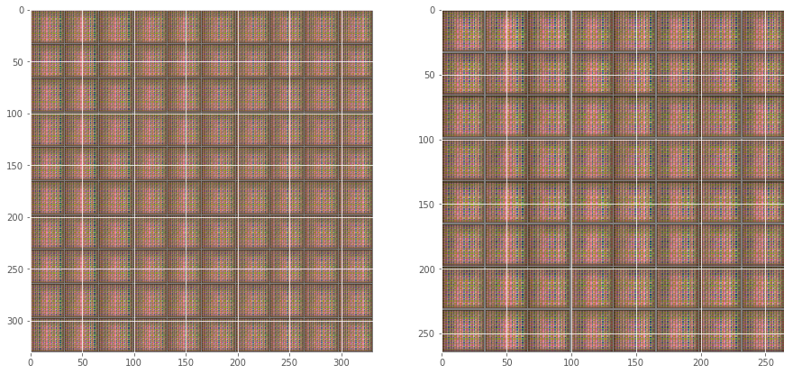


    Model saved in file: ././gan.ckpt-0
    


```python
# Tell all the threads to shutdown.
coord.request_stop()

# Wait until all threads have finished.
coord.join(threads)

# Clean up the session.
sess.close()
```

<a name="part-2---variational-auto-encoding-generative-adversarial-network-vaegan"></a>
# Part 2 - Variational Auto-Encoding Generative Adversarial Network (VAEGAN)

In our definition of the generator, we started with a feature vector, `Z`.  This feature vector was not connected to anything before it.  Instead, we had to randomly create its values using a random number generator of its `n_latent` values from -1 to 1, and this range was chosen arbitrarily.  It could have been 0 to 1, or -3 to 3, or 0 to 100.  In any case, the network would have had to learn to transform those values into something that looked like an image.  There was no way for us to take an image, and find the feature vector that created it.  In other words, it was not possible for us to *encode* an image.

The closest thing to an encoding we had was taking an image and feeding it to the discriminator, which would output a 0 or 1.  But what if we had another network that allowed us to encode an image, and then we used this network for both the discriminator and generative parts of the network?  That's the basic idea behind the VAEGAN: https://arxiv.org/abs/1512.09300.  It is just like the regular GAN, except we also use an encoder to create our feature vector `Z`.

We then get the best of both worlds: a GAN that looks more or less the same, but uses the encoding from an encoder instead of an arbitrary feature vector; and an autoencoder that can model an input distribution using a trained distance function, the discriminator, leading to nicer encodings/decodings.

Let's try to build it!  Refer to the paper for the intricacies and a great read.  Luckily, by building the `encoder` and `decoder` functions, we're almost there.  We just need a few more components and will change these slightly.

Let's reset our graph and recompose our network as a VAEGAN:


```python
tf.reset_default_graph()
```

<a name="batch-normalization"></a>
## Batch Normalization

You may have noticed from the `VAE` code that I've used something called "batch normalization".  This is a pretty effective technique for regularizing the training of networks by "reducing internal covariate shift".  The basic idea is that given a minibatch, we optimize the gradient for this small sample of the greater population.  But this small sample may have different characteristics than the entire population's gradient.  Consider the most extreme case, a minibatch of 1.  In this case, we overfit our gradient to optimize the gradient of the single observation.  If our minibatch is too large, say the size of the entire population, we aren't able to manuvuer the loss manifold at all and the entire loss is averaged in a way that doesn't let us optimize anything.  What we want to do is find a happy medium between a too-smooth loss surface (i.e. every observation), and a very peaky loss surface (i.e. a single observation).  Up until now we only used mini-batches to help with this.  But we can also approach it by "smoothing" our updates between each mini-batch.  That would effectively smooth the manifold of the loss space.  Those of you familiar with signal processing will see this as a sort of low-pass filter on the gradient updates.

In order for us to use batch normalization, we need another placeholder which is a simple boolean: True or False, denoting when we are training.  We'll use this placeholder to conditionally update batch normalization's statistics required for normalizing our minibatches.  Let's create the placeholder and then I'll get into how to use this.


```python
# placeholder for batch normalization
is_training = tf.placeholder(tf.bool, name='istraining')
```
The original paper that introduced the idea suggests to use batch normalization "pre-activation", meaning after the weight multipllication or convolution, and before the nonlinearity.  We can use the `tensorflow.contrib.layers.batch_norm` module to apply batch normalization to any input tensor give the tensor and the placeholder defining whether or not we are training.  Let's use this module and you can inspect the code inside the module in your own time if it interests you.
```python
from tensorflow.contrib.layers import batch_norm
help(batch_norm)
```
<a name="building-the-encoder-1"></a>
## Building the Encoder

We can now change our encoder to accept the `is_training` placeholder and apply `batch_norm` just before the activation function is applied:

```python
def encoder(x, is_training, channels, filter_sizes, activation=tf.nn.tanh, reuse=None):
    # Set the input to a common variable name, h, for hidden layer
    h = x

    print('encoder/input:', h.get_shape().as_list())
    # Now we'll loop over the list of dimensions defining the number
    # of output filters in each layer, and collect each hidden layer
    hs = []
    for layer_i in range(len(channels)):
        
        with tf.variable_scope('layer{}'.format(layer_i+1), reuse=reuse):
            # Convolve using the utility convolution function
            # This requirs the number of output filter,
            # and the size of the kernel in `k_h` and `k_w`.
            # By default, this will use a stride of 2, meaning
            # each new layer will be downsampled by 2.
            h, W = utils.conv2d(h, channels[layer_i],
                                k_h=filter_sizes[layer_i],
                                k_w=filter_sizes[layer_i],
                                d_h=2,
                                d_w=2,
                                reuse=reuse)
            
            h = batch_norm(h, is_training=is_training)

            # Now apply the activation function
            h = activation(h)
            print('layer:', layer_i, ', shape:', h.get_shape().as_list())
            
            # Store each hidden layer
            hs.append(h)

    # Finally, return the encoding.
    return h, hs
```

Let's now create the input to the network using a placeholder.  We can try a slightly larger image this time.  But be careful experimenting with much larger images as this is a big network.

<h3><font color='red'>TODO! COMPLETE THIS SECTION!</font></h3>


```python
n_pixels = 64
n_channels = 3
input_shape = [None, n_pixels, n_pixels, n_channels]

# placeholder for the input to the network
X = tf.placeholder(name='X', shape=input_shape, dtype=tf.float32)
```

And now we'll connect the input to an encoder network.  We'll also use the `tf.nn.elu` activation instead.  Explore other activations but I've found this to make the training much faster (e.g. 10x faster at least!).  See the paper for more details: [Fast and Accurate Deep Network Learning by Exponential Linear Units (ELUs)
](http://arxiv.org/abs/1511.07289)

<h3><font color='red'>TODO! COMPLETE THIS SECTION!</font></h3>


```python
channels = [64, 64, 64]
filter_sizes = [5, 5, 5]
activation = tf.nn.elu
n_hidden = 128

with tf.variable_scope('encoder'):
    H, Hs = encoder(
                x=X,
                is_training=is_training,
                channels=channels,
                filter_sizes=filter_sizes,
                activation=activation,
                reuse=None)
    Z = utils.linear(H, n_hidden)[0]
```

    encoder/input: [None, 64, 64, 3]
    layer: 0 , shape: [None, 32, 32, 64]
    layer: 1 , shape: [None, 16, 16, 64]
    layer: 2 , shape: [None, 8, 8, 64]
    

<a name="building-the-variational-layer"></a>
## Building the Variational Layer

In Session 3, we introduced the idea of Variational Bayes when we used the Variational Auto Encoder.  The variational bayesian approach requires a richer understanding of probabilistic graphical models and bayesian methods which we we're not able to go over in this course (it requires a few courses all by itself!).  For that reason, please treat this as a "black box" in this course.

For those of you that are more familiar with graphical models, Variational Bayesian methods attempt to model an approximate joint distribution of $Q(Z)$ using some distance function to the true distribution $P(X)$.  Kingma and Welling show how this approach can be used in a graphical model resembling an autoencoder and can be trained using KL-Divergence, or $KL(Q(Z) || P(X))$.  The distribution Q(Z) is the variational distribution, and attempts to model the lower-bound of the true distribution $P(X)$ through the minimization of the KL-divergence.  Another way to look at this is the encoder of the network is trying to model the parameters of a known distribution, the Gaussian Distribution, through a minimization of this lower bound.  We assume that this distribution resembles the true distribution, but it is merely a simplification of the true distribution.  To learn more about this, I highly recommend picking up the book by Christopher Bishop called "Pattern Recognition and Machine Learning" and reading the original Kingma and Welling paper on Variational Bayes.

Now back to coding, we'll create a general variational layer that does exactly the same thing as our VAE in session 3.  Treat this as a black box if you are unfamiliar with the math.  It takes an input encoding, `h`, and an integer, `n_code` defining how many latent Gaussians to use to model the latent distribution.  In return, we get the latent encoding from sampling the Gaussian layer, `z`, the mean and log standard deviation, as well as the prior loss, `loss_z`.


```python
def variational_bayes(h, n_code):
    # Model mu and log(\sigma)
    z_mu = tf.nn.tanh(utils.linear(h, n_code, name='mu')[0])
    z_log_sigma = 0.5 * tf.nn.tanh(utils.linear(h, n_code, name='log_sigma')[0])

    # Sample from noise distribution p(eps) ~ N(0, 1)
    epsilon = tf.random_normal(tf.stack([tf.shape(h)[0], n_code]))

    # Sample from posterior
    z = z_mu + tf.multiply(epsilon, tf.exp(z_log_sigma))

    # Measure loss
    loss_z = -0.5 * tf.reduce_sum(
        1.0 + 2.0 * z_log_sigma - tf.square(z_mu) - tf.exp(2.0 * z_log_sigma),
        1)

    return z, z_mu, z_log_sigma, loss_z
```

Let's connect this layer to our encoding, and keep all the variables it returns.  Treat this as a black box if you are unfamiliar with variational bayes!

<h3><font color='red'>TODO! COMPLETE THIS SECTION!</font></h3>


```python
# Experiment w/ values between 2 - 100
# depending on how difficult the dataset is
n_code = 32

with tf.variable_scope('encoder/variational'):
    Z, Z_mu, Z_log_sigma, loss_Z = variational_bayes(h=Z, n_code=n_code)
    print('variational encoder shape:', Z.get_shape().as_list())
```

    variational encoder shape: [None, 32]
    

<a name="building-the-decoder-1"></a>
## Building the Decoder

In the GAN network, we built a decoder and called it the generator network.  Same idea here.  We can use these terms interchangeably.  Before we connect our latent encoding, `Z` to the decoder, we'll implement batch norm in our decoder just like we did with the encoder.  This is a simple fix: add a second argument for `is_training` and then apply batch normalization just after the `deconv2d` operation and just before the nonlinear `activation`.


```python
def decoder(z, is_training, dimensions, channels, filter_sizes,
            activation=tf.nn.elu, reuse=None):
    h = z
    for layer_i in range(len(dimensions)):
        with tf.variable_scope('layer{}'.format(layer_i+1), reuse=reuse):
            h, W = utils.deconv2d(x=h,
                               n_output_h=dimensions[layer_i],
                               n_output_w=dimensions[layer_i],
                               n_output_ch=channels[layer_i],
                               k_h=filter_sizes[layer_i],
                               k_w=filter_sizes[layer_i],
                               reuse=reuse)
            h = batch_norm(h, is_training=is_training)
            h = activation(h)
            print('layer:', layer_i, ', shape:', h.get_shape().as_list())
    return h
```

Now we'll build a decoder just like in Session 3, and just like our Generator network in Part 1.  In Part 1, we created `Z` as a placeholder which we would have had to feed in as random values.  However, now we have an explicit coding of an input image in `X` stored in `Z` by having created the encoder network.


```python
dimensions = [n_pixels // 8, n_pixels // 4, n_pixels // 2, n_pixels]
channels = [30, 30, 30, n_channels]
filter_sizes = [4, 4, 4, 4]
activation = tf.nn.elu
n_latent = n_code * (n_pixels // 16)**2

with tf.variable_scope('generator'):
    Z_decode = utils.linear(
        Z, n_output=n_latent, name='fc', activation=activation)[0]
    Z_decode_tensor = tf.reshape(
        Z_decode, [-1, n_pixels//16, n_pixels//16, n_code], name='reshape')
    G = decoder(
        Z_decode_tensor, is_training, dimensions,
        channels, filter_sizes, activation)
```

    layer: 0 , shape: [None, 8, 8, 30]
    layer: 1 , shape: [None, 16, 16, 30]
    layer: 2 , shape: [None, 32, 32, 30]
    layer: 3 , shape: [None, 64, 64, 3]
    


```python
print('Z_decode shape:', Z_decode.get_shape().as_list())
print('Z_decode_tensor shape:', Z_decode_tensor.get_shape().as_list())            
```

    Z_decode shape: [None, 512]
    Z_decode_tensor shape: [None, 4, 4, 32]
    

Now we need to build our discriminators.  We'll need to add a parameter for the `is_training` placeholder.  We're also going to keep track of every hidden layer in the discriminator.  Our encoder already returns the `Hs` of each layer.  Alternatively, we could poll the graph for each layer in the discriminator and ask for the correspond layer names.  We're going to need these layers when building our costs.


```python
def discriminator(X,
                  is_training,
                  channels=[50, 50, 50, 50],
                  filter_sizes=[4, 4, 4, 4],
                  activation=tf.nn.elu,
                  reuse=None):

    # We'll scope these variables to "discriminator_real"
    with tf.variable_scope('discriminator', reuse=reuse):
        H, Hs = encoder(
            X, is_training, channels, filter_sizes, activation, reuse)
        shape = H.get_shape().as_list()
        print("H: ", H.get_shape().as_list())
        H = tf.reshape(
            H, [-1, shape[1] * shape[2] * shape[3]])
        print("H reshaped: ", H.get_shape().as_list())
        D, W = utils.linear(
            x=H, n_output=1, activation=tf.nn.sigmoid, name='fc', reuse=reuse)
        print("D: ", D)
    return D, Hs
```

Recall the regular GAN and DCGAN required 2 discriminators: one for the generated samples in `Z`, and one for the input samples in `X`.  We'll do the same thing here.  One discriminator for the real input data, `X`, which the discriminator will try to predict as 1s, and another discriminator for the generated samples that go from `X` through the encoder to `Z`, and finally through the decoder to `G`.  The discriminator will be trained to try and predict these as 0s, whereas the generator will be trained to try and predict these as 1s.


```python
D_real, Hs_real = discriminator(X, is_training, reuse=True)
D_fake, Hs_fake = discriminator(G, is_training, reuse=True)
```

    encoder/input: [None, 64, 64, 3]
    layer: 0 , shape: [None, 32, 32, 50]
    layer: 1 , shape: [None, 16, 16, 50]
    layer: 2 , shape: [None, 8, 8, 50]
    layer: 3 , shape: [None, 4, 4, 50]
    H:  [None, 4, 4, 50]
    H reshaped:  [None, 800]
    D:  Tensor("discriminator_4/fc/Sigmoid:0", shape=(?, 1), dtype=float32)
    encoder/input: [None, 64, 64, 3]
    layer: 0 , shape: [None, 32, 32, 50]
    layer: 1 , shape: [None, 16, 16, 50]
    layer: 2 , shape: [None, 8, 8, 50]
    layer: 3 , shape: [None, 4, 4, 50]
    H:  [None, 4, 4, 50]
    H reshaped:  [None, 800]
    D:  Tensor("discriminator_5/fc/Sigmoid:0", shape=(?, 1), dtype=float32)
    

<a name="building-vaegan-loss-functions"></a>
## Building VAE/GAN Loss Functions

Let's now see how we can compose our loss.  We have 3 losses for our discriminator.  Along with measuring the binary cross entropy between each of them, we're going to also measure each layer's loss from our two discriminators using an l2-loss, and this will form our loss for the log likelihood measure.  The details of how these are constructed are explained in more details in the paper: https://arxiv.org/abs/1512.09300 - please refer to this paper for more details that are way beyond the scope of this course!  One parameter within this to pay attention to is `gamma`, which the authors of the paper suggest control the weighting between content and style, just like in Session 4's Style Net implementation.


```python
with tf.variable_scope('loss'):
    # Loss functions
    loss_D_llike = 0
    for h_real, h_fake in zip(Hs_real, Hs_fake):
        loss_D_llike += tf.reduce_sum(tf.squared_difference(
            utils.flatten(h_fake), utils.flatten(h_real)), 1)

    eps = 1e-12
    loss_real = tf.log(D_real + eps)
    loss_fake = tf.log(1 - D_fake + eps)
    loss_GAN = tf.reduce_sum(loss_real + loss_fake, 1)
    
    gamma = 0.75
    loss_enc = tf.reduce_mean(loss_Z + loss_D_llike)
    loss_dec = tf.reduce_mean(gamma * loss_D_llike - loss_GAN)
    loss_dis = -tf.reduce_mean(loss_GAN)
```


```python
nb_utils.show_graph(tf.get_default_graph().as_graph_def())
```
<a name="creating-the-optimizers"></a>
## Creating the Optimizers

We now have losses for our encoder, decoder, and discriminator networks.  We can connect each of these to their own optimizer and start training!  Just like with Part 1's GAN, we'll ensure each network's optimizer only trains its part of the network: the encoder's optimizer will only update the encoder variables, the generator's optimizer will only update the generator variables, and the discriminator's optimizer will only update the discriminator variables.

<h3><font color='red'>TODO! COMPLETE THIS SECTION!</font></h3>


```python
learning_rate = 0.0001

opt_enc = tf.train.AdamOptimizer(
    learning_rate=learning_rate).minimize(
    loss_enc,
    var_list=[var_i for var_i in tf.trainable_variables()
              if var_i.name.startswith('encoder')])

opt_gen = tf.train.AdamOptimizer(
    learning_rate=learning_rate).minimize(
    loss_dec,
    var_list=[var_i for var_i in tf.trainable_variables()
              if var_i.name.startswith('generator')])

opt_dis = tf.train.AdamOptimizer(
    learning_rate=learning_rate).minimize(
    loss_dis,
    var_list=[var_i for var_i in tf.trainable_variables()
              if var_i.name.startswith('discriminator')])
```

<a name="loading-the-dataset"></a>
## Loading the Dataset

We'll now load our dataset just like in Part 1.  Here is where you should explore with your own data!

<h3><font color='red'>TODO! COMPLETE THIS SECTION!</font></h3>


```python
from libs import datasets, dataset_utils

batch_size = 64
n_epochs = 100
crop_shape = [n_pixels, n_pixels, n_channels]
crop_factor = 0.8
input_shape = [218, 178, 3]

# Try w/ CELEB first to make sure it works, then explore w/ your own dataset.
files = datasets.CELEB()
batch = dataset_utils.create_input_pipeline(
    files=files,
    batch_size=batch_size,
    n_epochs=n_epochs,
    crop_shape=crop_shape,
    crop_factor=crop_factor,
    shape=input_shape)
```

    It does not look like you have downloaded the entire Celeb Dataset.
    Try downloading the dataset from the "Aligned and Cropped" link located here (imgs/img_align_celeba.zip [1.34 GB]): http://mmlab.ie.cuhk.edu.hk/projects/CelebA.html
    

We'll also create a latent manifold just like we've done in Session 3 and Part 1.  This is a random sampling of 4 points in the latent space of `Z`.  We then interpolate between them to create a "hyper-plane" and show the decoding of 10 x 10 points on that hyperplane.


```python
n_samples = 10
zs = np.random.uniform(
    -1.0, 1.0, [4, n_code]).astype(np.float32)
zs = utils.make_latent_manifold(zs, n_samples)
```

Now create a session and create a coordinator to manage our queues for fetching data from the input pipeline and start our queue runners:


```python
# We create a session to use the graph
sess = tf.Session()
init_op = tf.global_variables_initializer()

saver = tf.train.Saver()
coord = tf.train.Coordinator()
threads = tf.train.start_queue_runners(sess=sess, coord=coord)
sess.run(init_op)
```

Load an existing checkpoint if it exists to continue training.


```python
if os.path.exists("vaegan.ckpt"):
    saver.restore(sess, "vaegan.ckpt")
    print("GAN model restored.")
```

We'll also try resynthesizing a test set of images.  This will help us understand how well the encoder/decoder network is doing:


```python
n_files = len(files)
test_xs = sess.run(batch) / 255.0
if not os.path.exists('imgs'):
    os.mkdir('imgs')
m = utils.montage(test_xs, 'imgs/test_xs.png')
plt.imshow(m)
```


    <matplotlib.image.AxesImage at 0x7f88cb635208>


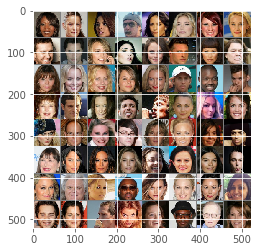


<a name="training-1"></a>
## Training

Almost ready for training.  Let's get some variables which we'll need.  These are the same as Part 1's training process.  We'll keep track of `t_i` which we'll use to create images of the current manifold and reconstruction every so many iterations.  And we'll keep track of the current batch number within the epoch and the current epoch number.


```python
t_i = 0
batch_i = 0
epoch_i = 0
ckpt_name = './vaegan.ckpt'
```

Just like in Part 1, we'll train trying to maintain an equilibrium between our Generator and Discriminator networks.  You should experiment with the margin depending on how the training proceeds.


```python
equilibrium = 0.693
margin = 0.4
```

Now we'll train!  Just like Part 1, we measure the `real_cost` and `fake_cost`.  But this time, we'll always update the encoder.  Based on the performance of the real/fake costs, then we'll update generator and discriminator networks.  This will take a long time to produce something nice, but not nearly as long as the regular GAN network despite the additional parameters of the encoder and variational networks.  Be sure to monitor the reconstructions to understand when your network has reached the capacity of its learning!  For reference, on Celeb Net, I would use about 5 layers in each of the Encoder, Generator, and Discriminator networks using as input a 100 x 100 image, and a minimum of 200 channels per layer.  This network would take about 1-2 days to train on an Nvidia TITAN X GPU.


```python
while epoch_i < n_epochs:
    if batch_i % (n_files // batch_size) == 0:
        batch_i = 0
        epoch_i += 1
        print('---------- EPOCH:', epoch_i)

    batch_i += 1
    batch_xs = sess.run(batch) / 255.0
    real_cost, fake_cost, _ = sess.run([
        loss_real, loss_fake, opt_enc],
        feed_dict={
            X: batch_xs,
            is_training: True})
    real_cost = -np.mean(real_cost)
    fake_cost = -np.mean(fake_cost)

    gen_update = True
    dis_update = True

    if real_cost > (equilibrium + margin) or \
       fake_cost > (equilibrium + margin):
        gen_update = False

    if real_cost < (equilibrium - margin) or \
       fake_cost < (equilibrium - margin):
        dis_update = False

    if not (gen_update or dis_update):
        gen_update = True
        dis_update = True

    if gen_update:
        sess.run(opt_gen, feed_dict={
            X: batch_xs,
            is_training: True})
    if dis_update:
        sess.run(opt_dis, feed_dict={
            X: batch_xs,
            is_training: True})

    if batch_i % 50 == 0:
        print('real:', real_cost, '/ fake:', fake_cost)

        # Plot example reconstructions from latent layer
        recon = sess.run(G, feed_dict={
                Z: zs,
                is_training: False})

        recon = np.clip(recon, 0, 1)
        m1 = utils.montage(recon.reshape([-1] + crop_shape),
                'imgs/manifold_%08d.png' % t_i)

        # Plot example reconstructions
        recon = sess.run(G, feed_dict={
                X: test_xs,
                is_training: False})
        recon = np.clip(recon, 0, 1)
        m2 = utils.montage(recon.reshape([-1] + crop_shape),
                'imgs/reconstruction_%08d.png' % t_i)
        
        fig, axs = plt.subplots(1, 2, figsize=(15, 10))
        axs[0].imshow(m1)
        axs[1].imshow(m2)
        plt.show()
        
        t_i += 1
        

    if batch_i % 200 == 0:
        # Save the variables to disk.
        save_path = saver.save(sess, "./" + ckpt_name,
                               global_step=batch_i,
                               write_meta_graph=False)
        print("Model saved in file: %s" % save_path)
```

    ---------- EPOCH: 1
    real: 0.205149 / fake: 0.971561
    
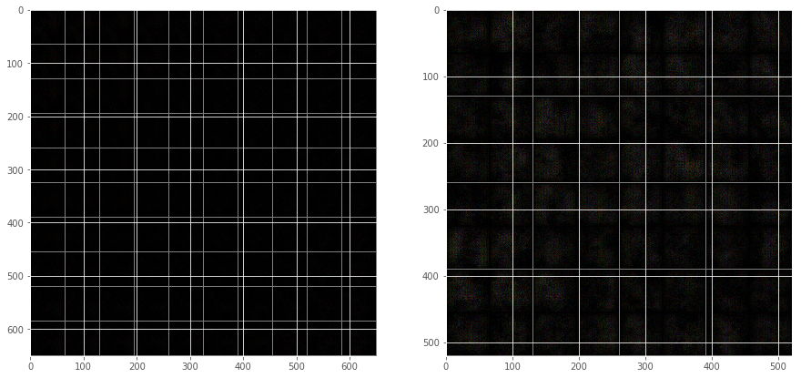

    real: 0.148093 / fake: 0.984728
    
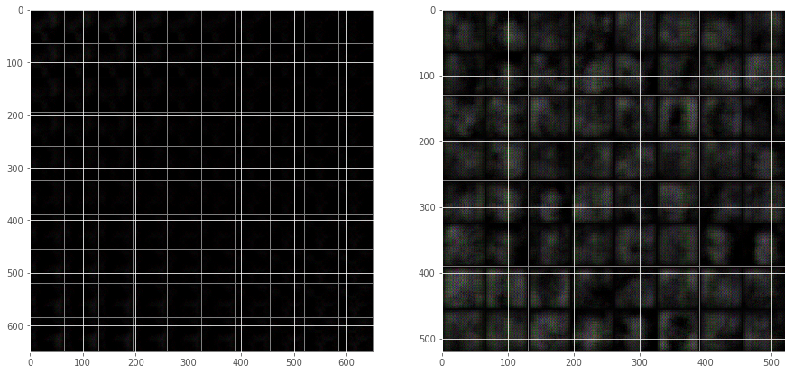
    
    real: 0.362498 / fake: 0.222033
 
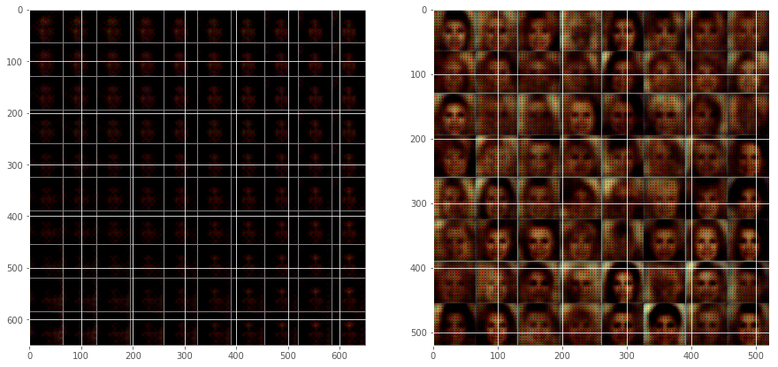

    Model saved in file: ././vaegan.ckpt-2000
    real: 0.341877 / fake: 0.229757

```python
# One of the threads has issued an exception.  So let's tell all the
# threads to shutdown.
coord.request_stop()

# Wait until all threads have finished.
coord.join(threads)

# Clean up the session.
sess.close()
```

<a name="part-3---latent-space-arithmetic"></a>
# Part 3 - Latent-Space Arithmetic

<a name="loading-the-pre-trained-model"></a>
## Loading the Pre-Trained Model

We're now going to work with a pre-trained VAEGAN model on the Celeb Net dataset.  Let's load this model:


```python
tf.reset_default_graph()
```


```python
from libs import celeb_vaegan as CV
```


```python
net = CV.get_celeb_vaegan_model()
```

We'll load the graph_def contained inside this dictionary.  It follows the same idea as the `inception`, `vgg16`, and `i2v` pretrained networks.  It is a dictionary with the key `graph_def` defined, with the graph's pretrained network.  It also includes `labels` and a `preprocess` key.  We'll have to do one additional thing which is to turn off the random sampling from variational layer.  This isn't really necessary but will ensure we get the same results each time we use the network.  We'll use the `input_map` argument to do this.  Don't worry if this doesn't make any sense, as we didn't cover the variational layer in any depth.  Just know that this is removing a random process from the network so that it is completely deterministic.  If we hadn't done this, we'd get slightly different results each time we used the network (which may even be desirable for your purposes).


```python
sess = tf.Session()
g = tf.get_default_graph()
tf.import_graph_def(net['graph_def'], name='net', input_map={
        'encoder/variational/random_normal:0': np.zeros(512, dtype=np.float32)})
names = [op.name for op in g.get_operations()]
print(names)
```    
Now let's get the relevant parts of the network: `X`, the input image to the network, `Z`, the input image's encoding, and `G`, the decoded image.  In many ways, this is just like the Autoencoders we learned about in Session 3, except instead of `Y` being the output, we have `G` from our generator!  And the way we train it is very different: we use an adversarial process between the generator and discriminator, and use the discriminator's own distance measure to help train the network, rather than pixel-to-pixel differences.

```python
X = g.get_tensor_by_name('net/x:0')
Z = g.get_tensor_by_name('net/encoder/variational/z:0')
G = g.get_tensor_by_name('net/generator/x_tilde:0')
```
Let's get some data to play with:

```python
files = datasets.CELEB()
img_i = 50
img = plt.imread(files[img_i])
plt.imshow(img)
```
    <matplotlib.image.AxesImage at 0x15c269ca8d0>


Now preprocess the image, and see what the generated image looks like (i.e. the lossy version of the image through the network's encoding and decoding).


```python
p = CV.preprocess(img)
synth = sess.run(G, feed_dict={X: p[np.newaxis]})
```

    C:\Users\eutan\Anaconda3\lib\site-packages\skimage\transform\_warps.py:84: UserWarning: The default mode, 'constant', will be changed to 'reflect' in skimage 0.15.
      warn("The default mode, 'constant', will be changed to 'reflect' in "
    


```python
fig, axs = plt.subplots(1, 2, figsize=(10, 5))
axs[0].imshow(p)
axs[1].imshow(synth[0] / synth.max())
```


    <matplotlib.image.AxesImage at 0x15c26ac2ac8>


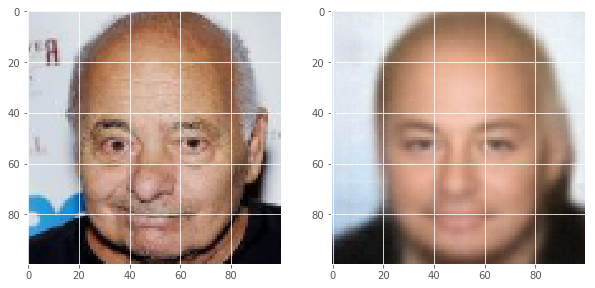


So we lost a lot of details but it seems to be able to express quite a bit about the image.  Our inner most layer, `Z`, is only 512 values yet our dataset was 200k images of 64 x 64 x 3 pixels (about 2.3 GB of information).  That means we're able to express our nearly 2.3 GB of information with only 512 values!  Having some loss of detail is certainly expected!

<a name="exploring-the-celeb-net-attributes"></a>
## Exploring the Celeb Net Attributes

Let's now try and explore the attributes of our dataset.  We didn't train the network with any supervised labels, but the Celeb Net dataset has 40 attributes for each of its 200k images.  These are already parsed and stored for you in the `net` dictionary:


```python
net.keys()
```


    dict_keys(['graph_def', 'labels', 'attributes', 'preprocess'])


```python
len(net['labels'])
```


    40


```python
net['labels']
```


    ['5_o_Clock_Shadow',
     'Arched_Eyebrows',
     'Attractive',
     'Bags_Under_Eyes',
     'Bald',
     'Bangs',
     'Big_Lips',
     'Big_Nose',
     'Black_Hair',
     'Blond_Hair',
     'Blurry',
     'Brown_Hair',
     'Bushy_Eyebrows',
     'Chubby',
     'Double_Chin',
     'Eyeglasses',
     'Goatee',
     'Gray_Hair',
     'Heavy_Makeup',
     'High_Cheekbones',
     'Male',
     'Mouth_Slightly_Open',
     'Mustache',
     'Narrow_Eyes',
     'No_Beard',
     'Oval_Face',
     'Pale_Skin',
     'Pointy_Nose',
     'Receding_Hairline',
     'Rosy_Cheeks',
     'Sideburns',
     'Smiling',
     'Straight_Hair',
     'Wavy_Hair',
     'Wearing_Earrings',
     'Wearing_Hat',
     'Wearing_Lipstick',
     'Wearing_Necklace',
     'Wearing_Necktie',
     'Young']


Let's see what attributes exist for one of the celeb images:


```python
plt.imshow(img)
[net['labels'][i] for i, attr_i in enumerate(net['attributes'][img_i]) if attr_i]
```


    ['5_o_Clock_Shadow',
     'Bags_Under_Eyes',
     'Bald',
     'Big_Nose',
     'Chubby',
     'Double_Chin',
     'Gray_Hair',
     'Male',
     'Receding_Hairline']


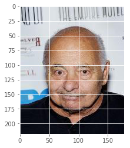


<a name="find-the-latent-encoding-for-an-attribute"></a>
## Find the Latent Encoding for an Attribute

The Celeb Dataset includes attributes for each of its 200k+ images.  This allows us to feed into the encoder some images that we know have a *specific* attribute, e.g. "smiling".  We store what their encoding is and retain this distribution of encoded values.  We can then look at any other image and see how it is encoded, and slightly change the encoding by adding the encoded of our smiling images to it!  The result should be our image but with more smiling.  That is just insane and we're going to see how to do it.  First lets inspect our latent space:


```python
Z.get_shape()
```


    TensorShape([Dimension(None), Dimension(512)])


We have 512 features that we can encode any image with.  Assuming our network is doing an okay job, let's try to find the `Z` of the first 100 images with the 'Bald' attribute:


```python
bald_label = net['labels'].index('Bald')
```


```python
bald_label
```


    4


Let's get all the bald image indexes:


```python
bald_img_idxs = np.where(net['attributes'][:, bald_label])[0]
```


```python
bald_img_idxs
```


    array([    50,     78,    114, ..., 202503, 202524, 202560])


Now let's just load 100 of their images:


```python
bald_imgs = [plt.imread(files[bald_img_i])[..., :3]
             for bald_img_i in bald_img_idxs[:100]]
```

Let's see if the mean image looks like a good bald person or not:


```python
plt.imshow(np.mean(bald_imgs, 0).astype(np.uint8))
```


    <matplotlib.image.AxesImage at 0x7f757e0c1710>


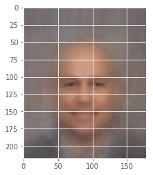


Yes that is definitely a bald person.  Now we're going to try to find the encoding of a bald person.  One method is to try and find every other possible image and subtract the "bald" person's latent encoding.  Then we could add this encoding back to any new image and hopefully it makes the image look more bald.  Or we can find a bunch of bald people's encodings and then average their encodings together.  This should reduce the noise from having many different attributes, but keep the signal pertaining to the baldness.

Let's first preprocess the images:


```python
bald_p = np.array([CV.preprocess(bald_img_i) for bald_img_i in bald_imgs])
bald_p.shape
```

    /home/ubuntu/.local/lib/python3.5/site-packages/skimage/transform/_warps.py:84: UserWarning: The default mode, 'constant', will be changed to 'reflect' in skimage 0.15.
      warn("The default mode, 'constant', will be changed to 'reflect' in "
    


    (100, 100, 100, 3)


Now we can find the latent encoding of the images by calculating `Z` and feeding `X` with our `bald_p` images:

<h3><font color='red'>TODO! COMPLETE THIS SECTION!</font></h3>


```python
bald_zs = sess.run(Z, feed_dict={X: bald_p})
```

Now let's calculate the mean encoding:


```python
bald_feature = np.mean(bald_zs, 0, keepdims=True)
```


```python
bald_feature.shape
```


    (1, 512)


Let's try and synthesize from the mean bald feature now and see how it looks:

<h3><font color='red'>TODO! COMPLETE THIS SECTION!</font></h3>


```python
bald_generated = sess.run(G, feed_dict={Z: bald_feature})
```


```python
plt.imshow(bald_generated[0] / bald_generated.max())
```


    <matplotlib.image.AxesImage at 0x7fae3763f048>


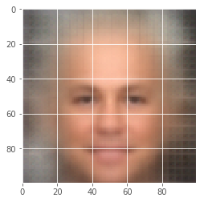


<a name="latent-feature-arithmetic"></a>
## Latent Feature Arithmetic

Let's now try to write a general function for performing everything we've just done so that we can do this with many different features.  We'll then try to combine them and synthesize people with the features we want them to have...


```python
def get_features_for(label='Bald', has_label=True, n_imgs=50):
    label_i = net['labels'].index(label)
    label_idxs = np.where(net['attributes'][:, label_i] == has_label)[0]
    label_idxs = np.random.permutation(label_idxs)[:n_imgs]
    imgs = [plt.imread(files[img_i])[..., :3]
            for img_i in label_idxs]
    preprocessed = np.array([CV.preprocess(img_i) for img_i in imgs])
    zs = sess.run(Z, feed_dict={X: preprocessed})
    return np.mean(zs, 0)
```

Let's try getting some attributes positive and negative features.  Be sure to explore different attributes!  Also try different values of `n_imgs`, e.g. 2, 3, 5, 10, 50, 100.  What happens with different values?

<h3><font color='red'>TODO! COMPLETE THIS SECTION!</font></h3>


```python
# Explore different attributes
z1 = get_features_for('Male', True, n_imgs=10)
z2 = get_features_for('Male', False, n_imgs=10)
z3 = get_features_for('Smiling', True, n_imgs=10)
z4 = get_features_for('Smiling', False, n_imgs=10)
```

    /home/ubuntu/.local/lib/python3.5/site-packages/skimage/transform/_warps.py:84: UserWarning: The default mode, 'constant', will be changed to 'reflect' in skimage 0.15.
      warn("The default mode, 'constant', will be changed to 'reflect' in "
    


```python
b1 = sess.run(G, feed_dict={Z: z1[np.newaxis]})
b2 = sess.run(G, feed_dict={Z: z2[np.newaxis]})
b3 = sess.run(G, feed_dict={Z: z3[np.newaxis]})
b4 = sess.run(G, feed_dict={Z: z4[np.newaxis]})
```


```python
fig, axs = plt.subplots(1, 4, figsize=(15, 6))
axs[0].imshow(b1[0] / b1.max()), axs[0].set_title('Male'), axs[0].grid('off'), axs[0].axis('off')
axs[1].imshow(b2[0] / b2.max()), axs[1].set_title('Not Male'), axs[1].grid('off'), axs[1].axis('off')
axs[2].imshow(b3[0] / b3.max()), axs[2].set_title('Smiling'), axs[2].grid('off'), axs[2].axis('off')
axs[3].imshow(b4[0] / b4.max()), axs[3].set_title('Not Smiling'), axs[3].grid('off'), axs[3].axis('off')
```
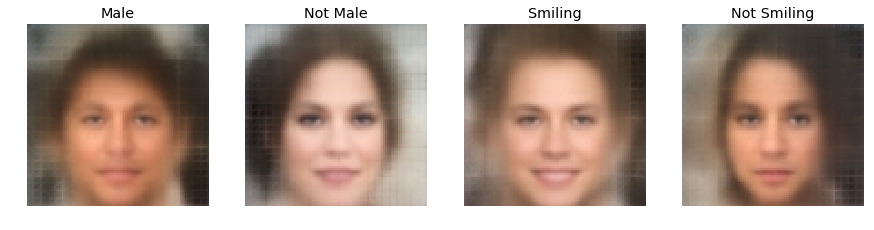
Now let's interpolate between the "Male" and "Not Male" categories:
```python
notmale_vector = z2 - z1
n_imgs = 5
amt = np.linspace(0, 1, n_imgs)
zs = np.array([z1 + notmale_vector*amt_i for amt_i in amt])
g = sess.run(G, feed_dict={Z: zs})
```
```python
fig, axs = plt.subplots(1, n_imgs, figsize=(20, 4))
for i, ax_i in enumerate(axs):
    ax_i.imshow(np.clip(g[i], 0, 1))
    ax_i.grid('off')
    ax_i.axis('off')
```
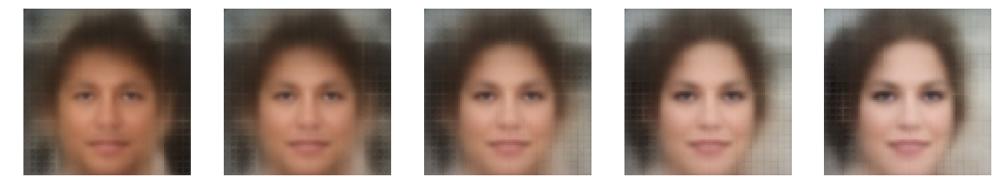
And the same for smiling:
```python
smiling_vector = z3 - z4
amt = np.linspace(0, 1, n_imgs)
zs = np.array([z4 + smiling_vector*amt_i for amt_i in amt])
g = sess.run(G, feed_dict={Z: zs})
fig, axs = plt.subplots(1, n_imgs, figsize=(20, 4))
for i, ax_i in enumerate(axs):
    ax_i.imshow(np.clip(g[i] / g[i].max(), 0, 1))
    ax_i.grid('off')
```


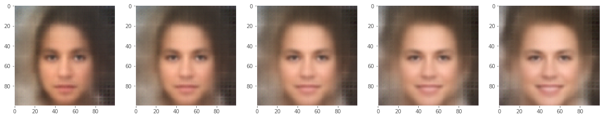


There's also no reason why we have to be within the boundaries of 0-1.  We can extrapolate beyond, in, and around the space.


```python
n_imgs = 5
amt = np.linspace(-1.5, 2.5, n_imgs)
zs = np.array([z4 + smiling_vector*amt_i for amt_i in amt])
g = sess.run(G, feed_dict={Z: zs})
fig, axs = plt.subplots(1, n_imgs, figsize=(20, 4))
for i, ax_i in enumerate(axs):
    ax_i.imshow(np.clip(g[i], 0, 1))
    ax_i.grid('off')
    ax_i.axis('off')
```


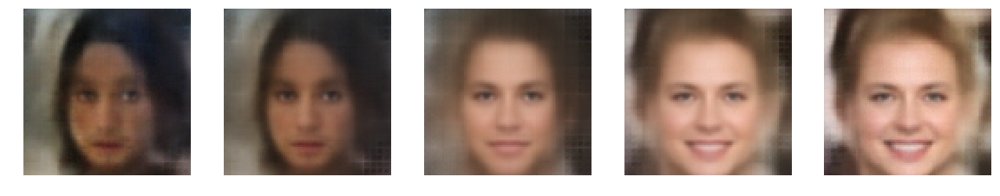


<a name="extensions"></a>
## Extensions

[Tom White](https://twitter.com/dribnet), Lecturer at Victoria University School of Design, also recently demonstrated an alternative way of interpolating using a sinusoidal interpolation.  He's created some of the most impressive generative images out there and luckily for us he has detailed his process in the arxiv preprint: https://arxiv.org/abs/1609.04468 - as well, be sure to check out his twitter bot, https://twitter.com/smilevector - which adds smiles to people :) - Note that the network we're using is only trained on aligned faces that are frontally facing, though this twitter bot is capable of adding smiles to any face.  I suspect that he is running a face detection algorithm such as AAM, CLM, or ASM, cropping the face, aligning it, and then running a similar algorithm to what we've done above.  Or else, perhaps he has trained a new model on faces that are not aligned.  In any case, it is well worth checking out!

Let's now try and use sinusoidal interpolation using his implementation in [plat](https://github.com/dribnet/plat/blob/master/plat/interpolate.py#L16-L24) which I've copied below:


```python
def slerp(val, low, high):
    """Spherical interpolation. val has a range of 0 to 1."""
    if val <= 0:
        return low
    elif val >= 1:
        return high
    omega = np.arccos(np.dot(low/np.linalg.norm(low), high/np.linalg.norm(high)))
    so = np.sin(omega)
    return np.sin((1.0-val)*omega) / so * low + np.sin(val*omega)/so * high
```


```python
amt = np.linspace(0, 1, n_imgs)
zs = np.array([slerp(amt_i, z1, z2) for amt_i in amt])
g = sess.run(G, feed_dict={Z: zs})
fig, axs = plt.subplots(1, n_imgs, figsize=(20, 4))
for i, ax_i in enumerate(axs):
    ax_i.imshow(np.clip(g[i], 0, 1))
    ax_i.grid('off')
    ax_i.axis('off')
```
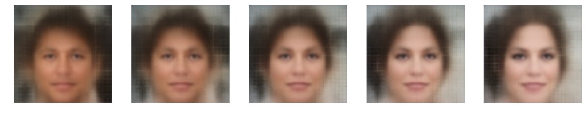
It's certainly worth trying especially if you are looking to explore your own model's latent space in new and interesting ways.

Let's try and load an image that we want to play with.  We need an image as similar to the Celeb Dataset as possible.  Unfortunately, we don't have access to the algorithm they used to "align" the faces, so we'll need to try and get as close as possible to an aligned face image.  One way you can do this is to load up one of the celeb images and try and align an image to it using e.g. Photoshop or another photo editing software that lets you blend and move the images around.  That's what I did for my own face...


```python
img = plt.imread('parag.png')[..., :3]
img = CV.preprocess(img, crop_factor=1.0)[np.newaxis]
```

    /home/ubuntu/.local/lib/python3.5/site-packages/skimage/transform/_warps.py:84: UserWarning: The default mode, 'constant', will be changed to 'reflect' in skimage 0.15.
      warn("The default mode, 'constant', will be changed to 'reflect' in "
    

Let's see how the network encodes it:


```python
img_ = sess.run(G, feed_dict={X: img})
fig, axs = plt.subplots(1, 2, figsize=(10, 5))
axs[0].imshow(img[0]), axs[0].grid('off')
axs[1].imshow(np.clip(img_[0] / np.max(img_), 0, 1)), axs[1].grid('off')
```
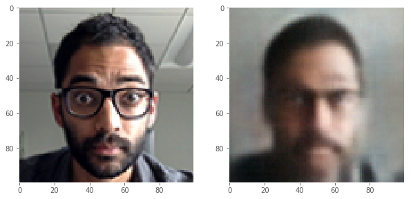
Notice how blurry the image is.  Tom White's preprint suggests one way to sharpen the image is to find the "Blurry" attribute vector:
```python
z1 = get_features_for('Blurry', True, n_imgs=25)
z2 = get_features_for('Blurry', False, n_imgs=25)
unblur_vector = z2 - z1
```
    /home/ubuntu/.local/lib/python3.5/site-packages/skimage/transform/_warps.py:84: UserWarning: The default mode, 'constant', will be changed to 'reflect' in skimage 0.15.
      warn("The default mode, 'constant', will be changed to 'reflect' in "    
```python
z = sess.run(Z, feed_dict={X: img})
```
```python
n_imgs = 5
amt = np.linspace(0, 1, n_imgs)
zs = np.array([z[0] + unblur_vector * amt_i for amt_i in amt])
g = sess.run(G, feed_dict={Z: zs})
fig, axs = plt.subplots(1, n_imgs, figsize=(20, 4))
for i, ax_i in enumerate(axs):
    ax_i.imshow(np.clip(g[i] / g[i].max(), 0, 1))
    ax_i.grid('off')
    ax_i.axis('off')
```

Notice that the image also gets brighter and perhaps other features than simply the bluriness of the image changes.  Tom's preprint suggests that this is due to the correlation that blurred images have with other things such as the brightness of the image, possibly due biases in labeling or how photographs are taken.   He suggests that another way to unblur would be to synthetically blur a set of images and find the difference in the encoding between the real and blurred images.  We can try it like so:
```python
from scipy.ndimage import gaussian_filter

idxs = np.random.permutation(range(len(files)))
imgs = [plt.imread(files[idx_i]) for idx_i in idxs[:100]]
blurred = []
for img_i in imgs:
    img_copy = np.zeros_like(img_i)
    for ch_i in range(3):
        img_copy[..., ch_i] = gaussian_filter(img_i[..., ch_i], sigma=3.0)
    blurred.append(img_copy)
```
```python
# Now let's preprocess the original images and the blurred ones
imgs_p = np.array([CV.preprocess(img_i) for img_i in imgs])
blur_p = np.array([CV.preprocess(img_i) for img_i in blurred])

# And then compute each of their latent features
noblur = sess.run(Z, feed_dict={X: imgs_p})
blur = sess.run(Z, feed_dict={X: blur_p})
```
    /home/ubuntu/.local/lib/python3.5/site-packages/skimage/transform/_warps.py:84: UserWarning: The default mode, 'constant', will be changed to 'reflect' in skimage 0.15.
      warn("The default mode, 'constant', will be changed to 'reflect' in "
```python
synthetic_unblur_vector = np.mean(noblur - blur, 0)
```
```python
n_imgs = 5
amt = np.linspace(0, 1, n_imgs)
zs = np.array([z[0] + synthetic_unblur_vector * amt_i for amt_i in amt])
g = sess.run(G, feed_dict={Z: zs})
fig, axs = plt.subplots(1, n_imgs, figsize=(20, 4))
for i, ax_i in enumerate(axs):
    ax_i.imshow(np.clip(g[i], 0, 1))
    ax_i.grid('off')
    ax_i.axis('off')
```
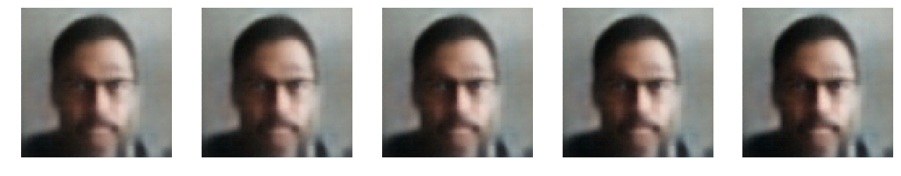
For some reason, it also doesn't like my glasses very much.  Let's try and add them back.
```python
z1 = get_features_for('Eyeglasses', True)
z2 = get_features_for('Eyeglasses', False)
glass_vector = z1 - z2
```
    /home/ubuntu/.local/lib/python3.5/site-packages/skimage/transform/_warps.py:84: UserWarning: The default mode, 'constant', will be changed to 'reflect' in skimage 0.15.
      warn("The default mode, 'constant', will be changed to 'reflect' in "
```python
z = sess.run(Z, feed_dict={X: img})
```
```python
n_imgs = 5
amt = np.linspace(0, 1, n_imgs)
zs = np.array([z[0] + glass_vector * amt_i + unblur_vector * amt_i for amt_i in amt])
g = sess.run(G, feed_dict={Z: zs})
fig, axs = plt.subplots(1, n_imgs, figsize=(20, 4))
for i, ax_i in enumerate(axs):
    ax_i.imshow(np.clip(g[i], 0, 1))
    ax_i.grid('off')
    ax_i.axis('off')
```

Well, more like sunglasses then.  Let's try adding everything in there now!
```python
n_imgs = 5
amt = np.linspace(0, 1.0, n_imgs)
zs = np.array([z[0] + glass_vector * amt_i + unblur_vector * amt_i + amt_i * smiling_vector for amt_i in amt])
g = sess.run(G, feed_dict={Z: zs})
fig, axs = plt.subplots(1, n_imgs, figsize=(20, 4))
for i, ax_i in enumerate(axs):
    ax_i.imshow(np.clip(g[i], 0, 1))
    ax_i.grid('off')
    ax_i.axis('off')
```

Well it was worth a try anyway.  We can also try with a lot of images and create a gif montage of the result:
```python
n_imgs = 5
amt = np.linspace(0, 1.5, n_imgs)
z = sess.run(Z, feed_dict={X: imgs_p})
imgs = []
for amt_i in amt:
    zs = z + synthetic_unblur_vector * amt_i + amt_i * smiling_vector
    g = sess.run(G, feed_dict={Z: zs})
    m = utils.montage(np.clip(g, 0, 1))
    imgs.append(m)
```
```python
import imageio
imageio.mimsave('celeb.gif', imgs)
```
```python
ipyd.Image(url='celeb.gif?i={}'.format(
        np.random.rand()), height=1000, width=1000)
```

Exploring multiple feature vectors and applying them to images from the celeb dataset to produce animations of a face, saving it as a GIF.  Recall you can store each image frame in a list and then use the `gif.build_gif` function to create a gif.  Explore your own syntheses and then include a gif of the different images you create as "celeb.gif" in the final submission.  Perhaps try finding unexpected synthetic latent attributes in the same way that we created a blur attribute.  You can check the documentation in scipy.ndimage for some other image processing techniques, for instance: http://www.scipy-lectures.org/advanced/image_processing/ - and see if you can find the encoding of another attribute that you then apply to your own images.  You can even try it with many images and use the `utils.montage` function to create a large grid of images that evolves over your attributes.  Or create a set of expressions perhaps.  Up to you just explore!

<h3><font color='red'>TODO! COMPLETE THIS SECTION!</font></h3>
The objective is to transition unsmiling images to Young, Attractive and Smiling images, followed by Grey, Chubby, Unsmiling with Eye Bags
```python
# Obtain first 100 unsmiling images
label_unsmile_i = net['labels'].index('Smiling')
label_unsmile_idxs = np.where(net['attributes'][:, label_unsmile_i] == False)[0]
label_unsmile_idxs = np.random.permutation(label_unsmile_idxs)[:100]
imgs_unsmile = [plt.imread(files[img_i])[..., :3]
        for img_i in label_unsmile_idxs]

x = np.array(imgs_unsmile)
x = np.array([CV.preprocess(img_i) for img_i in imgs_unsmile])
# Unblur the images
idxs = np.random.permutation(range(len(files)))
imgs = imgs_unsmile
blurred = []
for img_i in imgs:
    img_copy = np.zeros_like(img_i)
    for ch_i in range(3):
        img_copy[..., ch_i] = gaussian_filter(img_i[..., ch_i], sigma=3.0)
    blurred.append(img_copy)
```
# Now let's preprocess the original images and the blurred ones
```python
imgs_p = np.array([CV.preprocess(img_i) for img_i in imgs])
blur_p = np.array([CV.preprocess(img_i) for img_i in blurred])
# And then compute each of their latent features
noblur = sess.run(Z, feed_dict={X: imgs_p})
blur = sess.run(Z, feed_dict={X: blur_p})
synthetic_unblur_vector = np.mean(noblur - blur, 0)

# Smiling features
z_smile = get_features_for(label='Smiling', has_label=True, n_imgs=50)
z_unsmile = get_features_for(label='Smiling', has_label=False, n_imgs=50)

# Attractive features
z_attractive = get_features_for(label='Attractive', has_label=True, n_imgs=50)
z_unattractive = get_features_for(label='Attractive', has_label=False, n_imgs=50)

# Young features
z_young = get_features_for(label='Young', has_label=True, n_imgs=50)
z_unyoung = get_features_for(label='Young', has_label=False, n_imgs=50)

# Eye Bags features
z_bag = get_features_for(label='Bags_Under_Eyes', has_label=True, n_imgs=50)
z_unbag = get_features_for(label='Bags_Under_Eyes', has_label=False, n_imgs=50)

# Chubby features
z_chubby = get_features_for(label='Chubby', has_label=True, n_imgs=50)
z_unchubby = get_features_for(label='Chubby', has_label=False, n_imgs=50)

# Grey features
z_grey = get_features_for(label='Gray_Hair', has_label=True, n_imgs=50)
z_ungrey = get_features_for(label='Gray_Hair', has_label=False, n_imgs=50)

# Unblur vector
unblur_vector = z_unblur - z_blur
# Smile vector
smile_vector = z_smile - z_unsmile
# Attractive vector
attractive_vector = z_attractive - z_unattractive
# Young vector
young_vector = z_young - z_unyoung
# Eye Bags vector
bag_vector = z_bag - z_unbag
# Chubby vector
chubby_vector = z_chubby - z_unchubby
# Grey Bags vector
grey_vector = z_grey - z_ungrey

# Generate the images for the features
b_smile = sess.run(G, feed_dict={Z: z_smile[np.newaxis]})
b_unsmile = sess.run(G, feed_dict={Z: z_unsmile[np.newaxis]})
b_attractive = sess.run(G, feed_dict={Z: z_attractive[np.newaxis]})
b_unattractive = sess.run(G, feed_dict={Z: z_unattractive[np.newaxis]})
b_young = sess.run(G, feed_dict={Z: z_young[np.newaxis]})
b_unyoung = sess.run(G, feed_dict={Z: z_unyoung[np.newaxis]})
b_chubby = sess.run(G, feed_dict={Z: z_chubby[np.newaxis]})
b_unchubby = sess.run(G, feed_dict={Z: z_unchubby[np.newaxis]})
b_grey = sess.run(G, feed_dict={Z: z_grey[np.newaxis]})
b_ungrey = sess.run(G, feed_dict={Z: z_ungrey[np.newaxis]})
b_bag =  sess.run(G, feed_dict={Z: z_bag[np.newaxis]})
```
Plot the reconstructed latent information of Smile, Attractive, Young, Chubby and Grey
```python
fig, axs = plt.subplots(1, 11, figsize=(15, 6))
axs[0].imshow(b_smile[0] / b_smile.max()), axs[0].set_title('Smile'), axs[0].grid('off'), axs[0].axis('off')
axs[1].imshow(b_unsmile[0] / b_unsmile.max()), axs[1].set_title('Not Smile'), axs[1].grid('off'), axs[1].axis('off')
axs[2].imshow(b_attractive[0] / b_attractive.max()), axs[2].set_title('Attractive'), axs[2].grid('off'), axs[2].axis('off')
axs[3].imshow(b_unattractive[0] / b_unattractive.max()), axs[3].set_title('Not Attractive'), axs[3].grid('off'), axs[3].axis('off')
axs[4].imshow(b_young[0] / b_young.max()), axs[4].set_title('Young'), axs[4].grid('off'), axs[4].axis('off')
axs[5].imshow(b_unyoung[0] / b_unyoung.max()), axs[5].set_title('Not Young'), axs[5].grid('off'), axs[5].axis('off')
axs[6].imshow(b_chubby[0] / b_chubby.max()), axs[6].set_title('Chubby'), axs[6].grid('off'), axs[6].axis('off')
axs[7].imshow(b_unchubby[0] / b_unchubby.max()), axs[7].set_title('Not Chubby'), axs[7].grid('off'), axs[7].axis('off')
axs[8].imshow(b_grey[0] / b_grey.max()), axs[8].set_title('Grey'), axs[8].grid('off'), axs[8].axis('off')
axs[9].imshow(b_ungrey[0] / b_ungrey.max()), axs[9].set_title('Not Grey'), axs[9].grid('off'), axs[9].axis('off')
axs[10].imshow(b_bag[0] / b_bag.max()), axs[10].set_title('Eye Bag'), axs[10].grid('off'), axs[10].axis('off')
```
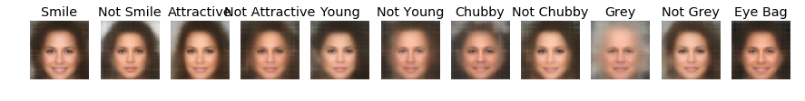
Now synthesize the images from young and attractive, to grey and chubby
```python
n_imgs = 20
amt = np.linspace(0, 1.5, n_imgs)
z = sess.run(Z, feed_dict={X: x})
imgs = []
for amt_i in amt:
    zs = z + synthetic_unblur_vector * amt_i + amt_i * smile_vector + amt_i * attractive_vector
    g = sess.run(G, feed_dict={Z: zs})
    m = utils.montage(np.clip(g, 0, 1))
    imgs.append(m)

for amt_i in amt:
    zs2 = zs - (amt_i * smile_vector * 2) + amt_i * chubby_vector + (0.5 * amt_i * bag_vector) + (amt_i * grey_vector * 0.5) - (amt_i * young_vector * 0.5)
    g = sess.run(G, feed_dict={Z: zs2})
    m = utils.montage(np.clip(g, 0, 1))
    imgs.append(m)
```
Create the gif
```python
import imageio
imageio.mimsave("vaegan.gif", imgs)
ipyd.Image(url='vaegan.gif?i={}'.format(
            np.random.rand()), height=1000, width=1000)
```

<a name="part-4---character-level-recurrent-neural-network"></a>
